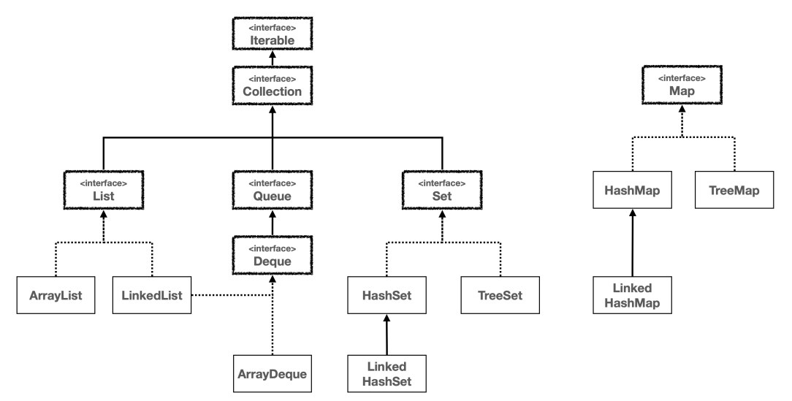
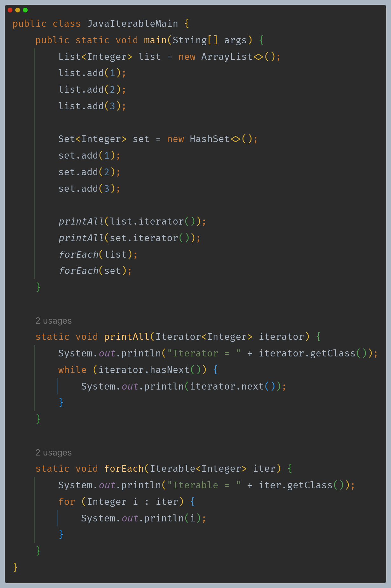

# 자바 - 컬렉션 프레임워크 - 순회, 정렬

## 자바가 제공하는 `Iterable`, `Iterator`

- 자바 컬렉션 프레임워크는 배열 리스트, 연결 리스트, 해시셋 등 다양한 자료 구조를 제공한다.
- 자바는 컬렉션 프레임워크를 사용하는 개발자가 편리하고 일관된 방법으로 자료 구조를 순회할 수 있도록 `Iterable` 인터페이스를 제공하고, 
    이미 각각의 구현체에 맞는 `Iterator` 도 다 구현해두었다.
- 자바 `Collection` 인터페이스 상위에 `Iterable`이 있다는 것은 모든 컬렉션을 `Iterable`과 `Iterator`를 사용해서 순회할 수 있다는 뜻이다.
- `Map`의 경우 `key` 뿐만 아니라 `value` 까지 있기 때문에 바로 순회를 할 순 없다. 대신에 `key`나 `value`를 정해서 순회할 수 있다.
  - `keySet()`, `values()`를 호출하면 `Set`, `Collection`을 반환하기 때문에 `key`나 `value`를 정해서 순회할 수 있다.
  - `Entry`를 `Set` 구조로 반환하는 `entrySet()`도 순회가 가능하다.

- `Iterable`, `Iterator`는 인터페이스 이므로 다형성을 활용할 수 있다.
- `java.util.ArrayList$Itr` : `ArrayList`의 `Iterator`는 `ArrayList`의 중첩 클래스이다.
- `java.util.HashMap$KeyIterator` : `HashSet` 자료 구조는 내부에서 `HashMap` 자료 구조를 사용한다.
  - `HashMap` 자료 구조에서 `value`를 사용하지 않으면 `HashSet`과 같다.

> **반복자 디자인 패턴**
> 
> - 객체 지향 프로그래밍에서 컬렉션의 요소들을 순회할 때 사용되는 디자인 패턴이다.
> - 이 패턴은 컬렉션의 내부 표현 방식을 노출시키지 않으면서도 그 안의 각 요소에 순차적으로 접근할 수 있게 해준다.
> - 이 패턴은 컬렉션의 구현과는 독립적으로 요소들을 탐색할 수 있는 방법을 제공하며, 이로 인해 코드의 복잡성은 줄이고 재사용성을 높일 수 있다.

---

[이전 ↩️ - 자바(컬렉션 프레임워크) - 직접 구현하는 `Iterable`, `Iterator`](https://github.com/genesis12345678/TIL/blob/main/Java/mid_2/jcf/%EC%A7%81%EC%A0%91%EA%B5%AC%ED%98%84Iterable.md)

[메인 ⏫](https://github.com/genesis12345678/TIL/blob/main/Java/mid_2/Main.md)

[다음 ↪️ - 자바(컬렉션 프레임워크) - 정렬(`Comparable`, `Comparator`)](https://github.com/genesis12345678/TIL/blob/main/Java/mid_2/jcf/Sort.md)