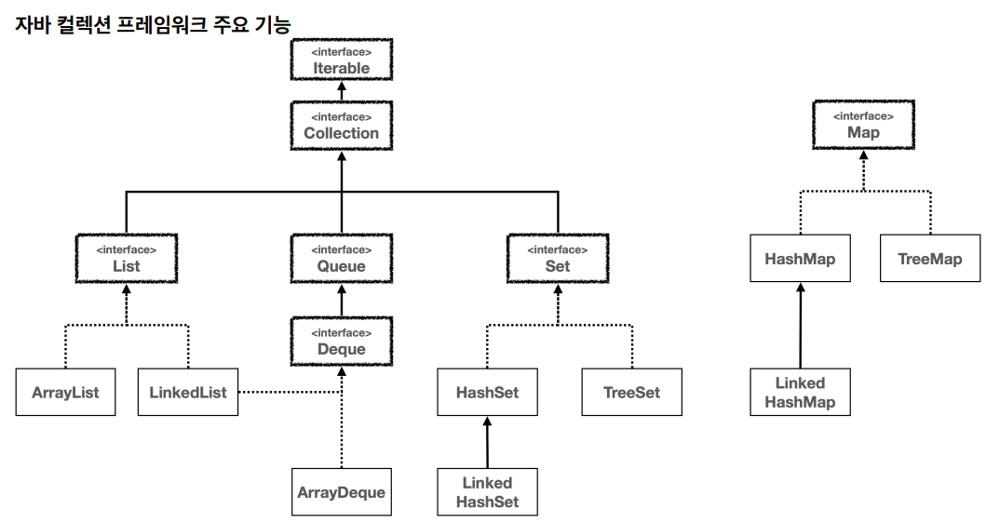

# 자바 - 컬렉션 프레임워크 전체 정리

- 자바 컬렉션 프레임워크는 데이터 그룹을 저장하고 처리하기 위한 통합 아키텍처를 제공한다.
- 이 프레임워크는 인터페이스, 구현, 알고리즘으로 구성되어 있으며, 다양한 타입의 컬렉션을 효율적으로 처리할 수 있게 해준다.
- 여기서 컬렉션이란 객체의 그룹이나 집합을 의미한다.

---

## Collection 인터페이스의 필요성

- `Collection` 인터페이스는 자바 컬렉션 프레임워크의 가장 기본적인 인터페이스로, 자바에서 데이터 그룹을 다루는 데 가장 필요한 기본적인 메서드들을 정의한다.
- 그리고 다양한 컬렉션 타입들이 공통적으로 따라야 하는 기본 규약을 정의한다.
- `List`, `Set`, `Queue` 와 같은 더 구체적인 컬렉션 인터페이스들은 모두 `Collection` 인터페이스를 확장하여, 공통된 메서드들을 상속 받고 추가적인 기능이나 특성을 제공한다.
- 이러한 설계는 자바 컬렉션 프레임워크의 일관성과 재사용성을 높여준다.
  - **일관성**
    - 모든 컬렉션 타입들이 `Collection` 인터페이스를 구현함으로써, 모든 컬렉션들이 기본적인 동작을 공유한다는 것을 보장한다.
    - 이는 개발자가 다양한 타입의 컬렉션을 다룰 때 일관된 방식으로 접근할 수 있게 해준다.
  - **재사용성**
    - `Collection` 인터페이스에 정의된 메서드듣은 다양한 컬렉션 타입에 공통으로 적용된다.
    - 이는 코드의 재사용성을 높이고, 유지 보수를 용이하게 한다.
  - **확장성**
    - 새로운 컬렉션 타입을 만들 때 `Collection` 인터페이스를 구현함으로써, 기존에 정의된 알고리즘과 도구를 사용할 수 있게 된다.
    - 이는 프레임워크의 확장성을 향상시킨다.
  - **다형성**
    - `Collection` 인터페이스를 사용함으로써, 다양한 컬렉션 타입들을 같은 타입으로 다룰 수 있다.
    - 이는 다형성을 활용해서 유연한 코드를 작성할 수 있게 해준다.

**`Collection` 인터페이스의 주요 메서드**
- `add(E e)` : 컬렉션에 요소를 추가한다.
- `remove(Object o)` : 주어진 객체를 컬렉션에서 제거한다.
- `size()` : 컬렉션에 포함된 요소의 수를 반환한다.
- `isEmpty()` : 컬렉션이 비어 있는지 확인한다.
- `contains(Object o)` : 컬렉션이 특정 요소를 포함하고 있는지 확인한다.
- `iterator()` : 컬렉션의 요소에 접근하기 위한 반복자를 반환한다.
- `clear()` : 컬렉션의 모든 요소를 제거한다.

`Collection`은 `Map`을 제외한 모든 컬렉션 타입의 부모이기 때문에, 모든 컬렉션을 받아서 유연하게 처리할 수 있다. 
대표적으로 `Collection` 인터페이스는 `iterator`를 제공한다. 따라서 데이터를 단순히 순회할 목적이라면 `Collection`을 사용하면 모든
컬렉션 타입의 데이터를 순회할 수 있다.

**컬렉션 프레임워크는 크게 인터페이스, 구현, 알고리즘을 제공한다.**

---

## 인터페이스

**자바 컬렉션 프레임워크의 핵심 인터페이스**
- **Collection**: 단일 루트 인터페이스로, 모든 컬렉션 클래스가 이 인터페이스를 상속받는다.
  - `List` , `Set` , `Queue` 등의 인터페이스가 여기에 포함된다.
- **List**: 순서가 있는 컬렉션을 나타내며, 중복 요소를 허용한다. 인덱스를 통해 요소에 접근할 수 있다.
  - 예: `ArrayList` , `LinkedList`
- **Set**: 중복 요소를 허용하지 않는 컬렉션을 나타낸다. 특정 위치가 없기 때문에 인덱스를 통해 요소에 접근할 수 없다.
  - 예: `HashSet` , `LinkedHashSet` , `TreeSet`
- **Queue**: 요소가 처리되기 전에 보관되는 컬렉션을 나타낸다.
  - 예: `ArrayDeque` , `LinkedList` , `PriorityQueue`
- **Map**: 키와 값 쌍으로 요소를 저장하는 객체이다. `Map` 은 `Collection` 인터페이스를 상속받지 않는다.
  - 예: `HashMap` , `LinkedHashMap` , `TreeMap`

---

## 구현

**자바는 각 인터페이스의 여러 구현을 제공한다**
- **List**: `ArrayList` 는 내부적으로 배열을 사용하며, `LinkedList` 는 연결 리스트를 사용한다.
- **Set**: `HashSet` 은 해시 테이블을, `LinkedHashSet` 은 해시 테이블과 연결 리스트를, `TreeSet` 은 레드-블랙 트리를 사용한다.
- **Map**: `HashMap` 은 해시 테이블을, `LinkedHashMap` 은 해시 테이블과 연결 리스트를, `TreeMap` 은 레드-블랙 트리를 사용한다.
- **Queue**: `LinkedList` 는 연결 리스트를 사용한다. `ArrayDeque` 는 배열 기반의 원형 큐를 사용한다. 대부분의 경우 `ArrayDeque` 가 빠르다.

---

## 알고리즘

- 컬렉션 프레임워크는 데이터를 처리하고 조작하기 위한 다양한 알고리즘을 제공한다. 
- 이러한 알고리즘은 각각의 자료 구조 자체적으로 기능을 제공하기도 하고 또 `Collections` 와 `Arrays` 클래스에 정적 메소드 형태로도 구현되어 있다.
- 이를 통해 정렬, 검색, 순환, 변환 등의 작업을 수행할 수 있다.

---

## 선택 가이드

- **순서가 중요하고 중복이 허용되는 경우**: 
  - `List` 인터페이스를 사용하자. 
  - `ArrayList` 가 일반적인 선택이지만, 추가/삭제 작업이 앞쪽에서 빈번한 경우에는 `LinkedList` 가 성능상 더 좋은 선택이다.
- **중복을 허용하지 않고 순서가 중요하지 않은 경우**: 
  - `HashSet` 을 사용하자. 
  - 순서를 유지해야 하면 `LinkedHashSet` 을, 정렬된 순서가 필요하면 `TreeSet` 을 사용하자.
- **요소를 키-값 쌍으로 저장하려는 경우**: 
  - `Map` 인터페이스를 사용하자. 
  - 순서가 중요하지 않다면 `HashMap` 을, 순서를 유지해야 한다면 `LinkedHashMap` 을, 정렬된 순서가 필요하면 `TreeMap` 을 사용하자.
- **요소를 처리하기 전에 보관해야 하는 경우**: 
  - `Queue` , `Deque` 인터페이스를 사용하자. 
  - 스택, 큐 구조 모두 `ArrayDeque` 를 사용하는 것이 가장 빠르다. 만약 우선순위에 따라 요소를 처리해야 한다면 `PriorityQueue`를 고려하자.

**실무 선택 가이드**
- `List`의 경우 대부분 `ArrayList`를 사용
- `Set`의 경우 대부분 `HashSet`을 사용
- `Map`의 경우 대부분 `HashMap`을 사용
- `Queue`의 경우 대부분 `ArrayDeque`를 사용

---

[이전 ↩️ - 자바(컬렉션 프레임워크) - 컬렉션 유틸]()

[메인 ⏫](https://github.com/genesis12345678/TIL/blob/main/Java/mid_2/Main.md)