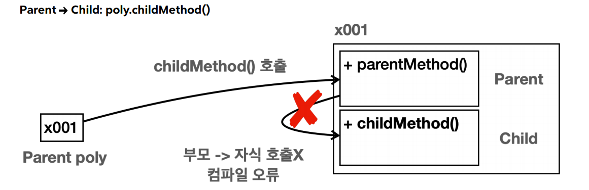
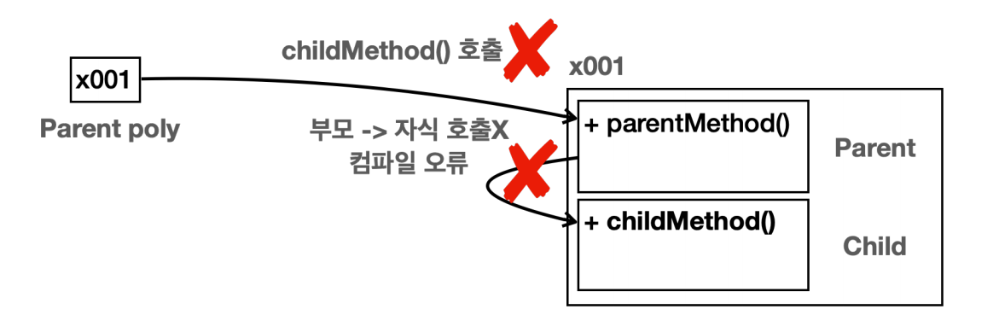
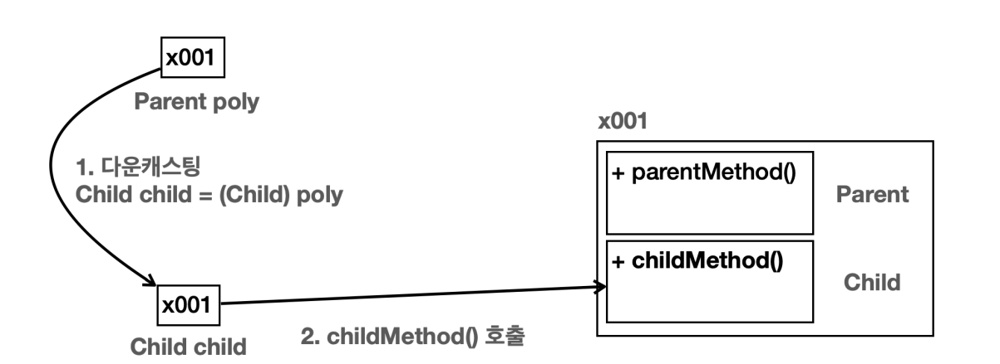
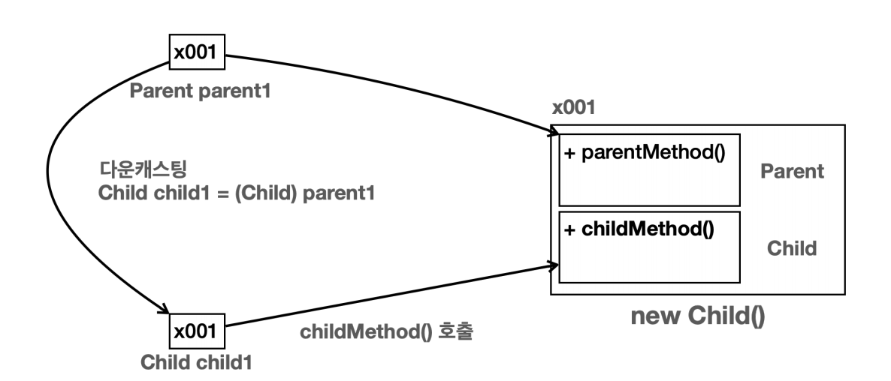
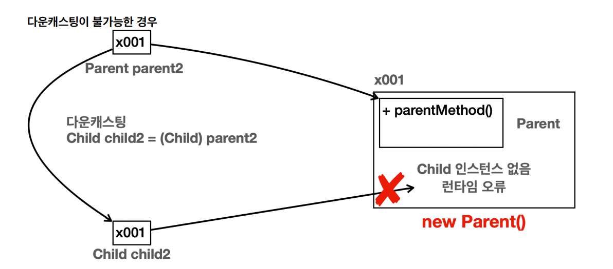
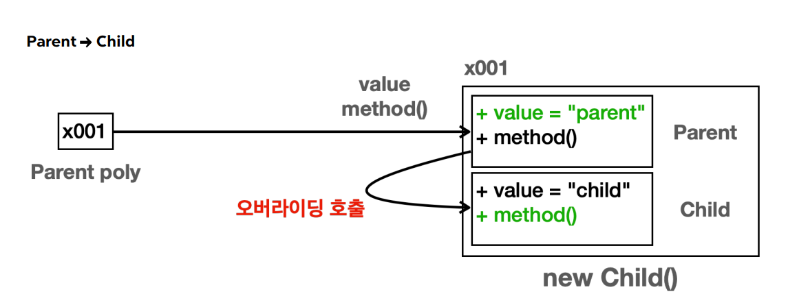

# 다형성 - 1

- 객체지향 프로그래밍의 대표적인 특징으로는 캡슐화, 상속, 다형성이 있다. 그 중 다형성은 객체지향 프로그래밍의 핵심이다.
- 다형성(`Polymorphism`)은 이름 그대로 "다양한 형태"를 뜻한다.
- 프로그래밍에서 다형성은 한 객체가 여러 타입의 객체로 취급될 수 있는 능력을 뜻한다.
- 보통 하나의 객체는 하나의 타입으로 고정되어 있는데, 다형성을 사용하면 하나의 객체가 다른 타입으로 사용될 수 있다.

<br>

## 다형적 참조

```java
public class Parent {
    public void parentMethod() {
        System.out.println("Parent.parentMethod");
    }
}
```

```java
public class Child extends Parent{
    public void ChildMethod() {
        System.out.println("Child.ChildMethod");
    }
}
```

```java
public class Main {
    public static void main(String[] args) {
        System.out.println("Parent -> parent");
        Parent parent = new Parent(); //부모가 부모 인스턴스 참조
        parent.parentMethod();

        System.out.println("----------------------------");

        System.out.println("Child -> child");
        Child child = new Child(); //자식이 자식 인스턴스 참조
        child.ChildMethod();

        System.out.println("----------------------------");

        System.out.println("Parent -> Child");
        Parent poly = new Child(); //부모가 자식 인스턴스 참조
        poly.parentMethod();

//        poly.childMethod();          부모가 자식의 기능을 호출할 수 없다.
//        Child child1 = new Parent(); 자식은 부모를 참조할 수 없다.
    }
}
```

```text
Parent -> parent
Parent.parentMethod
----------------------------
Child -> child
Child.ChildMethod
----------------------------
Parent -> Child
Parent.parentMethod
```

**부모 타입이 부모 인스턴스 참조**


- 부모 타입의 변수가 부모 인스턴스를 참조한다.
  - `Parent parent = new Parent();`
- 부모 타입인 `Parent`를 생성했기 때문에 메모리 상에 `Parent`만 생성되고, 자식은 생성되지 않는다.

**자식 타입이 자식 인스턴스 참조**


- 자식 타입의 변수가 자식 인스턴스를 참조한다.
  - `Child child = new Child();`
- 자식 타입인 `Child`를 생성했기 때문에 메모리 상에 `Child`와 `Parent`가 모두 생성된다.

**다형적 참조: 부모 타입이 자식 인스턴스 참조**


- 부모 타입의 변수가 자식 인스턴스를 참조한다.
  - `Parent poly = new Child();`
- 자식 타입인 `Child`를 생성했기 때문에 메모리 상에 `Child`와 `Parent`가 모두 생성된다.
- **부모 타입은 자식 타입을 담을 수 있다.**
  - `Parent poly`는 부모 타입이고, `new Child()`를 통해 생성된 결과는 `Child` 타입이다. 자바에서 부모 타입은 자식 타입을 담을 수 있다.
  - 하지만 반대로 자식 타입은 부모 타입을 담을 수 없다.

**다형적 참조**

- 부모 타입의 변수는 자신은 물론, 자식 타입까지 참조할 수 있다. 자식의 자식이 있다면 자식의 하위 타입도 참조할 수 있다.
  - `Parent poly = new Parent()`
  - `Parent poly = new Child()`
  - `Parent poly = new Grandson()` (`Child`의 자식)
- 자바에서 부모 타입은 자신을 기준으로 모든 자식 타입을 참조할 수 있다.
- 이것을 다양한 형태를 참조할 수 있다고 해서 **다형적 참조**라고 한다.

**다형적 참조 인스턴스 실행**

- `poly.parentMethod()`를 호출하면 먼저 참조값을 사용해서 인스턴스를 찾는다. 그리고 인스턴스 안에서 실행할 타입도 찾아야 한다.
- `poly`는 `Parent` 타입이기 때문에 `Parent` 클래스부터 시작해서 필요한 기능을 찾는다.
- 인스턴스의 `Parent` 클래스에 `parentMethod()`가 있기 때문에 해당 메서드가 호출된다.

**다형적 참조 한계**

- `Parent poly = new Child()`, 이렇게 자식을 참조한 상황에서 자식 타입에 있는 메서드를 호출하면 어떻게 될까?
- 먼저 참조값을 통해 인스턴스를 찾고, 인스턴스 안에서 실행할 타입을 찾아야 한다.
- 호출자인 `poly`는 `Parent` 타입이기 때문에 `Parent` 클래스부터 시작해서 필요한 기능을 찾는다.
- **그런데 상속 관계는 부모 방향으로 올라갈 수는 있지만 자식 방향으로 찾아 내려갈 수는 없다.**
- `Parent`는 최상위 부모 타입이다. 따라서 자식 메서드를 찾을 수 없으므로 컴파일 오류가 발생한다.



- 자식 타입의 메서드를 호출하고 싶으면 **캐스팅**이란 것이 필요하다.

> **다형적 참조의 핵심은 부모는 자식을 품을 수 있다는 것이다.**

<br>

## 다형성과 캐스팅

```java
public class Main {
    public static void main(String[] args) {
        Parent poly = new Child(); //부모가 자식 인스턴스 참조(다형적 참조)
//        poly.childMethod(); //자식의 기능을 호출할 수 없다.

        //다운 캐스팅(부모 타입 -> 자식 타입)
        Child child = (Child) poly;
        child.childMethod();
    }
}
```



- `poly.childMethod()`를 호출하면 먼저 참조 값을 사용해서 인스턴스를 찾는다.
- 인스턴스 안에서 사용할 타입을 찾아야 한다. `poly`는 `Parent` 타입이다.
- 그런데 상속 관계는 부모로만 찾아서 올라갈 수 있고, `Parent`가 최상위 부모이다. `childMethod()`는 자식 타입에 있으므로 호출할 수 없다.(컴파일 오류 발생)

**다운캐스팅**

- 이럴 때는 호출하는 타입을 자식 타입으로 변경하면 인스턴스의 자식 타입에 있는 메서드를 호출할 수 있다.
- 하지만 다음과 같은 문제가 발생한다.
- **부모는 자식을 담을 수 있지만 자식은 부모를 담을 수 없다.**
- `Child child = poly`처럼 부모 타입을 사용하는 변수를 자식 타입에 대입하려고 하면 컴파일 오류가 발생한다.
- **이때는 다운캐스팅으로 부모 타입을 잠깐 자식 타입으로 변경하면 된다.**
- `Child child = (Child) poly;`
- 캐스팅을 한다고 해서 `poly`의 타입이 변하는 것은 아니다. 해당 참조값을 꺼내고 **복사해서** 참조값이 `Child` 타입이 되는 것이다.
- 기존 변수는 절대 건드리지 않는다.



- **캐스팅**
  - **업 캐스팅** : 부모 타입으로 변경
  - **다운 캐스팅** : 자식 타입으로 변경

<br>

## 캐스팅 종류

### 일시적 다운 캐스팅

```java
public class Main {
    public static void main(String[] args) {
        Parent poly = new Child(); //부모가 자식 인스턴스 참조(다형적 참조)
//        poly.childMethod(); //자식의 기능을 호출할 수 없다.

        //일시적 다운 캐스팅 - 해당 메서드를 호출하는 순간에만 다운 캐스팅
        ((Child) poly).childMethod();
    }
}
```

- 이렇게 캐스팅을 한다고 해도 `poly`는 `Parent` 타입 그대로를 유지한다.

### 업 캐스팅

```java
public class Main {
    public static void main(String[] args) {
        Child child = new Child();
        Parent parent = (Parent) child; //업 캐스팅 생략 가능, 오히려 생략을 권장
        Parent parent1 = child;
        Parent parent2 = new Child();

        parent.parentMethod();
        parent1.parentMethod();
        parent2.parentMethod();
    }
}
```

- **다운 캐스팅은 생략할 수 없지만, 업 캐스팅은 생략할 수 있다.**
- 업 캐스팅은 매우 자주 사용하기 때문에 생략을 권장한다.
- **업 캐스팅은 생략해도 되고, 다운 캐스팅은 개발자가 왜 직접 명시적으로 캐스팅을 해야할까?**

### 다운 캐스팅 주의점

```java
public class Main {
    public static void main(String[] args) {
        Parent parent1 = new Child();
        Child child1 = (Child) parent1;
        child1.childMethod(); //문제 없음

        Parent parent2 = new Parent();
        Child child2 = (Child) parent2; //런타임 오류 - ClassCastException 발생
        child2.childMethod();
    }
}
```



- `parent1`의 경우 다운 캐스팅을 해도 문제가 없다.



- `parent2`의 경우 다운 캐스팅 하면 `ClassCastException` 이라는 런타임 오류가 발생한다.

**다운 캐스팅이 불가능한 이유**

- `Parent parent2 = new Parent();`
- `parent2`는 부모 타입으로 객체를 생성한다.따라서 메모리 상에 자식 타입은 전져 존재하지 않는다.
- `Child child2 = (Child) parent2;`
- 다음으로 자식 타입으로 다운 캐스팅을 시도한다.
  그런데 `parent2`는 `Parent` 로 생성이 되었다. 따라서 메모리 상에 `Child` 자체가 존재하지 않기 때문에 `Child`를 사용할 수 없는 것이다.

자바에서는 이렇게 사용할 수 없는 타입으로 다운 캐스팅 하는 경우에 `ClassCastException`이라는 예외를 발생시킨다.

### 업 캐스팅이 안전하고 다운 캐스팅이 위험한 이유

- 업 캐스팅의 경우 이런 문제가 절대로 발생하지 않는다. 왜냐하면 객체를 생성하면 해당 타입의 상위 부모 타입은 모두 함께 생성되기 때문이다.
- 따라서 위로만 타입을 변경하는 업 캐스팅은 메모리 상에 인스턴스가 모두 존재하기 때문에 항상 안전하다.
- 그래서 업 캐스팅을 생략할 수 있다.


- 반면 다운 캐스팅의 경우 인스턴스에 존재하지 않는 하위 타입으로 캐스팅하는 문제가 발생할 수 있다. 왜냐하면 객체를 생성하면 부모 타입은 모두 함께 생성되지만 자식 타입은 생성되지 않기 때문이다.
- 따라서 개발자가 이런 문제를 인지하고 사용해야 한다는 의미로 명시적으로 캐스팅을 해주어여 한다.


- `A a = new B()` : `A`로 업 캐스팅
- `B b = new B()` : 자신과 같은 타입
- `C c = new B()` : 자식은 부모를 담을 수 없다, 컴파일 오류 발생
- `C c = (C) new B()` : 하위 타입으로 강제 다운 캐스팅 시도, 하지만 `B` 인스턴스에 `C`와 관련된 부분이 없으므로 `ClassCastException` 런타임 오류 발생

## instanceof

- 다형성에서 참조형 변수는 이름 그대로 다양한 자식을 대상으로 참조할 수 있다.
- 그런데 참조하는 대상이 다양한데 어떤 인스턴스를 참조하고 있는지 확인하려면 어떻게 해야할까?

```java
public class Main {
    public static void main(String[] args) {
        Parent parent1 = new Parent();
        System.out.println("parent1 호출");
        call(parent1);

        System.out.println("-------------------------");

        Parent parent2 = new Child();
        System.out.println("parent2 호출");
        call(parent2);
    }

    private static void call(Parent parent) {
        parent.parentMethod();

        if (parent instanceof Child) {
            System.out.println("Child 인스턴스, 다운 캐스팅 시도 가능");
            Child child = (Child) parent;
            child.childMethod();
        } else {
            System.out.println("Child 인스턴스가 없으므로 다운 캐스팅 시도 불가능");
        }
    }
}
```

```text
parent1 호출
Parent.parentMethod
Child 인스턴스가 없으므로 다운 캐스팅 시도 불가능
-------------------------
parent2 호출
Parent.parentMethod
Child 인스턴스, 다운 캐스팅 시도 가능
Child.childMethod
```

- 이렇게 다운 캐스팅을 수행하기 전에 `instanceof`로 원하는 타입으로 변경이 가능한지 확인한 다음에 다운 캐스팅을 수행하는 것이 안전하다.
- `instanceof` 키워드는 오른쪽 대상의 자식 타입을 왼쪽에서 참조하는 경우에도 `true`를 반환한다.
- 즉, 오른쪽에 있는 타입에 왼쪽에 있는 인스턴스의 타입이 들어갈 수 있는지 대입해보면 된다.
  - `new Parent() instanceof Parent`
    - `Parent p = new Parent()` , `true`
  - `new Child() instanceof Parent`
    - `Parent p = new Child()`, `true`
  - `new Parent() instanceof Child`
    - `Child c = new Parent()`, **false**
  - `new Child instanceof Child`
    - `Child c = new Child()`, `true`

### Pattern Matching for instanceof

- 자바 16부터는 `instanceof`를 사용하면서 동시에 변수를 선언할 수 있다.

```java
public class Main {
    public static void main(String[] args) {
        Parent parent1 = new Parent();
        System.out.println("parent1 호출");
        call(parent1);

        System.out.println("-------------------------");

        Parent parent2 = new Child();
        System.out.println("parent2 호출");
        call(parent2);
    }

    private static void call(Parent parent) {
        parent.parentMethod();

        if (parent instanceof Child child) { //instanceof 로 확인 후 바로 다운 캐스팅
            System.out.println("Child 인스턴스, 다운 캐스팅 시도 가능");
            child.childMethod();
        } else {
            System.out.println("Child 인스턴스가 없으므로 다운 캐스팅 시도 불가능");
        }
    }
}
```

- `instanceof`로 캐스팅이 가능한 것을 보장해주므로 바로 변수를 선언하는 기능을 제공한다.

<br>

## 다형성과 메서드 오버라이딩

```java
public class Parent {
    public void method() {
        System.out.println("Parent.parentMethod");
    }
}
```

```java
public class Child extends Parent{

    @Override
    public void method() {
        System.out.println("Child.method");
    }
}
```

```java
public class Main {
    public static void main(String[] args) {
        //자식이 자식 인스턴스 참조
        Child child = new Child();
        child.method();

        //부모가 부모 인스턴스 참조
        Parent parent = new Parent();
        parent.method();

        //부모가 자식 인스턴스 참조
        Parent poly = new Child();
        poly.method();
    }
}
```

```text
Child.method
Parent.parentMethod
Child.method
```



- `poly` 변수는 `Parent` 타입이다.따라서 `poly.method()`를 호출하면 인스턴스의 `Parent` 타입에서 기능을 찾아서 실행한다.
- 그런데 하위 타입에서 메서드가 오버라이딩 되어 있다. **오버라이딩 된 메서드가 항상 우선권을 가진다.** 따라서 `Child.method()`가 실행이 된다.

오버라이딩은 부모 타입에서 정의한 기능을 자식 타입에서 재정의 하는 것이다. 만약 자식에서 오버라이딩하고, 자식의 자식에서도 오버라이딩을 하면 더 하위 자식의 오버리이딩 된 메서드가 우선권을 가진다.

> 내용 참고 : [인프런 - 김영한의 실전 자바 - 기본편](https://www.inflearn.com/course/%EA%B9%80%EC%98%81%ED%95%9C%EC%9D%98-%EC%8B%A4%EC%A0%84-%EC%9E%90%EB%B0%94-%EA%B8%B0%EB%B3%B8%ED%8E%B8/dashboard)