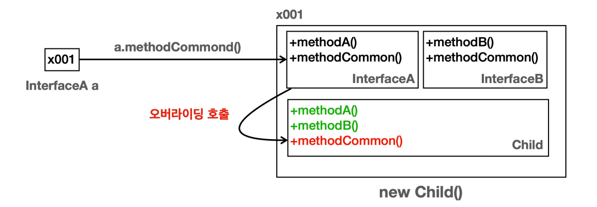
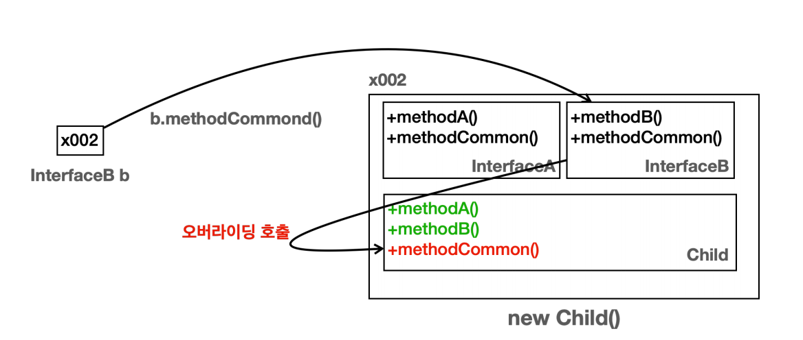

# 다형성 - 2

## 다형성 활용

```java
public class Dog {
    public void sound() {
        System.out.println("멍멍");
    }
}
```

```java
public class Cat {
    public void sound() {
        System.out.println("야옹");
    }
}
```

```java
public class Cow {
    public void sound() {
        System.out.println("음메");
    }
}
```

```java
public class Main {
    public static void main(String[] args) {
        Dog dog = new Dog();
        Cat cat = new Cat();
        Cow cow = new Cow();

        System.out.println("동물 을음 소리 테스트 시작");
        dog.sound();
        System.out.println("동물 을음 소리 테스트 종료");

        System.out.println("동물 을음 소리 테스트 시작");
        cat.sound();
        System.out.println("동물 을음 소리 테스트 종료");

        System.out.println("동물 을음 소리 테스트 시작");
        cow.sound();
        System.out.println("동물 을음 소리 테스트 종료");
    }
}
```

- 여기에 새로운 동물이 추가된다면 새로운 동물 클래스를 만들고 `main`에 비슷한 코드가 추가되어야 할 것이다.
- 중복 코드가 너무 많아진다.
- 배열이나 for문, 메서드 추출로 해결해 보려고 해도 동물 클래스들이 서로 완전히 다른 클래스이기 때문에 이것도 쉽지 않다.

**다형성의 핵심은 다형적 참조와 메서드 오버라이딩이다. 이 둘을 활용하여 모두 같은 타입을 사용하고, 각자 자신의 메서드도 호출할 수 있다.**


```java
public class Animal {

    public void sound() {
        System.out.println("동물 울음 소리");
    }
}
```

```java
public class Dog extends Animal{

    @Override
    public void sound() {
        System.out.println("멍멍");
    }
}
```

```java
public class Cat extends Animal{

    @Override
    public void sound() {
        System.out.println("야옹");
    }
}
```

```java
public class Cow extends Animal{

    @Override
    public void sound() {
        System.out.println("음메");
    }
}
```

```java
public class Main {
    public static void main(String[] args) {
        Dog dog = new Dog();
        Cat cat = new Cat();
        Cow cow = new Cow();

        soundAnimal(dog);
        soundAnimal(cat);
        soundAnimal(cow);

    }

    static void soundAnimal(Animal animal) {
        System.out.println("동물 울음 소리 테스트 시작");
        animal.sound();
        System.out.println("동물 울음 소리 테스트 종료");
    }
}
```

- `Animal animal`은 상위 부모 타입이기 때문에 자신의 모든 자식 타입을 참조할 수 있다.
- 그리고 메서드 오버라이딩이 되었기 때문에 자식 타입의 메서드가 실행된다.
- 이제 새로운 동물이 추가되어도 새로운 클래스만 생성하고 `main`쪽에 코드 변화는 크게 없을 것이다.

`Animal[] animals = {dog, cat, cow};` 처럼 배열을 이용해 `for문`으로도 가능해졌다. 어떤 동물이 추가되어도 `Animal`만 상속받으면 메서드나 반복문에는 전혀 변화가 생기지 않는다.

**새로운 기능이 추가되었을 때 변하는 부분을 최소화 하는 것이 잘 작성된 코드이다. 이렇게 하기 위해서는 코드에서 변하는 부분과 변하지 않는 부분을 명확하게 구분하는 것이 좋다.**

- **남은 문제**
  - `Animal` 클래스를 생성할 수 있는 문제
    - `Animal`이라는 추상적인 개념을 직접 생성해서 사용할 일은 없다.
  - `Animal` 클래스를 상속 받은 곳에서 메서드 오버라이딩을 하지 않을 가능성
    - 개발자가 실수로 메서드 오버라이딩을 하지 않아도 코드상에는 전혀 문제가 없다. 단지 `Animal` 클래스에 있는 메서드를 그대로 사용할 뿐이다.

**좋은 프로그램은 제약이 있는 프로그램이다. 추상 클래스와 추상 메서드를 사용하여 문제를 해결할 수 있다.**

<br>

## 추상 클래스

- `Animal`과 같이 부모 클래스는 제공하지만, 실제 생성되면 안 되는 클래스를 추상 클래스라 한다.
- 추상 클래스는 이름 그대로 추상적인 개념을 제공하는 클래스로, 실체인 인스턴스가 존재하지 않는다. 대신에 상속을 목적으로 사용되고, 부모 클래스 역할을 담당한다.

```java
public abstract class Animal {

    public abstract void sound();
}
```

- **추상 메서드가 하나라도 있는 클래스는 추상 클래스로 선언해야 한다.**
  - 그렇지 않으면 컴파일 오류가 발생한다.
  - 추상 메서드는 메서드 바디가 없다. 따라서 작동하지 않는 메서드를 가진 불완전한 클래스로 볼 수 있기 때문에 직접 생성하지 못하도록 추상 클래스로 선언해야 한다.
- **추상 메서드는 상속 받는 자식 클래스가 반드시 오버라이딩 해서 사용해야 한다.**
  - 그렇지 않으면 컴파일 오류가 발생한다.
  - 추상 메서드는 자식 클래스가 반드시 오버라이딩 해야 하기 때문에 메서드 바디 부분이 없다. 바디 부분을 만들면 컴파일 오류가 발생한다.
  - 오버라이딩 하지 않으면 자식도 추상 클래스가 되어야 한다.
- 추상 메서드는 기존 메서드와 같다. 다만 메서드 바디가 없고, 자식 클래스가 해당 메서드를 반드시 오버라이딩 해야 한다는 제약이 추가된 것이다.

```java
public abstract class Animal {

    public abstract void sound();

    public void move() {
        System.out.println("동물이 움직입니다.");
    }
}
```

- `sound()` 메서드는 자식이 반드시 오버라이딩 해야하고, `move()` 메서드는 오버라이딩을 선택적으로 할 수 있다.
- 이렇게 추상 클래스에서도 메서드 바디가 있는 메서드를 만들 수 있다.
- `move()`를 오버라이딩 하지 않으면 `Animal`에 있는 `move()`가 그대로 호출된다.

### 순수 추상 클래스

- **순수 추상 클래스** : 모든 메서드가 추상 메서드인 추상 클래스

```java
public abstract class Animal {

    public abstract void sound();
    public abstract void move();
}
```

- 이런 순수 추상 클래스는 실행 로직을 전혀 가지고 있지 않다. 단지 다형성을 위한 부모 타입으로써 껍데기 역할만 제공할 뿐이다.
- 순수 추상 클래스의 특징
  - 인스턴스를 생성할 수 없다.
  - 상속 시 자식은 모든 메서드를 오버라이딩 해야 한다.(하지 않으면 컴파일 오류 발생)
  - 주로 다형성을 위해 사용된다.

**상속 시 자식은 모든 메서드를 오버라이딩 해야 한다**라는 특징을 잘 생각해 보면 순수 추상 클래스는 마치 어떤 규격을 지켜서 구현해야 하는 것 처럼 느껴진다.

이런 순수 추상 클래스의 개념은 프로그래밍에서 매우 자주 사용된다. 자바는 순수 추상 클래스를 더 편리하게 사용할 수 있도록 **인터페이스**라는 개념을 제공한다.

<br>

## 인터페이스

```java
public interface Animal {

    public abstract void sound();
    public abstract void move();
}
```

- `public abstract` 키워드는 생략 가능하다.

```java
public interface Animal {

    void sound();
    void move();
}
```

- 인터페이스는 순수 추상 클래스의 특징에 더해 약간의 편의 기능이 추가된다.

  - 인터페이스의 메서드는 모두 `public`, `abstract`이다.
  - 메서드에 `public abstract`를 생력할 수 있다.(생략을 권장)
  - 인터페이스는 다중 구현(다중 상속)을 지원한다.

- **인터페이스도 멤버 변수를 가질 수 있다.**

  - 인터페이스에서 멤버 변수는 `public`, `static`, `final`이 모두 포함되었다고 간주된다.(3가지 키워드 모두 생략 가능)

- 클래스, 추상 클래스, 인터페이스는 프로그램 코드, 메모리 구조상 모두 똑같다.
- 모두 자바에서 `.class`로 다루어진다.
- 인터페이스를 작성할 때도 `.java`에 인터페이스를 정의한다.

**상속 vs 구현**

- 부모 클래스의 기능을 자식 클래스가 상속 받을 때 클래스는 상속 받는다고 표현한다.
- 부모 인터페이스의 기능을 자식이 상속 받을 때는 자식이 인터페이스를 구현한다고 표현한다.
- 상속은 이름 그대로 부모의 기능을 물려 받는 것이 목적이다. 하지만 **인터페이스는 모든 메서드가 추상 메서드**이다. 따라서 물려받을 수 있는 기능이 없고, 오히려 인터페이스에 정의한 모든 메서드를 자식이 오버라이딩 해서 기능을 구현해야 한다. 따라서 구현한다고 표현한다.

상속과 구현은 사람이 표현하는 단어만 다를 뿐 자바 입장에서는 모두 똑같다. 일반 상속 구조와 동일하게 작동한다.

**인터페이스를 사용해야 하는 이유**

모든 메서드가 추상 메서드인 경우 순수 추상 클래스를 만들어도 되고, 인터페이스를 만들어도 된다. 그런데 인터페이스를 사용해야 하는 이유는 다음과 같은 이유가 있다.

- **제약**
  - 인터페이스를 구현하는 곳에서 인터페이스의 메서드를 반드시 구현하라는 제약을 줄 수 있다.
  - 순수 추상 클래스는 누군가 실행 가능한 메서드를 만들 수도 있다. 이렇게 되면 자식 클래스에서 추가된 기능을 구현하지 않을 수도 있고, 또 더는 순수 추상 클래스가 아니게 된다.
  - 인터페이스는 자동으로 모든 메서드가 추상 메서드가 되기 때문에 이런 문제를 원천 차단할 수 있다.
- **다중 구현**
  - 자바에서 클래스 상속은 부모를 하나만 지정할 수 있는 반면, 인터페이스는 부모를 여러명 두는 다중 구현(다중 상속)이 가능하다.

**좋은 프로그램은 제약이 있는 프로그램이다.**

> 자바8 부터 나온 `default` 메서드를 사용하면 인터페이스도 메서드를 구현할 수 있다. 하지만 이것은 예외적으로 아주 특별한 경우에만 사용하는 것이 좋다.<br>
> 자바9 에서 나온 인터페이스의 `private` 메서드도 마찬가지다.

<br>

## 인터페이스 다중 구현

- 자바는 다중 상속을 지원하지 않는다.
- 다중 상속을 사용하면 어떤 부모의 메서드를 사용해야 할지 애매한 문제가 발생한다.(다이아몬드 문제)
- 그리고 다중 상속을 사용하면 클래스 계층 구조가 매우 복잡해질 수 있다.
- 이런 문제점 때문에 자바는 클래스의 다중 상속을 허용하지 않지만, 대신에 인터페이스의 다중 구현을 허용하여 이러한 문제를 해결할 수 있다.

  **인터페이스는 모두 추상 메서드로 이루어져 있기 때문에 인터페이스의 다중 구현은 허용한다.**


- `InterfaceA`, `InterfaceB` 모두 `methodCommon()` 을 가지고 있다. 그리고 `Child`는 두 인터페이스를 구현했다.
- 상속 관계였다면 두 부모 중 어떤 한 부모의 `methodCommon()`을 사용해야 할지 결정해야 하는 다이아몬드 문제가 발생한다.
- 하지만 인터페이스 자신은 구현을 가지지 못하고, 해당 인터페이스를 구현하는 곳에서 해당 기능을 모두 구현해야 하기 때문에 오버라이딩에 의해 어차피 `Child`에서 오버라이딩 된 `methodCommon()`이 호출된다.
- 결과적으로 두 부모 중에 어떤 한 부모의 `methodCommon()`을 선택하는 것이 아니라 인터페이스들을 구현한 `Child`에 있는 `methodCommon()`이 사용된다.
- 이런 이유로 인터페이스는 다이아몬드 문제가 발생하지 않아서 인터페이스의 경우 다중 구현을 허용한다.

위 그림 그대로 구현하면 다음과 같이 동작한다.





> 내용 참고 : [인프런 - 김영한의 실전 자바 - 기본편](https://www.inflearn.com/course/%EA%B9%80%EC%98%81%ED%95%9C%EC%9D%98-%EC%8B%A4%EC%A0%84-%EC%9E%90%EB%B0%94-%EA%B8%B0%EB%B3%B8%ED%8E%B8/dashboard)