# 자바 동시성 프로그래밍 - 비동기 프로그래밍

## CompletableFuture

- `CompletableFuture`는 비동기 프로그래밍을 쉽게 다루고 복잡한 비동기 작업을 효과적으로 처리할 수 있도록 해주는 도구로 자바 8에 도입되었다.
- `CompletableFuture`는 값과 상태를 설정함으로 명시적으로 완료시킬 수 있는 `Future`로서 코드의 가독성을 높이고 비동기 작업의 조합을 간단하게 처리할 수 있다.
- 자바에서 비동기 및 병렬 프로그래밍의 능력을 향상시키는 데 중요한 역할을 하고 있는 클래스이다.

### Future & CompletableFuture

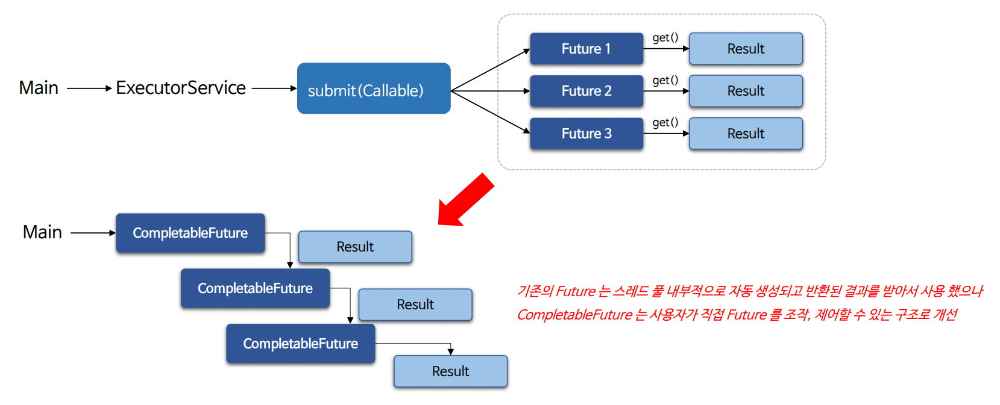

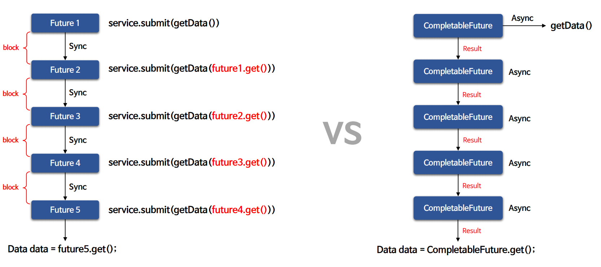

> **`CompletableFuture`는 비동기 작업 단계를 구성, 결합, 실행하고 오류를 처리하기 위한 다양한 방법을 제공한다.**

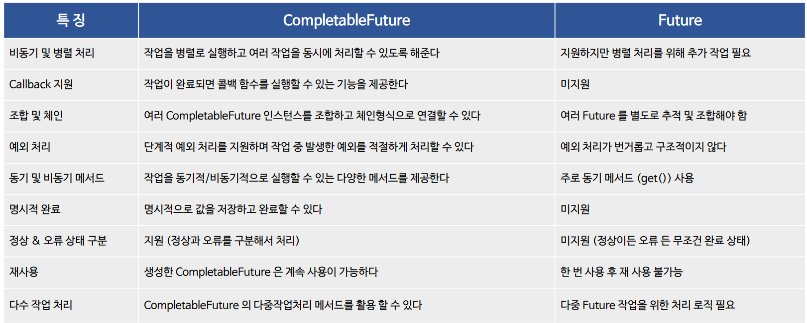

> **비동기 및 병렬 작업의 효율적인 제어와 조작을 위해서는 `Future`보다 `CompletableFuture`를 사용하는 것이 더 좋다.**

### 코드 비교 - Future

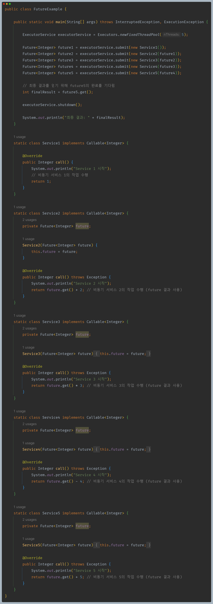

### 코드 비교 - CompletableFuture

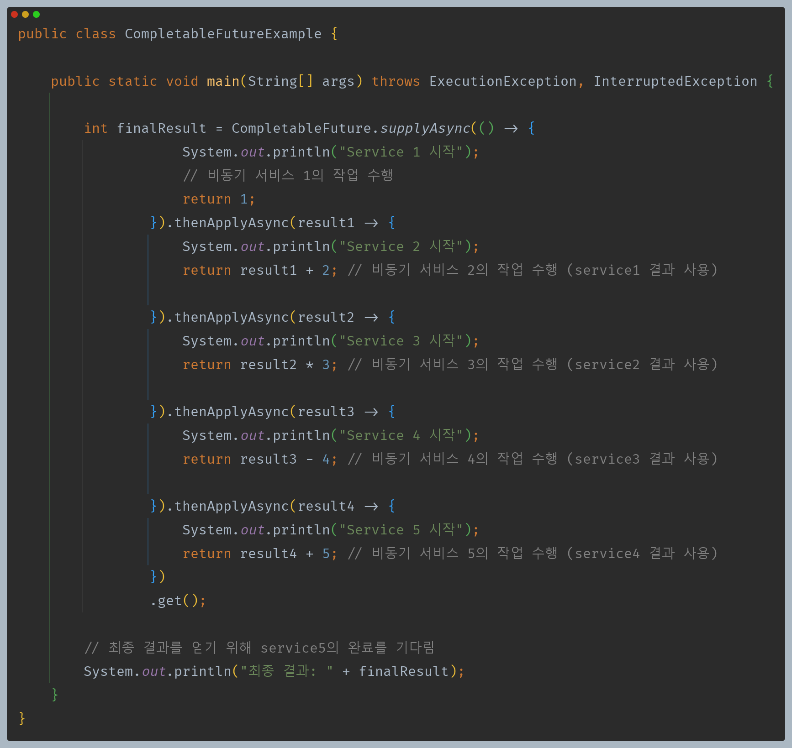

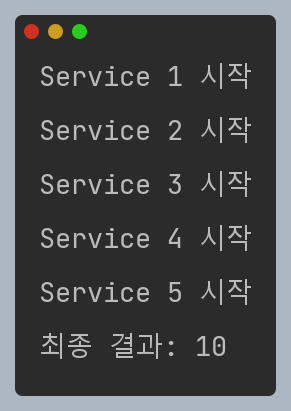

---

## CompletableFuture 구조 및 API

- `CompletableFuture`는 비동기 작업과 함수형 프로그래밍의 콜백 패턴을 조합한 `Future`라 할 수 있으며 2가지 유형의 API로 구분할 수 있다.
- `CompletableFuture`는 `Future`와 `CompletionStage` 를 구현한 클래스이다.

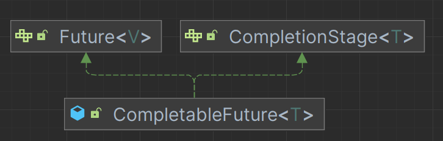

### CompletionStage

- `CompletionStage`는 비동기 작업을 위한 콜백 함수 API를 제공하며 어떤 작업이 완료된 후에 실행되어야 하는 후속 작업들을 정의하는 데 사용된다.
- `CompletionStage`는 "이 작업이 끝나면, 그 다음에 이 작업을 해라." 와 같은 연쇄적인 비동기 작업을 표현하기 위한 도구로 사용되며
    한 작업의 완료는 자동으로 다음 작업의 시작을 트리거 할 수 있어, 여러 비동기 작업들을 연속적으로 연결하여 실행할 수 있게 해준다.

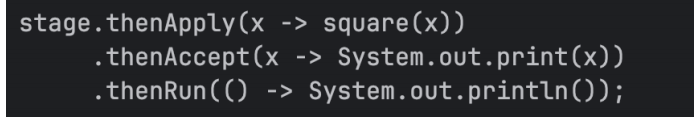

### CompletableFuture API

- 비동기 작업을 시작하고 실행, 완료 등의 API를 제공한다.

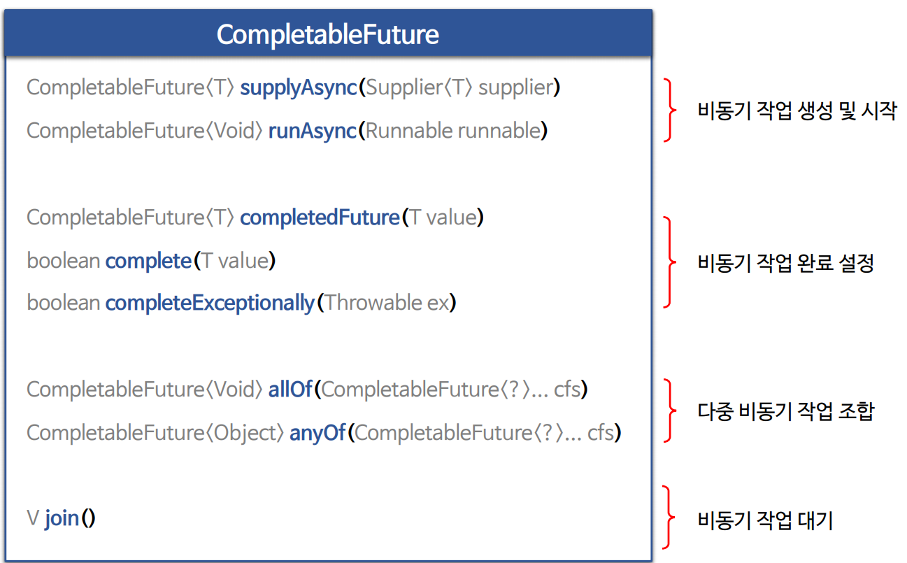

### CompletionStage API

- 비동기 작업을 조작하고, 예외 처리하는 등의 API를 제공한다.

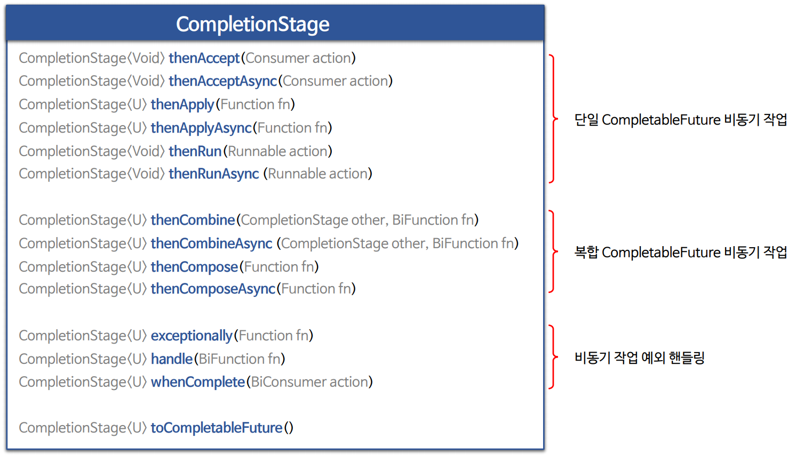

### 비동기 작업 유형

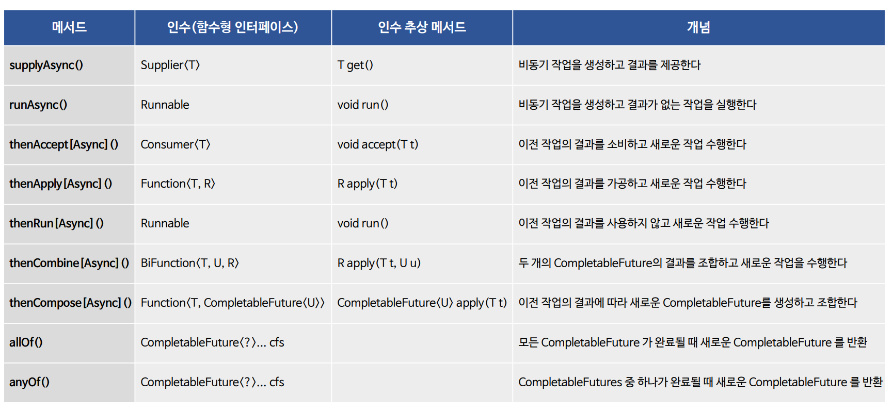

### 비동기 작업 실행 객체

- `CompletableFuture` API를 실행하면 내부적으로 API와 연결되는 객체가 생성되어 동기 또는 비동기 작업을 수행하게 된다.

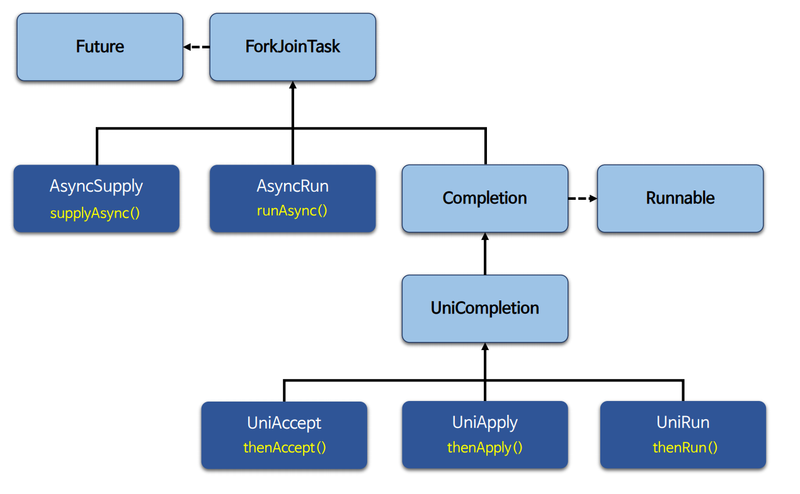

- 예를 들어 `supplyAsync()`를 실행하면 내부적으로 `AsyncSupply` 객체가 생성된다.

---

## Future와 CompletableFuture 간단한 비교

### 암묵적 완료 vs 명시적 완료

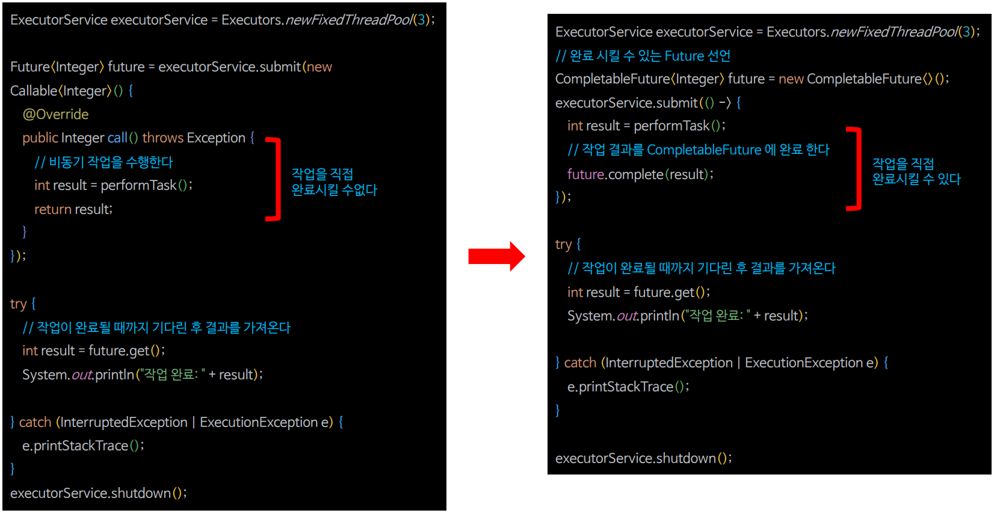

### ExecutorService 비동기 vs CompletableFuture 비동기

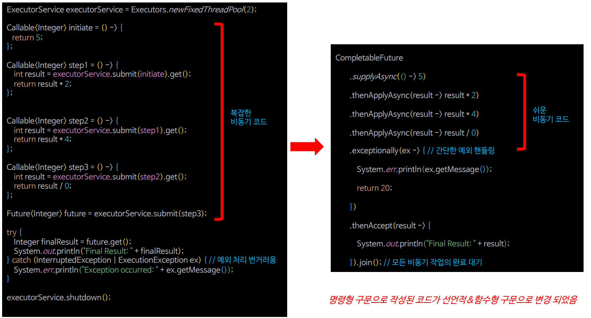

---

[이전 ↩️ - 비동기 프로그래밍 - 동기 vs 비동기]()

[메인 ⏫](https://github.com/genesis12345678/TIL/blob/main/Java/reactive/Main.md)

[다음 ↪️ - 비동기 프로그래밍 - 비동기 작업 시작(`supplyAsync()` & `runAsync()`)]()