# 자바 동시성 프로그래밍 - 비동기 프로그래밍

## ForkJoinPool 개념

- `ForkJoinPool`은 자바에서 병렬 처리를 지원하는 스레드 풀로서 자바 7부터 도입 되었다.
- `ForkJoinPool`은 작업을 작은 조각으로 나누고 병렬로 처리하여 다중 코어 프로세서에서 효율적으로 작업을 수행할 수 있도록 도와준다.
- 참고로 `ForkJoinPool` 에서 만드는 스레드는 데몬 스레드이다.

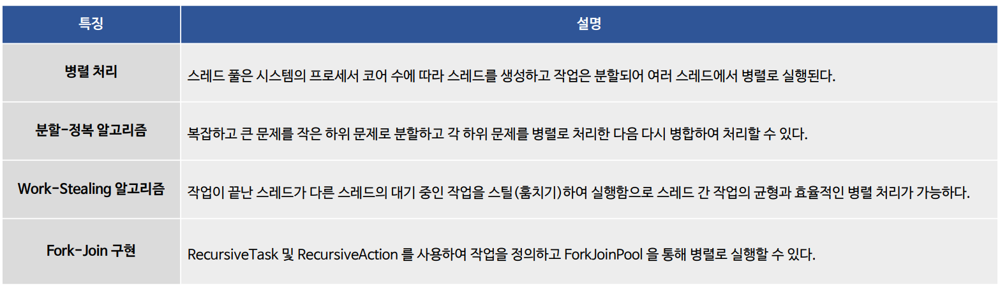

### 분할-정복 알고리즘 (Parallelism)

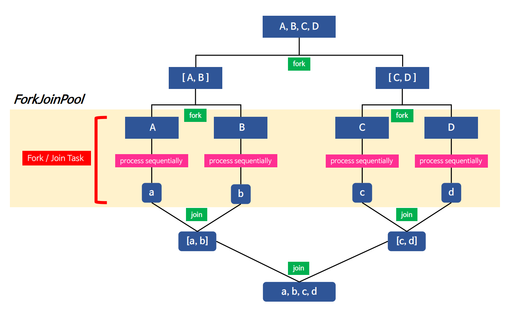

### Work-Stealing

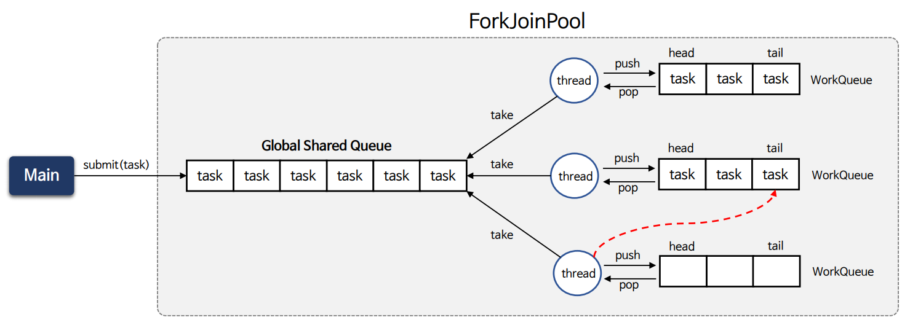

- 스레드는 글로벌 큐에 `task`가 존재하면 자신의 `WorkQueue`의 `head`에 **push** 해놓고 `task` 처리 시 `head`에서 `task`를 **pop** 해서 가져온다.
- 스레드가 자신만의 `WorkQueue`의 `head`에서 `task`를 **push**하고 **pop** 하기 때문에 별도의 동기화 처리가 필요하지 않게 된다.
- 다른 스레드가 자신의 `WorkQueue`에 **Work Stealing** 하는 경우 `WorkQueue`의 `tail`에서 **pop**을 하기 때문에 동기화 없이 `Lock-Free`하게 구현할 수 있다.
- 결과적으로 스레드는 자신의 `WorkQueue`의 `head`에서 대부분 작업을 수행하고, **Work-Stealing** 하는 다른 스레드는 `tail`에서 작업이 수행되므로 스레드 간 경합이 현저히 줄어든다.
- 다만 스레드의 개수가 상당히 많아지면 **Work-Stealing** 하려는 스레드 간 경합이 심해질 수 있다.

> - 참고로 글로벌 큐에서는 각 스레드의 `WorkQueue`를 가지고 있다.
> - 왜냐하면 `WorkQueue`는 스레드 간에 공유할 수 없는 영역이기 때문에 접근할 수 없다.
> - 때문에 **Work-Stealing** 할 때 글로벌 큐에서 다른 스레드의 `WorkQueue`에 접근해서 스틸링 하는 것이다.

### Fork-Join 구현

- `ForkJoinPool` 프레임워크에서 사용되는 작업 유형으로 `RecursiveTask` 및 `RecursiveAction`이 있으며 `ForkJoinTask`를 상속하고 있으며 병렬 작업을 수행한다.
- 추상 클래스인 `RecursiveTask` 또는 `RecursiveAction`을 상속해서 `Fork-Join` 기능을 구현할 수 있다.

**RecursiveTask**

- 병렬 작업을 수행하고 작업 결과를 반환한다.
- **`compute()` 메서드를 오버라이드 하여 작업을 정의하고 결과를 반환한다.**
- 분할-정복 알고리즘에서 큰 작업을 작은 하위 작업으로 분할하고 각 하위 작업의 결과를 합산하여 최종 결과를 반환할 때 사용된다.

**RecursiveAction**

- 병렬 작업을 수행하지만 작업 결과를 반환하지 않는다.
- **`compute()` 메서드를 오버라이드 하여 작업을 정의하며 반환 값이 없는 `void` 형식이다.**
- 배열의 요소를 병렬로 업데이트하거나 로그를 기록하는 작업 등에서 사용된다.

---

## ForkJoinPool 구조

### ForkJoinPool 생성

- 기본적으로 애플리케이션에서 공용으로 사용하는 스레드는 `CPU 코어 개수 - 1` 개 만큼 생성된다.
  - `Runtime.getRuntime().avaliableProcessors() - 1`
- `ForkJoinPool.commonPool()`은 전체 애플리케이션에서 스레드를 공용으로 사용하기 때문에 다음과 같은 주의가 필요하다.
  - **스레드 블로킹**
    - **I/O 바운드 작업**은 스레드를 블록시키는 작업으로 `commonPool()` 에서 실행 시 스레드 부족으로 다른 작업이 지연될 수 있다.
    - 별도의 스레드 풀을 생성하여 **I/O 작업과 CPU 작업을 분리**하고 I/O 작업을 별도의 스레드에서 처리하는 것을 고려해야 한다.
  - **기아 상태(Starvation)**
    - I/O 작업이 지속적으로 블록되면 CPU 작업이 실행 기회를 얻지 못하고 기아 상태에 빠질 수 있다.
    - 스레드 풀을 분리하여 CPU 작업이 충분한 실행 기회를 얻도록 관리해야 하고, 대신 스레드가 필요 이상으로 생성되어 리소스 비용이 커지지 않도록 해야 한다.

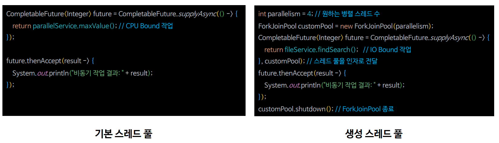

### ForkJoinPool 실행 구조

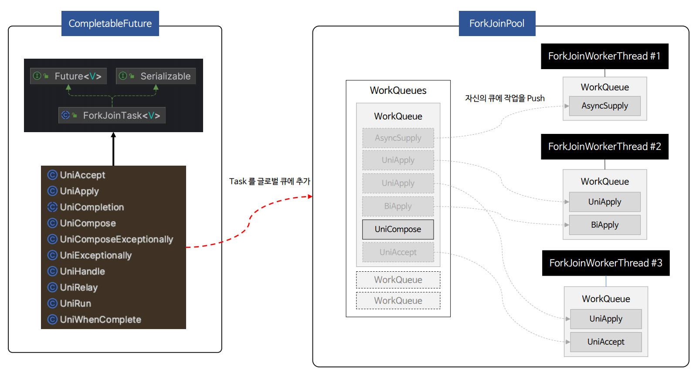

### ForkJoinPool & ThreadPoolExecutor 스레드 풀 설정

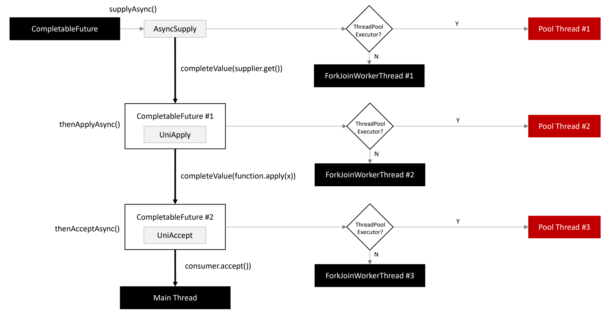

- `CompletableFuture`의 비동기 처리를 위한 각 API에는 작업 정의 외에 사용할 스레드 풀을 추가로 전달할 수 있다.
- 직접 생성한 `ThreadPoolExecutor`를 전달하면 **Pool Thread**에서 스레드를 가져와 수행하고, 전달하지 않으면 **ForkJoinWorkerThread**에서 스레드를 가져와 수행한다.
- 예를 들어 I/O 바운드 작업은 `ThreadPoolExecutor`에서 작업을 수행하고, CPU 바운드 작업은 **ForkJoinWorkerThread**에서 작업을 효율적으로 수행하도록 할 수 있다.

### 스레드 풀과 비동기 작업

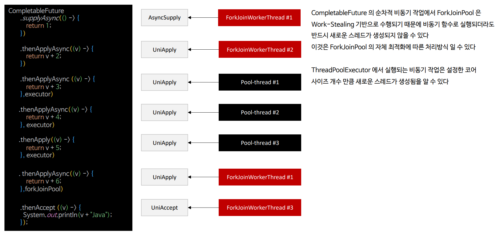

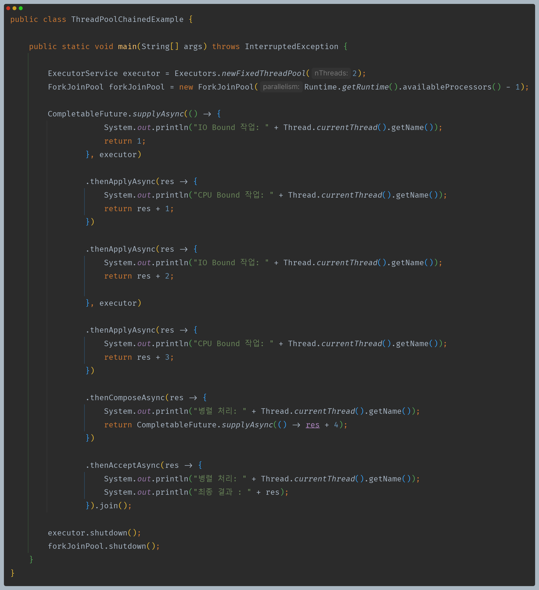

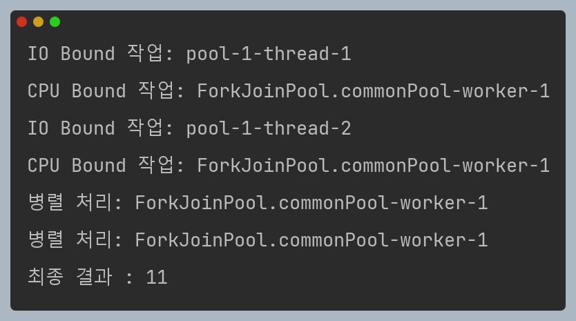

---

## ForkJoinPool 예제 코드

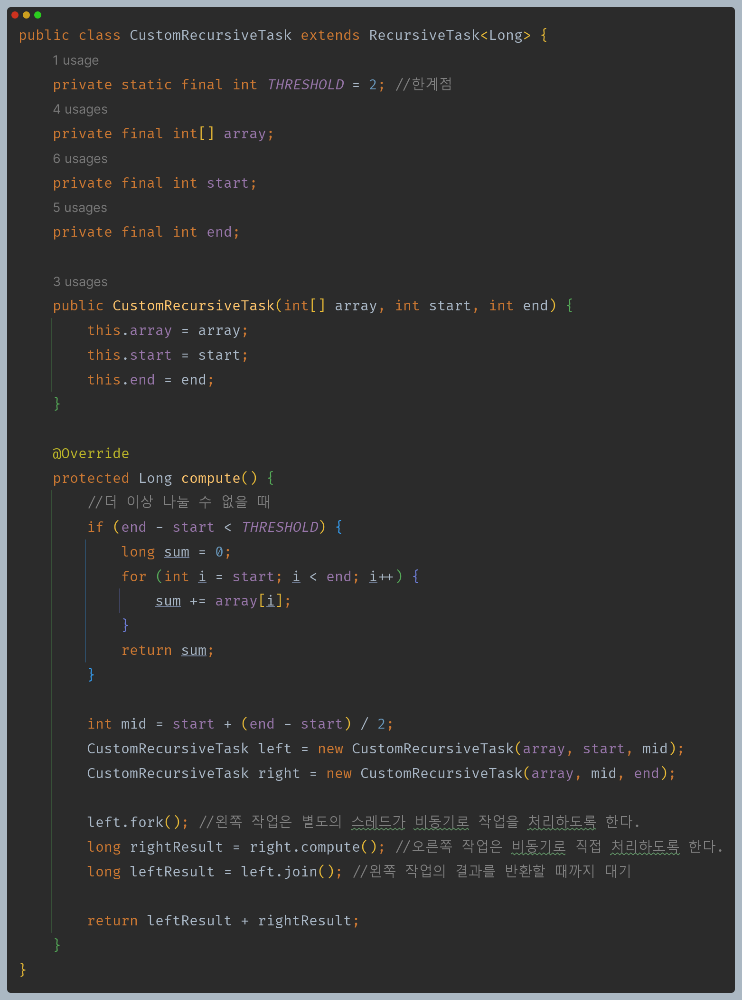

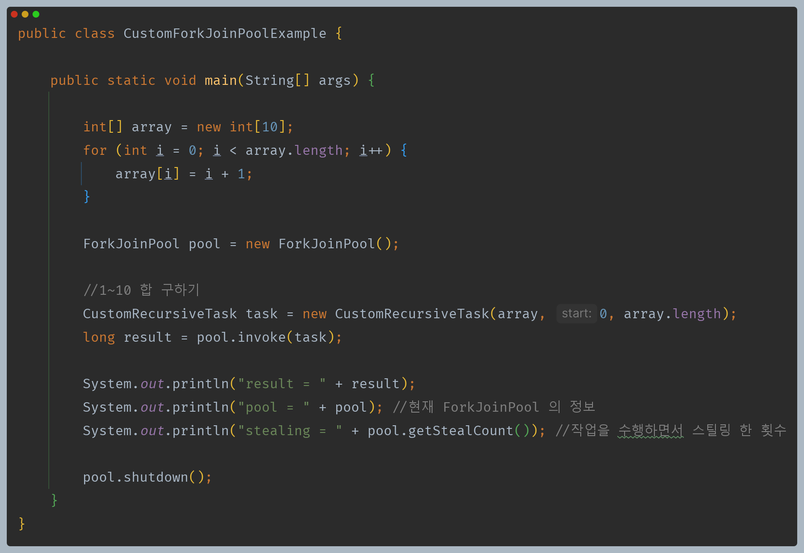

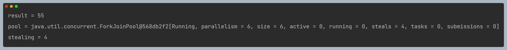

---

[이전 ↩️ - 비동기 프로그래밍 - 비동기 대기 및 취소 처리](https://github.com/genesis12345678/TIL/blob/main/Java/reactive/AsyncProgramming/%EC%B7%A8%EC%86%8C%EC%B2%98%EB%A6%AC.md)

[메인 ⏫](https://github.com/genesis12345678/TIL/blob/main/Java/reactive/Main.md)