# 자바 동시성 프로그래밍 - 비동기 프로그래밍

## allOf()

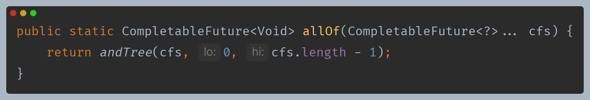

- **개념**
  - 여러 개의 `CompletableFuture`를 동시에 실행하고 모든 `CompletableFuture`가 완료될 때까지 대기하는 데 사용된다.
  - `CompletableFuture` 중에서 가장 오래 걸리는 작업이 완료 되기 전까지 `allOf()`는 대기한다.
  - [`ExecutorService`의 `invokeAll()`](https://github.com/genesis12345678/TIL/blob/main/Java/reactive/javaFramework/ExecutorService.md#executorservice-api---%EB%8B%A4%EC%A4%91-%EC%9E%91%EC%97%85-%EC%B2%98%EB%A6%AC)과 유사한 개념이다.
- **인수 값**
  - `CompletableFuture<?>`의 배열을 인수로 받는다.
- **반환 값**
  - 새로운 `CompletableFuture<Void>` 객체를 반환한다.

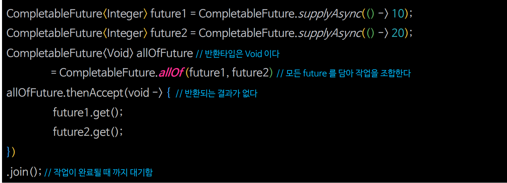

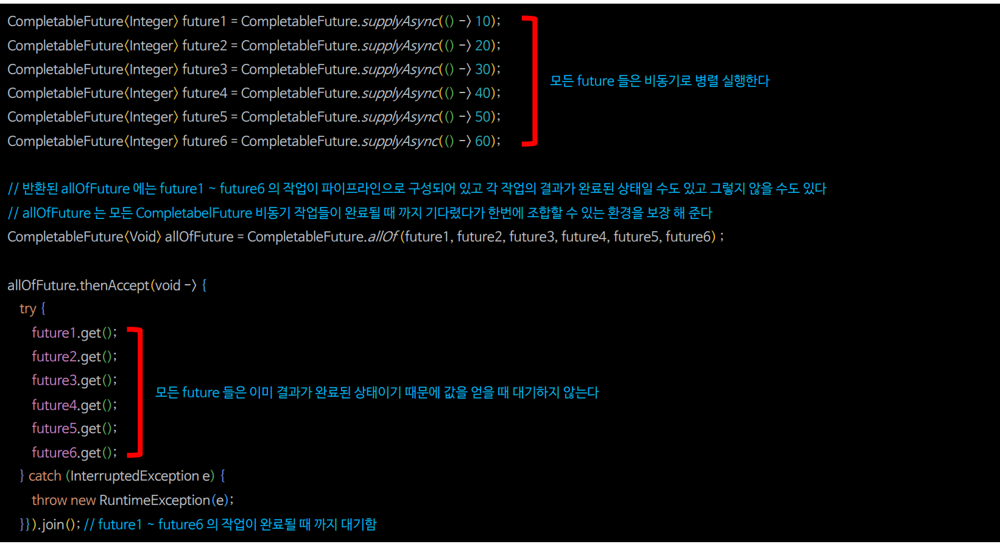

### allOf() 흐름도

> - 메인 스레드가 `join()`으로 대기하고 있다가 해제 되는 기준은 `allOf()`로 반환된 `CompletableFuture`의 결과가 아닌 `null`이 아닌 값(`AltResult`)으로 채워져야 한다.
> - `AltResult`는 모든 `CompletableFuture`의 비동기 작업이 완료되었을 때 `allOf()`의 `CompletableFuture`에 저장되는 `null` 개념의 객체이다.

### allOf() 예제 코드

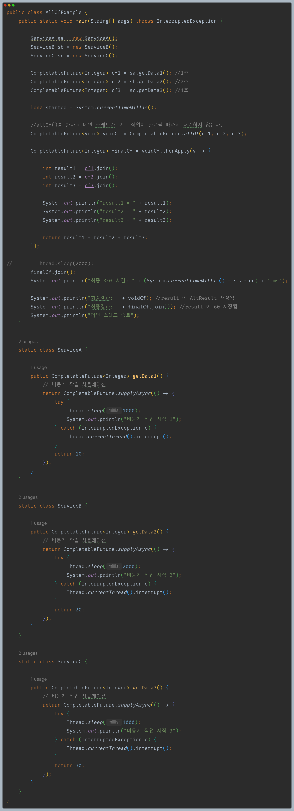

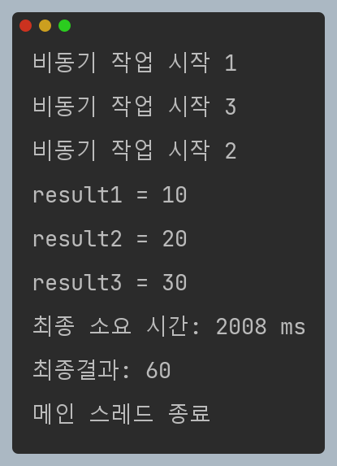

---

## anyOf()

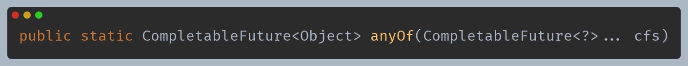

- **개념**
  - 여러 개의 `CompletableFuture` 중에서 가장 먼저 완료되는 하나의`CompletableFuture`를 반환하는 메서드이다.
  - 병렬 작업을 수행하고 가장 먼저 결과를 얻고자 할 때 유용하다.
  - [`ExecutorService`의 `invokeAny()`](https://github.com/genesis12345678/TIL/blob/main/Java/reactive/javaFramework/ExecutorService.md#executorservice-api---%EB%8B%A4%EC%A4%91-%EC%9E%91%EC%97%85-%EC%B2%98%EB%A6%AC)와 유사한 개념이다.
- **인수 값**
  - `CompletableFuture<?>`의 배열을 인수로 받는다.
- **반환 값**
  - 새로운 `CompletableFuture<Object>` 객체를 반환한다.

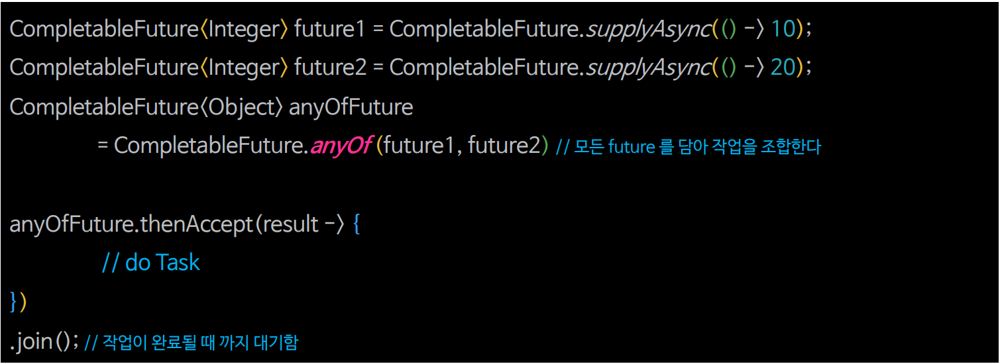

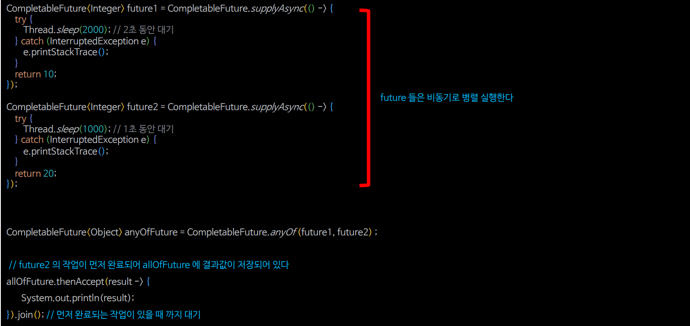

### anyOf() 흐름도

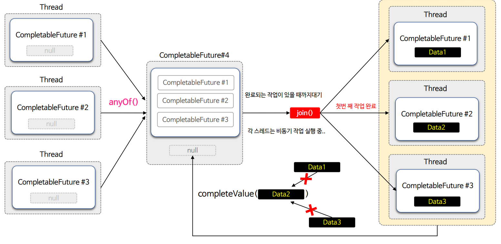

> - 메인 스레드가 `join()`으로 대기하고 있다가 해제 되는 기준은 `anyOf()`로 반환된 `CompletableFuture`의 결과 값이 채워져야 한다.
> - `CompletableFuture`의 결과 값이 먼저 채워지면 다른 값으로 수정되거나 변경될 수 없다.

### anyOf() 예제 코드

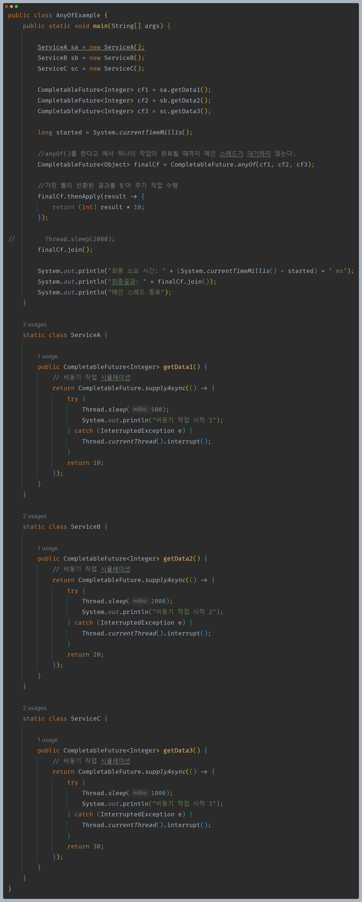

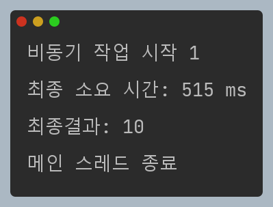

---

[이전 ↩️ - 비동기 프로그래밍 - 비동기 작업 조합(`thenCompose()` & `thenCombine()`)]()

[메인 ⏫](https://github.com/genesis12345678/TIL/blob/main/Java/reactive/Main.md)

[다음 ↪️ - 비동기 프로그래밍 - 비동기 예외 처리]()