# 자바 동시성 프로그래밍 - 비동기 프로그래밍

## 비동기 작업 시작 (`supplyAsync()` & `runAsync()`)

- `CompletableFuture`는 비동기 작업을 생성하고 실행하는 시작 메서드로 `supplyAsync()`와 `runAsync()`를 제공한다.
- `CompletableFuture`는 비동기 작업을 실행하기 위해 내부적으로 `ForkJoinPool.commonPool()`의 스레드 풀을 사용하며, 선택적으로 `ThreadPoolExecutor`를 사용할 수 있다.

---

## supplyAsync()

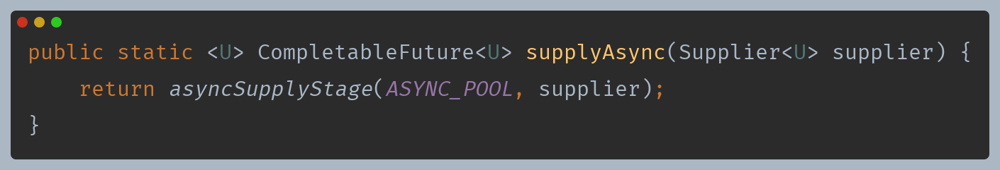

- **개념**
  - 정적 메서드로서 비동기 작업을 시작하고 작업 수행 후 결과를 반환한다.
- **인수 값**
  - `Supplier<T>` 함수를 인수로 받아 작업 결과를 반환한다.
- **반환 값**
  - 새로운 `CompletableFuture<T>` 객체를 반환하며 `CompletableFuture`에 비동기 작업의 결과를 저장한다.
- **실행 객체**
  - `AsyncSupply`

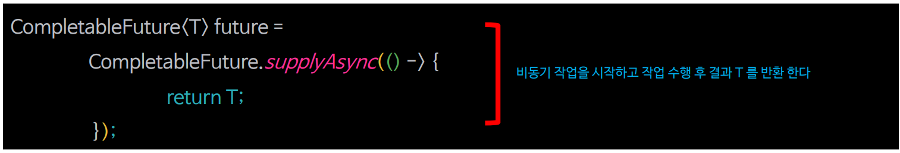

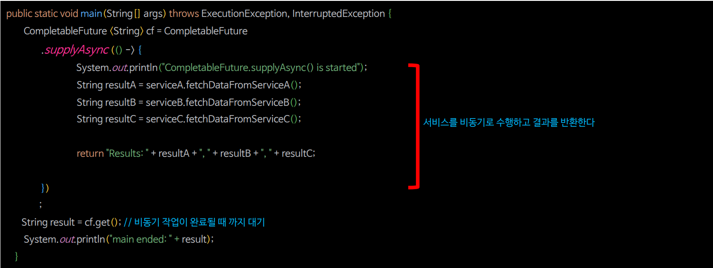

> **`supplyAsync()`는 다음 작업으로 결과를 제공하기 위해 비동기적으로 수행해야 할 경우 사용할 수 있다.**

### supplyAsync() 흐름도

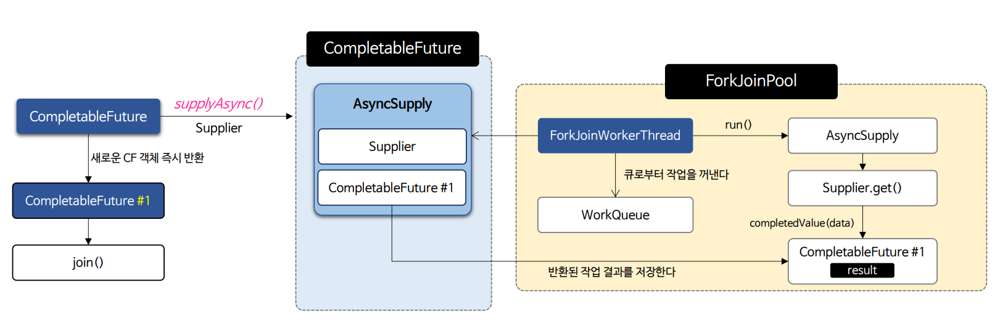

> `AsyncSupply` 에서 수행한 작업 결과는 `CompletableFuture.supplyAsync()`에서 생성된 `CompletableFuture #1`에 저장된다.

---

## runAsync()

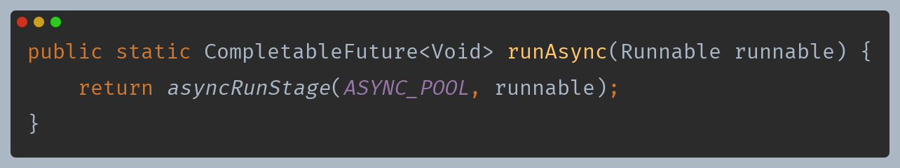

- **개념**
  - 정적 메서드로서 비동기 작업을 시작하고 작업 수행 후 완료한다.
- **인수 값**
  - `Ruunable` 객체를 인수로 받아 작업을 실행한다.
- **반환 값**
  - 새로운 `CompletableFuture<T>` 객체를 반환하고 작업 결과를 저장하지 않는다.
- **실행 객체**
  - `AsyncRun`

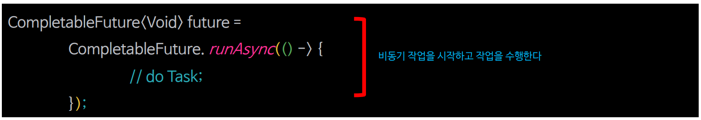

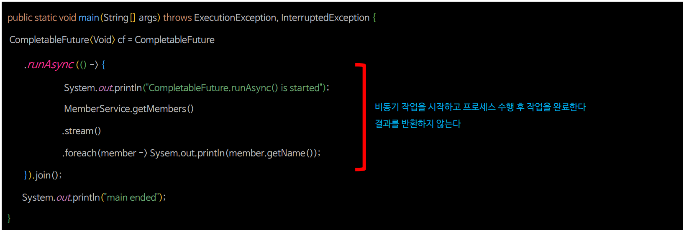

> `runAsync()`는 보통 실행 로그를 남기거나 독립적인 백그라운드 작업 또는 다음 작업에서 결과를 기다리지 않고 다른 작업을 수행해야 할 경우 사용할 수 있다.

### runAsync() 흐름도

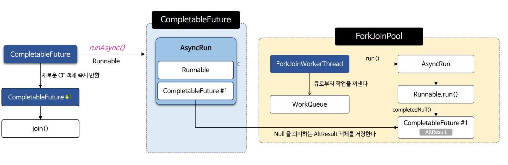

> `runAsync()`는 보통 실행 로그를 남기거나 독립적인 백그라운드 작업 또는 다음 작업에서 결과를 기다리지 않고 다른 작업을 수행해야 할 경우 사용할 수 있다.

---

## 예제 코드

### supplyAsync()

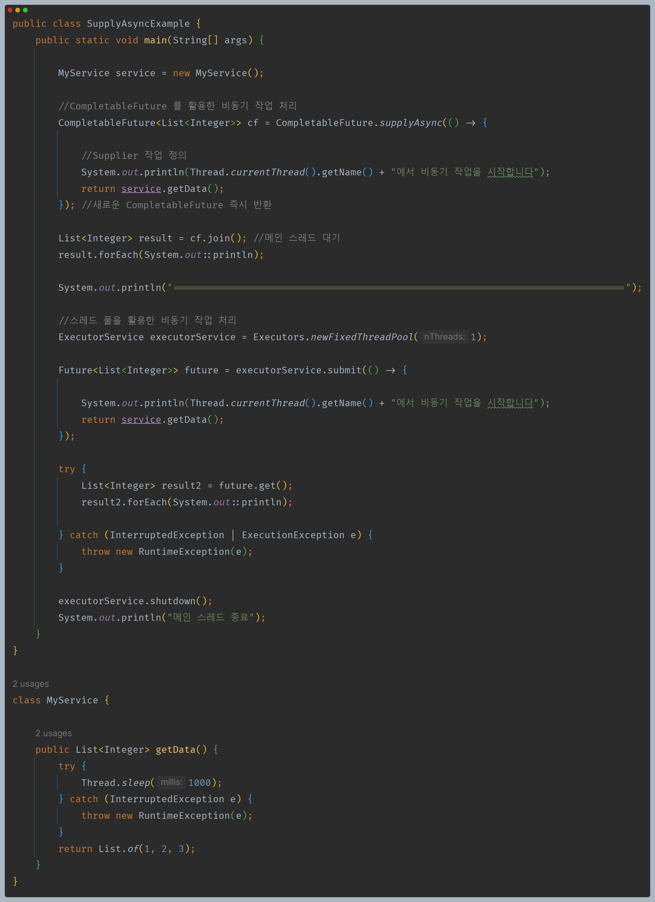

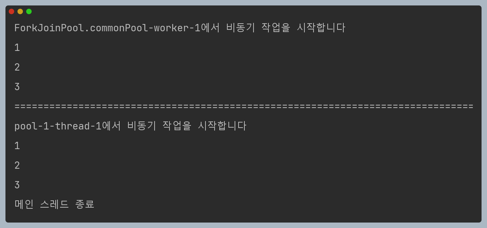

### runAsync()

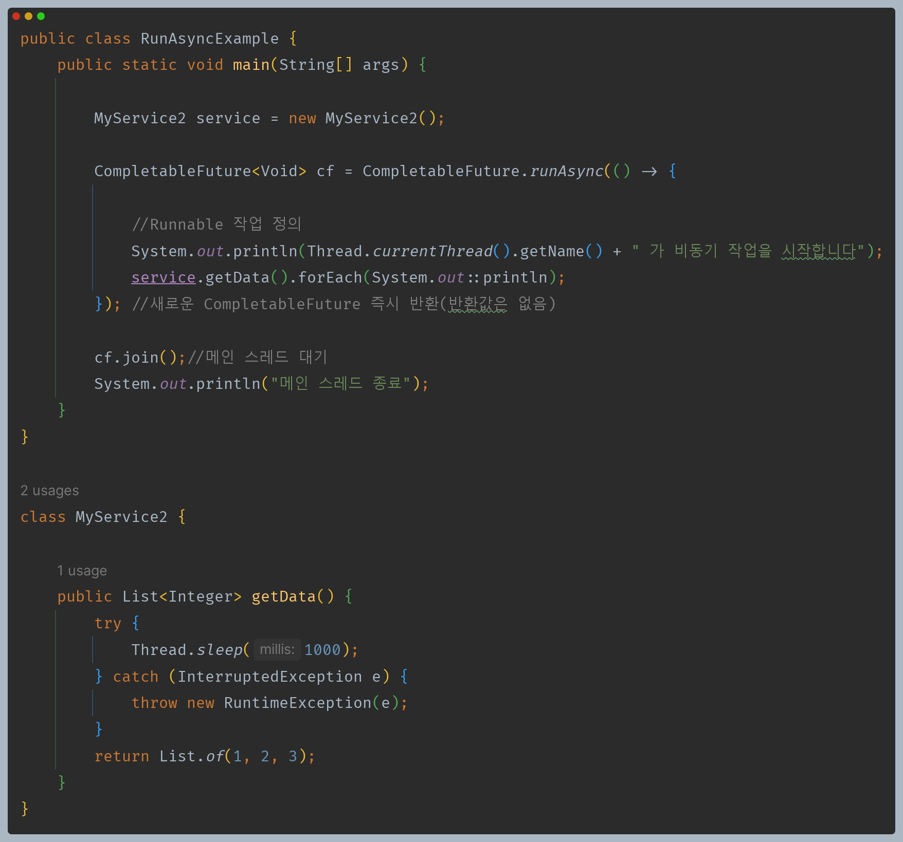

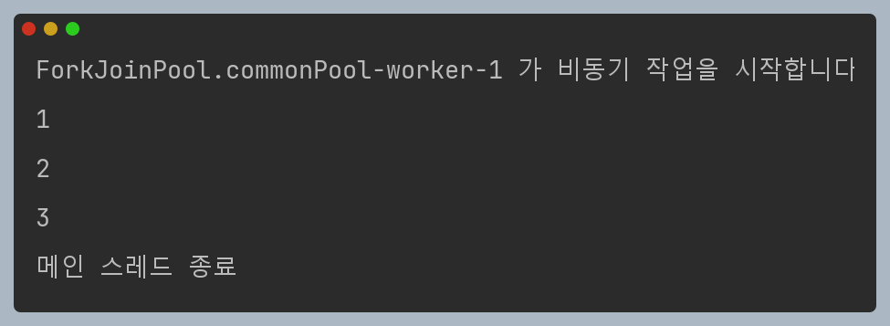

---

[이전 ↩️ - 비동기 프로그래밍 - CompletableFuture]()

[메인 ⏫](https://github.com/genesis12345678/TIL/blob/main/Java/reactive/Main.md)

[다음 ↪️ - 비동기 프로그래밍 - 비동기 결과 조작(`thenApply()` & `thenApplyAsync()`)]()