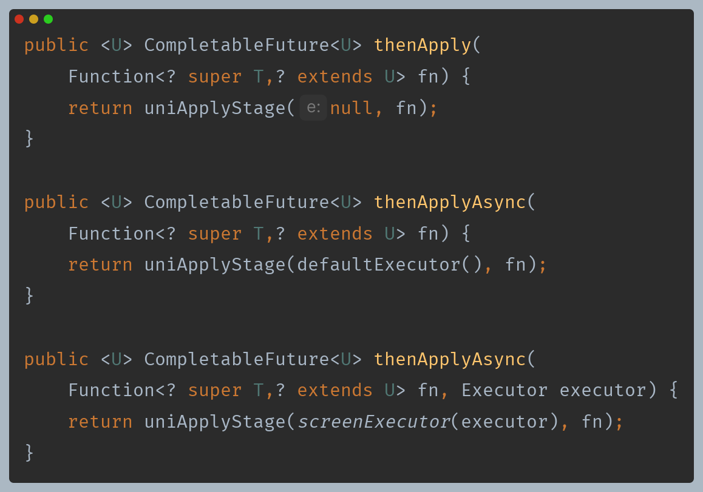
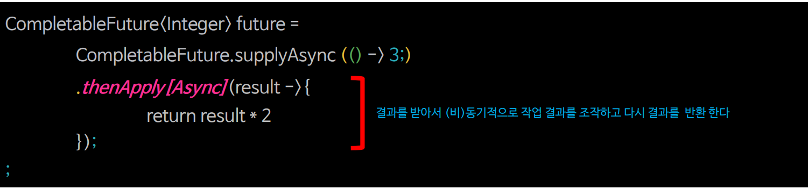
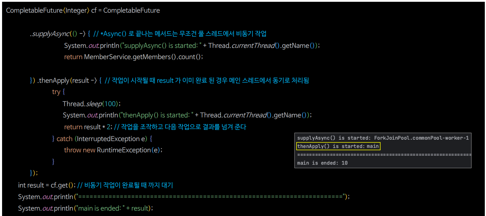
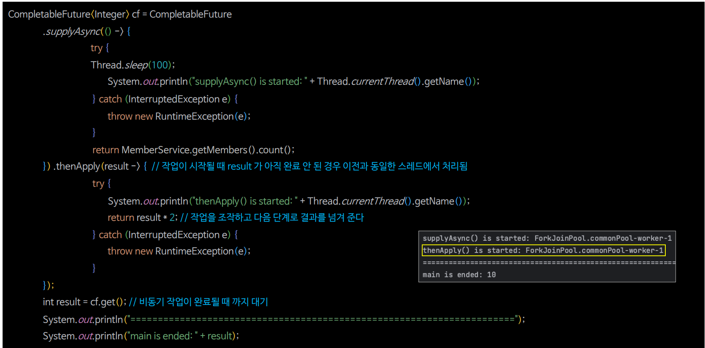
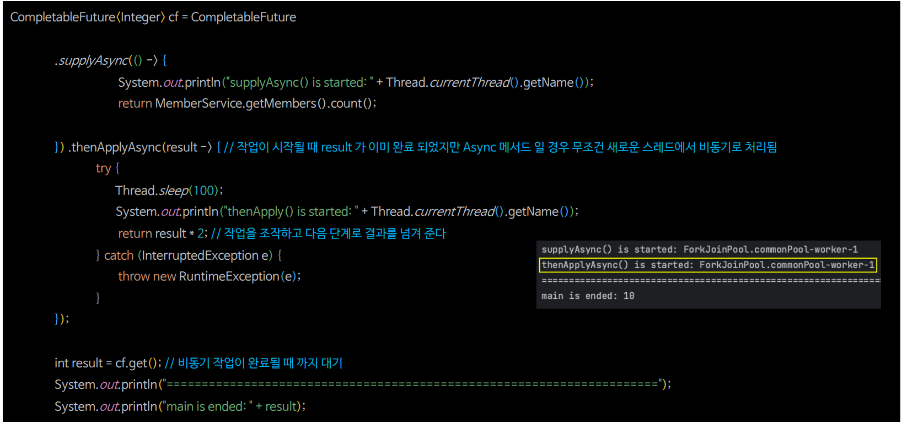
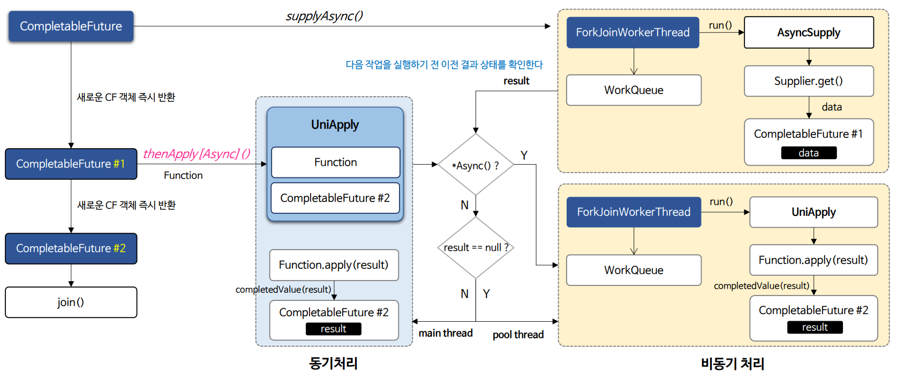
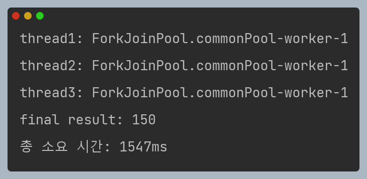
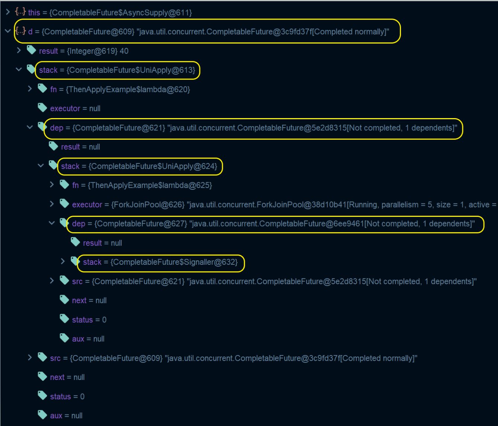

# 자바 동시성 프로그래밍 - 비동기 프로그래밍

## 비동기 결과 조작(`thenApply()` & `thenApplyAsync()`)

- `CompletableFuture`는 비동기 작업을 조작하는 메서드로 `thenApply[Async]()`, `thenAccept[Async]()`, `thenRun[Async]()` 를 제공한다.

---

## thenApply[Async] ()

- **개념**
  - 인스턴스 메서드로서 (비)동기적으로 작업의 결과를 조작하고 결과를 반환한다.
  - Stream의 `map()`과 유사하다.
- **인수 값**
  - `Function<T, R>` 함수를 인수로 받고 작업 결과를 반환한다.
- **반환 값**
  - 새로운 `CompletableFuture<T>` 객체를 반환하며 `CompletableFuture`에 작업 결과를 저장한다.
- **실행 객체**
  - `UniApply`

### thenApply() 동기 진행

> **`thenApply()`는 작업을 실행하는 시점에서 이전 작업 결과가 완료 되었다면 메인 스레드에서 처리되고 그렇지 않으면 이전과 동일한 스레드에서 처리된다.**

### thenApply() 비동기 진행

> **`thenApply()`는 작업을 실행하는 시점에서 이전 작업 결과가 완료 되지 않았다면 이전과 동일한 스레드에서 처리된다.**

### thenApplyAsync() 비동기 진행

> **`thenApplyAsync()`는 이전 작업 결과와 상관없이 무조건 풀 스레드에서 비동기 처리된다. 풀 스레드는 이전과 동일한 스레드가 될 수 있고 새롭게 생성된 스레드가 될 수도 있다.**

### thenApply[Async] () 흐름도

> - **`thenApplyAsync()`는 이전 작업 결과와 상관없이 무조건 풀 스레드에서 비동기 처리된다. 풀 스레드는 이전과 동일한 스레드가 될 수 있고 새롭게 생성된 스레드가 될 수도 있다.**
> - **`thenApply()`는 작업을 실행하는 시점에서 이전 작업 결과가 완료 되었다면 메인 스레드에서 처리되고 그렇지 않으면 이전과 동일한 스레드에서 처리된다.**

### thenApply[Async] () 예제 코드

- 소요 시간을 보면 약 1.5초가 소요되었다. 0.5초 소요되는 작업이 총 3번 진행되어 1.5초 인가 싶지만 작업은 비동기로 진행이 되기 때문에 0.5초면 모든
  작업이 다 마칠 것 같다. **그렇다면 왜 비동기 임에도 순차적으로 처리될까?**
  - 참고로 스레드 풀에서 한개의 스레드만 사용해서 그런 것은 아니다.
- `CompletableFuture`의 모든 작업이 다 제출되고 나면 구조는 다음과 같아진다.

- `supplyAsync()`를 시작으로 만들어진 `CompletableFuture` 내부에는 `result`와 `stack`이라는 이름으로 저장된 다음으로 실행되어야 할 또 다른 `CompletableFuture`가 저장되어 있다.
- `result`에는 이전 `CompletableFuture`의 반환 결과가 저장 된다. 즉, `CompletableFuture`가 실행할 작업은 이전에 `CompletableFuture`가 반환한 결과에 의존적인 것이다.(어찌보면 당연하다)

> **`CompletableFuture`는 작업들을 비동기 처리로 빠르게 수행하는 것이 목적이 아닌 메인 스레드와 분리해서 여러 작업들을 메서드 체인 형식으로
> 가독성 있고 편하게 만들 수 있는 기능들을 지원하는 것이다.**
> 
> `CompletableFuture` 없이는 비동기적으로 이전의 작업 결과를 가지고 다른 작업을 수행하는 등의 기능을 만들려면 콜백을 사용하는 등 구현이 어렵다.

---

[이전 ↩️ - 비동기 프로그래밍 - 비동기 작업 시작(`supplyAsync()` & `runAsync()`)](https://github.com/genesis12345678/TIL/blob/main/Java/reactive/AsyncProgramming/runAsync.md)

[메인 ⏫](https://github.com/genesis12345678/TIL/blob/main/Java/reactive/Main.md)

[다음 ↪️ - 비동기 프로그래밍 - 비동기 결과 조작(`thenAccept()` & `thenRun()`)](https://github.com/genesis12345678/TIL/blob/main/Java/reactive/AsyncProgramming/thenRun.md)