# 자바 동시성 프로그래밍 - 비동기 프로그래밍

## thenAccept[Async] ()

- **개념**
  - 인스턴스 메서드로서 (비)동기적으로 작업의 결과를 소비하고 추가 수행을 한다.
- **인수 값**
  - `Consumer<T>` 함수를 인수로 받고 작업을 수행한다.
- **반환 값**
  - 새로운 `CompletableFuture<T>` 객체를 반환한다.
- **실행 객체**
  - `UniAccept`

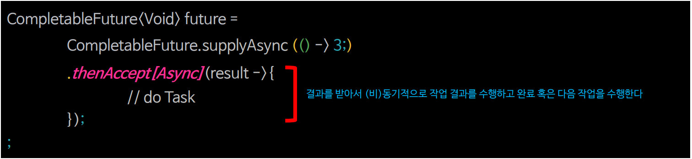

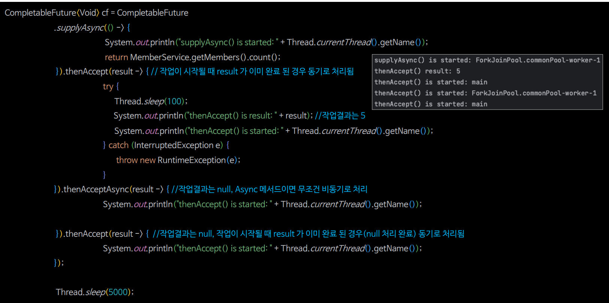

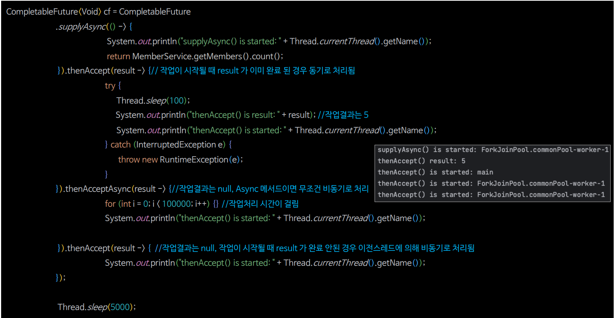

### thenAccept[Async] () 흐름도

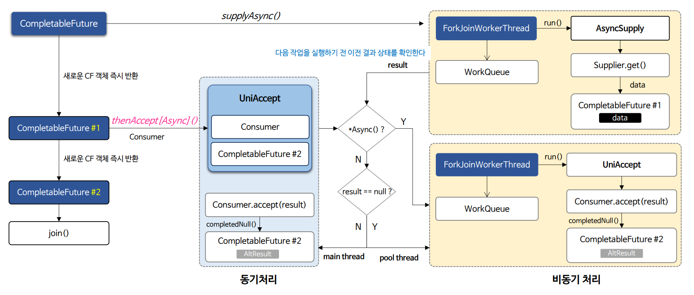

> - `thenAcceptAsync()`는 이전 작업 결과와 상관없이 무조건 풀 스레드에서 비동기 처리된다. 풀 스레드는 이전과 동일한 스레드가 될 수도 있고 새롭게 생성된 스레드가 될 수도 있다.
> - `thenAccept()`는 이전 작업 결과가 완료되었다면 메인 스레드에서 동기 처리되고, 그렇지 않으면 이전과 동일한 스레드에서 비동기 처리된다.

### thenAccept[Async] () 예제 코드

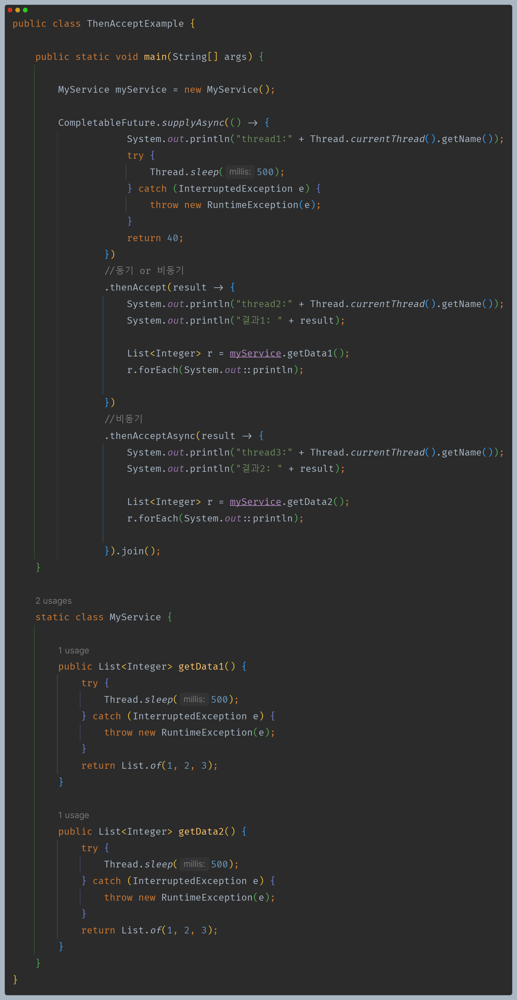

---

## thenRun[Async] ()

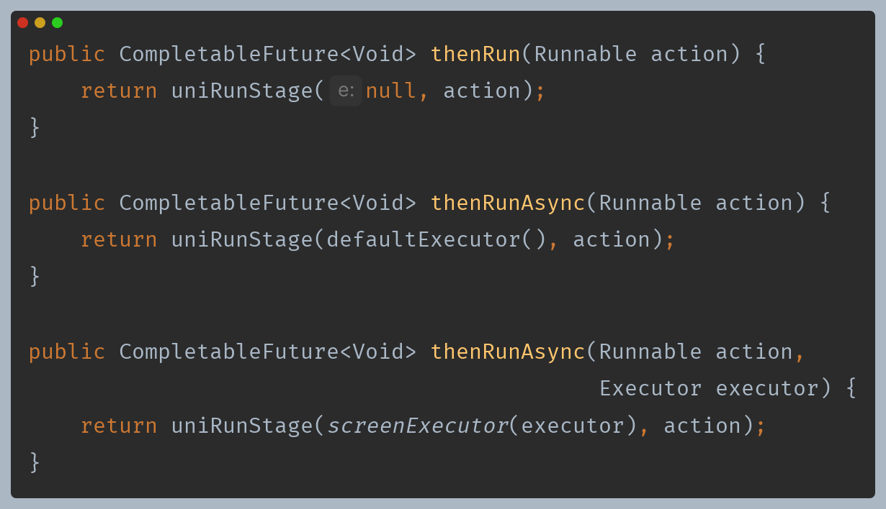

- **개념**
  - 인스턴스 메서드로서 (비)동기적으로 이전 결과를 무시하고 단순한 후속 작업을 수행한다.
- **인수 값**
  - `Runnable` 함수를 인수로 받고 작업을 수행한다.
- **반환 값**
  - 새로운 `CompletableFuture<T>` 객체를 반환한다.
- **실행 객체**
  - `UniRun`

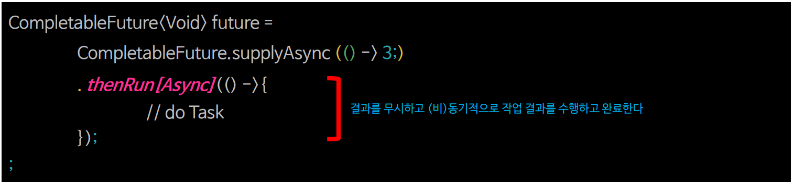

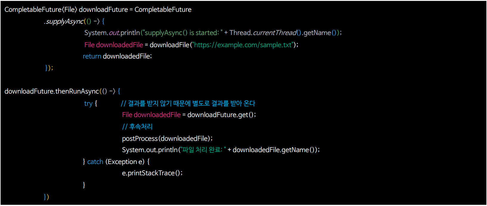

### thenRun[Async] () 흐름도

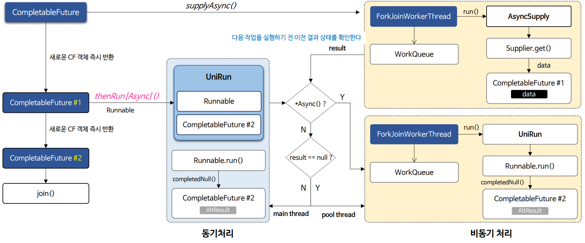

> - `thenRunAsync()`는 이전 작업 결과와 상관없이 무조건 풀 스레드에서 비동기 처리된다. 풀 스레드는 이전과 동일한 스레드가 될 수도 있고 새롭게 생성된 스레드가 될 수도 있다.
> - `thenRun()`는 이전 작업 결과가 완료되었다면 메인 스레드에서 동기 처리되고, 그렇지 않으면 이전과 동일한 스레드에서 비동기 처리된다.

### thenRun[Async] () 예제 코드

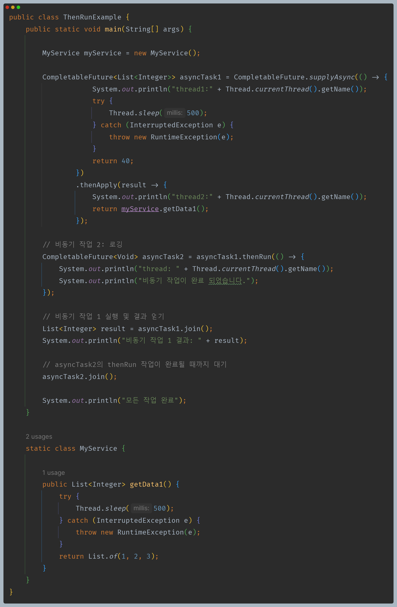

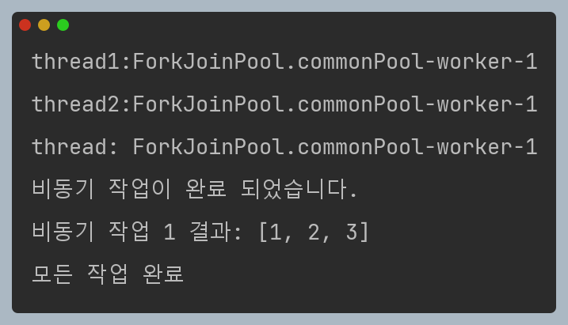

---

## CompletableFuture Pipeline

- 체인으로 연결된 `CompletableFuture`의 각 작업은 이전 작업이 완료된 다음 실행하는 Pipeline 으로 구성된다.
- Pipeline 으로 구성된 `CompletableFuture`는 해당 작업이 완료되면 다음 작업을 호출하는 구조이기 때문에 비록 비동기 작업이라 하더라도 동시가 아닌 순차적으로 처리된다.
- 모든 작업이 동시적으로 실행되기 위해서는 `CompletableFuture`간 의존 관계를 최소화 혹은 제거해야 하고 각 작업을 독립적으로 설계해야 가능하다.

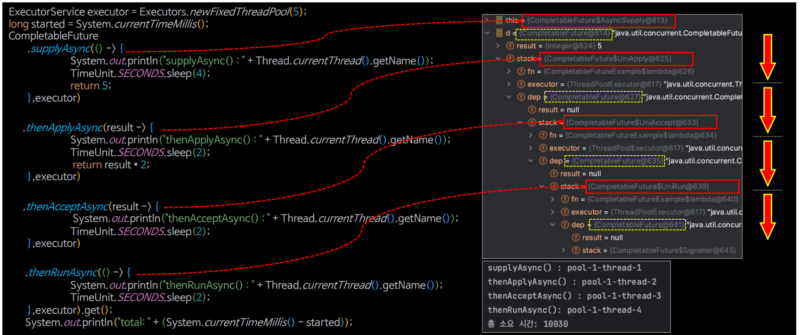

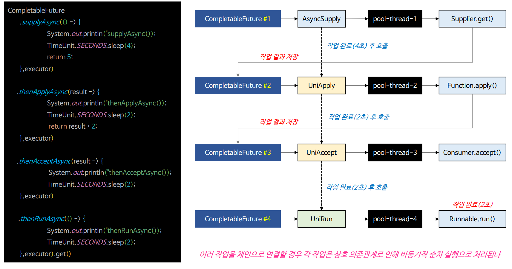

---

[이전 ↩️ - 비동기 프로그래밍 - 비동기 결과 조작(`thenApply()` & `thenApplyAsync()`)]()

[메인 ⏫](https://github.com/genesis12345678/TIL/blob/main/Java/reactive/Main.md)

[다음 ↪️ - 비동기 프로그래밍 - 비동기 작업 조합(`thenCompose()` & `thenCombine()`)]()