# 자바 동시성 프로그래밍 - 비동기 프로그래밍

## 비동기 예외 처리

- `CompletableFuture`는 비동기 작업의 예외를 처리할 수 있도록 `handle[Async]()`, `whenComplete[Async]()`, `exceptionally[Async]()`를 제공한다.

---

## exceptionally[Async] ()

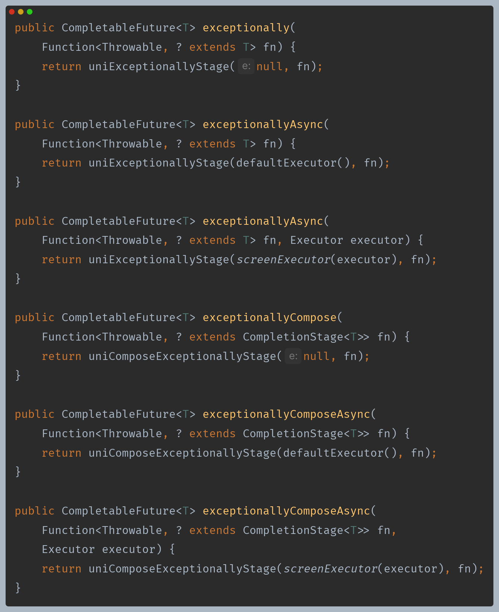

- **개념**
  - 작업이 예외로 완료된 경우 해당 예외를 처리하고, 새로운 결과나 대체 예외를 반환할 수 있다.
  - 작업이 예외로 완료된 경우에만 실행되고, 정상적으로 완료된 경우 이 함수는 실행되지 않는다.
- **인수 값**
  - `Function<Throwable, T>` 형식의 함수를 인수로 받는다.
- **반환 값**
  - 새로운 `CompletableFuture<T>` 객체를 반환하며 `CompletableFuture`에 결과 또는 예외를 저장할 수 있다.

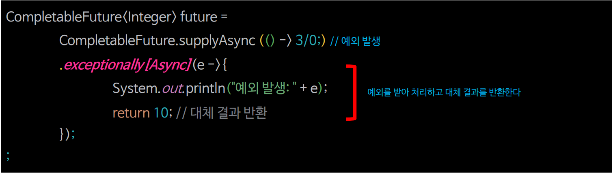

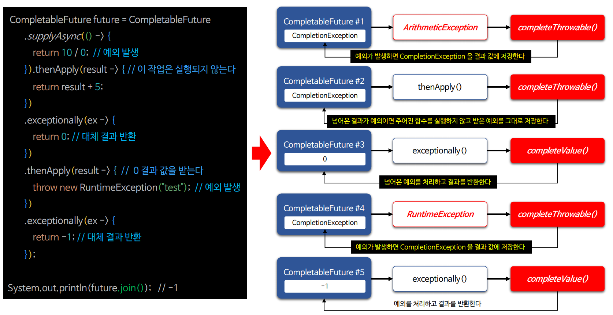

### exceptionally[Async] () 예제 코드

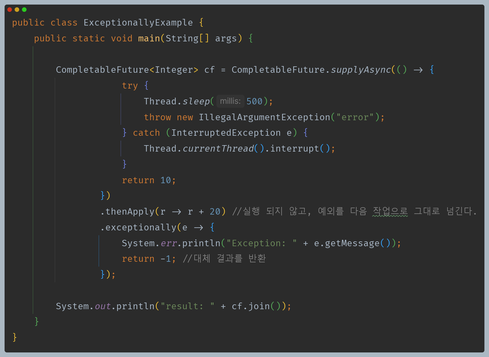

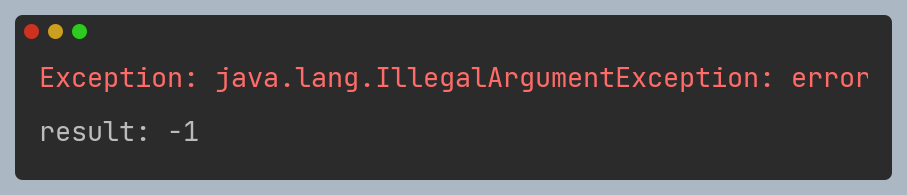

---

## handle[Async] ()

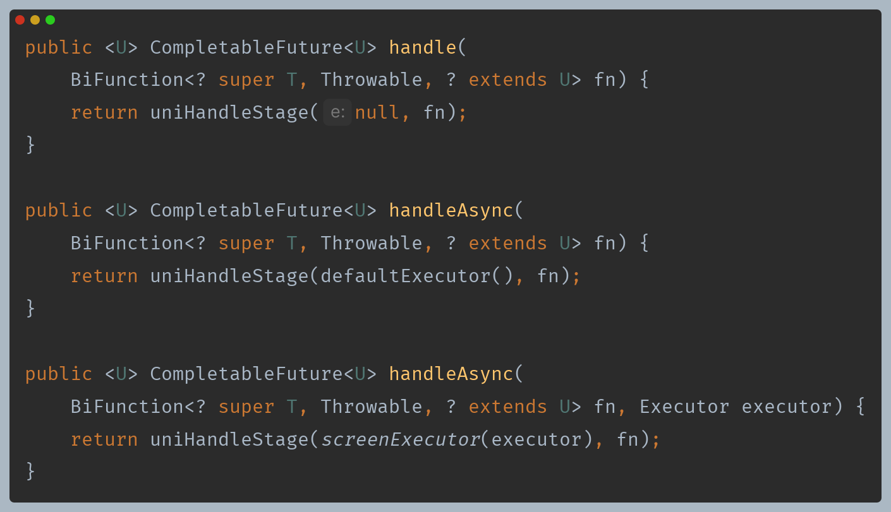

- **개념**
  - 결과와 예외 처리를 모두 다룰 수 있는 메서드로, 비동기 작업의 예외 처리와 결과 처리를 동시에 수행할 때 유용하다.
- **인수 값**
  - `BiFunction<T, Throwable, U>` 형식의 함수를 인수로 받으며 인수의 의미는 다음과 같다.
  - 첫 번째 인수(`T`)는 비동기 작업이 성공적으로 완료된 경우 결과를 나타낸다.
  - 두 번째 인수(`Throwable`)은 비동기 작업이 예외로 완료된 경우 해당 예외를 나타낸다.
- **반환 값**
  - 새로운 `CompletableFuture<T>` 객체를 반환하며 `CompletableFuture`에 정상 결과 또는 예외를 저장할 수 있다.

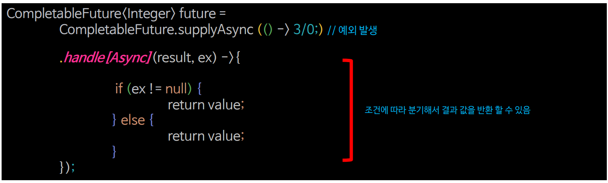

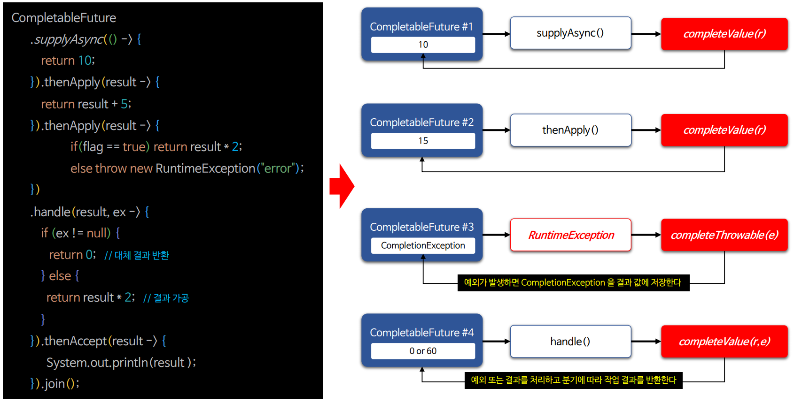

### handle[Async] () 예제 코드

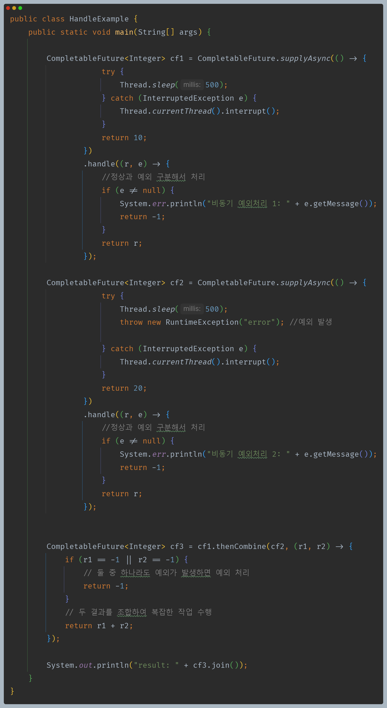

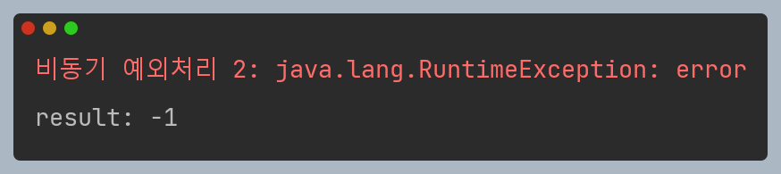

---

## whenComplete[Async] ()

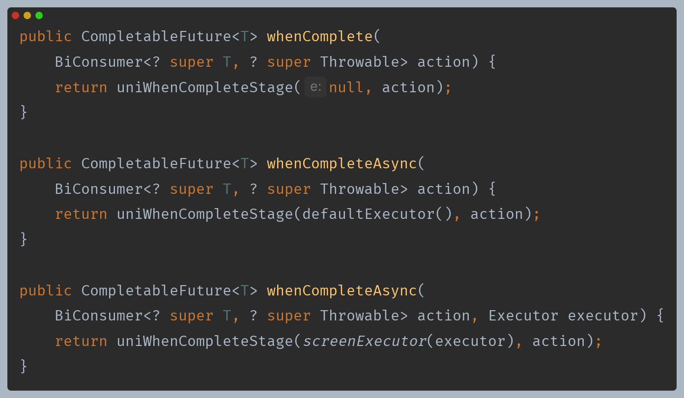

- **개념**
  - 결과와 예외 처리를 모두 다룰 수 있는 메서드로, 비동기 작업의 예외 처리와 결과 처리를 동시에 수행할 때 유용하다.
- **인수 값**
  - `BiConsumer<T, Throwable>` 형식의 함수를 인수로 받으며 인수의 의미는 다음과 같다.
  - 첫 번째 인수(`T`)는 비동기 작업이 성공적으로 완료된 경우 결과를 나타낸다.
  - 두 번째 인수(`Throwable`)은 비동기 작업이 예외로 완료된 경우 해당 예외를 나타낸다.
- **반환 값**
  - 새로운 `CompletableFuture<T>` 객체를 반환하며 `CompletableFuture`에 정상 결과 또는 예외를 저장할 수 있다.

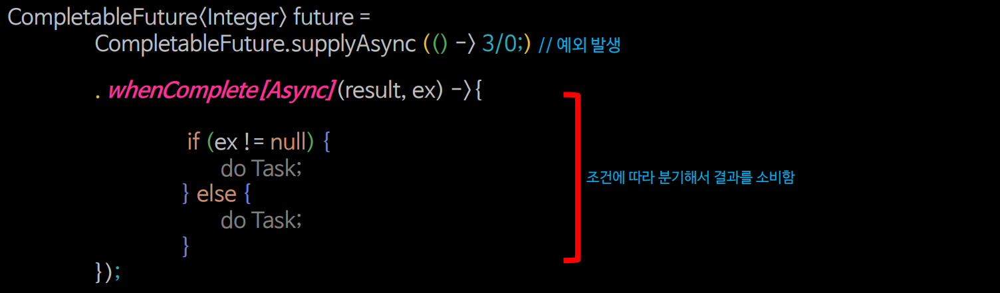

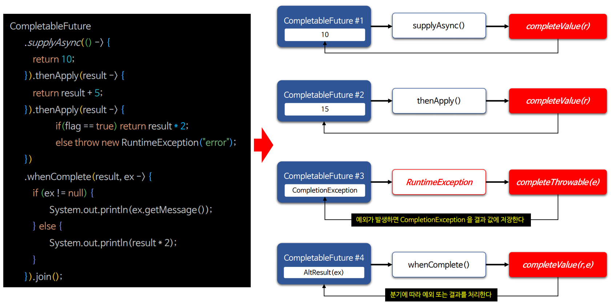

### whenComplete[Async] () 예제 코드

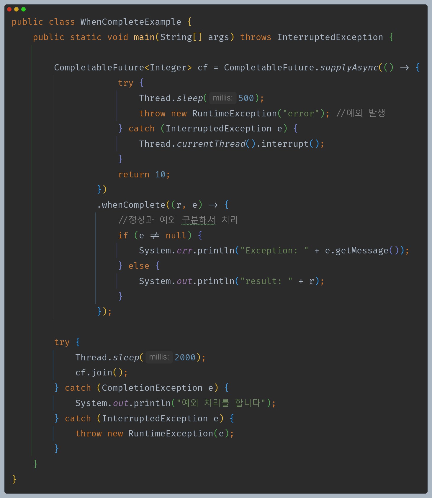

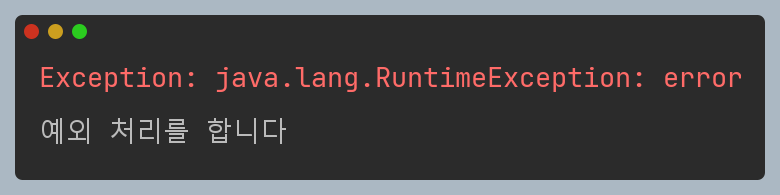

- `whenComplete()`은 다른 예외 처리 메서드들과 달리 대체 결과가 없기 때문에 `join()`을 통한 결과를 가져올 때 예외가 발생할 수 있다.

---

## handle vs exceptionally vs whenComplete

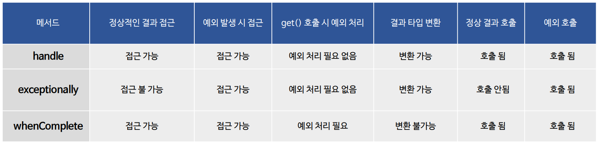

---

[이전 ↩️ - 비동기 프로그래밍 - 비동기 작업 조합(`allOf()` & `anyOf()`)]()

[메인 ⏫](https://github.com/genesis12345678/TIL/blob/main/Java/reactive/Main.md)

[다음 ↪️ - 비동기 프로그래밍 - 비동기 완료 처리]()