# 자바 동시성 프로그래밍 - 비동기 프로그래밍

## 비동기 완료 처리

- `CompletableFuture`는 비동기 작업의 완료를 위한 여러가지 메서드를 제공하고 있다.

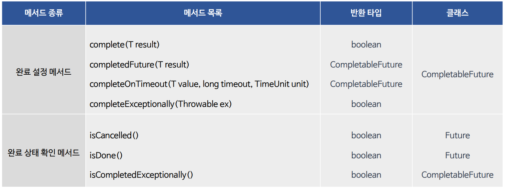

---

## 완료 설정 메서드

- `CompletableFuture`의 핵심 기능 중 하나로서 비동기 작업 결과를 사용자가 직접 완료할 수 있다.

### complete()

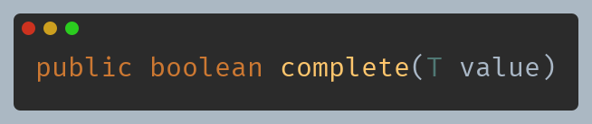

- `CompletableFuture` 가 완료되지 않았다면 주어진 값으로 설정하고 `CompletableFuture`를 완료 상태로 전환한다.
- 이미 완료 상태이면 다른 값으로 다시 완료시킬 수 없으며 완료 상태로 전환하면 `true`, 그렇지 않으면 `false`를 반환한다.

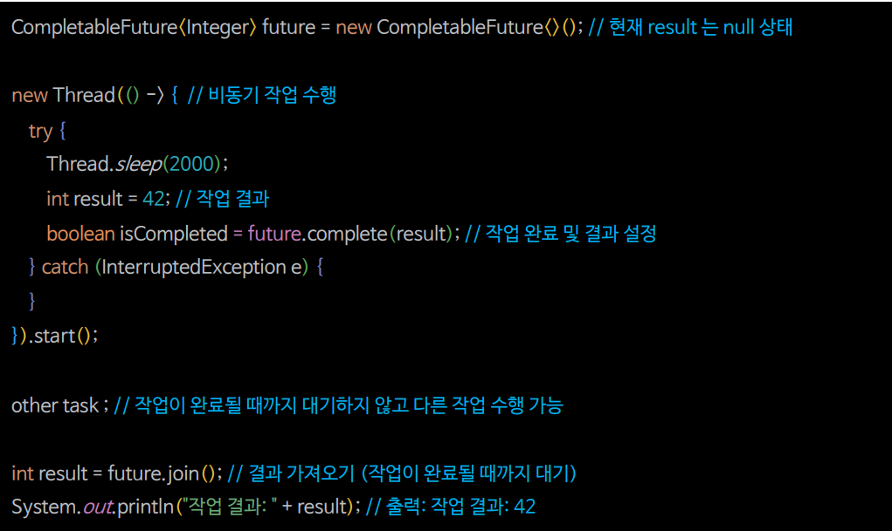

### complete() 예제 코드

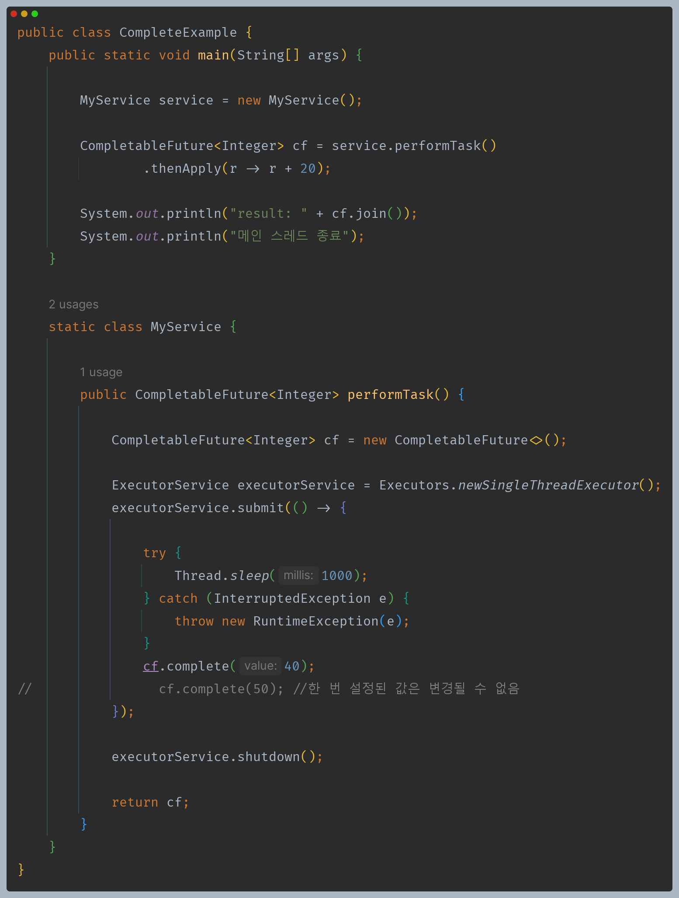

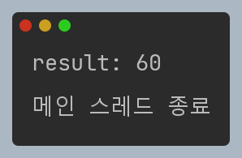

### completedFuture()

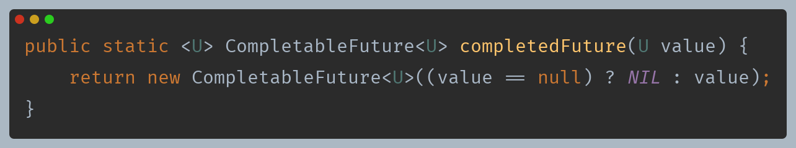

- 주어진 값으로 이미 완료된 새로운 `CompletableFuture` 를 반환한다.
- 비동기 작업을 수행하지 않고 미리 계산된 결과를 반환해야 할 때 유용하다.

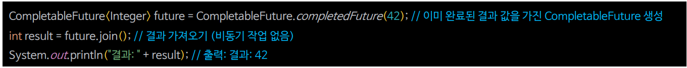

### completedFuture() 예제 코드

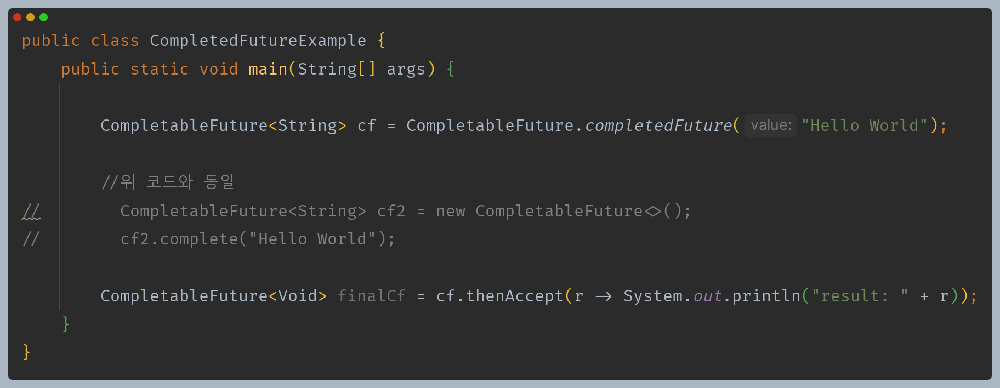

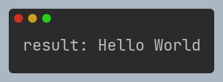

### completeOnTimeout()

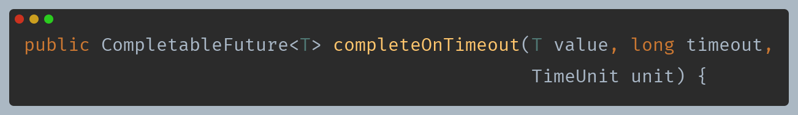

- 지정된 타임아웃 이전에 완료되지 않은 경우 주어진 기본 값으로 완료한다.

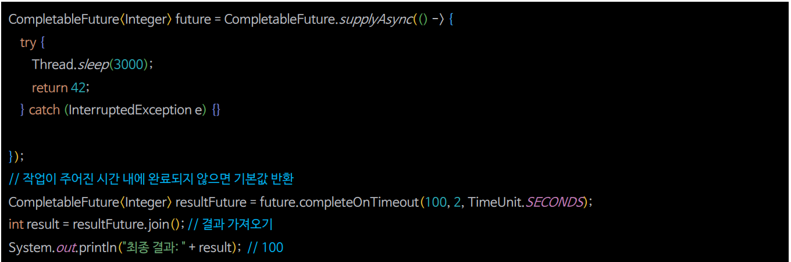

### completeOnTimeout() 예제 코드

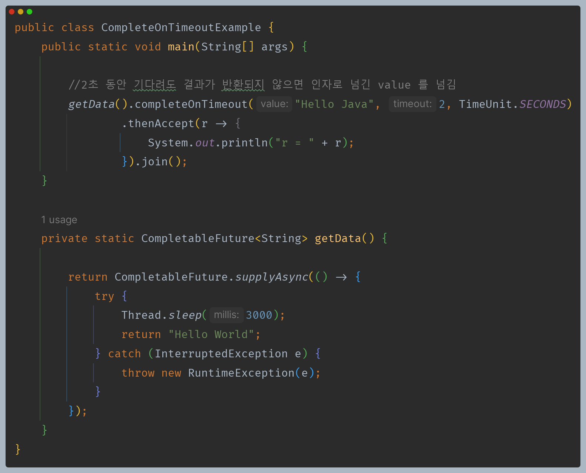

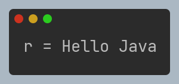

### completeExceptionally()

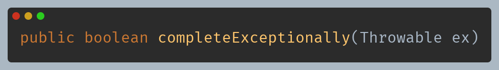

- `CompletableFuture`를 예외 상태로 완료시키는 데 사용되는 메서드로 주어진 예외 객체를 사용하여 비동기 작업을 예외로 처리하는 데 사용할 수 있다.
- `exceptionally()` 또는 `handle()` 메서드를 사용하여 예외 처리 작업을 수행할 수 있으며 예외를 처리하고 대체 결과를 반환하거나 다른 작업을 수행할 수 있다.

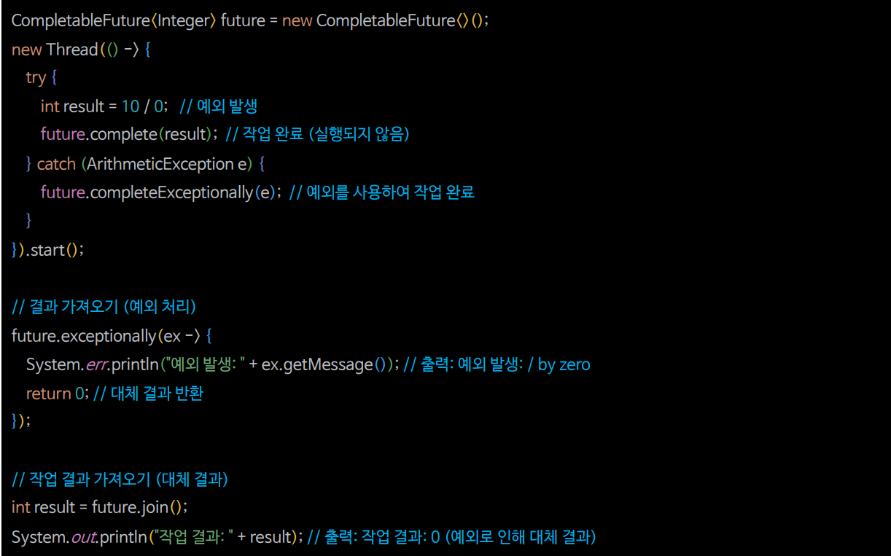

### completeExceptionally() 예제 코드

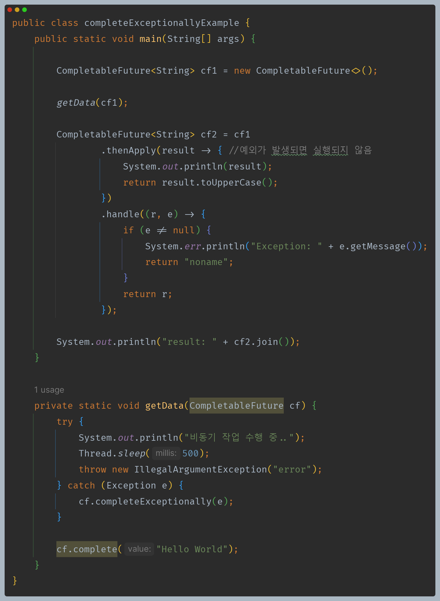

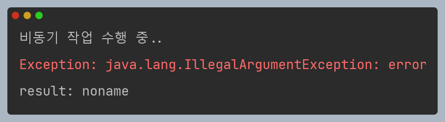

---

## 완료 상태 확인 메서드

- `CompletableFuture`는 완료 상태를 명확하게 구분할 수 있도록 `isCompletedExceptionally()` 메서드를 추가 제공한다.

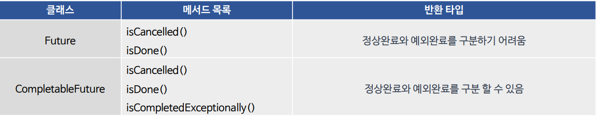

### isCancelled()

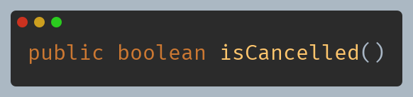

- 작업이 정상적으로 완료되기 전에 취소 되었으면 `true`를 반환한다.

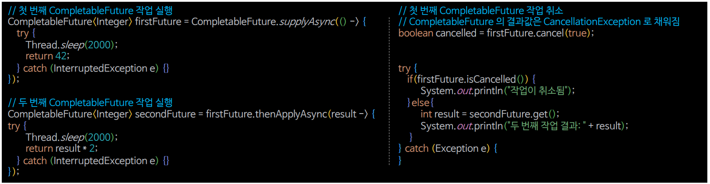

### isDone()

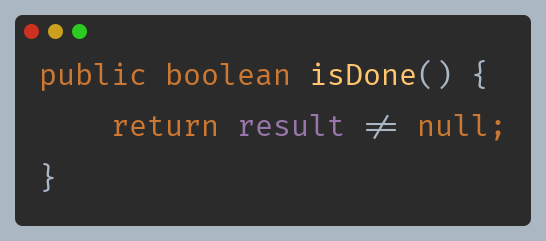

- 정상적으로, 예외적으로 또는 취소를 통해 완료된 경우 등 어떤 방식으로든 완료된 경우 `true`를 반환한다.

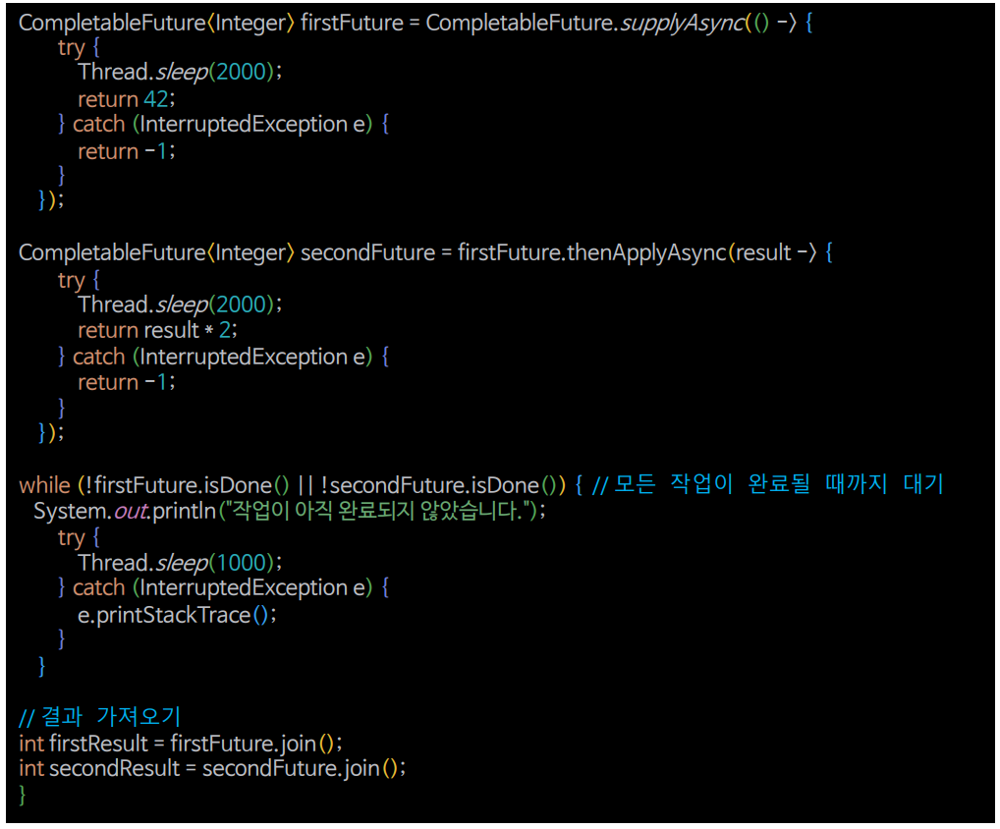

### isDone() 예제 코드

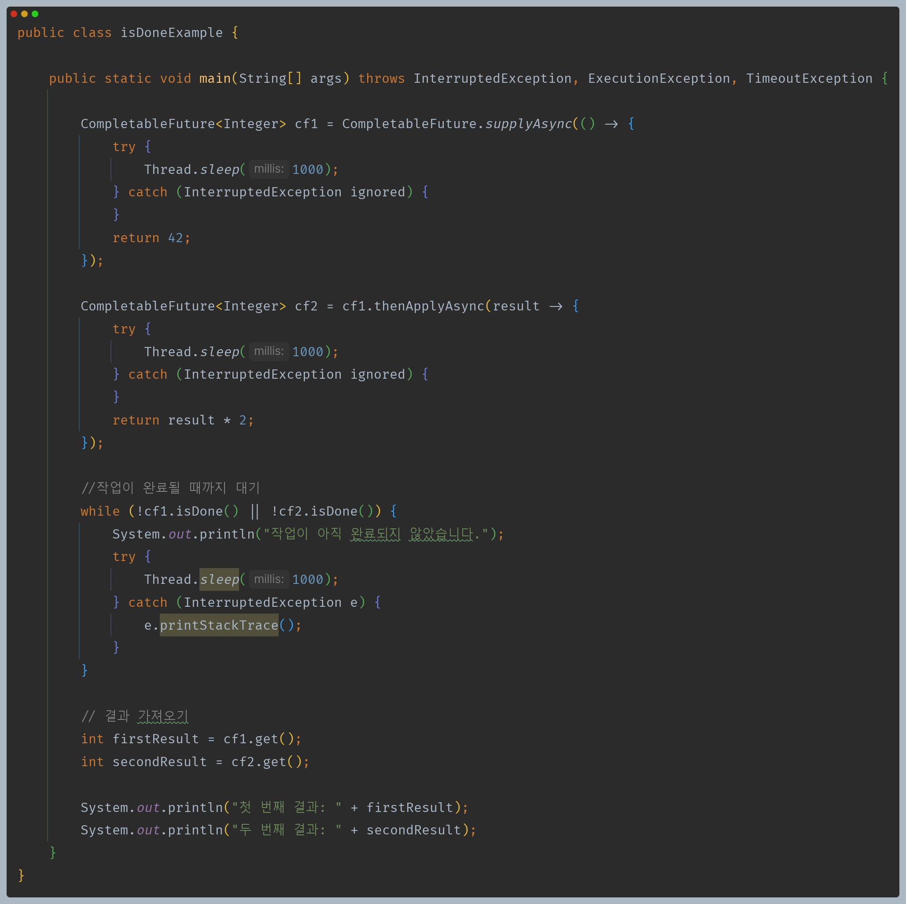

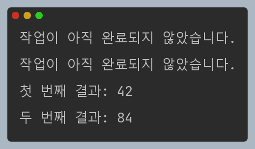

### isCompletedExceptionally()

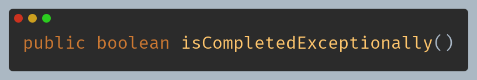

- `CompletableFuture`가 취소 되거나 `completeExceptionally()`의 명시적 호출 또는 `CompletionStage` 실행의 갑작스런 종료 등 예외적으로 완료된 경우 `true`를 반환한다.

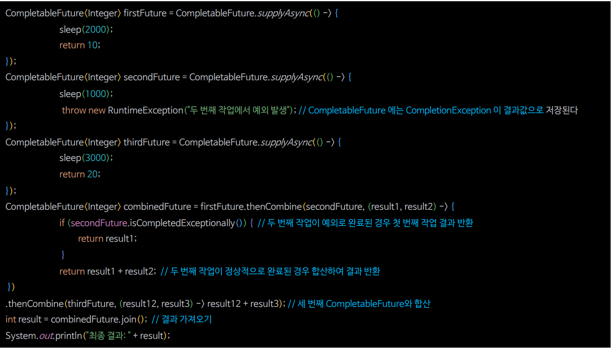

### isCancelled() & isCompletedExceptionally() 예제 코드

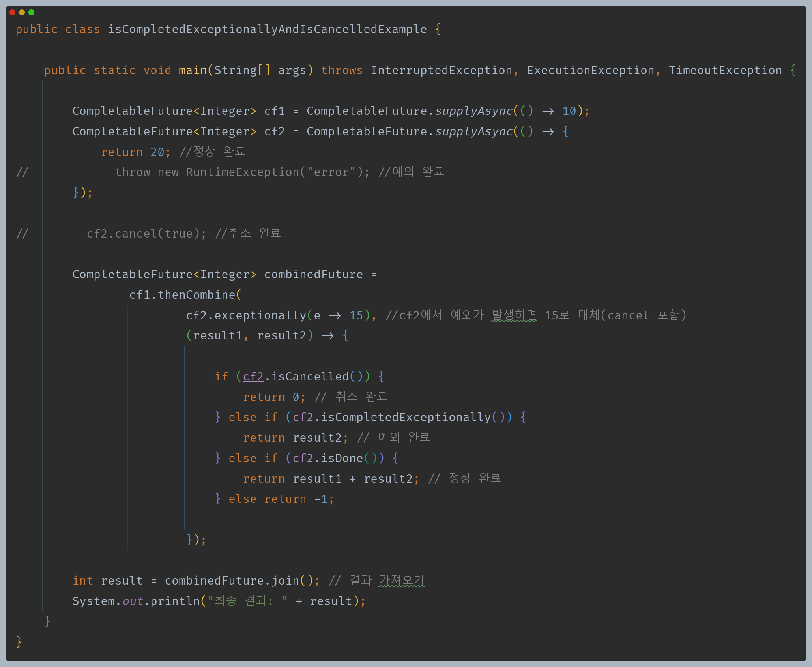

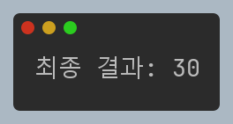

---

## CompletableFuture 의 완료 원리

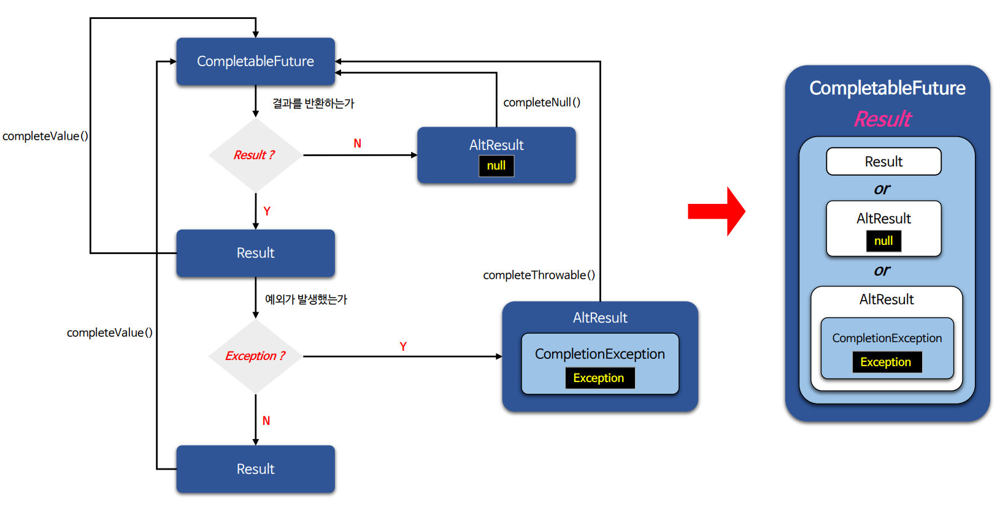

---

[이전 ↩️ - 비동기 프로그래밍 - 비동기 예외 처리](https://github.com/genesis12345678/TIL/blob/main/Java/reactive/AsyncProgramming/%EC%98%88%EC%99%B8%EC%B2%98%EB%A6%AC.md)

[메인 ⏫](https://github.com/genesis12345678/TIL/blob/main/Java/reactive/Main.md)

[다음 ↪️ - 비동기 프로그래밍 - 비동기 대기 및 취소 처리](https://github.com/genesis12345678/TIL/blob/main/Java/reactive/AsyncProgramming/%EC%B7%A8%EC%86%8C%EC%B2%98%EB%A6%AC.md)