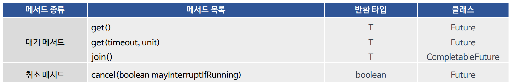
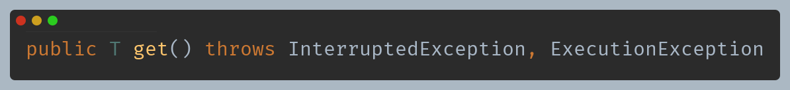
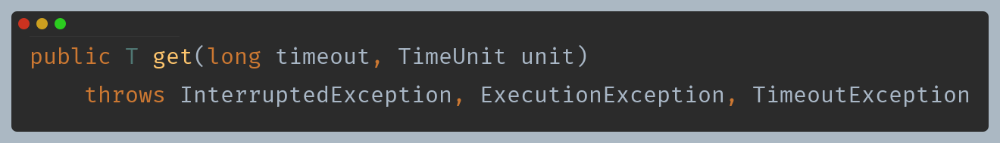
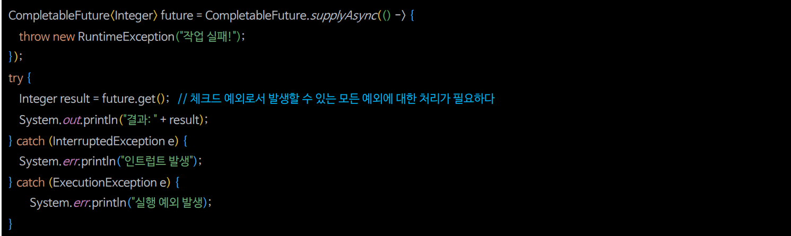
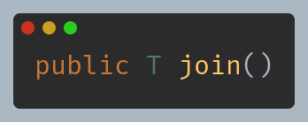
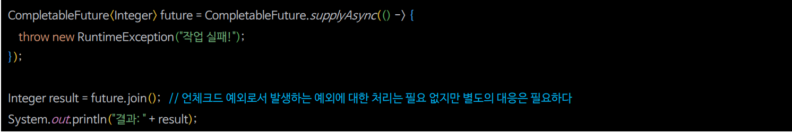
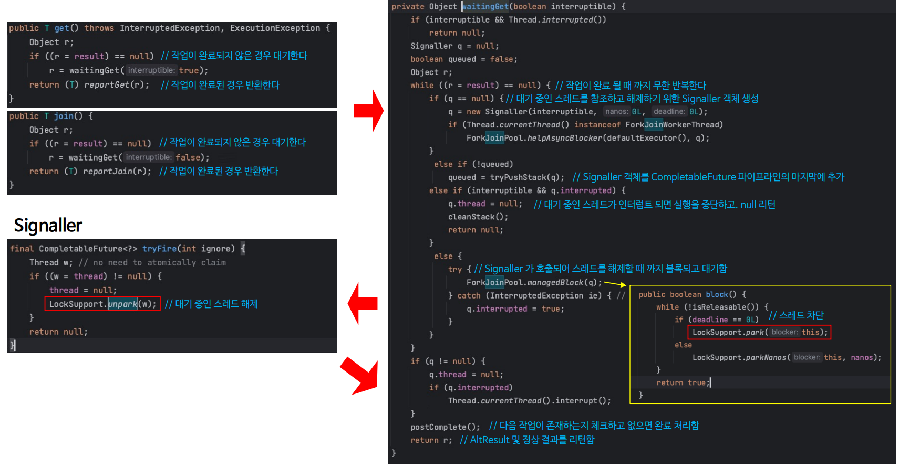

# 자바 동시성 프로그래밍 - 비동기 프로그래밍

## 비동기 대기 및 취소 처리

- `CompletableFuture`는 비동기 작업의 대기, 취소를 위한 메서드를 제공하고 있다.

---

## get()

- 작업이 완료될 때까지 혹은 지정된 시간까지 대기하고 결과를 반환한다.
- 예외로 작업이 완료된 경우 `CancellationException`(취소 예외), `ExecutionException`(실행 예외), `InterruptedException`(인터럽트 예외) 을 발생시키며 예외를 처리해 주어야 한다.

---

## join()

- 작업이 완료될 때까지 대기하고 결과를 반환한다.
- 예외로 작업이 완료된 경우 `CancellationException`(취소 예외), `CompletionException`(완료 예외)을 발생시키며 언체크 예외로서 예외 처리를 해주지 않아도 된다.

---

## get()과 join() 의 대기 및 해제 원리

---

[이전 ↩️ - 비동기 프로그래밍 - 비동기 완료 처리]()

[메인 ⏫](https://github.com/genesis12345678/TIL/blob/main/Java/reactive/Main.md)

[다음 ↪️ - 비동기 프로그래밍 - ForkJoinPool]()