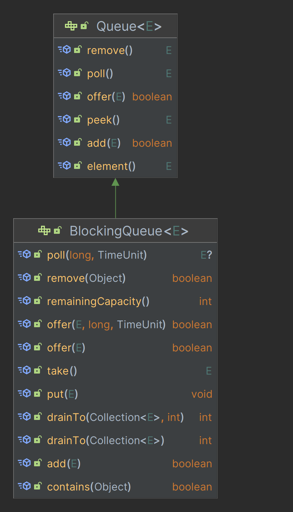
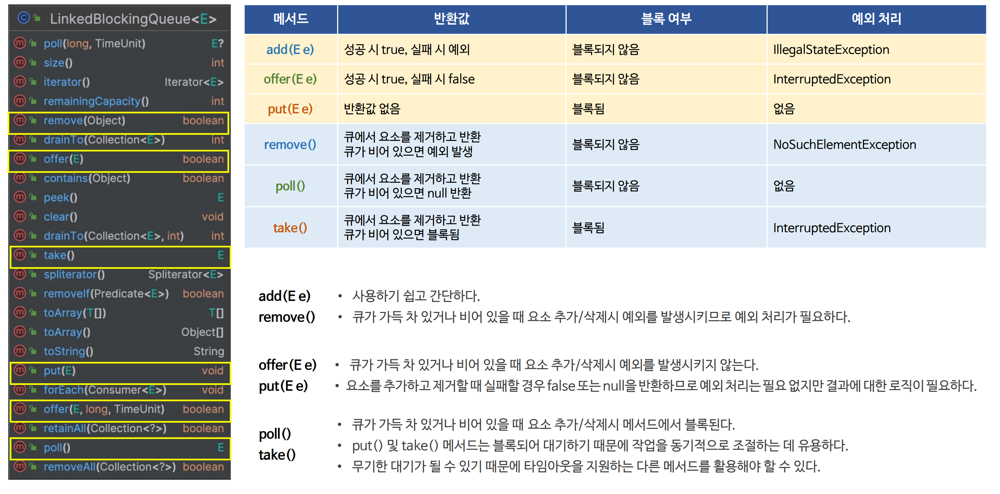
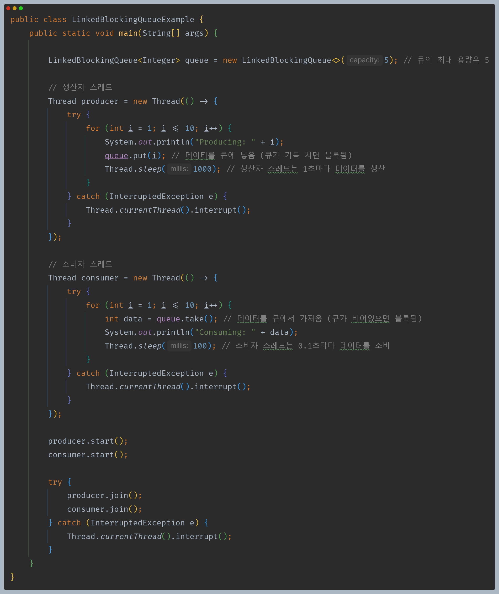
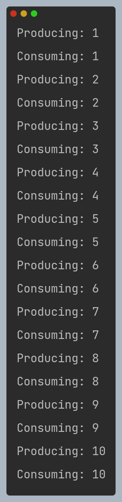

# 자바 동시성 프로그래밍 - ThreadPoolExecutor

## BlockingQueue

- 기본적으로 스레드 풀은 작업이 제출되면 `corePoolSize`의 새 스레드를 추가해서 작업을 할당하고 큐에 작업을 바로 추가하지 않는다.
- `corePoolSize`를 초과해서 스레드가 실행 중이면 새 스레드를 추가해서 작업을 할당하는 대신 큐에 작업을 추가한다.(큐가 가득찰 때까지)
- 큐에 공간이 가득차게 되고 스레드가 `maxPoolSize` 이상 실행 중이면 더 이상 작업은 추가되지 않고 거부된다.

### SynchronousQueue

- `newCachedThreadPool()` 에서 사용한다.
- 내부적으로 크기가 0인 큐로서 스레드 간에 작업을 직접 전달하는 역할을 하며 작업을 대기열에 넣으려고 할 때 실행할 스레드가 즉시 없으면 새로운 스레드가 생성된다.
- 요소를 추가하려고 하면 다른 스레드가 해당 요소를 꺼낼 때까지 현재 스레드는 블로킹되고, 요소를 꺼내려고 하면 다른 스레드가 요소를 추가할 때까지 현재 스레드는 블로킹된다.
- `SynchronousQueue`는 평균적인 처리보다 더 빨리 작업이 요청되면 스레드가 무한정 증가할 수 있다.

### LinkedBlockingQueue

- `Executors.newFixedThreadPool()` 에서 사용한다.
- 무제한 크기의 큐로서 `corePoolSize` 의 스레드가 모두 사용 중인 경우 새로운 작업이 제출되면 대기열에 등록하고 대기하게 된다.
- 무제한 크기의 큐이기 때문에 `corePoolSize`의 스레드만 생성하고 더 이상 추가 스레드를 생성하지 않기 때문에 `maximumPoolSize`를 설정해도 아무런 효과가 없다.
- `LinkedBlockingQueue` 방식은 일시적인 요청의 폭증을 완화하는 데 유용할 수 있지만 평균적인 처리보다 더 빨리 작업이 도착할 경우 대기열이 무한정 증가할 수 있다.

### ArrayBlockingQueue

- 내부적으로 고정된 크기의 배열을 사용하여 작업을 추가하고 큐를 생성할 때 최대 크기를 지정해야 하며 한 번 지정된 큐의 크기는 변경할 수 없다.
- 큰 대기열과 작은 풀을 사용하면 CPU 사용량 OS 리소스 및 컨텍스트 전환 오버헤드가 최소화 되지만 낮은 처리량을 유발할 수 있다.
- 작은 대기열과 큰 풀을 사용하면 CPU 사용량이 높아지지만 대기열이 가득 찰 경우 추가적인 작업을 거부하기 때문에 처리량이 감소할 수 있다.

---

## 예제 코드

- 생산하는 스레드에서 `LinkedBlockingQueue`에 원소를 삽입하려고 할 때 큐가 가득 차 있으면 소비하는 스레드에서 소비를 마치고 깨워줄 때까지(`signal`) 블록된다.
- 소비하는 스레드에서 `LinkedBlockingQueue`의 원소를 제거하려고 할 때 큐가 비어 있으면 생산하는 스레드에서 생산을 마치고 깨워줄 때까지(`signal`) 블록된다.

---

[이전 ↩️ - ThreadPoolExecutor - keepAliveTime]()

[메인 ⏫](https://github.com/genesis12345678/TIL/blob/main/Java/reactive/Main.md)

[다음 ↪️ - ThreadPoolExecutor - RejectedExecutionHandler]()