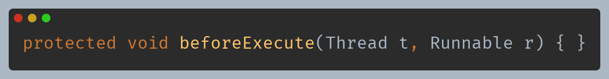
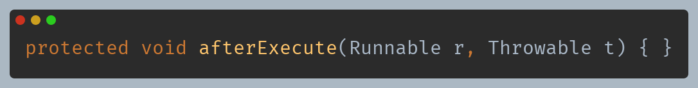
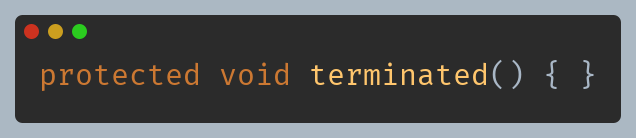
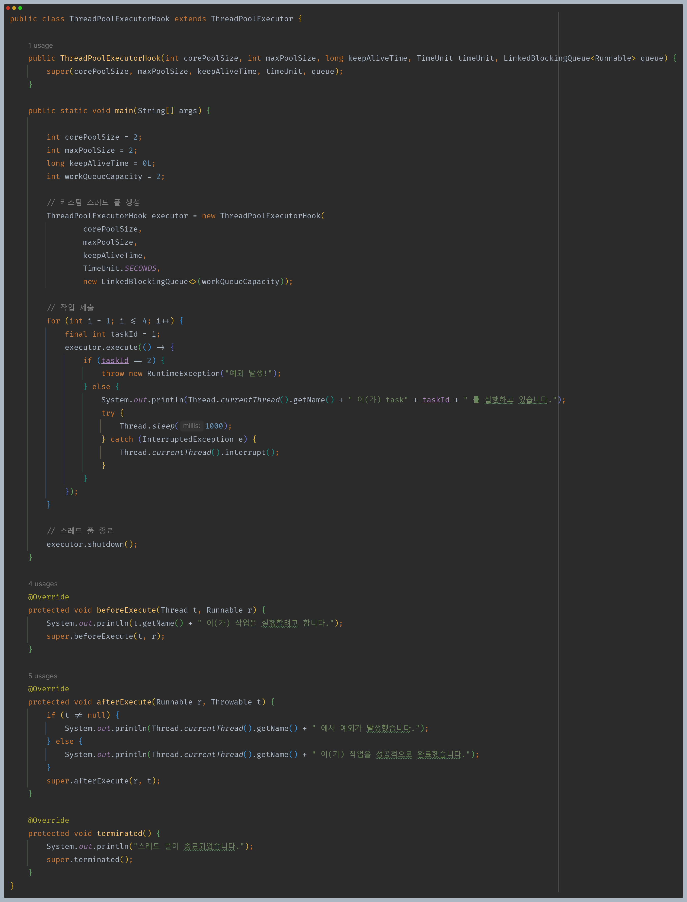
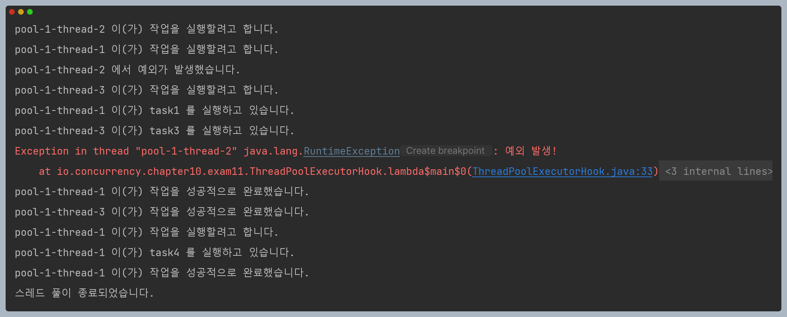

# 자바 동시성 프로그래밍 - ThreadPoolExecutor

## ThreadPoolExecutor Hook 메서드

- `ThreadPoolExecutor` 클래스는 스레드 풀을 관리하고 작업 실행 시점에 특정 이벤트를 처리하기 위한 **Hook 메서드**를 제공한다.
- `ThreadPoolExecutor` 클래스를 상속하고 Hook 메서드를 재정의하여 작업 스레드 풀의 동작을 사용자 정의할 수 있으며 3개의 Hook 메서드가 있다.

- 작업 스레드가 작업을 실행하기 전에 호출되는 메서드로서, 제출된 각 작업마다 한 번씩 호출되고 작업 실행 전에 원하는 동작을 추가할 수 있다.

- 작업 스레드가 작업 실행을 완료한 후에 호출되는 메서드로서, 제출된 각 작업마다 한 번씩 호출되고 작업 실행 후에 원하는 동작을 추가하거나 예외 처리를 수행할 수 있다.

- 스레드 풀이 완전히 종료된 후에 호출되는 메서드로서, 스레드 풀이 종료되면 이 메서드를 재정의하여 클린업 작업을 수행할 수 있다.

---

## 예제 코드

---

[이전 ↩️ - ThreadPoolExecutor - RejectedExecutionHandler](https://github.com/genesis12345678/TIL/blob/main/Java/reactive/ThreadPoolExecutor/RejectedExecutionHandler.md)

[메인 ⏫](https://github.com/genesis12345678/TIL/blob/main/Java/reactive/Main.md)

[다음 ↪️ - ThreadPoolExecutor - 생명 주기와 상태 & ThreadPoolExecutor 아키텍처](https://github.com/genesis12345678/TIL/blob/main/Java/reactive/ThreadPoolExecutor/LifeCycle.md)