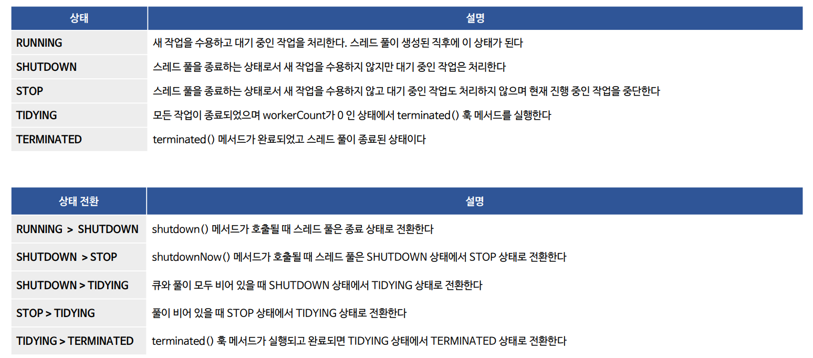
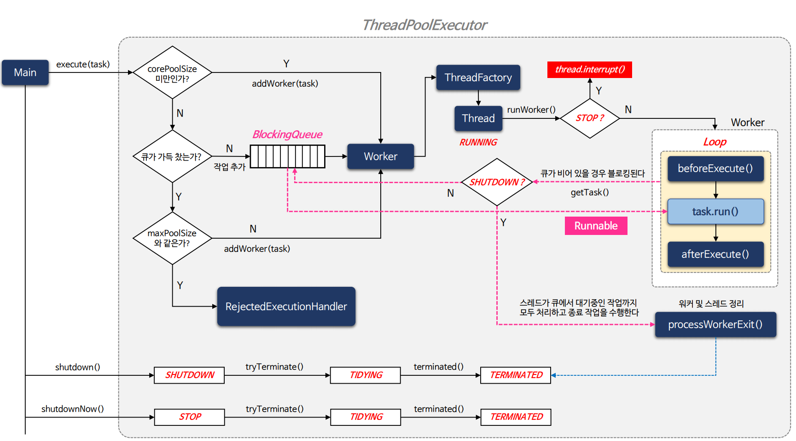
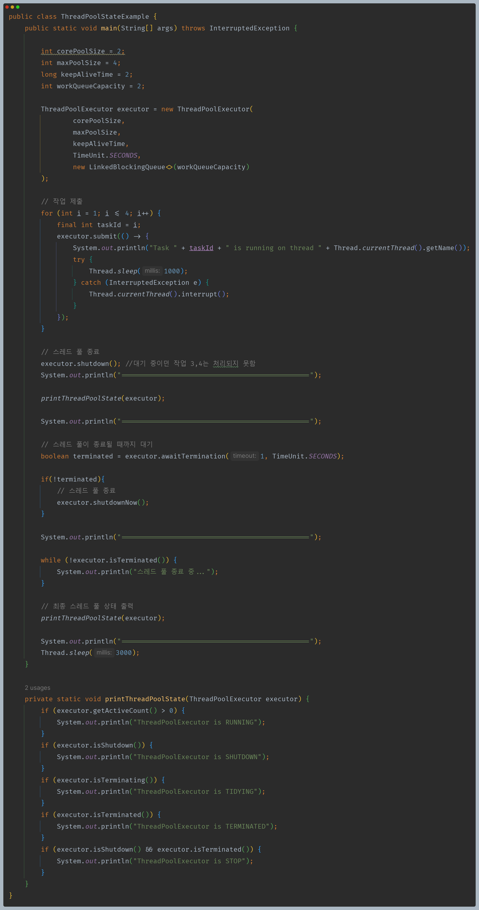
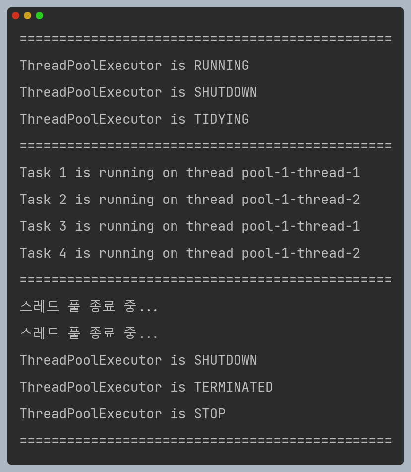

# 자바 동시성 프로그래밍 - ThreadPoolExecutor

## ThreadPoolExecutor 생명 주기와 상태

- `ThreadPoolExecutor`는 다양한 생명 주기와 상태를 가지며 이러한 상태에 따라 작업 스레드 풀의 동작이 결정된다.
- 주요 상태 및 상태 전환은 다음과 같다.

---

## ThreadPoolExecutor 주요 API

---

## ThreadPoolExecutor 흐름도

---

## 예제 코드

---

[이전 ↩️ - ThreadPoolExecutor - 스레드 풀 Hook 메서드](https://github.com/genesis12345678/TIL/blob/main/Java/reactive/ThreadPoolExecutor/Hook.md)

[메인 ⏫](https://github.com/genesis12345678/TIL/blob/main/Java/reactive/Main.md)

[다음 ↪️ - 비동기 프로그래밍 - 동기 vs 비동기](https://github.com/genesis12345678/TIL/blob/main/Java/reactive/AsyncProgramming/Blocking.md)