# 자바 동시성 프로그래밍 - ThreadPoolExecutor

## RejectedExecutionHandler

- `execute(Runnable)`로 제출된 작업이 풀의 포화로 인해 거부 될 경우 `execute()` 메서드는 `RejectedExecutionHandler.rejectedExecution()` 메서드를 호출한다.
- 미리 정의된 네 가지 핸들러 정책 클래스가 제공되며 직접 사용자 정의 클래스를 만들어 사용할 수 있다.
  - `ThreadPoolExecutor.AbortPolicy`
    - 기본 값이며, 작업 거부 시 `RejectedExecutionException` 예외를 발생시킨다.
  - `ThreadPoolExecutor.CallerRunsPolicy`
    - `Executor`(스레드풀) 가 종료 되지 않은 경우 `execute()`를 호출한 스레드 자체가 작업을 실행한다.
  - `ThreadPoolExecutor.DiscardPolicy`
    - 거부된 작업은 그냥 삭제된다.
  - `ThreadPoolExecutor.DiscardOldestPolicy`
    - `Executor`가 종료되지 않은 경우 대기열의 맨 앞에 있는 작업을 삭제하고 실행이 재시도 된다.
    - 재시도가 실패하면 반복 될 수 있다.

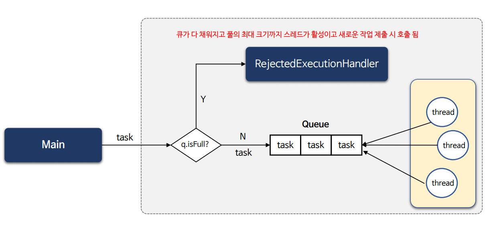

---

## 예제 코드 - 1

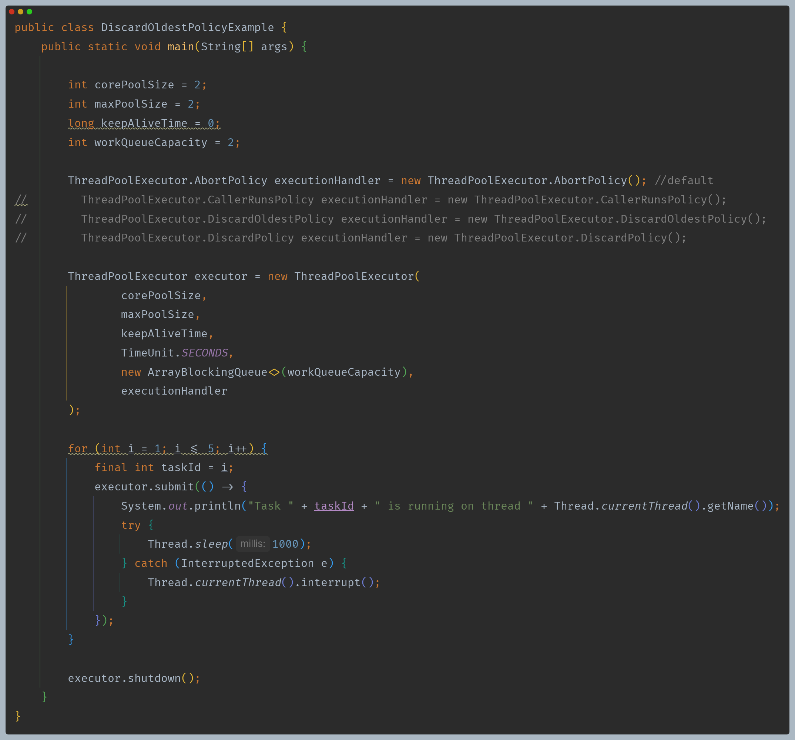

- 5개 작업 중 2개는 처리되고, 3개 작업이 제출될 때 최대 2개(`maxPoolSize`)의 스레드가 생성이 된다.
- 이때 큐의 사이즈는 2이므로 1개의 작업은 처리되지 못하게 된다.

### AbortPolicy

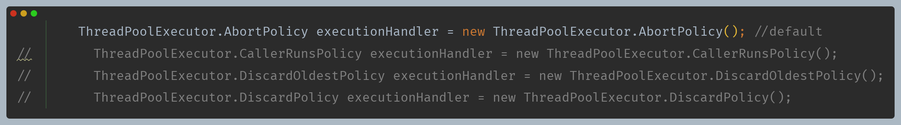

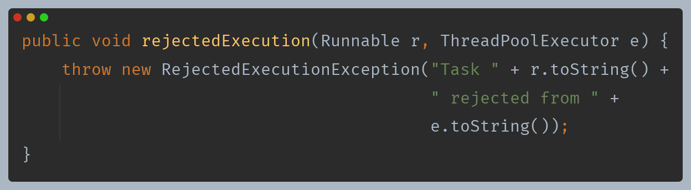

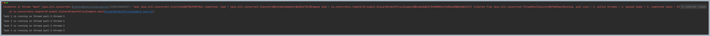

### CallerRunsPolicy

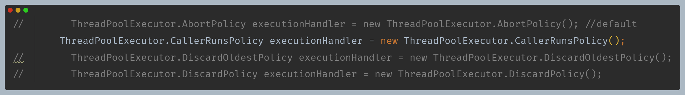

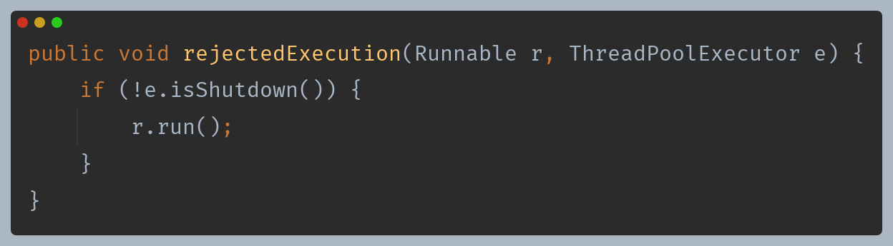

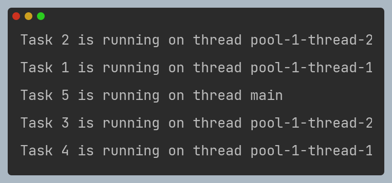

### DiscardPolicy

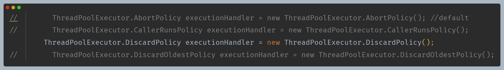
  
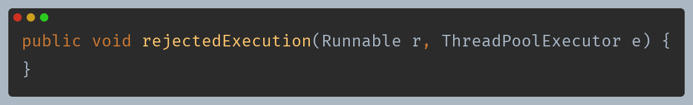

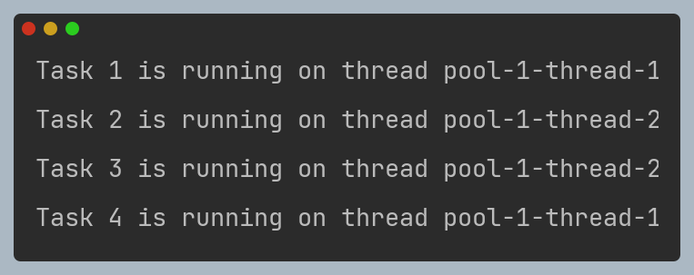

### DiscardOldestPolicy

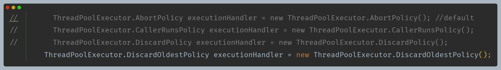

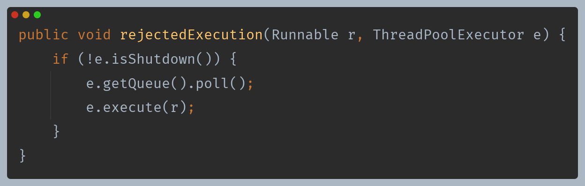

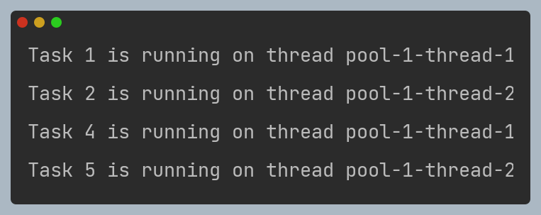

---

## 예제 코드 - 2

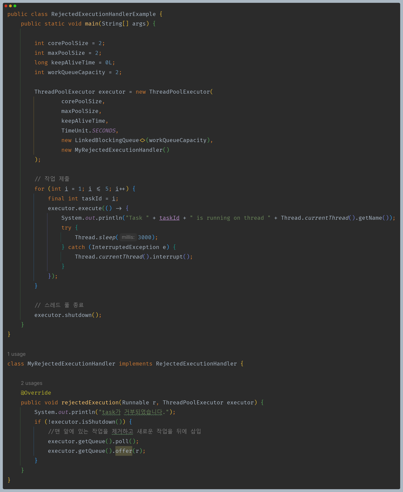

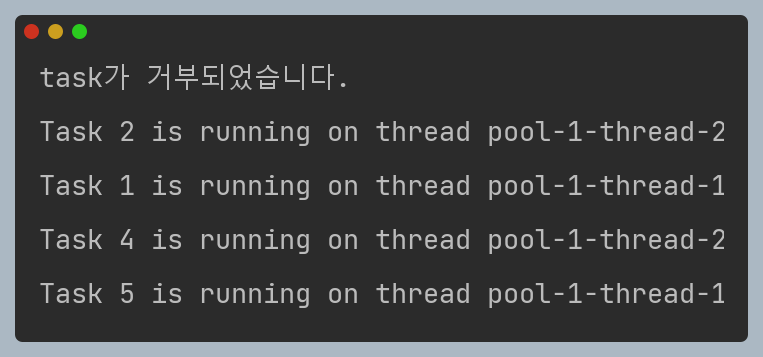

---

[이전 ↩️ - ThreadPoolExecutor - BlockingQueue](https://github.com/genesis12345678/TIL/blob/main/Java/reactive/ThreadPoolExecutor/corePoolSize.md)

[메인 ⏫](https://github.com/genesis12345678/TIL/blob/main/Java/reactive/Main.md)

[다음 ↪️ - ThreadPoolExecutor - 스레드 풀 Hook 메서드](https://github.com/genesis12345678/TIL/blob/main/Java/reactive/ThreadPoolExecutor/Hook.md)