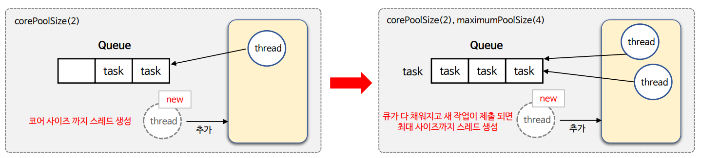
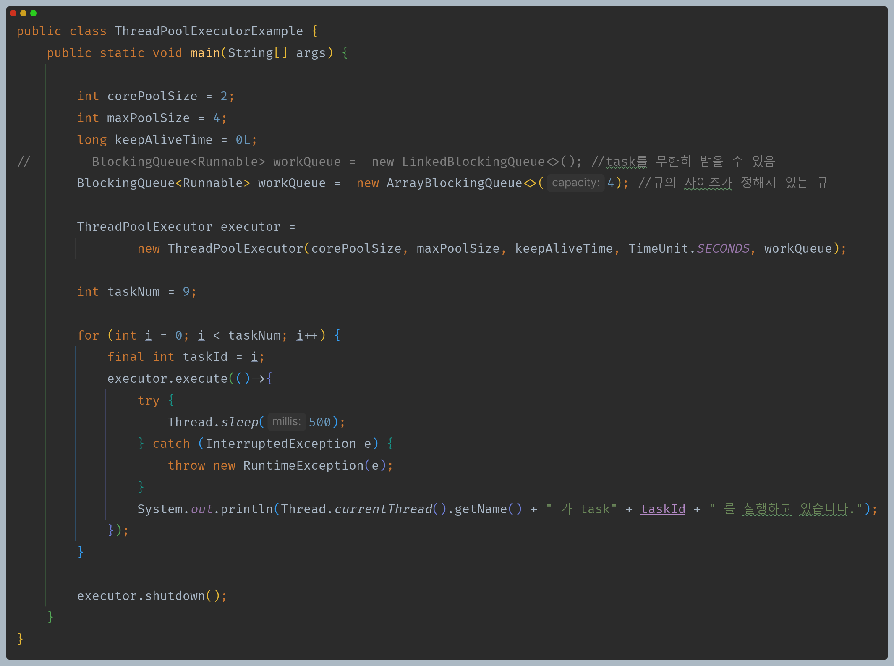
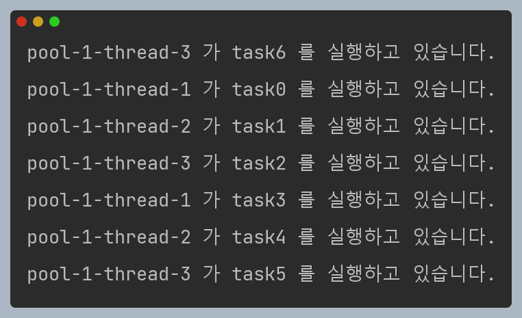
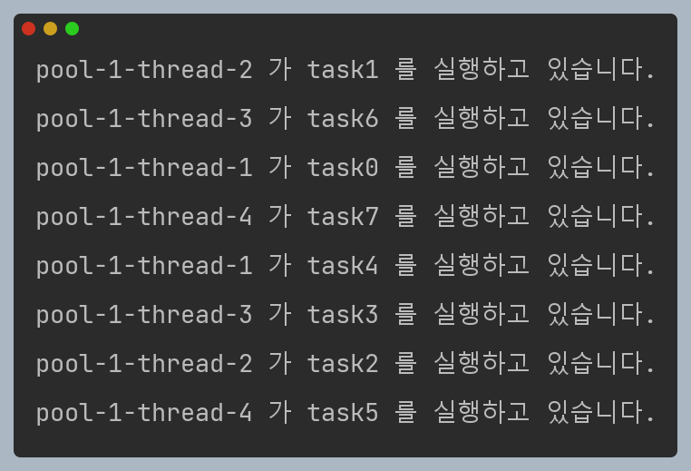
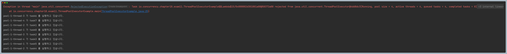
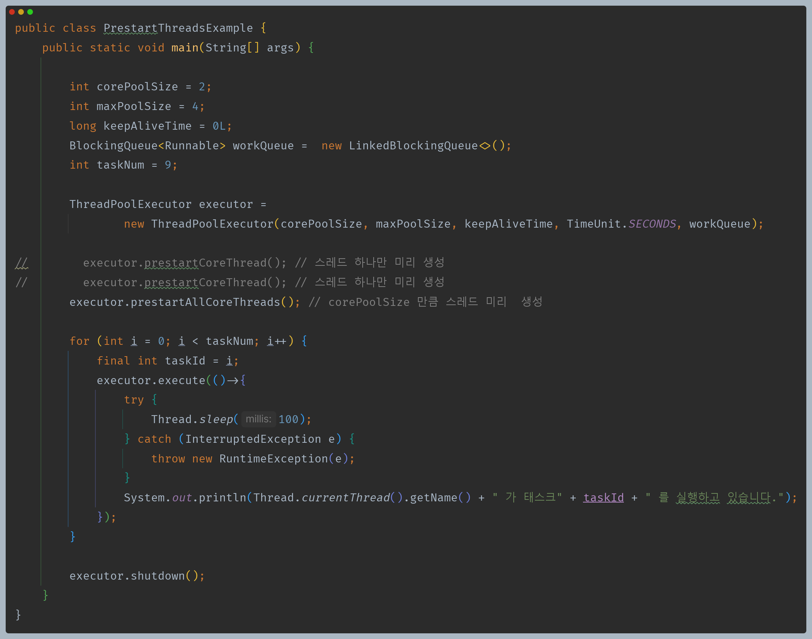

# 자바 동시성 프로그래밍 - ThreadPoolExecutor

- `ThreadPoolExecutor`는 `ExecutorService`를 구현한 클래스로서 매개변수를 통해 다양한 설정과 조정이 가능하며 사용자가 직접 컨트롤 할 수 있는 스레드 풀이다.

## corePoolSize & maximumPoolSize

- `ThreadPoolExecutor`는 `corePoolSize` 및 `maximumPoolSize`로 설정된 개수에 따라 스레드 풀 크기를 자동으로 조정한다.
- `ThreadPoolExecutor`는 새 작업이 제출될 때 `corePoolSize` 미만의 스레드가 실행 중이면 `corePoolSize`가 될 때까지 새 스레드를 생성한다.
- `corePoolSize`를 초과할 경우 큐 사이즈가 남아 있으면 큐에 작업을 추가하고 큐가 가득 차 있는 경우는 `maximumPoolSize`가 될 때까지 새 스레드가 생성된다.
- `setCorePoolSize()` 및 `setMaximumPoolSize()` 메서드를 사용하여 동적으로 값을 변경할 수 있다.
- 기본적으로 스레드 풀은 스레드를 미리 생성하지 않고 새 작업이 도착할 때만 생성하지만 `prestartCoreThread()` 또는 `prestartAllCoreThreads()` 메서드를 사용하여
    동적으로 재정의 할 수 있다.

--- 

## 예제 코드 - 1

- `BlockingQueue` 인터페이스의 구현체 중 `LinkedBlockingQueue`는 작업을 무한대로 받을 수 있기 때문에 사실상 `maximumPoolSize`의 의미가 없어진다. 왜냐하면
    큐가 어쨌든 가득 차야 새 스레드가 생성되고 말고를 결정할텐데, `LinkedBlockingQueue`는 큐가 가득 찬다는 개념이 없기 때문이다.
- 반면 `ArrayBlockingQueue`는 큐의 최대 사이즈를 지정할 수 있다. 위 예제의 경우 큐의 사이즈를 4로 설정했고, 작업이 4개일 때 또 다른 작업이 제출되면
    새 스레드가 생성되는 것이다.

### `taskNum`이 7일 때

- 스레드 1, 2 외에 추가로 한 개의 스레드가 생성된 것을 확인할 수 있다.(스레드 3)
- `corePoolSize`가 2이므로 2개의 작업은 즉시 처리되고, 나머지 5개의 작업은 큐에 저장될 것이다.
- 근데 큐의 최대 크기는 4이므로 다 채워진 상태에서 한 개의 작업이 들어오므로 스레드가 한 개 생성된다.
- 생성된 스레드의 개수(3개)가 `maximumPoolSize`(4) 를 넘지 않으므로 정상적으로 작업을 처리한다. 

### `taskNum`이 8일 때

- 스레드 1, 2 외에 추가로 두 개의 스레드가 생성된 것을 확인할 수 있다.(스레드 3, 4)
- `corePoolSize`가 2이므로 2개의 작업은 즉시 처리되고, 나머지 6개의 작업은 큐에 저장될 것이다.
- 근데 큐의 최대 크기는 4이므로 다 채워진 상태에서 두 개의 작업이 들어오므로 스레드가 두 개 생성된다.
- 생성된 스레드의 개수(4개)가 `maximumPoolSize`(4) 를 넘지 않으므로 정상적으로 작업을 처리한다.

### `taskNum`이 9일 때

- 스레드 1, 2 외에 추가로 두 개의 스레드가 생성된 것을 확인할 수 있다.(스레드 3, 4)
- `corePoolSize`가 2이므로 2개의 작업은 즉시 처리되고, 나머지 7개의 작업은 큐에 저장될 것이다.
- 근데 큐의 최대 크기는 4이므로 다 채워진 상태에서 3개의 작업이 들어오고, 최대 2개의 스레드를 추가로 생성한다.
- 마지막 작업은 큐에 들어갈 공간도 없고, `maximumPoolSize`(4)에 도달했기 때문에 예외가 발생하게 된다.

--- 

## 예제 코드 - 2

- `prestartCoreThread()`는 스레드 풀에 스레드를 미리 하나 생성새 놓는다. 단, 여러 번 호출해도 `corePoolSize` 이상의 스레드를 생성하지 않는다.
- `prestartAllCoreThreads`는 `corePoolSize` 만큼의 스레드를 스레드 풀에 미리 생성해 놓는다.

---

[이전 ↩️ - Java 동시성 프레임워크 - Executors](https://github.com/genesis12345678/TIL/blob/main/Java/reactive/javaFramework/Executors.md)

[메인 ⏫](https://github.com/genesis12345678/TIL/blob/main/Java/reactive/Main.md)

[다음 ↪️ - ThreadPoolExecutor - keepAliveTime](https://github.com/genesis12345678/TIL/blob/main/Java/reactive/ThreadPoolExecutor/keepAliveTime.md)