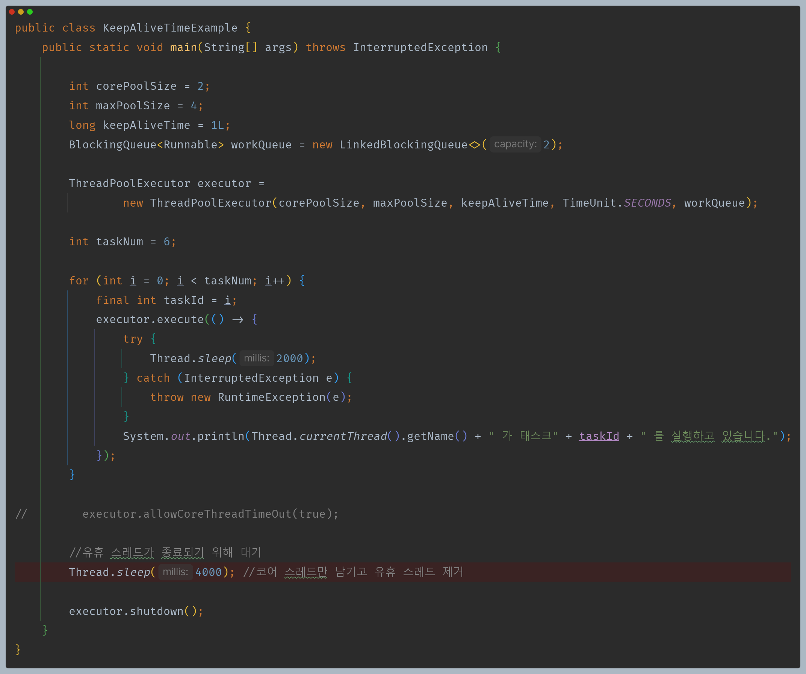
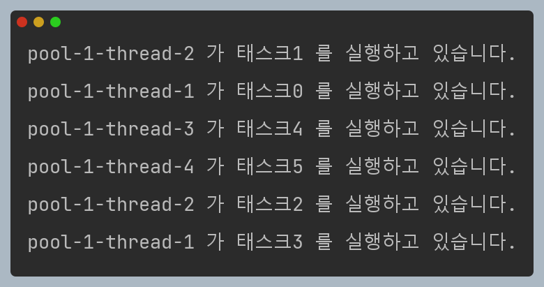
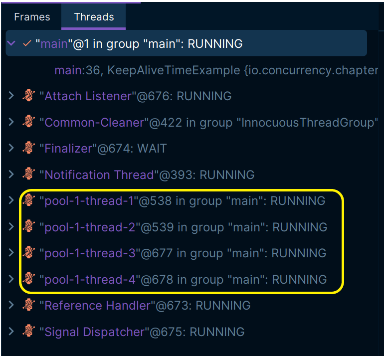
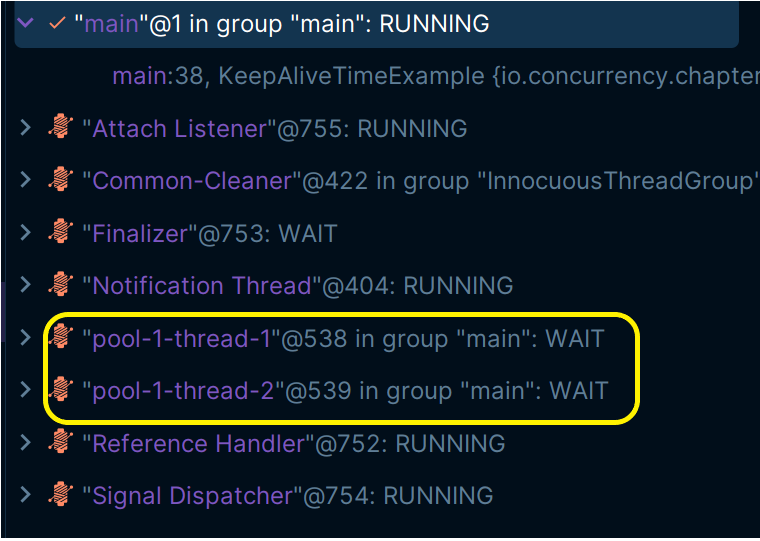

# 자바 동시성 프로그래밍 - ThreadPoolExecutor

## keepAliveTime

- `corePoolSize` 보다 더 많은 스레드가 존재하는 경우 각 스레드가 `keepAliveTime`보다 오랜 시간 동안 유휴 상태였다면 해당 스레드는 종료된다.
- `keep-alive` 정책은 `corePoolSize` 스레드 보다 많은 스레드가 있을 때만 적용되지만 `allowCoreThreadTimeOut(boolean)` 메서드를 사용하여 코어 스레드에도 적용할 수 있다.
- `Executors.newCachedThreadPool()`로 스레드 풀이 생성된 경우 대기 제한 시간이 60초 이며, `Executors.newFixedThreadPool()` 로 생성된 경우 제한 시간이 없다.

---

## 예제 코드

- `corePoolSize` 만큼 2개의 작업을 처리하고 나머지 4개의 작업을 큐에 넣을 때 큐의 최대 크기는 2이므로 2개의 스레드를 생성하고 `maxPoolSize`를 넘지 않으므로 총 4개의 스레드가 작업을 처리하게 된다.
- 이때 상태는 다음과 같다.

- 이후 유휴 스레드가 제거되는 것을 확인하기 위해 메인 스레드에서 잠시 대기하면 다음과 같다.

- 코어 스레드만 남기고 나머지 유휴 스레드는 제거되었다.
- 이때 주의할 것은 스레드에서 `Thread.sleep()` 같은 상태에서 대기하더라도, 해당 스레드는 **다음 일을 받기 위해서 대기하는 스레드**가 아니기 때문에
`keepAliveTime`에 의해서 제거되는 대상이 아니다.
- 즉, `keepAliveTime`의 유휴 시간은 스레드가 자신의 작업을 모두 끝낸 직후부터 유휴 시간을 체크한다.

---

[이전 ↩️ - ThreadPoolExecutor - corePoolSize & maximumPoolSize](https://github.com/genesis12345678/TIL/blob/main/Java/reactive/ThreadPoolExecutor/corePoolSize.md)

[메인 ⏫](https://github.com/genesis12345678/TIL/blob/main/Java/reactive/Main.md)

[다음 ↪️ - ThreadPoolExecutor - BlockingQueue](https://github.com/genesis12345678/TIL/blob/main/Java/reactive/ThreadPoolExecutor/BlockingQueue.md)