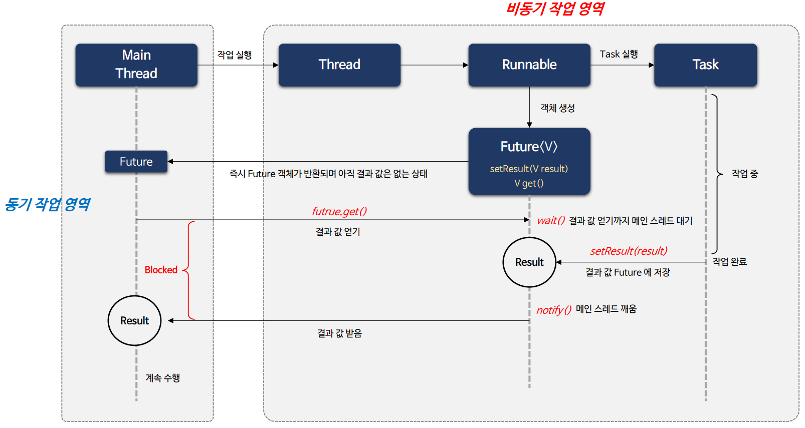
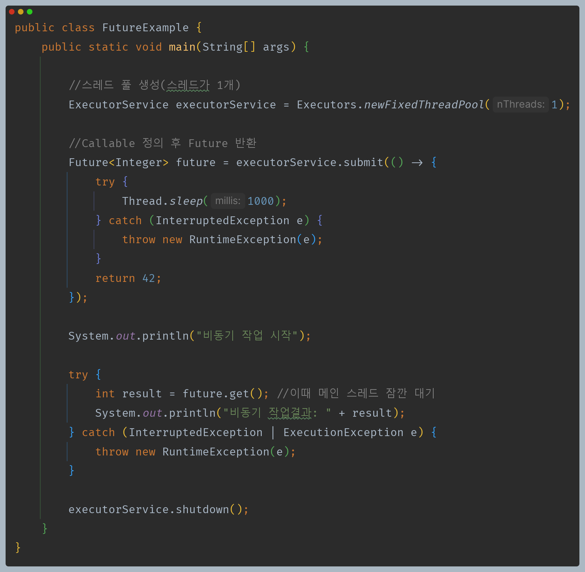
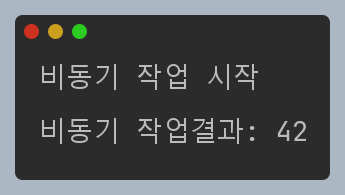
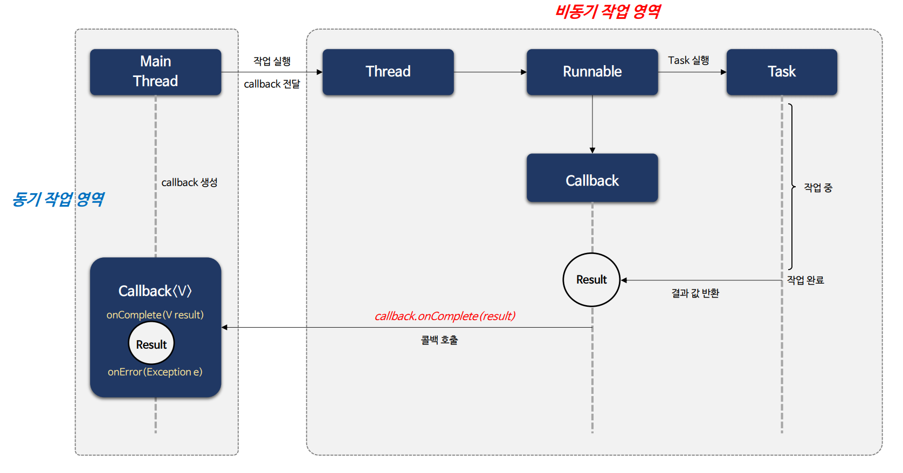
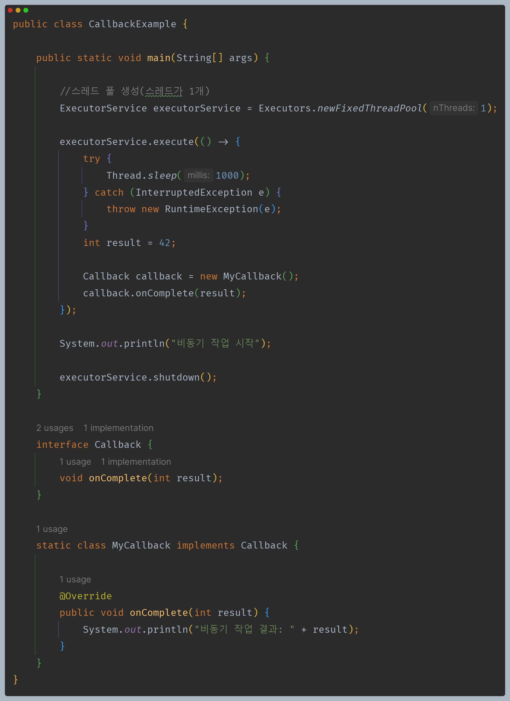
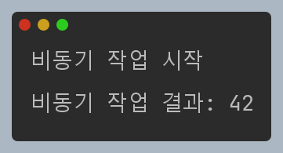
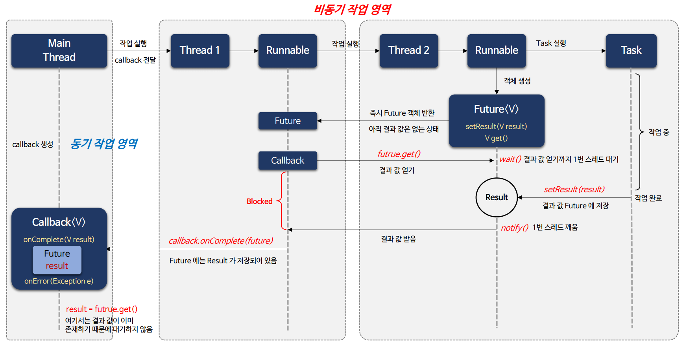
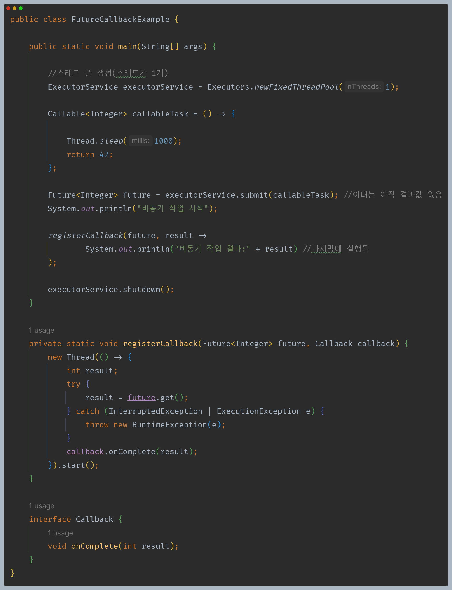
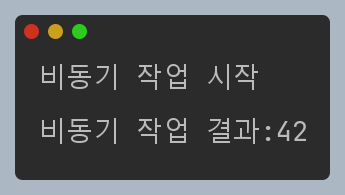

# 자바 동시성 프로그래밍 - Java 동시성 프레임워크

## Future & Callback

- 자바에서 `Future`와 `Callback`은 비동기 프로그래밍에서 사용되는 패턴으로 비동기 작업의 결과를 처리하거나 작업이 완료되었을 때 수행할 동작을 정의하며 사용한다.
- 자바에서는 `Future` 인터페이스와 구현체들을 제공하고 있으며 다양한 `Callback` 패턴을 활용하고 있다.
- 두 패턴은 사용하는 방식과 특징이 다르며 각 상황에 맞게 구현해서 사용하도록 한다.

| 구분     | `Future`                 | `Callback`                               |
|--------|--------------------------|------------------------------------------|
| **정의**     | 비동기 작업의 결과를 나타내는 객체      | 비동기 작업이 완료되었을 때 수행할 동작을 정의한 인터페이스 또는 클래스 |
| **블로킹 여부** | 비동기 작업이 완료될 때까지 블로킹      | 블로킹되지 않고 비동기 작업이 완료되면 콜백을 호출             |
| **작업 결과**  | 비동기 작업이 완료되면 결과를 얻을 수 있음 | 콜백 메서드를 통해 작업 결과를 처리                     |
| **활용 용도**  | 결과를 받아오는 작업에서 활용됨        | 비동기 작업의 완료 후 동작을 정의할 때 주로 활용됨            |

### 두 패턴이 필요한 이유

1. 비동기 작업에서 스레드 간 결과를 받을 방법이 필요하다.
2. 비동기 작업은 스레드 간 실행의 흐름이 독립적이기 때문에 비동기 작업의 완료 시점에 결과를 얻을 수 있어야 한다.

---

## Future를 활용한 비동기 작업

### 예제 코드

---

## Callback을 활용한 비동기 작업

### 예제 코드

---

## Future와 Callback을 혼합한 비동기 작업

### 예제 코드

---

[이전 ↩️ - Java 동시성 프레임워크 - Runnable & Callable]()

[메인 ⏫](https://github.com/genesis12345678/TIL/blob/main/Java/reactive/Main.md)

[다음 ↪️ - Java 동시성 프레임워크 - Future 구조 및 API]()