# 자바 동시성 프로그래밍 - Java 동시성 프레임워크

## ExecutorService API - 스레드 풀 실행 및 관리

- `ExecutorService`는 비동기 작업을 실행하고 관리하기 위한 두 가지 메서드를 제공한다.
  - `void execute(Runnable command);` - 작업을 제출하면 작업을 실행하고 종료한다.
  - `<T> Future<T> submit(Callable<T> task);` - 작업을 제출하면 작업을 실행함과 동시에 `Future`를 반환한다. `Future`에는 결과 값을 포함하고 있다.

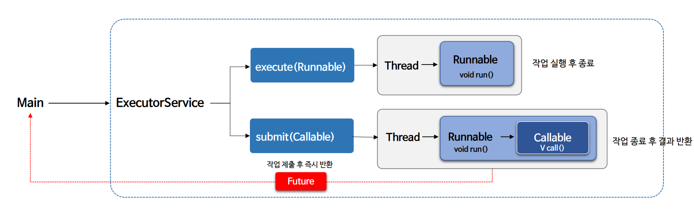

### execute() vs submit()

| 기능       | `execute()`                | `submit()`                              |
|----------|----------------------------|-----------------------------------------|
| 작업 유형    | `Runnable` 작업을 스레드 풀에서 실행  | `Runnable` 또는 `Callable` 작업을 스레드 풀에서 실행 |
| 작업 완료 대기 | 작업을 수행하고 작업이 완료되기를 기다리지 않음 | 작업이 완료될 때까지 결과를 기다릴 수 있음                |
| 결과 반환    | 결과를 반환하지 않음                | 작업의 결과를 `Future`로 반환하여 추후에 결과를 가져올 수 있음 |
| 반환 값     | `void`                      | `Future` 객체                             |

### API

> `execute()`는 `Executor`의 API 이다.

- **< T > Future< T > submit(Callable< T > task);**
  - `Callable` 작업을 실행하는 메서드로 작업의 결과를 나타내는 `Future`를 반환하며 `Future`에는 **작업의 결과가 저장된다.**
  - `Future`에 결과 `T`가 존재한다.
- **< T > Future< T > submit(Runnable task, T result);**
  - `Runnable` 작업을 실행하는 메서드로 작업의 결과를 나타내는 `Future`를 반환하며 `Future`에는 **지정된 결과가 저장된다.**
  - `Future`에 결과 `T`가 존재한다.
- **Future<?> submit(Runnable task);**
  - `Runnable` 작업을 실행하는 메서드로 작업의 결과를 나타내는 `Future`를 반환하며 `Future`에는 **아무런 결과가 존재하지 않는다.**
  - `Future`에 결과가 존재하지 않는다.

### 예제 코드 1 - execute()

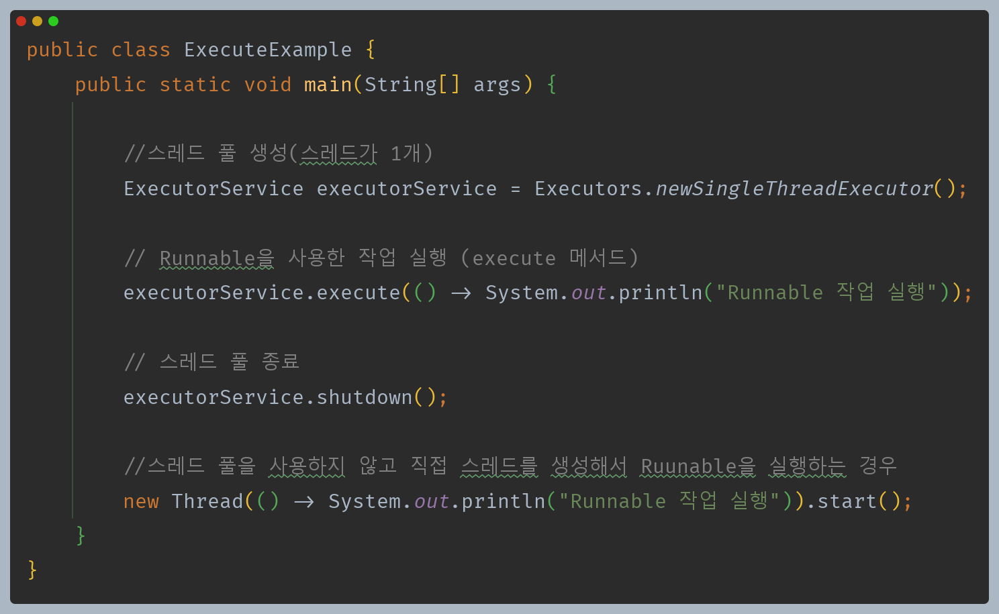

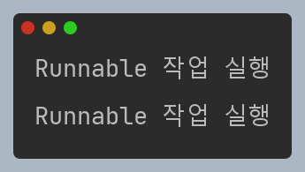

### 예제 코드 2 - submit(Callable)

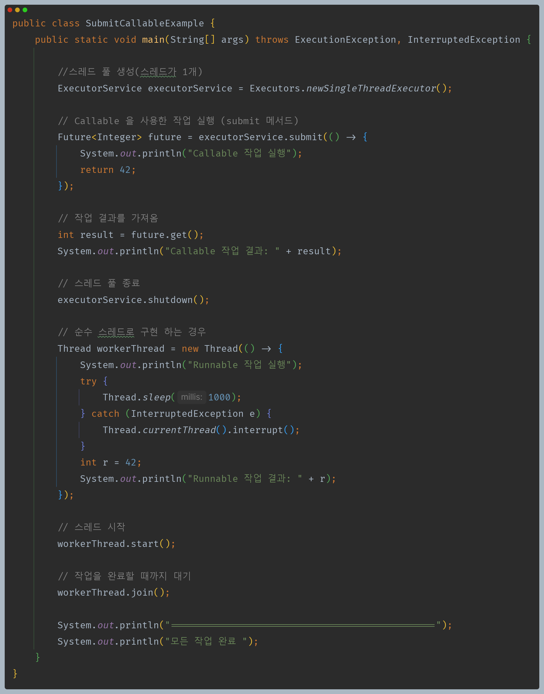

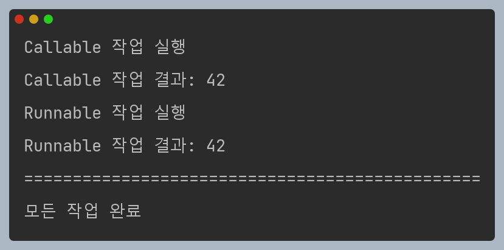

### 예제 코드 3 - submit(Runnable)

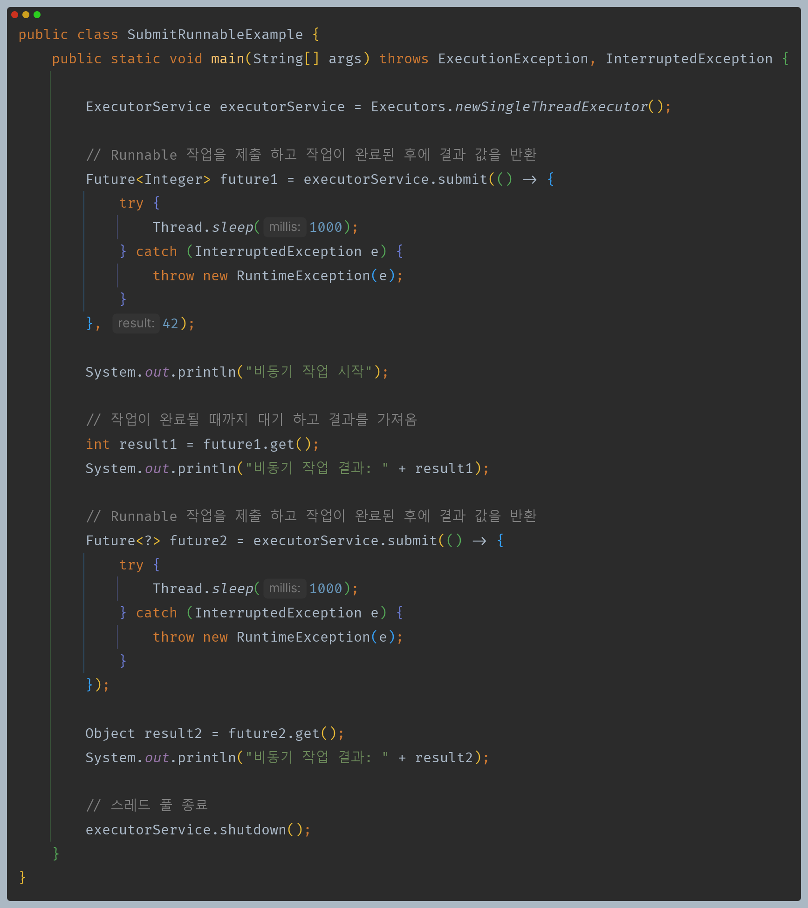

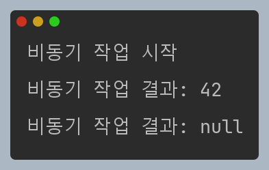

> **정리**
> - 비동기 작업의 결과가 필요 없을 경우 : `execute(Runnable)`
> - 비동기 작업의 결과가 필요할 경우 : `submit(Callable)`

---

## ExecutorService API - 스레드 풀 중단 및 종료

### 작업 중단 및 종료

- `ExecutorService`는 스레드 풀을 종료하기 위한 두 가지 메서드를 제공한다.
  - `void shutdown();` **(정상적인 스레드 풀 종료)**
    - 이전에 제출된 작업은 실행하고 더 이상 새로운 작업은 수락하지 않는다. 작업이 모두 완료되면 `ExecutorService`가 종료된다.
    - 실행 중인 스레드를 강제로 인터럽트 하지 않기 때문에 인터럽트에 응답하는 작업이나 `InterruptedException` 예외 구문을 작성할 필요가 없다.
  - `List<Runnable> shutdownNow();` **(강제적인 스레드 풀 종료)**
    - 이전에 제출된 작업도 취소하고 현재 실행 중인 작업도 중단하려고 시도한다. 그리고 작업 대기 중이었던 작업 목록을 반환한다.
    - 실행 중인 스레드를 강제로 인터럽트 하지만 해당 작업이 인터럽트에 응답하는 작업이 아닌 경우 작업 종료를 보장하지 않는다.
    - 작업을 종료하기 위해서는 `Thread.isInterrupted()`나 `sleep()`과 같은 인터럽트 관련 API를 사용해야 한다.
- `shutdown` 후 작업을 제출하려고 시도하면 `RejectExecutionException` 예외가 발생한다.
- `shutdown`을 호출한 스레드는 실행 중인 작업이 종료될 때까지 기다리지 않고 바로 다음 라인을 실행한다. 만약 스레드가 메서드 호출 후 블로킹 되기 위해서는
  `awaitTermination()`을 사용해야 한다.

### 작업 종료 대기 및 확인

- `ExecutorService`는 작업 종료 대기 및 확인을 위한 메서드를 제공한다.
  - `boolean awaitTermination(long timeout, TimeUnit unit) throws InterruptedException`
    - 종료 요청 후 모든 작업이 실행 완료될 때까지 또는 타임아웃이 발생하거나 현재 스레드가 인터럽트 될 때까지 블록된다.
    - 종료가 완료되면 `true`를 반환하고 종료가 타임아웃 발생 전에 완료되지 않으면 `false`를 반환한다.
  - `boolean isShutdown();`
    - `ExecutorService`의 `shutdown()` 또는 `shutdownNow()` 메서드가 호출 후 종료 절차가 시작되었는지를 나타내며, 종료 절차 중이거나 완전히
      종료된 상태일 때 `true`를 반환한다.
  - `boolean isTerminated();`
    - `ExecutorService`가 완전히 종료되어 더 이상 어떠한 작업도 수행하지 않는 상태인지를 나타내며, 모든 작업과 스레드가 완전히 종료된 후에 `true`를 반환한다.
    - `shutdown()` 또는 `shutdownNow()` 메서드가 먼저 호출 되지 않은 경우에는 절대 `true`가 되지 않는다.

### 종료 및 대기 흐름

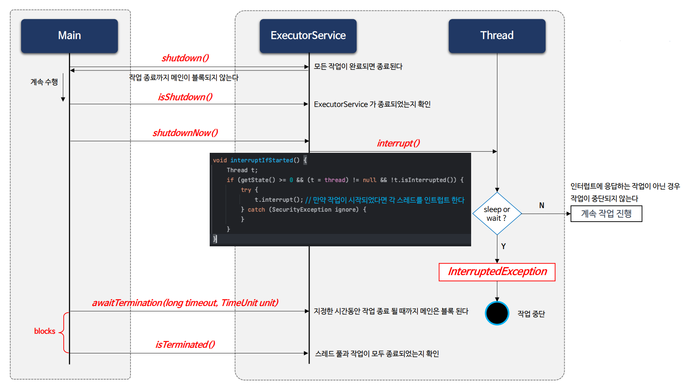

### 예제 코드 1

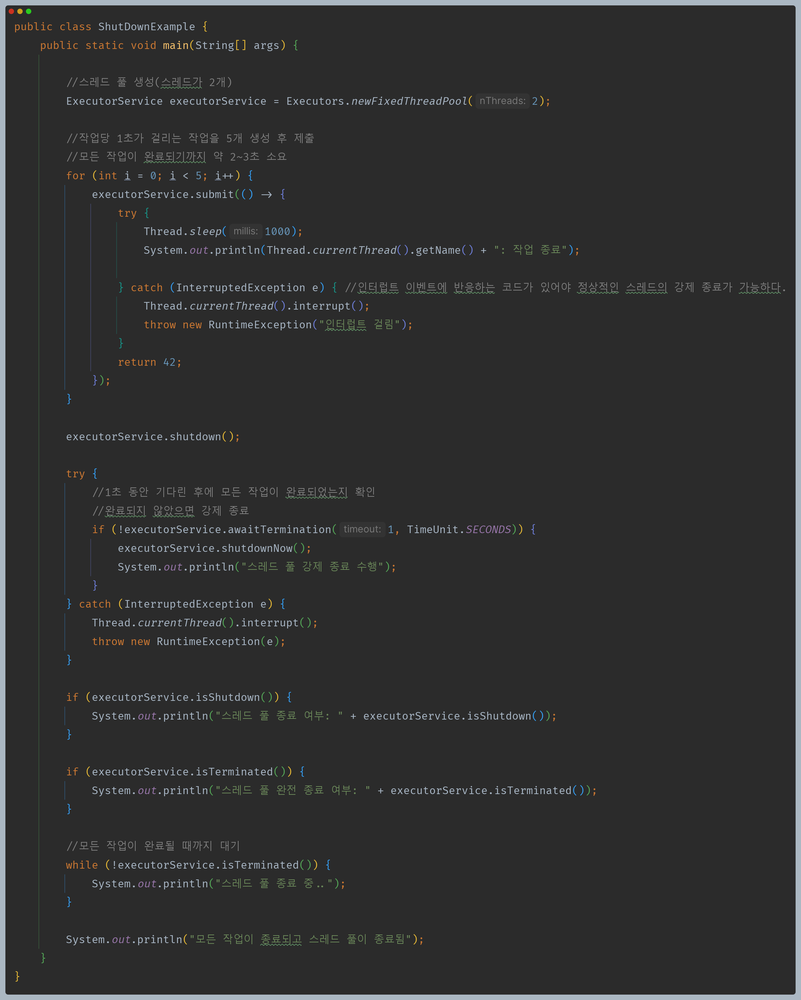

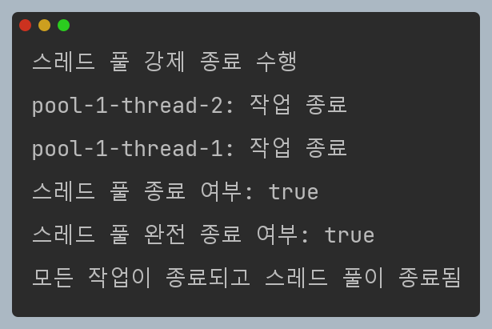

> `shutdownNow()`로 강제로 작업을 종료하더라도 인터럽트 관련 API를 처리하지 않으면 작업 종료를 보장하지 않는다.

### 예제 코드 2

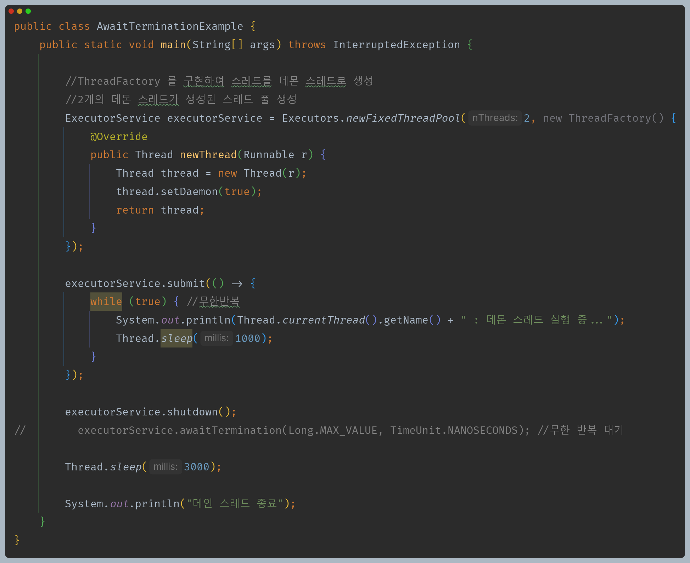

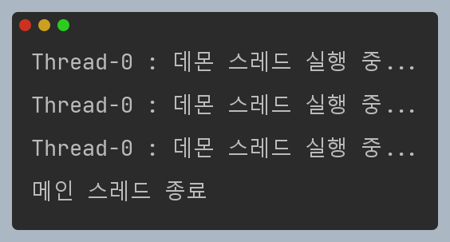

> - `shutdown()`을 호출했지만 스레드의 작업은 무한 반복 이므로 종료되지 않는다.
> - 하지만 `shutdown()`이 호출되어도 메인 스레드는 계속 실행 가능하기 때문에 밑에 코드를 계속 실행한다.
> - 그리고 스레드 풀의 스레드들은 데몬 스레드로 생성되었다. 데몬 스레드는 메인 스레드가 종료되면 같이 종료된다.

---

## ExecutorService API - 다중 작업 처리

- `ExecutorService`는 여러 작업을 실행하고 결과를 수집하는 데 사용되는 메서드를 제공한다.

### invokeAll()

- `<T> List<Future<T>> invokeAll(Collection<? extends Callable<T>> tasks) throws InterruptedException;`
  - 여러 개의 `Callable` 작업을 동시에 실행하고 모든 작업이 완료될 때까지 블록되며 각 작업의 결과를 나타내는 `Future` 객체의 리스트를 반환한다.
  - 작업이 완료되면 `Future.isDone()`이 `true`가 되며 작업은 정상적으로 종료되거나 예외를 던져 종료될 수 있다.
  - 대기 중에 인터럽트가 발생한 경우 아직 완료되지 않은 작업들은 취소된다.
- `<T> List<Future<T>> invokeAll(Collection<? extends Callable<T>> tasks, long timeout, TimeUnit unit) throws InterruptedException;`
  - 위 메서드와 기능은 동일하고 시간 경과와 관련된 부분만 차이가 있다.
  - 타임아웃이 발생하거나 모든 작업이 완료될 때까지 블록되며 각 작업의 결과를 나타내는 `Future` 객체의 리스트를 반환한다.
  - 타임아웃이 발생한 경우 이 작업 중 일부는 완료되지 않을 수 있으며 완료되지 않은 작업은 취소된다.

> **`invokeAll()`은 작업들 중 가장 오래 걸리는 작업 만큼 시간이 소요된다.**

### invokeAny()

- `<T> T invokeAny(Collection<? extends Callable<T>> tasks) throws InterruptedException, ExecutionException;`
  - 여러 개의 `Callable` 작업을 동시에 실행하고 그 중 가장 빨리 성공적으로 완료된 (예외를 던지지 않은) 작업의 결과를 반환한다.
  - 어떤 작업이라도 성공적으로 완료하면 블록을 해제하고 해당 작업의 결과를 반환한다.
  - 정상적인 반환 또는 예외 발생 시 완료되지 않은 작업들은 모두 취소된다.
- `<T> T invokeAny(Collection<? extends Callable<T>> tasks, long timeout, TimeUnit unit) throws InterruptedException, ExecutionException, TimeoutException;`
  - 위 메서드와 기능은 동일하고 시간 경과와 관련된 부분만 차이가 있다.
  - 주어진 시간이 경과하기 전에 예외 없이 성공적으로 완료된 작업의 결과를 반환한다.

> **`invokeAny()`는 작업들 중 가장 짧게 걸리는 작업 만큼 시간이 소요된다.**

### 예제 코드 - invokeAll()

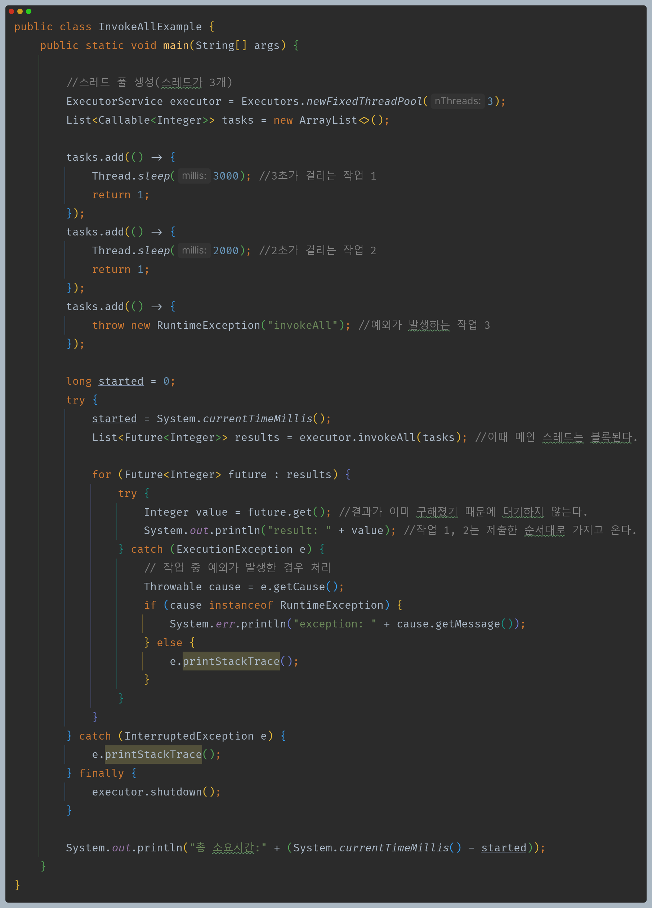

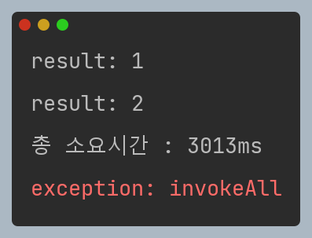

### 예제 코드 - invokeAny()

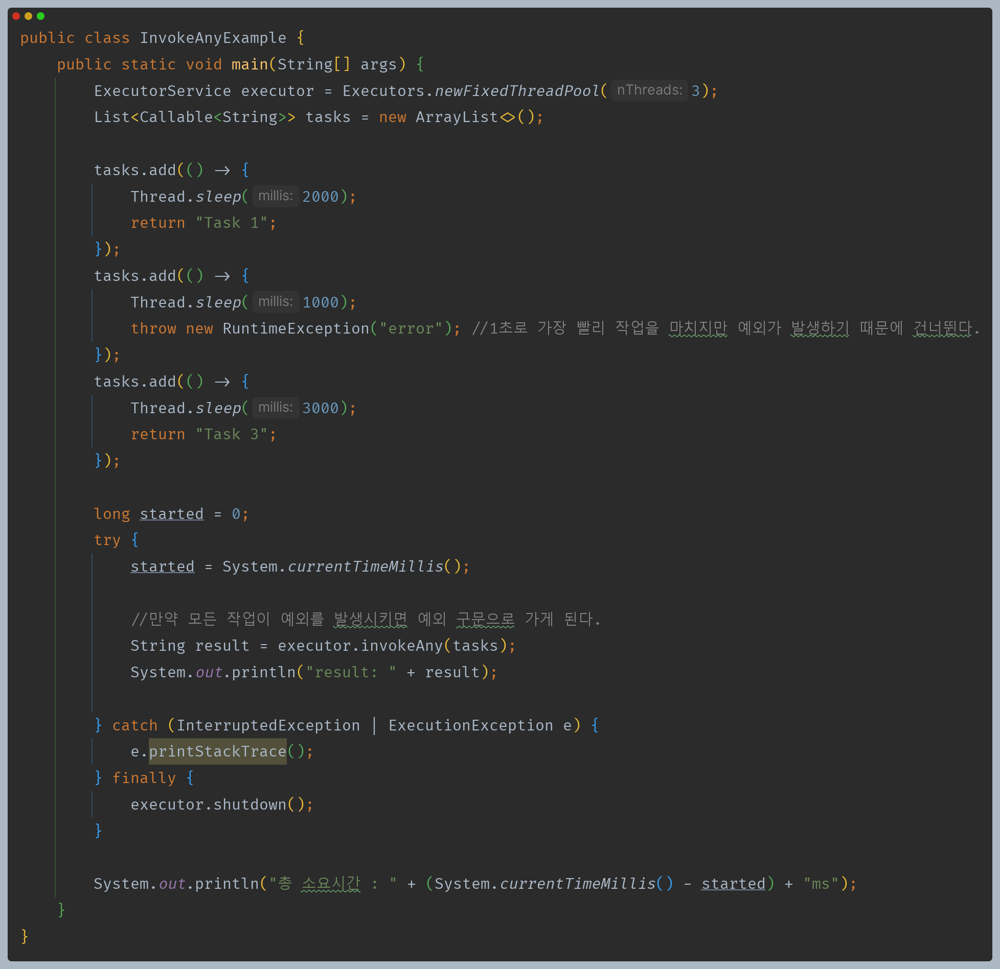

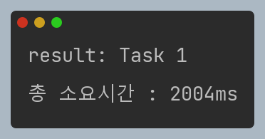

---

[이전 ↩️ - Java 동시성 프레임워크 - Future 구조 및 API]()

[메인 ⏫](https://github.com/genesis12345678/TIL/blob/main/Java/reactive/Main.md)

[다음 ↪️ - Java 동시성 프레임워크 - ScheduledExecutorService]()