# 자바 동시성 프로그래밍 - Java 동시성 프레임워크

## Executors - 고정 크기 스레드 풀 생성

- `Executors`는 `Executor`, `ExecutorService`, `ScheduledExecutorService`, `ThreadFactory` 및 `Callable` 클래스를 위한 유틸리티 팩토리 클래스이다.
- `Executors`는 스레드 풀 및 작업 스케줄링에 대한 다양한 메서드와 팩토리 메서드를 제공하여 복잡한 멀티 스레드 환경에서의 작업을 간단하게 다룰 수 있도록 해준다.

### 생성 메서드

- `ExecutorService` 인터페이스를 구현한 클래스를 생성하고 반환하는 메서드
- `ScheduledExecutorService` 인터페이스를 구현한 클래스를 생성하고 반환하는 메서드
- `ThreadFactory`를 생성하고 반환하는 메서드

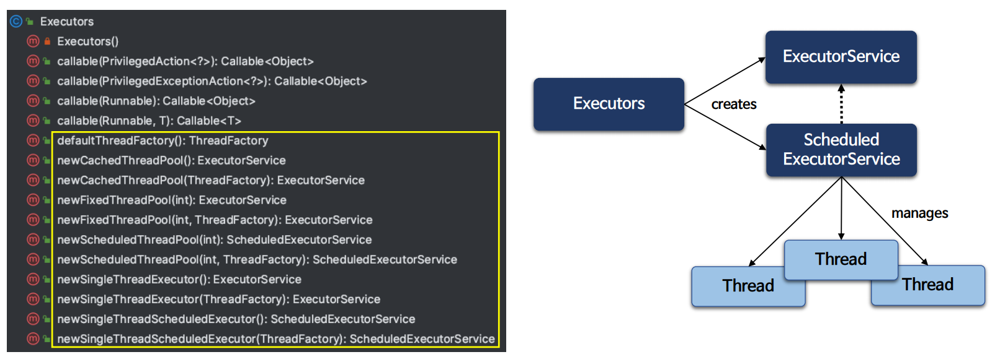

### API

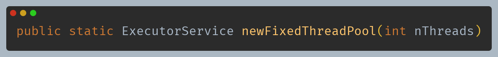

- 메서드의 매개변수로 원하는 스레드 스레드 개수를 지정할 수 있으며 지정한 개수만큼 스레드가 생성되어 작업을 처리하게 된다.
- 스레드 풀은 모든 스레드가 공유하는 대기열을 가지고 있으며 대기열은 무한한 크기의 대기열로 스레드가 가용 상태이면 대기 중인 작업을 처리한다.
- 모든 스레드가 활성 상태이고 작업이 추가적으로 제출되면 스레드가 사용 가능한 상태가 될 때까지 작업들은 대기열에서 대기한다.
- 스레드 풀이 종료하기 전에 어떤 스레드가 실패로 종료하게 되면 필요한 경우 새로운 스레드가 대신하게 된다.
- `nThreads <= 0`이면 `IllegalArgumentException` 예외가 발생한다.

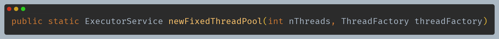

- 위 메서드와 기능은 동일하다.
- 매개변수 `ThreadFactory`를 통해 스레드 생성과 관련된 로직을 정할 수 있다. 즉, 커스텀하게 스레드 생성 방식을 적용하거나, 스레드의 이름,
    우선순위 등을 설정할 수 있다.

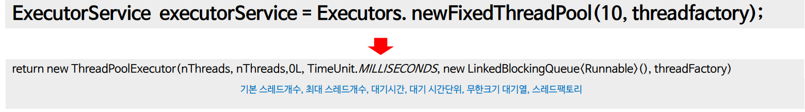

### ThreadFactory

- 스레드 생성과 관련된 세부 사항을 추상화하고 원하는 방식으로 스레드를 커스터마이징 할 수 있도록 도와주는 객체이다.
- `ThreadFactory`를 사용하면 `new Thread()` 호출을 직접 생성하지 않고 스레드 하위 클래스, 우선순위 등을 사용할 수 있게 된다.
- `Executors.defaultThreadFactory()` 메서드는 기본적인 간단한 구현을 제공한다.

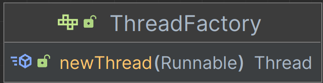

- 새로운 스레드를 생성한다.
- 구현체는 우선순위, 이름, 데몬 상태, 스레드 그룹 등을 초기화 할 수 있다.

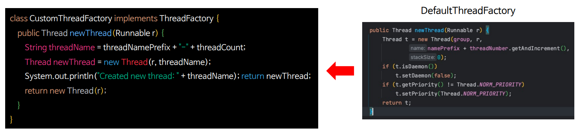

### 예제 코드 1

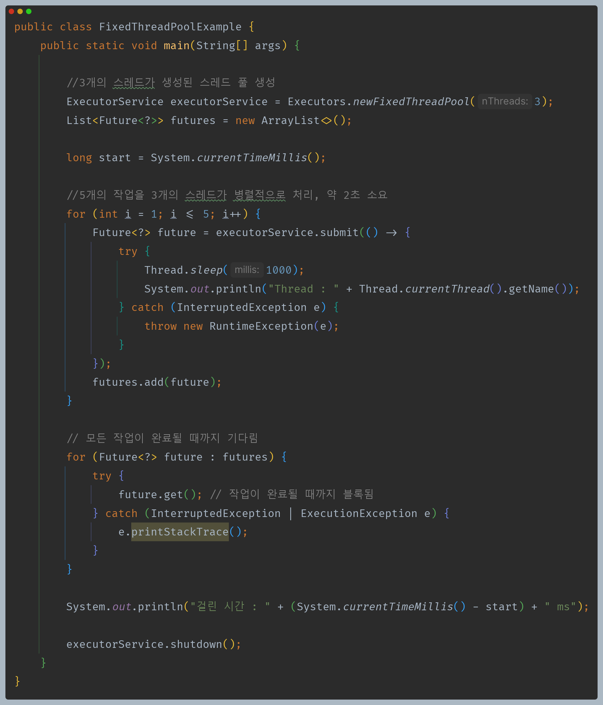

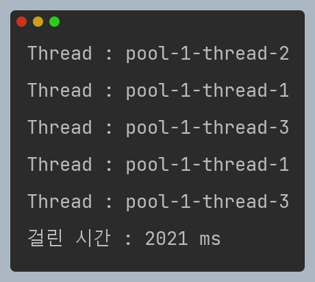

### 예제 코드 2

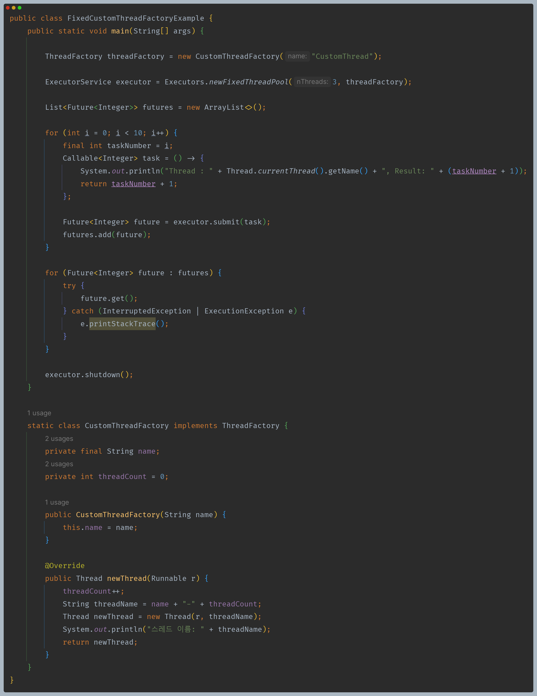

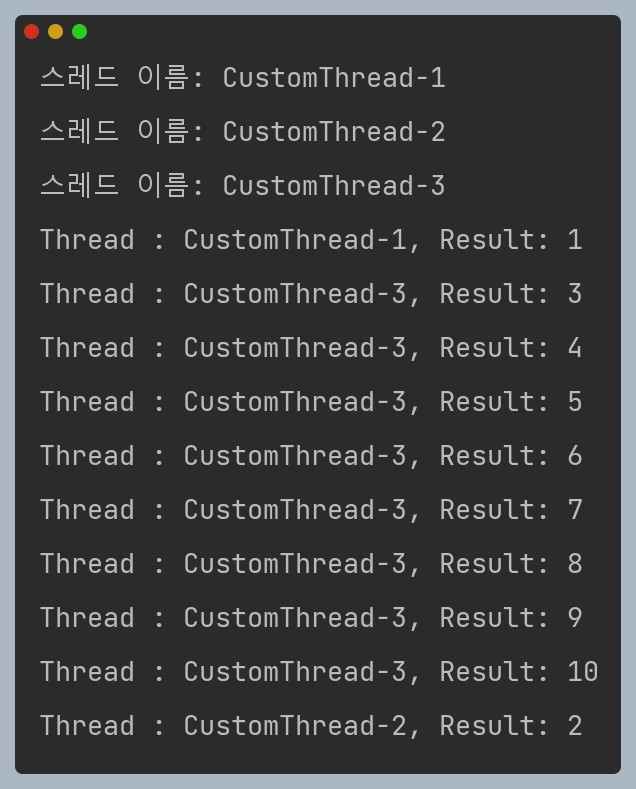

---

## Executors - 유동 및 단일 크기 스레드 풀 생성

### 유동 크기 스레드 풀 생성 API

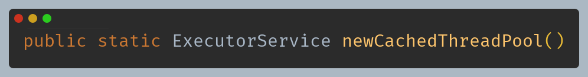

- 작업이 제출되면 현재 사용 가능한 스레드가 있는지 확인하고 없으면 새 스레드를 생성하여 작업을 수행한다.
- 일반적으로 많은 수의 짧은 작업들을 병렬로 실행하면서 처리 성능을 향상시킬 수 있으며 60초 동안 사용되지 않은 스레드는 자동 종료되고 캐시에저 제거된다.
- 작업을 담아놓고 대기시키는 블로킹 큐가 아닌 스레드 간 작업을 주고 받는 동기 큐를 사용하기 때문에 작업이 제출되면 해당 작업이 즉시 실행된다.
- 스레드의 개수를 제한하지 않으며 작업 요청이 많을 때는 스레드 수가 증가하고 작업 요청이 감소하면 유휴 상태의 스레드가 종료되어 스레드 풀의 스레드 개수가 조절된다.

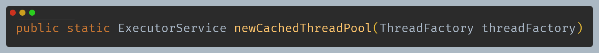

- 위 메서드와 기능은 동일하다.
- 매개변수 `ThreadFactory`를 통해 스레드 생성과 관련된 로직을 정할 수 있다. 즉, 커스텀하게 스레드 생성 방식을 적용하거나, 스레드의 이름,
  우선순위 등을 설정할 수 있다.

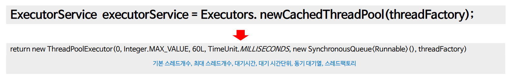

### 단일 크기 스레드 풀 생성 API

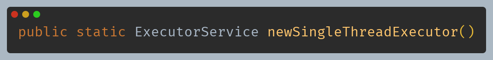

- 단일 스레드를 사용하여 작업을 실행하는 `ExecutorService`이며 작업들이 순차적으로 실행되는 것을 보장한다.
- 한 개의 스레드가 실행 중에 실패로 인해 종료되면 새로운 스레드가 생성되어 실패 이후 후속 작업을 대신 실행한다.
- 작업을 순차적으로 실행해야 하거나 여러 작업 간의 순서를 보장해야 할 때 유용하며 스레드가 한 개이기 때문에 공유 자원 관리에 대한 복잡성이 줄어들 수 있다.
- `newFixedThreadPool(1)`과 동등한 기능을 가지지만 추가 스레드를 사용하기 위해 다시 구성 되지 않는다.

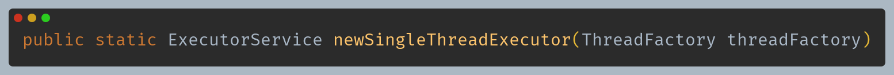

- 위 메서드와 기능은 동일하다.
- 매개변수 `ThreadFactory`를 통해 스레드 생성과 관련된 로직을 정할 수 있다. 즉, 커스텀하게 스레드 생성 방식을 적용하거나, 스레드의 이름,
  우선순위 등을 설정할 수 있다.

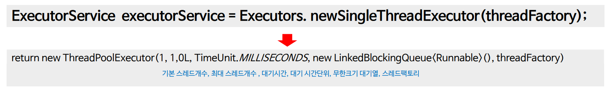

### 예제 코드 1

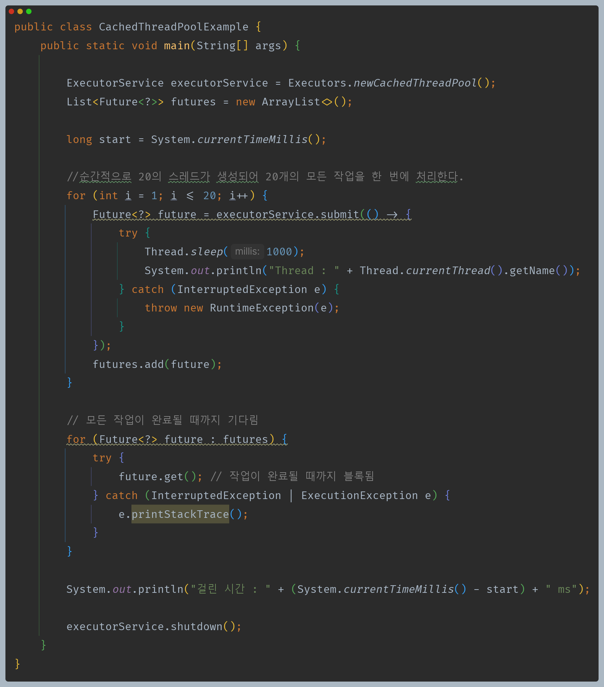

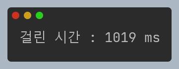

### 예제 코드 2

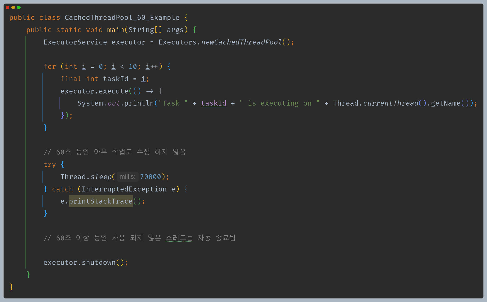

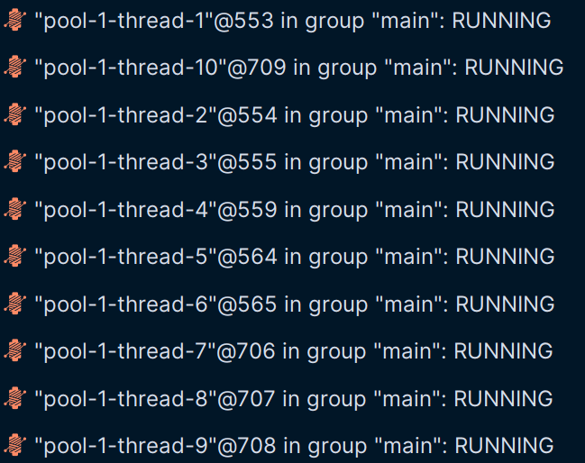

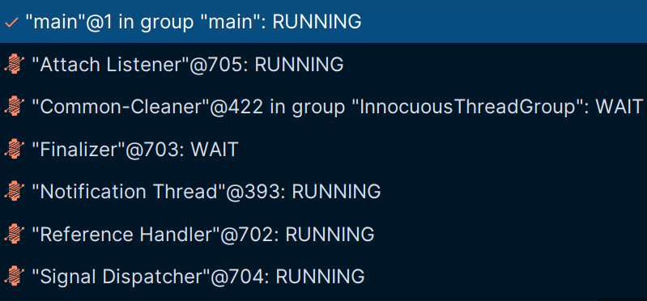

> 60초가 지난 후 사용되지 않은 스레드가 모두 제거되었다.

---

## Executors - 스케줄링 스레드 풀 생성

### 스케줄링 기능을 지원하는 스레드 풀 생성 API

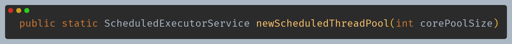

- 주어진 지연 시간 후에 명령을 실행하거나 주기적으로 실행할 수 있는 스레드 풀을 생성한다.
- 한 개의 스레드가 실행 중에 실패로 인해 종료되면 새로운 스레드가 생성되어 실패 이후 후속 작업을 대신 실행한다.
- `corePoolsize < 0`이면 `IllegalArgumentException` 예외가 발생한다.

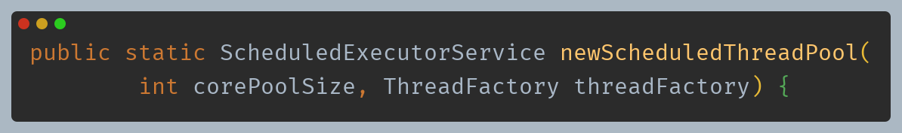

- 위 메서드와 기능은 동일하다.
- 매개변수 `ThreadFactory`를 통해 스레드 생성과 관련된 로직을 정할 수 있다. 즉, 커스텀하게 스레드 생성 방식을 적용하거나, 스레드의 이름,
  우선순위 등을 설정할 수 있다.

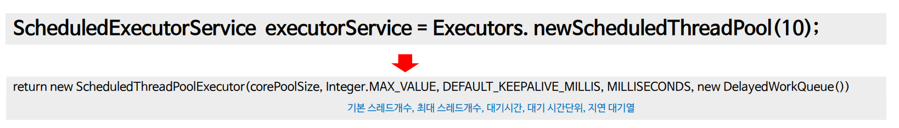

### 단일 스레드 풀 생성 API

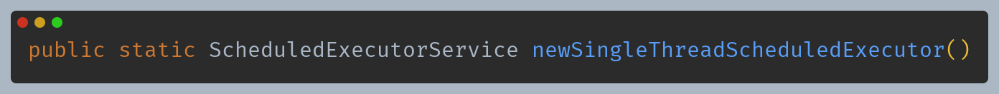

- 주어진 지연 후에 명령을 실행하거나 주기적으로 실행할 수 있는 단일 스레드 풀을 생성한다.
- 한 개의 스레드가 실행 중에 실패로 인해 종료되면 종료 이후에 필요한 경우 새로운 스레드가 생성되어 후속 작업을 실행한다.
- 작업은 순차적으로 실행되며 항상 하나의 작업만 활성화 된다.
- `newScheduledThreadPool(1)`과 동등한 기능을 가지지만 반환된 `ScheduledExecutorService`는 추가 스레드를 사용하도록 재구성 되지 않음이 보장된다.

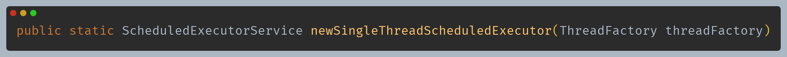

- 위 메서드와 기능은 동일하다.
- 매개변수 `ThreadFactory`를 통해 스레드 생성과 관련된 로직을 정할 수 있다. 즉, 커스텀하게 스레드 생성 방식을 적용하거나, 스레드의 이름,
  우선순위 등을 설정할 수 있다.

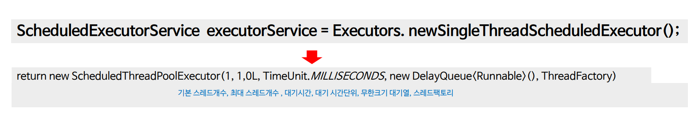

### 예제 코드 1

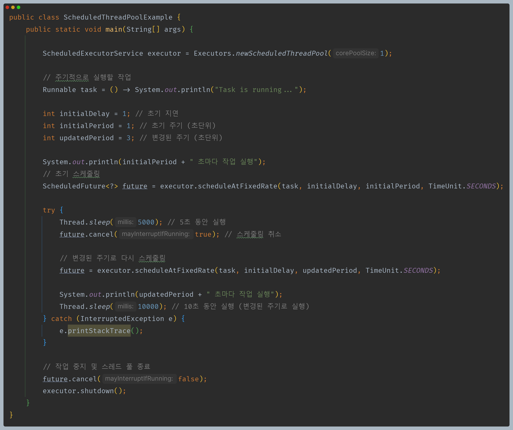

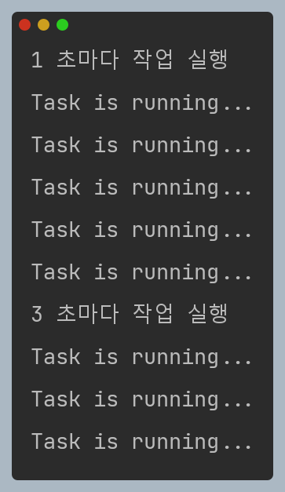

### 예제 코드 2

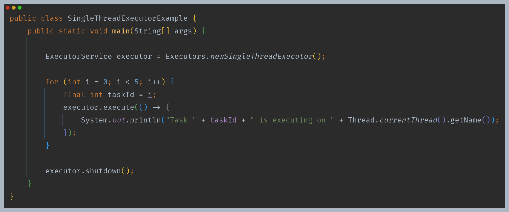

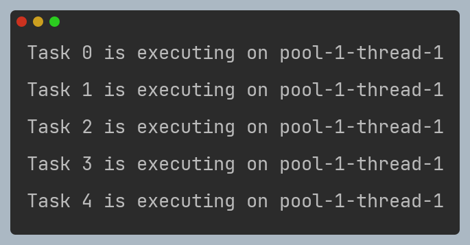

---

[이전 ↩️ - Java 동시성 프레임워크 - ScheduledExecutorService](https://github.com/genesis12345678/TIL/blob/main/Java/reactive/javaFramework/ScheduledExecutorService.md)

[메인 ⏫](https://github.com/genesis12345678/TIL/blob/main/Java/reactive/Main.md)

[다음 ↪️ - ThreadPoolExecutor - corePoolSize & maximumPoolSize](https://github.com/genesis12345678/TIL/blob/main/Java/reactive/ThreadPoolExecutor/corePoolSize.md)