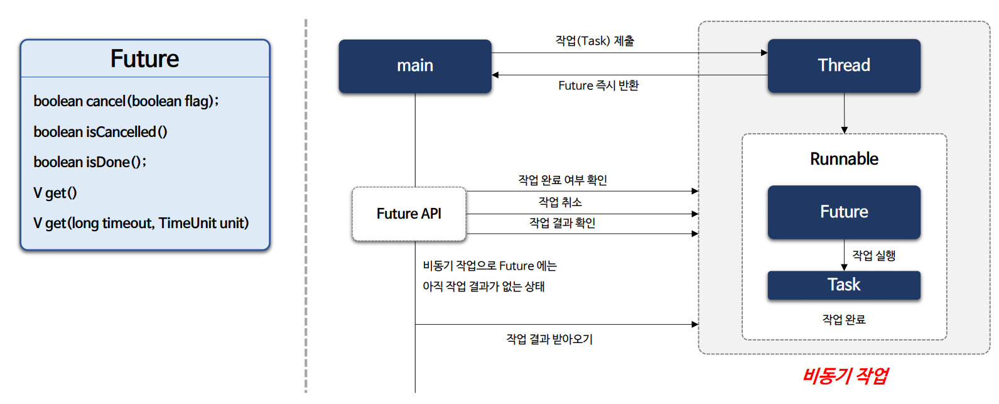
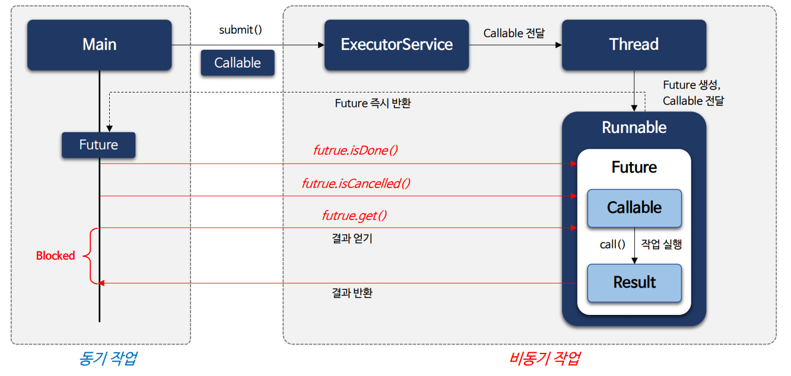
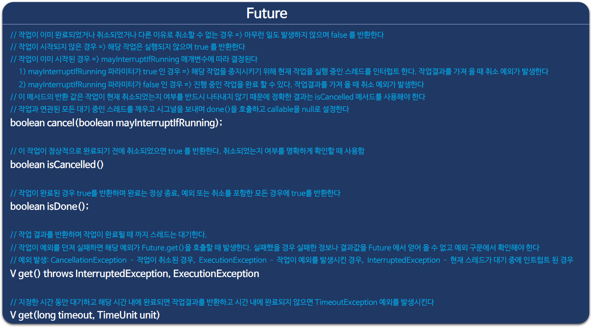
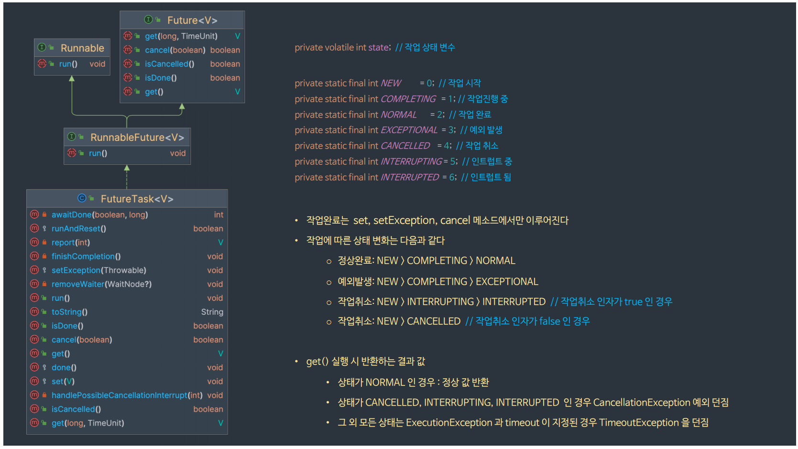
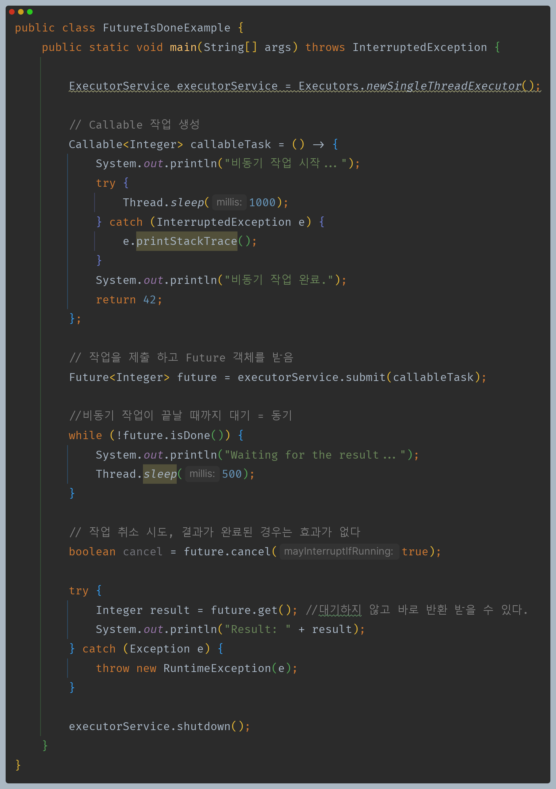
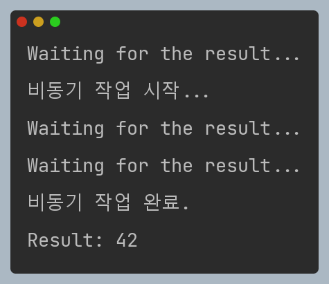
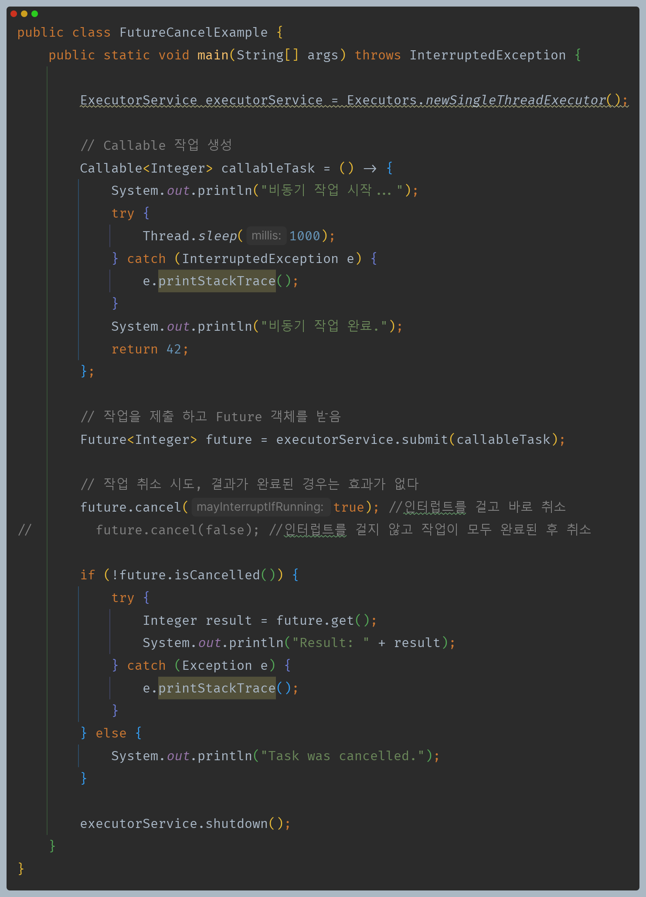
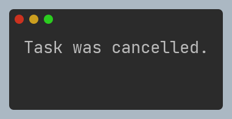
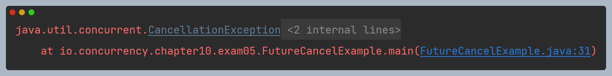

# 자바 동시성 프로그래밍 - Java 동시성 프레임워크

## Future 구조 및 API

- 자바에서 `Future`는 비동기 작업의 결과를 나중에 가져올 수 있도록 도와주는 인터페이스이다.
- `Future`는 **비동기 작업이 완료되었는지** 여부를 확인할 수 있고 조건에 따라 **작업을 취소**할 수 있으며 **작업의 결과**를 얻는 방법을 제공한다.
- `Future`는 작업의 결과를 가져올 때가지 블로킹되며 여러 작업을 조합하는 문제, 예외 처리의 어려움 등이 존재하는데 이런 단점을 보완하기 위해
    자바 8부터는 `CompletableFuture`와 같은 개선된 비동기 도구들이 제공되고 있다.

### Future & Callable

- `Future`와 `Callable`은 자바에서 비동기 작업을 처리하기 위해 서로 관련된 관계를 가진 클래스들이다.
  - `Callable`은 비동기 작업의 실행 내용을 정의하는 인터페이스로서 `call()` 메서드를 구현하여 작업을 정의하고 작업의 결과를 반환한다.
  - `Future`는 `Callable`에서 반환한 비동기 작업의 결과를 가져오기 위한 인터페이스로서 작업이 완료될 때까지 결과를 기다리거나 
    작업이 완료되면 결과를 가져올 수 있다.
- `ExecutorService`의 `submit()` 메서드는 `Callable`을 받아 작업을 실행하고 `Future`를 반환한다.

### Future API

### Future 구조

---

## 작업 취소 흐름도

---

## Future 예제 코드

### get()

- 스레드 풀에 `Callable`을 제출(submit)하면 `FutureTask`의 `callable` 속성에 정의한 `callable`을 저장하고, `state`를 `NEW`로 설정한다.
- 내부적으로 비동기로 작업을 실행하고, 메인 스레드는 계속 다른 작업을 수행할 수 있다.
- `get()`을 호출하면 비동기 작업이 끝날 때까지 메인 스레드는 대기하고 비동기 작업이 끝나면 `FutureTask`는 결과값을 저장하고 `state`를 `NORMAL`로 설정한다.

### isDone()

### cancel()

- 만약 `isCancelled()`로 확인하지 않고 바로 `get()`을 실행하면 `cancel()`의 인자가 `true`든 `false`든 예외가 발생하는 것은 같다.

---

[이전 ↩️ - Java 동시성 프레임워크 - Future & Callback]()

[메인 ⏫](https://github.com/genesis12345678/TIL/blob/main/Java/reactive/Main.md)

[다음 ↪️ - Java 동시성 프레임워크 - ExecutorService API]()