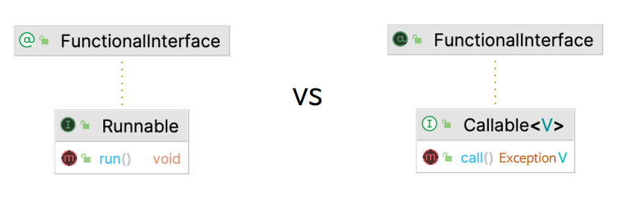
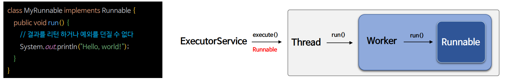
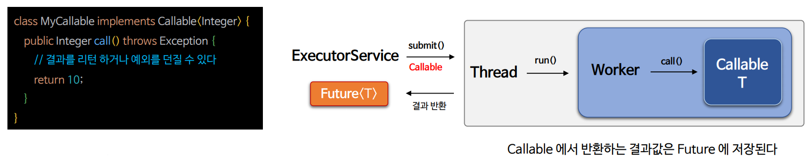
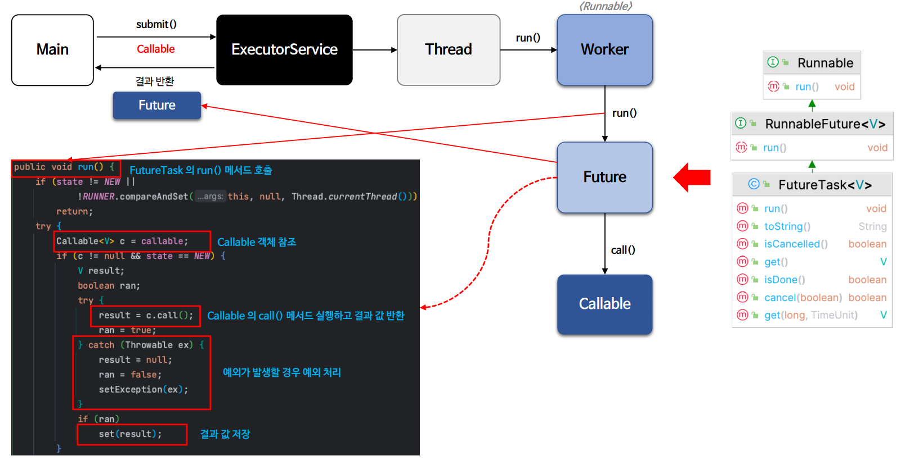
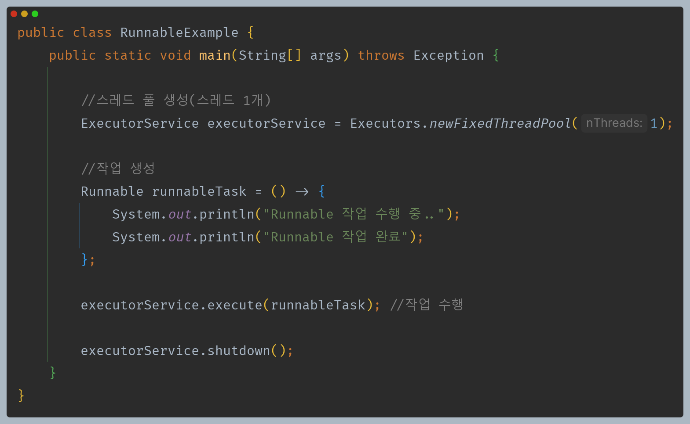
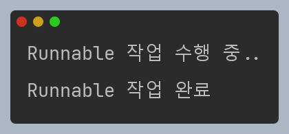
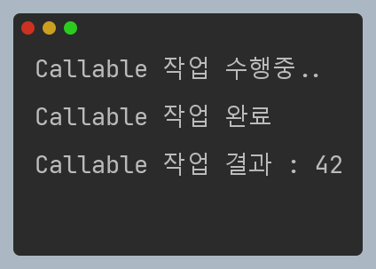

# 자바 동시성 프로그래밍 - Java 동시성 프레임워크

## Runnable & Callable

- `Runnable`과 `Callable`은 모두 별도의 스레드에서 실행할 수 있는 작업을 나타내는 데 사용되는 인터페이스이다.

- 두 인터페이스 사이에는 몇 가지 중요한 차이점이 있다.

| 기능       | `Runnable`                       | `Callable`                                |
|----------|----------------------------------|-------------------------------------------|
| **메서드 시그니처** | `run()` 메서드를 정의하며 인수가 없다.        | `call()` 메서드를 정의하며 인수가 없고 결과와 예외 구문이 있다.  |
| **예외 처리**    | `Checked Exception` 예외를 던질 수 없다. | `Checked Exception` 예외를 던질 수 있다.          |
| **용도**       | 스레드에서 실행할 작업 정의                  | 결과를 반환하며 예외를 처리해야 하는 작업 정의                |
| **결과 반환**    | 작업이 완료되면 결과를 반환하지 않는다.           | 작업이 완료되면 결과를 반환하며 `Future`로 결과를 추적할 수 있다. |

---

## 인터페이스 구현

### Runnable

### Callable

---

## Callalbe & Future

---

## 예제 코드

### Runnable

### Callalbe

---

[이전 ↩️ - Java 동시성 프레임워크 - Executor]()

[메인 ⏫](https://github.com/genesis12345678/TIL/blob/main/Java/reactive/Main.md)

[다음 ↪️ - Java 동시성 프레임워크 - Future & Callback]()