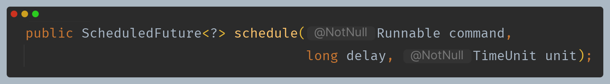
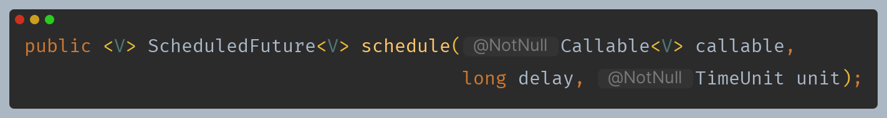
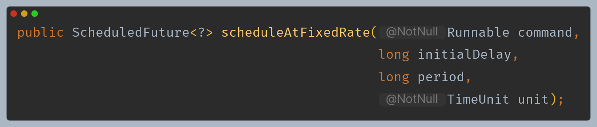
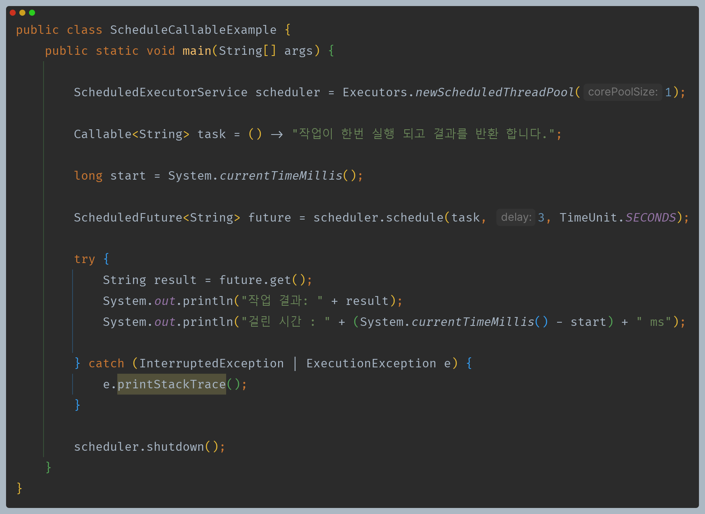
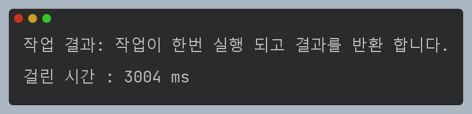
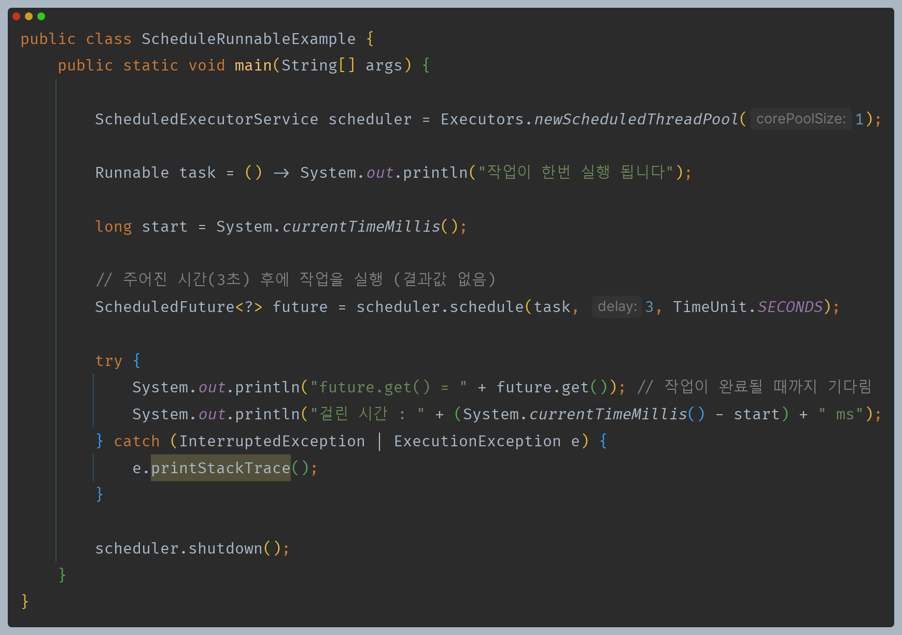
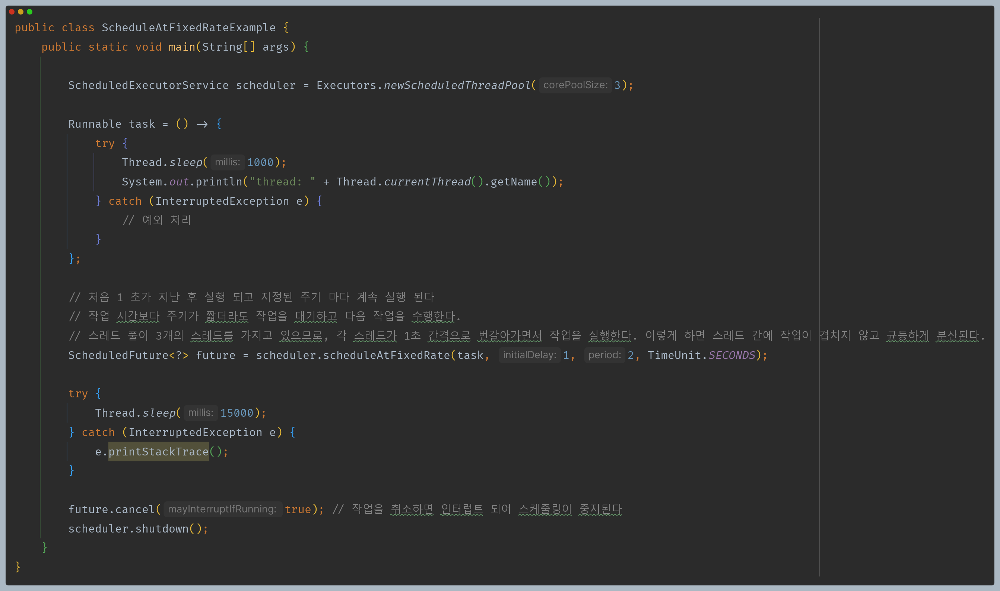
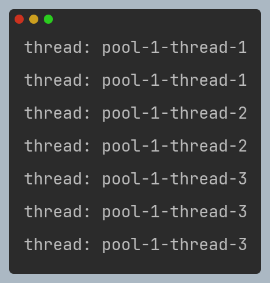
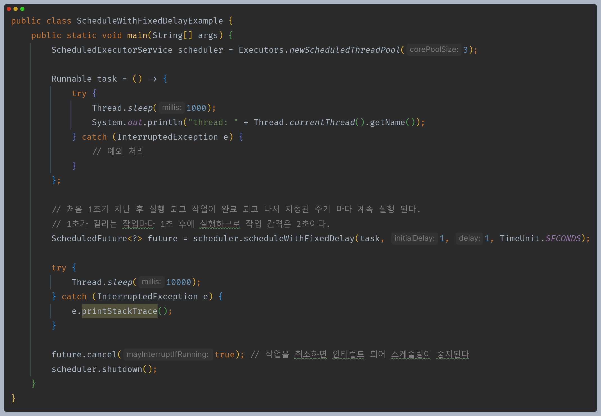
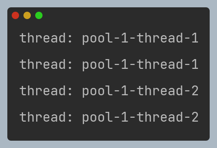

# 자바 동시성 프로그래밍 - Java 동시성 프레임워크

## ScheduledExecutorService

- 주어진 지연 시간 후에 명령을 실행하거나 주기적으로 실행할 수 있는 `ExecutorService` 를 상속한 인터페이스이다.
- 작업의 예약 및 실행을 위한 강력한 기능을 제공하여 시간 기반 작업을 조절하거나 주기적인 작업을 수행하는 데 유용하다.

### API

- 주어진 지연 시간 이후에 `Runnable` 작업을 예약하고 `ScheduledFuture`를 반환한다. 예약된 작업은 한 번만 실행된다.
- `command` : 실행할 작업
- `delay` : 실행을 지연할 시간
- `unit` : 지연 매개변수의 시간 단위
- `ScheduledFuture<?> future = scheduler.schedule(task, 5, TimeUnit.SECONDS);` : 5초 후에 작업을 실행하고 `Future` 반환

- 주어진 지연 시간 이후에 `Callable` 작업을 예약하고 `ScheduledFuture`를 반환한다. 예약된 작업은 한 번만 실행된다.
- `command` : 실행할 작업
- `delay` : 실행을 지연할 시간
- `unit` : 지연 매개변수의 시간 단위
- `ScheduledFuture<?> future = scheduler.schedule(callable, 5, TimeUnit.SECONDS);` : 5초 후에 작업을 실행하고 `Future` 반환

- 초기 지연 시간 이후에 `Runnable` 작업을 주기적으로 실행하도록 예약하고 `ScheduledFuture`를 반환한다. 이후에 주어진 주기로 실행된다.
- `command` : 실행할 작업
- `initialDelay` : 첫 번째 실행을 지연할 시간
- `period` : 연속적인 실행 사이의 주기
- `unit` : `initialDelay`와 `period` 매개변수의 시간 단위
- `scheduler.scheduleAtFixedRate(task, 1, 3, TimeUnit.SECONDS);` : 1초 지연 후 실행하고 이후 3초 주기로 계속 작업 실행

- 초기 지연 시간 이후에 `Runnable` 작업을 주기적으로 실행하도록 예약하고 `ScheduledFuture`를 반환한다. 작업이 완료되고 나서 지연 시간 후 실행된다.
- `command` : 실행할 작업
- `initialDelay` : 첫 번째 실행을 지연할 시간
- `delay` : 연속적인 실행 사이의 지연 시간
- `unit` : `initialDelay`와 `delay` 매개변수의 시간 단위
- `scheduler.scheduleWithFixedDelay(task, 1, 3, TimeUnit.SECONDS);` : 1초 지연 후 실행하고 작업이 완료 되면 3초 지나고 이것을 반복

> 명령어 타입이 `Callable`이 아니기 때문에 결과를 반환 받을 수 없으며 `Future.get()`을 호출하게 되면 대기 상태에 들어가게 된다.

### ScheduledFuture

- `ScheduledFuture`는 `ScheduledExecutorService`를 사용하여 작업을 예약한 결과이다.
- 주요 목적은 지연이나 주기적인 작업 실행을 위한 것이며 결과를 처리하는 것은 아니다.
- `getDelay(TimeUnit unit)` - 작업이 실행 되기까지 남은 지연 시간을 반환한다.

---

## 예제 코드 1 - ScheduleCallable

## 예제 코드 2 - ScheduleRunnable

## 예제 코드 3 - ScheduleAtFixedRate

## 예제 코드 3 - ScheduleWithFixedDelay

---

[이전 ↩️ - Java 동시성 프레임워크 - ExecutorService API](https://github.com/genesis12345678/TIL/blob/main/Java/reactive/javaFramework/ExecutorService.md)

[메인 ⏫](https://github.com/genesis12345678/TIL/blob/main/Java/reactive/Main.md)

[다음 ↪️ - Java 동시성 프레임워크 - Executors](https://github.com/genesis12345678/TIL/blob/main/Java/reactive/javaFramework/Executors.md)