# 자바 동시성 프로그래밍 - Java 동기화 도구

## 단일 연산 변수 (Atomic Variable)

- **단일 연산 변수**는 락을 사용하지 않고도 여러 스레드 간에 안전하게 값을 공유하고 동기화하는 데 사용되며 기본적으로 [volatile](https://github.com/genesis12345678/TIL/blob/main/Java/reactive/synchronization/javaSync/volatile.md)의 속성을 가지고 있다.
- **단일 연산 변수**는 원자적인 연산(`read-modify-write`)을 지원하여 내부적으로 `CAS(Compare and Swap)` 연산을 사용하여 데이터의 일관성과 안전성을 유지한다.
- **단일 연산 변수**는 간단한 연산의 경우 락을 사용하는 것보다 월등히 빠른 성능을 보여 주지만 연산이 복잡하거나 시간이 오래 걸리는 작업은 락을 사용하는 것보다 오버헤드가 커질 수 있다.
- **단일 연산 변수**는 단일 연산에 대해 원자성을 보장하지만 여러 연산을 조합한 복잡한 동작에 대해서는 원자성이 보장되지 않을 수 있으며 강력한 동기화 메커니즘을 고려해야 한다.

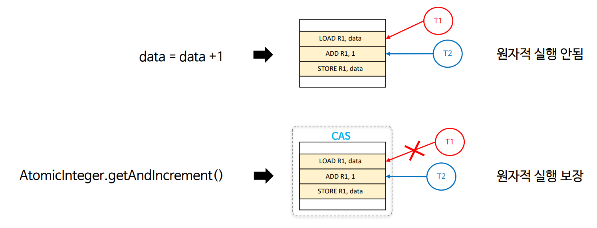

---

## 단일 연산 클래스 (Atomic Class)

- 단일 연산 변수를 사용하기 위한 여러 종류의 단일 연산 클래스가 제공된다.

### 클래스

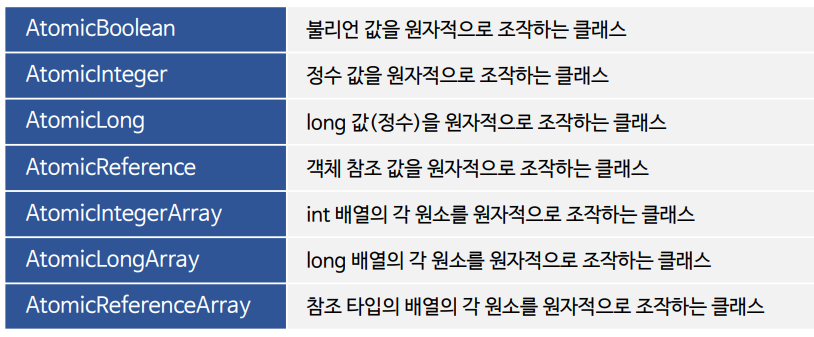

### 공통 API

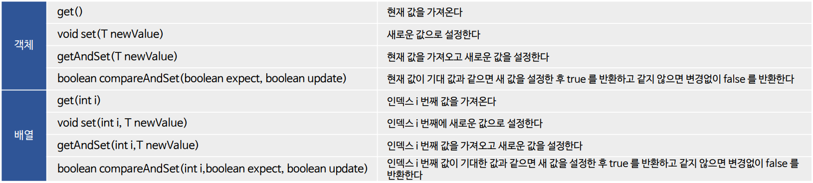

---

## 단일 연산 변수 예제 코드

### 1. AtomicBoolean

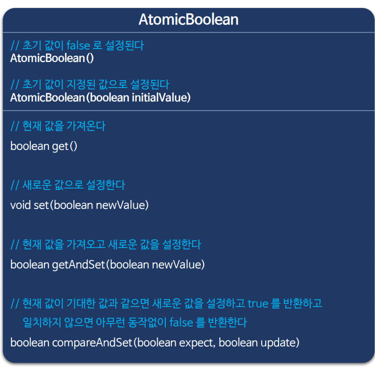

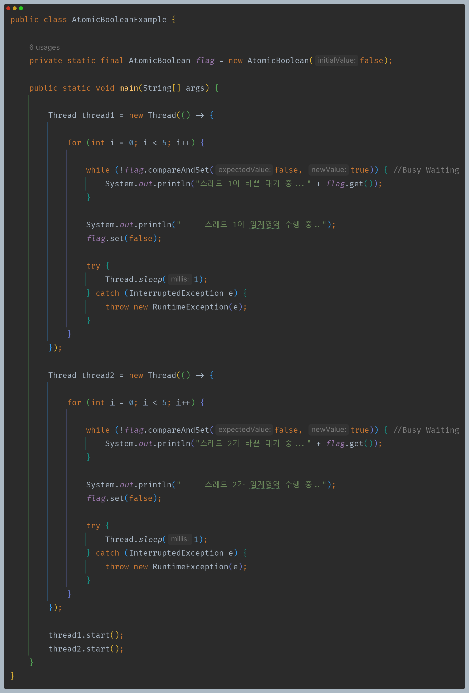

### 2. AtomicInteger

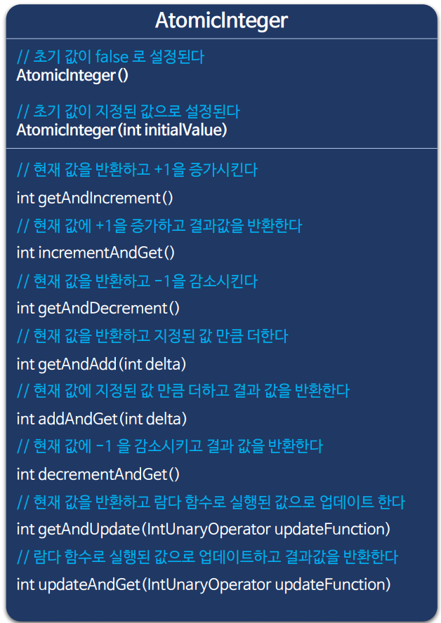

### 2-1. AtomicInteger 동기화 구현

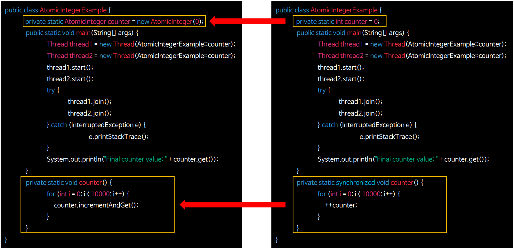

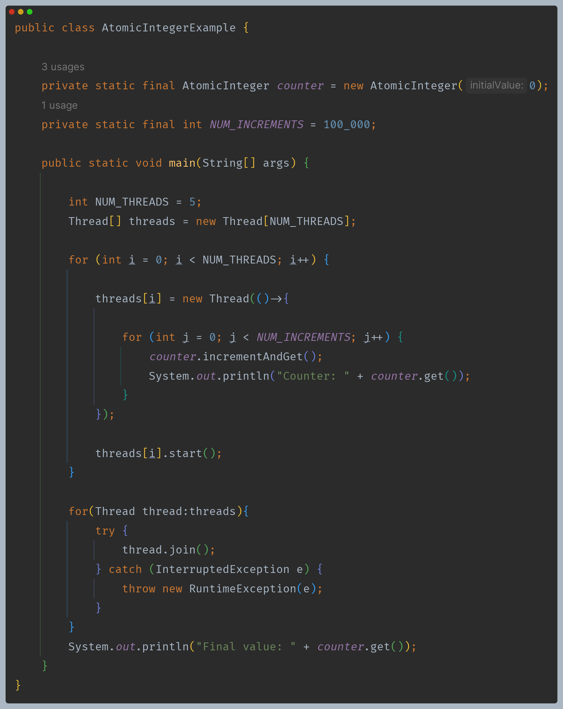

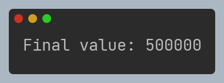

### 2.2 AtomicInteger API

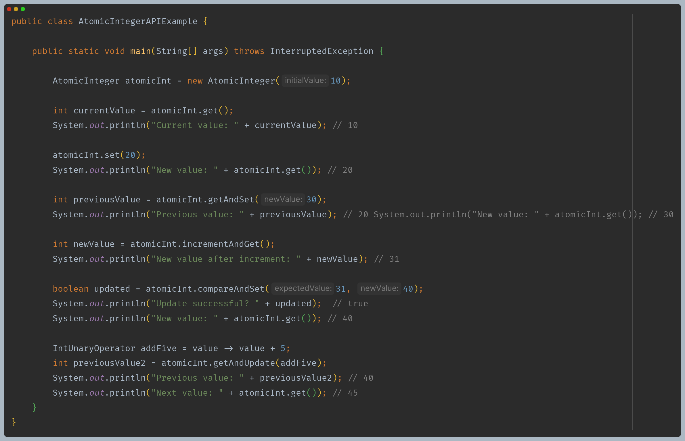

### 3. AtomicReference

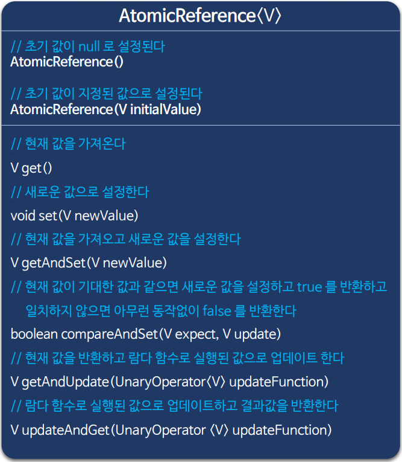

### 3.1 AtomicReference 동기화 구현

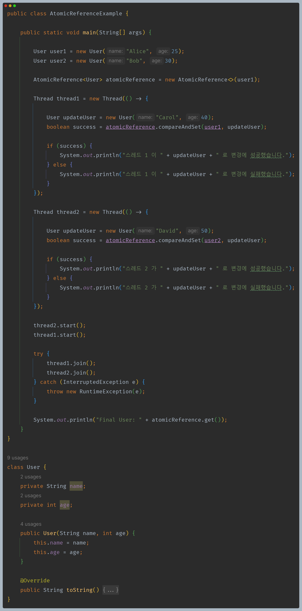

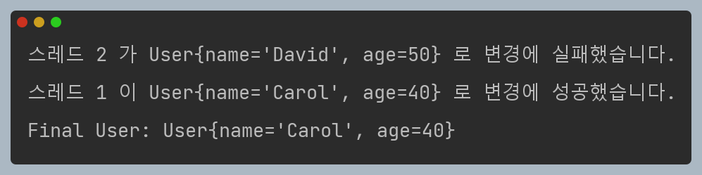

### 3.2 AtomicReference API

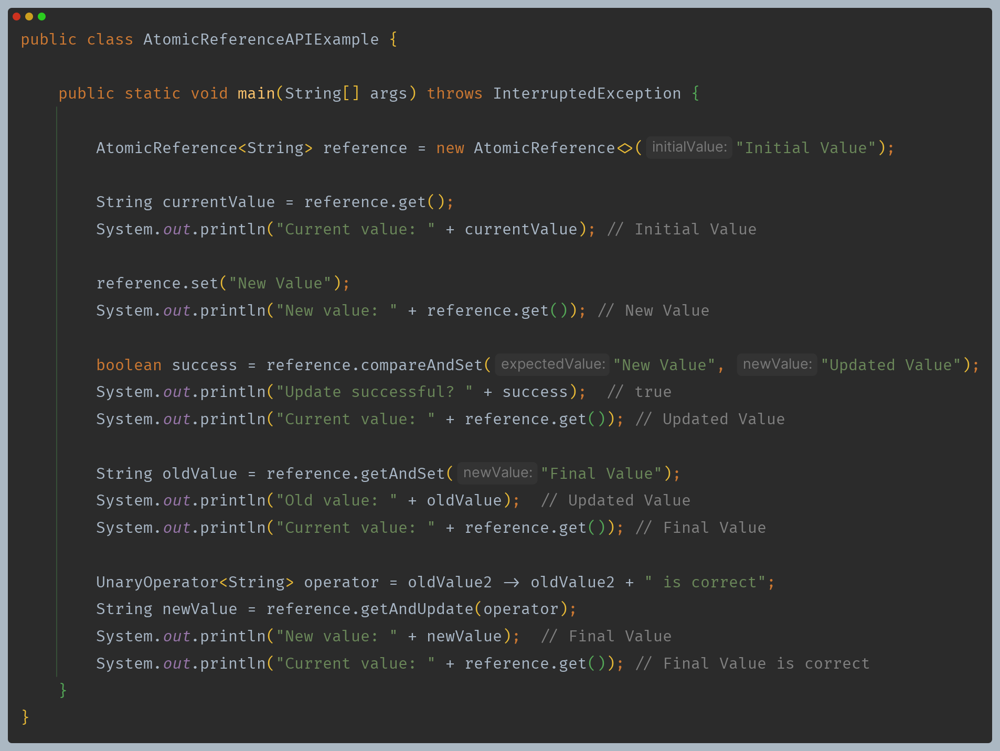

---

[이전 ↩️ - Java 동기화 도구 - CAS(Compare and Swap)]()

[메인 ⏫](https://github.com/genesis12345678/TIL/blob/main/Java/reactive/Main.md)

[다음 ↪️ - Java 동기화 도구 - AtomicFieldUpdater]()