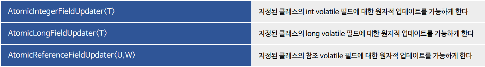
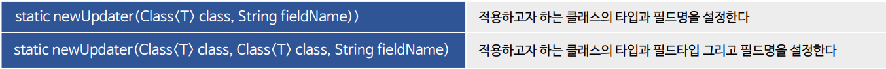
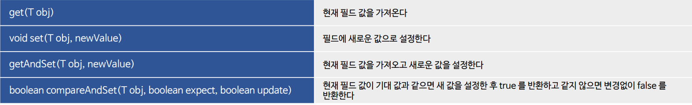
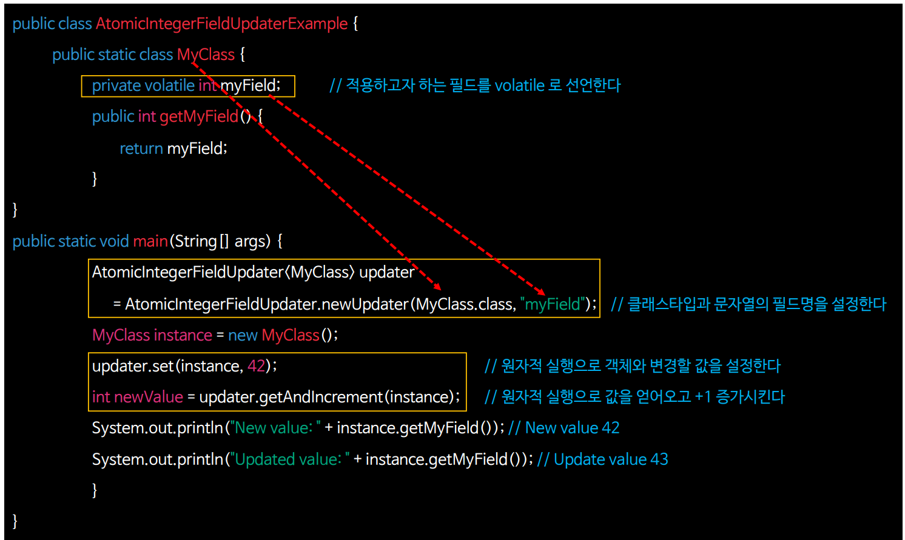
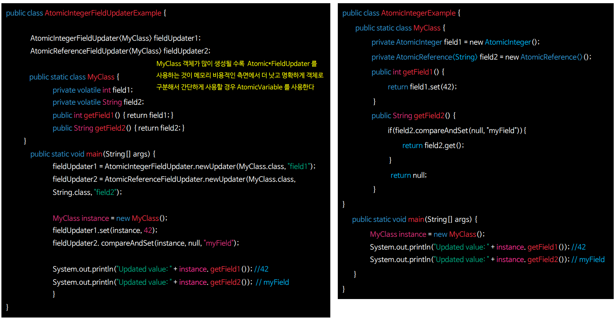
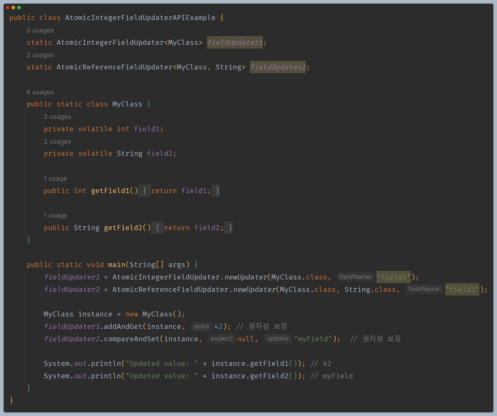
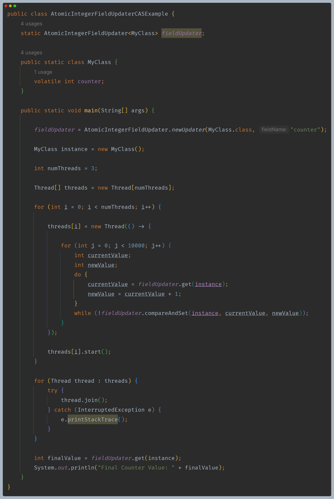
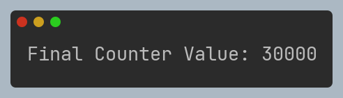
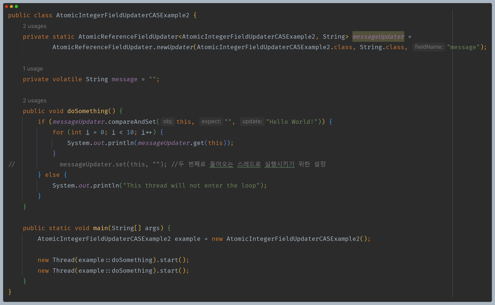
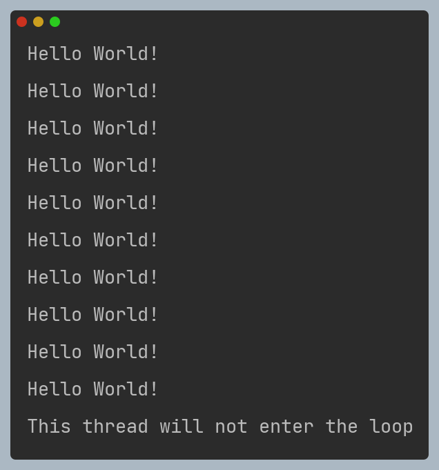

# 자바 동시성 프로그래밍 - Java 동기화 도구

## AtomicFieldUpdater

- 지정된 클래스의 `volatile` 필드에 대한 원자적 업데이트를 가능하게 하는 리플렉션 기반 유틸리티이다.
- 주로 클래스 내부의 필드를 원자적으로 변경하는 경우에 사용된다.

### 클래스

### 생성

### 공통 API

---

## AtomicIntegerFieldUpdater 기본 구현

---

## AtomicFieldUpdater vs AtomicVariable

---

## AtomicFieldUpdater 예제 코드

### 1

### 2

- `AtomicFieldUpdater`는 리플렉션 기반이기 때문에 모든 연산은 인스턴스를 인자로 넘겨주어야 한다.

### 3

- **CAS** 연산으로 두 스레드의 동시 접근을 막을 수 있다.

---

[이전 ↩️ - Java 동기화 도구 - Atomic Variable]()

[메인 ⏫](https://github.com/genesis12345678/TIL/blob/main/Java/reactive/Main.md)

[다음 ↪️ - Java 동기화 도구 - CountDownLatch]()