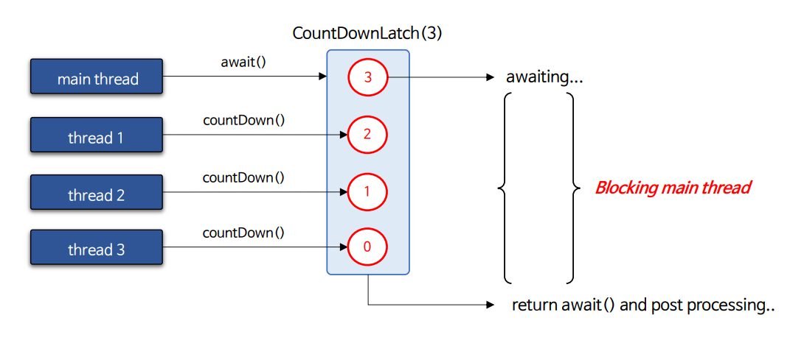
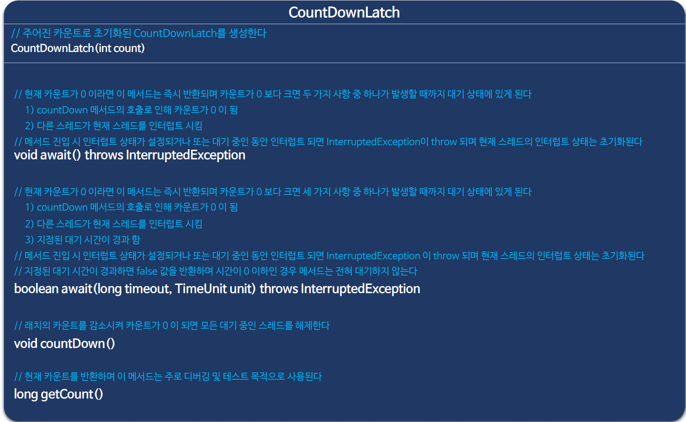
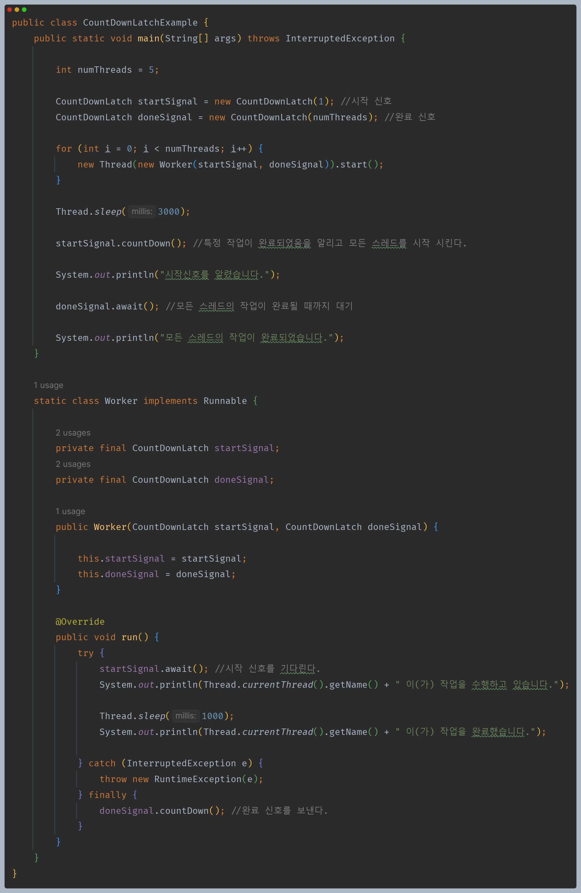
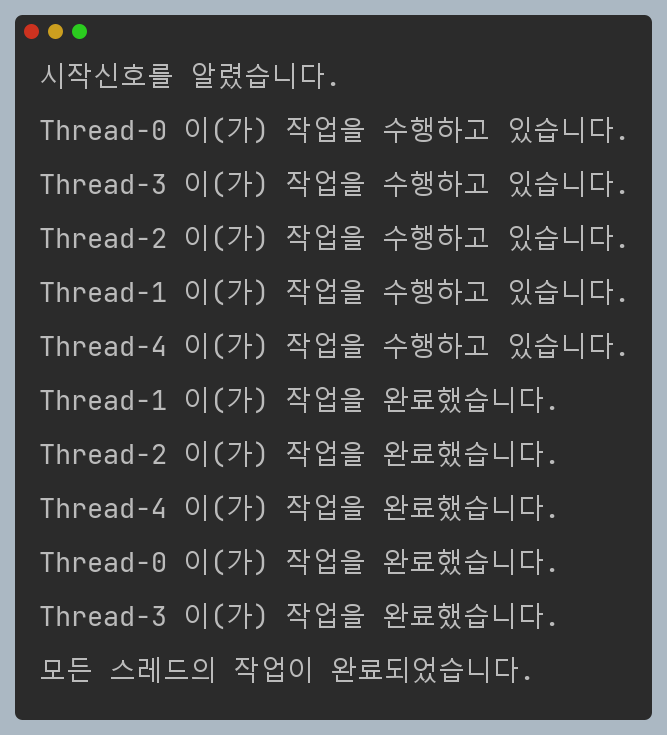

# 자바 동시성 프로그래밍 - Java 동기화 도구

## CountDownLatch

- 하나 이상의 스레드가 다른 스레드에서 수행되는 일련의 작업이 완료될 때까지 기다릴 수 있게 해주는 동기화 보조 도구이다.
- `CountDownLatch` 는 주어진 카운트로 초기화되고 `await()` 메서드는 현재 카운트가 `countDown()` 메서드의 호출로 인해 0이 될 때까지 블록되며
    그 이후에 모든 대기 중인 스레드가 해제되고 `await()` 이후 처리가 이루어진다.
- `CountDownLatch`는 일회성으로 처리된다. 즉, 카운트를 재설정 할 수 없다.(카운트를 재설정하는 버전이 필요한 경우 `CyclicBarrier`를 사용한다.)
- 한 스레드가 여러 번 `countDown()` 을 호출해도 된다.

### 사용 용도

- 여러 개의 스레드가 병렬로 실행되는 경우 특정 작업이 시작되거나 완료될 때까지 다른 스레드들이 기다리도록 할 수 있다.
- 여러 스레드가 초기화 작업을 마칠 때까지 기다렸다가 모든 스레드가 완료되면 마무리 작업을 수행할 수 있다.

### API

---

## CountDownLatch 예제 코드

---

[이전 ↩️ - Java 동기화 도구 - AtomicFieldUpdater]()

[메인 ⏫](https://github.com/genesis12345678/TIL/blob/main/Java/reactive/Main.md)

[다음 ↪️ - Java 동기화 도구 - CyclicBarrier]()