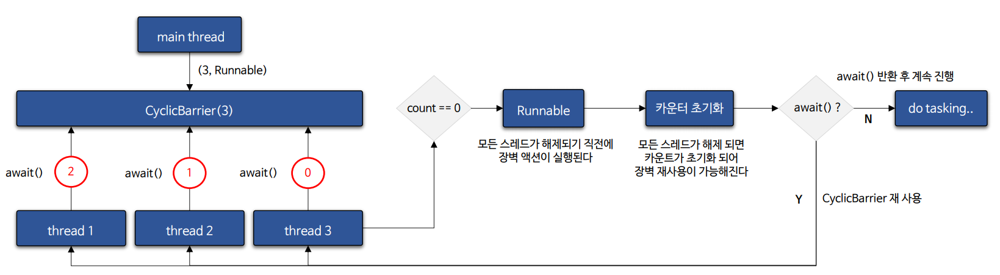
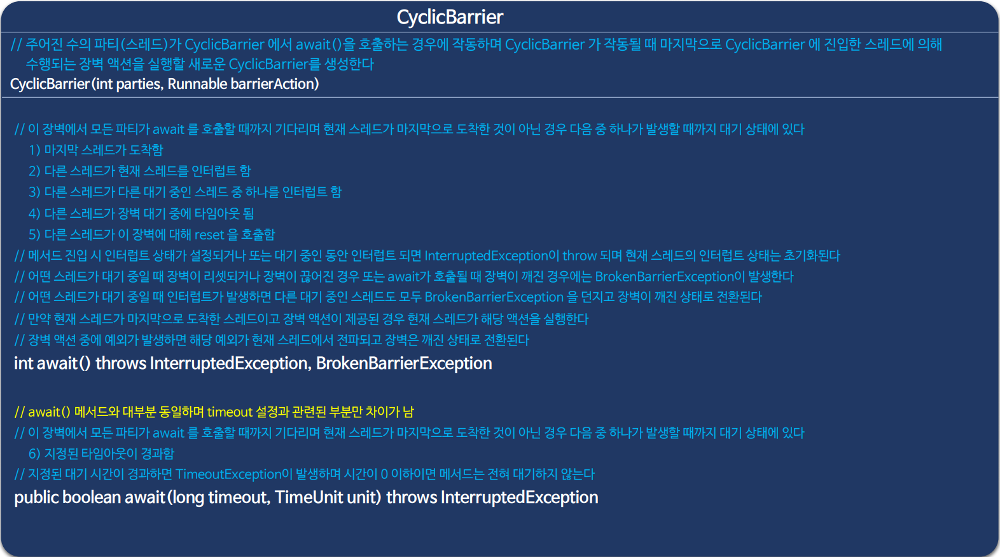
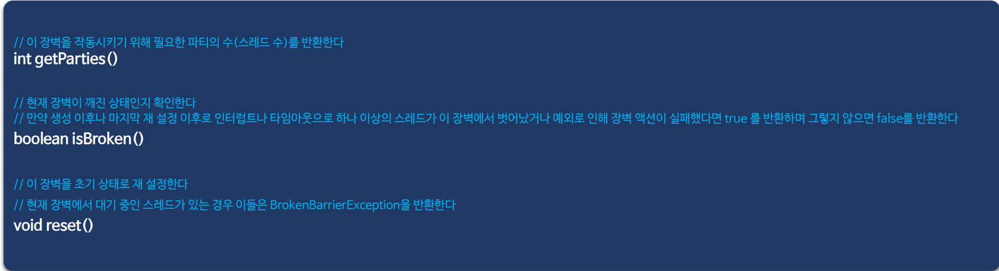
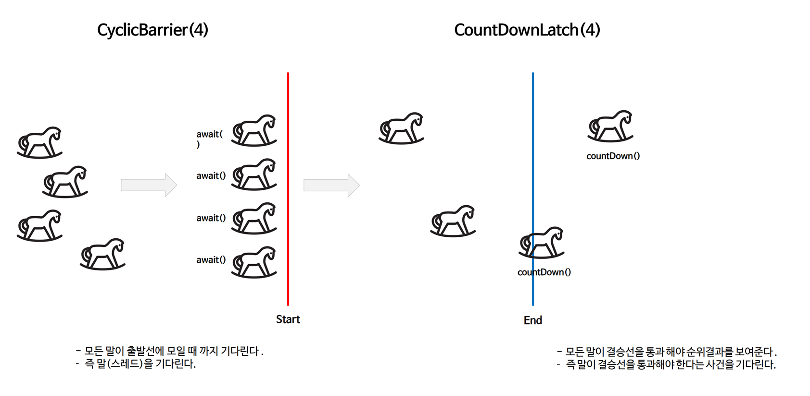
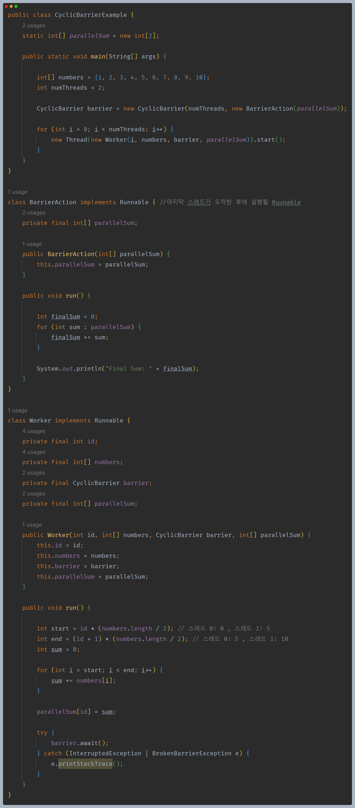
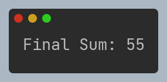

# 자바 동시성 프로그래밍 - Java 동기화 도구

## CyclicBarrier

- `CyclicBarrier`는 공통된 장벽 지점에 도달할 때까지 일련의 스레드가 서로 기다리도록 하는 동기화 보조 도구이다.
- `CyclicBarrier`는 대기 중인 스레드가 해제된 후에 재사용 할 수 있기 때문에 순환 장벽이라고 부른다.
- `CyclicBarrier`는 옵션으로 `Runnable` 명령을 지원하는데 이 명령은 마지막 스레드가 도착한 후에 각 장벽 지점마다 한 번씩 실행되는 장벽 액션(barrierAction) 역할을 수행한다.
- 이 `Runnable`은 스레드가 장벽 이후 실행을 계속하기 전에 공유 상태를 업데이트 하는 데 유용하다.

### 사용 용도

- 여러 스레드가 병렬로 작업을 수행하다가 특정 단계에 도달하거나 모든 스레드가 특정 작업을 완료하고 모이는 지점에서 사용된다. 예를 들어 병렬 계산 작업 중
    중간 결과를 모두 계산한 후에 다음 단계로 진행하기 위해 스레드들이 모이는 경우에 유용하다.
- 고정된 수의 스레드가 동시에 특정 작업을 수행하고 모든 스레드가 작업을 완료하고 모이는 시점에서 다음 단계를 진행할 때 사용된다. 즉, 여러 스레드가 협력하여
    작업을 나누고 동기화하는 데에 적합하다.

### API

### CountDownLatch , CyclicBarrier 비교

---

## CyclicBarrier 예제 코드

- 1 ~ 10까지의 합을 두 개의 스레드가 각각 구역을 나누어 반씩 계산한 후에 마지막 장벽 액션(`BarrierAction`)을 통해 최종 결괏값을 출력한다.
- 이렇게 스레드가 병렬 계산 작업 중 중간 결과를 모두 계산한 후에 다음 단계인 장벽 액션에서 중간 결과를 최종 합산하기 전에 스레드들을 모이게 할 수 있다.

---

[이전 ↩️ - Java 동기화 도구 - CountDownLatch](https://github.com/genesis12345678/TIL/blob/main/Java/reactive/javaSync/CountDownLatch.md)

[메인 ⏫](https://github.com/genesis12345678/TIL/blob/main/Java/reactive/Main.md)

[다음 ↪️ - Java 동기화 도구 - ]()