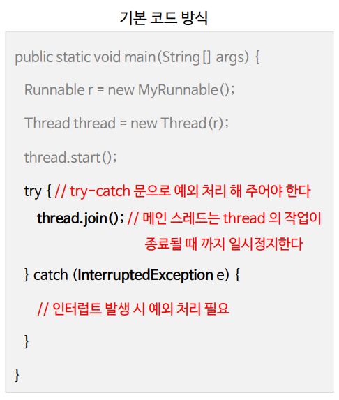
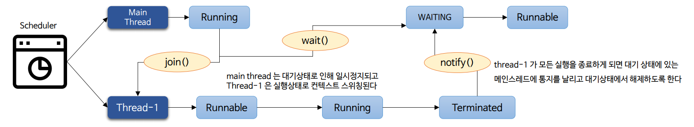
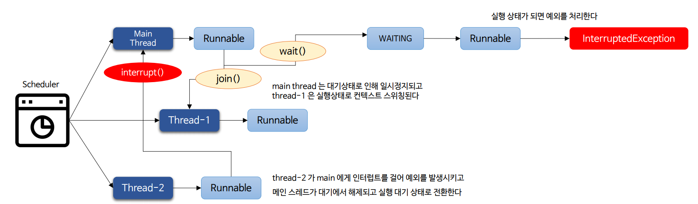
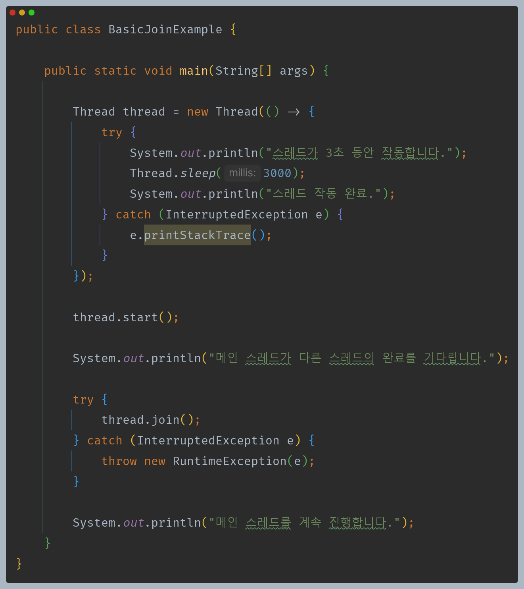
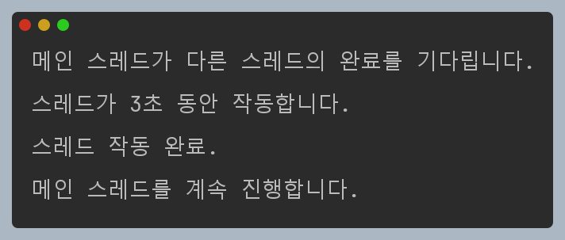
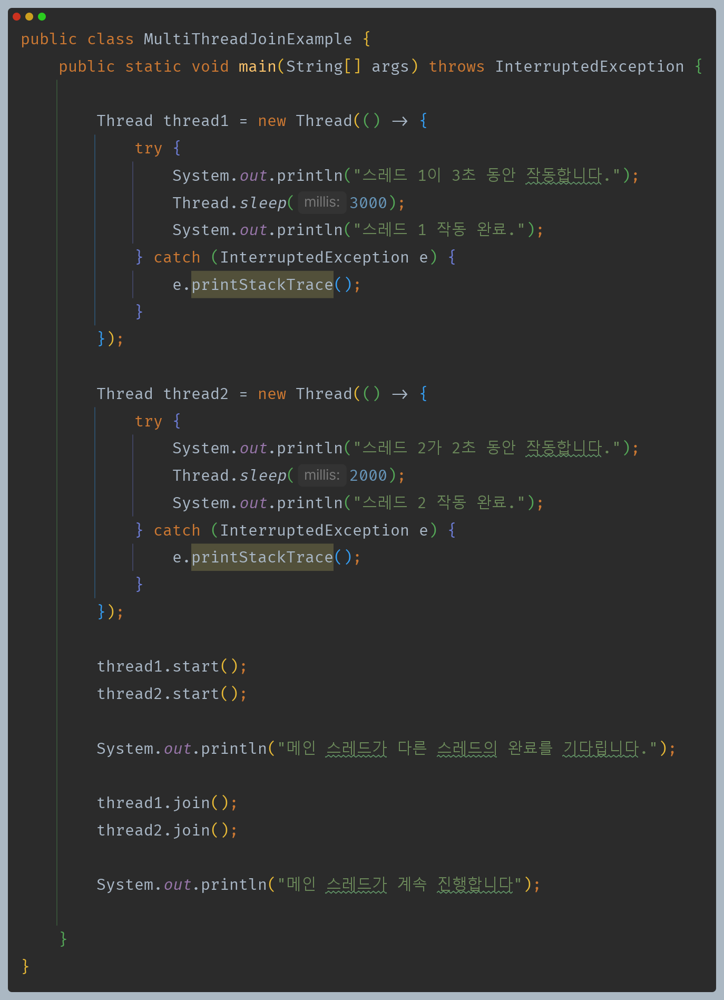
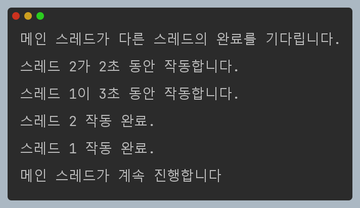
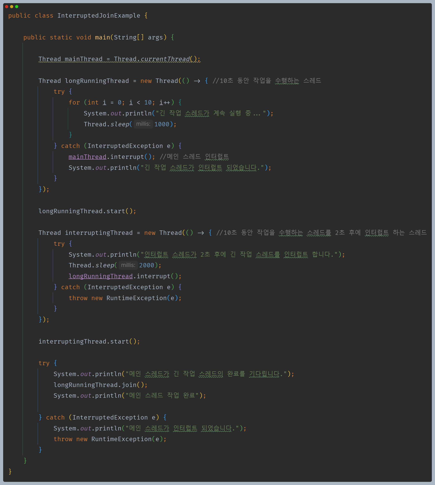
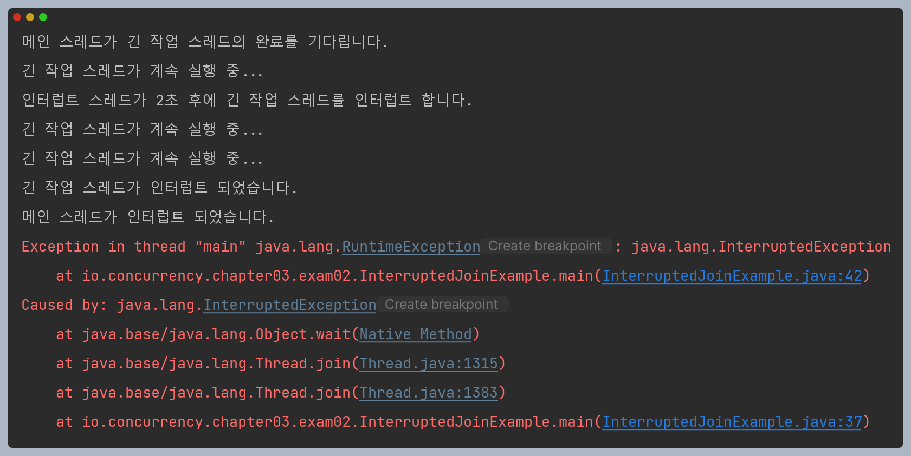

# 자바 동시성 프로그래밍 - Java Thread

## join()

- `join()` 메서드는 한 스레드가 다른 스레드가 종료될 때까지 실행을 중지하고 대기 상태에 들어갔다가 스레드가 종료되면 실행 대기 상태로 전환된다.
- 스레드의 순서를 제어하거나 다른 스레드의 작업을 기다려야 하거나 순차적인 흐름을 구성하고자 할 때 사용할 수 있다.
- `Object` 클래스의 `wait()` 네이티브 메서드로 연결되며 시스템 콜을 통해 커널 모드로 수행한다. 내부적으로 `wait()` & `notify()` 흐름을 가지고 제어한다.

---

## API 및 예외

- `public final void join() throws InterruptedException`
  - 스레드의 작업이 종료될 때까지 대기 상태를 유지한다.
- `public final synchronized void join(final long millis) throws InterruptedException`
  - 지정한 밀리초 시간 동안 스레드의 대기 상태를 유지한다.
  - 밀리초에 대한 인수 값은 음수가 될 수 없으며 음수일 경우 `IllegalArgumentException` 예외가 발생한다.
- `public final synchronized void join(long millis, int nanos) throws InterruptedException`
  - 지정한 밀리초에 나노초를 더한 시간 동안 스레드의 대기 상태를 유지한다.
  - 나노초의 범위는 0 ~ 999,999 이다.
- `InterruptedException`
  - 스레드가 인터럽트 될 경우 `InterruptedException` 예외를 발생시킨다.
  - 다른 스레드는 `join()`을 수행 중인 스레드에게 인터럽트, 즉 중단(멈춤) 신호를 보낼 수 있다.
  - `InterruptedException` 예외가 발생하면 스레드는 대기 상태에서 실행 대기 상태로 전환되어 실행 상태를 기다린다.

---

## join() 작동 방식

### wait() & notify()

### interrupt() 발생

---

## join() 작동 방식 정리

- `join()`을 실행하면 OS 스케줄러는 `join()`을 호출한 스레드를 대기 상태로 전환하고 호출 대상 스레드에게 CPU를 사용하도록 한다.
- 호출 대상 스레드의 작업이 종료되면 `join()`을 호출한 스레드는 실행 대기 상태로 전환되고 CPU가 실행을 재개할 때까지 기다린다.
- `join()`을 호출한 스레드가 실행 대기 상태에서 실행 상태가 되면 그 스레드는 남은 지점부터 실행을 다시 시작한다.
- 호출 대상 스레드가 여러 개일 경우 각 스레드의 작업이 종료될 때까지 `join()`을 호출한 스레드는 대기와 실행을 재개하는 흐름을 반복한다.
- `join()`을 호출한 스레드가 인터럽트 되면 해당 스레드는 대기에서 해제되고 실행 상태로 전환되어 예외를 처리하게 된다.

---

## join() 예제 코드

메인 스레드는 `thread`의 작업이 종료될 때까지 이후 작업을 수행할 수 없다.

멀티 스레드 상황에서도 메인 스레드는 n개의 스레드가 작업을 모두 마칠 때까지 이후 작업을 수행할 수 없다.

---

[이전 ↩️ - Java Thread - `sleep()`]()

[메인 ⏫](https://github.com/genesis12345678/TIL/blob/main/Java/reactive/Main.md)

[다음 ↪️ - Java Thread - `interrupt()` & `interrupted()` & `isInterrupted()`]()