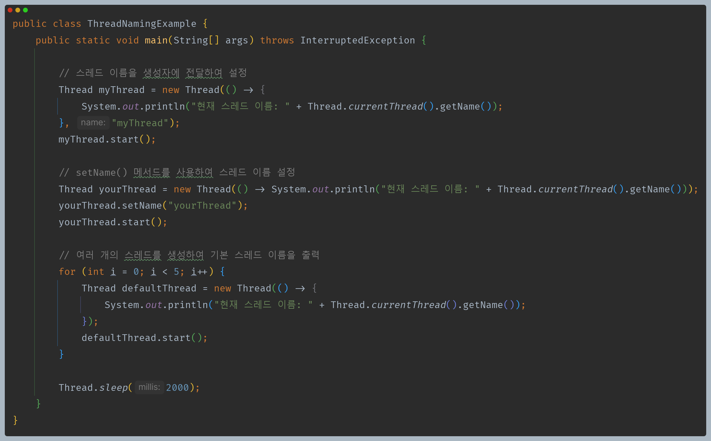
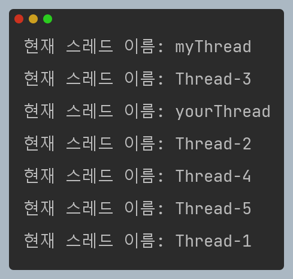
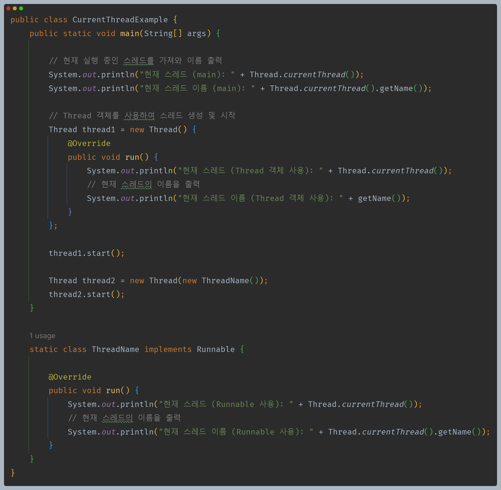
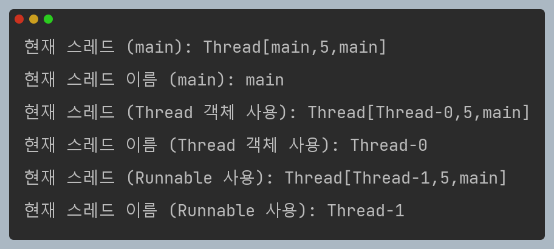
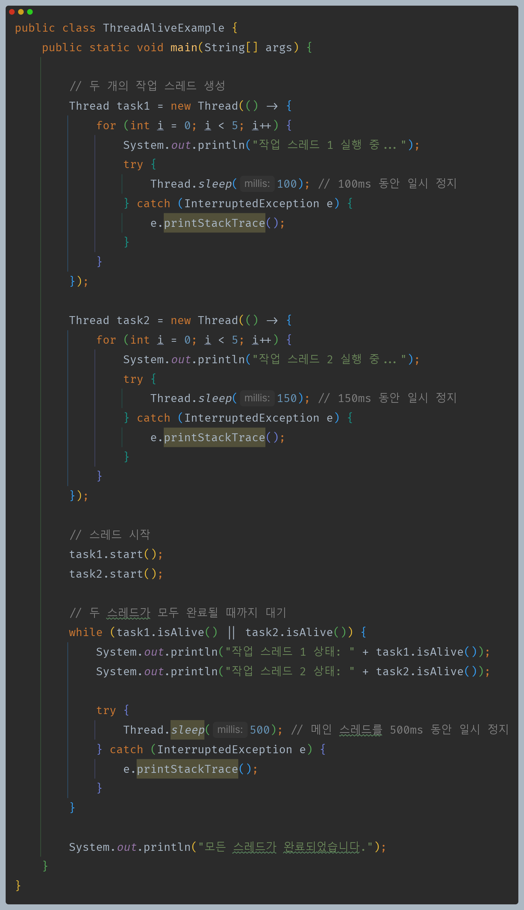
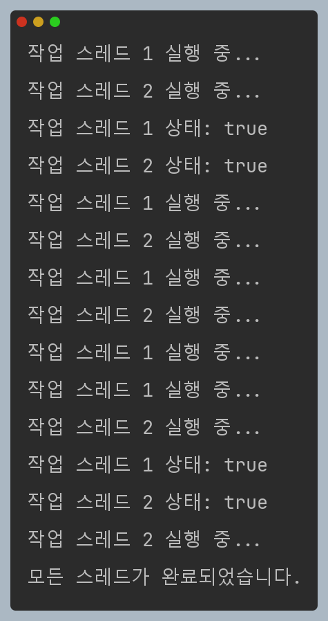

# 자바 동시성 프로그래밍 - Java Thread

## Thread Name

- 멀티 스레드 환경에서 어떤 스레드가 실행 중인지 알아야 할 경우 스레드에 사용자 이름을 지정하면 실행 중인 스레드를 쉽게 찾을 수 있다.
- 디버깅 할 때 어떤 스레드가 무슨 작업을 하고 있는지 정확하게 파악하기 위해서 스레드 이름을 정하는 것은 큰 도움이 된다.
- 자바에서 스레드가 생성되면 스레드 이름이 자동으로 주어진다.
  - 가장 먼저 생성되는 메인 스레드의 이름은 `main` 이다.
  - 스레드 이름은 `Thread-0`, `Thread-1` , ... `Thread-n`과 같이 0부터 순차적으로 숫자를 증가하면서 이름이 만들어진다.
- 자바에서 사용자가 스레드 이름을 정하는 방법은 두 가지를 제공한다.
  - 스레드 객체 생성 시 인자로 전달
    - `Thread myThread = new Thread([ThreadGroup], [Runnalbe], "myThread");`
  - `setName()`으로 설정
    - `myThread.setName("myThread");`
- `getName()`으로 스레드 이름을 참조할 수 있다.
  - `myThread.getName();`

> - 참고로 `setName()`으로 스레드 이름을 직접 명시하면 자동으로 스레드 이름이 만들어질 때는 0번부터 시작되지 않는다.
> - 생성자에 이름을 전달할 때는 0번부터 시작된다.

---

## currentThread()

- `Thread` 클래스의 정적 메서드로, 현재 실행 중인 스레드 객체에 대한 참조를 반환한다.

---

## isAlive()

- 스레드가 살아 있는지 여부를 알 수 있다.
- 스레드의 `start()` 메서드가 호출되고 스레드가 아직 종료되지 않은 경우 스레드가 활성 상태인 것으로 간주되어 `true`를 반환한다.

---

[이전 ↩️ - Java Thread - `interrupt()` & `interrupted()` & `isInterrupted()`]()

[메인 ⏫](https://github.com/genesis12345678/TIL/blob/main/Java/reactive/Main.md)

[다음 ↪️ - Java Thread - Priority]()