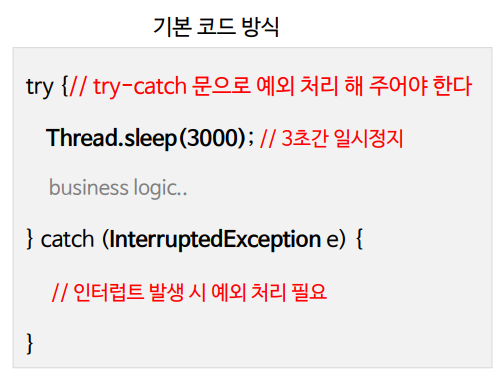
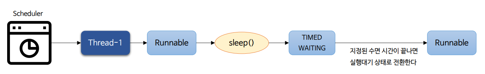
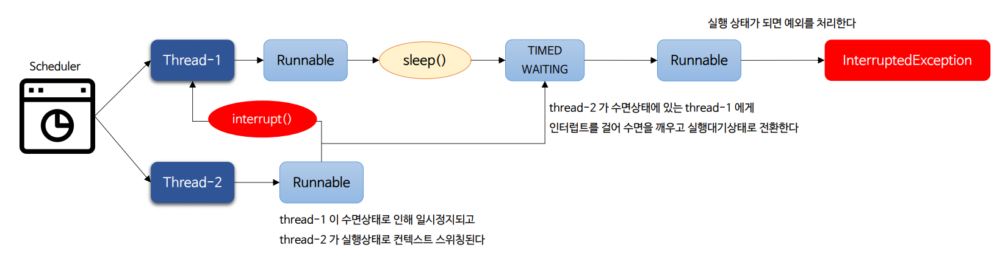
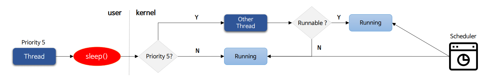
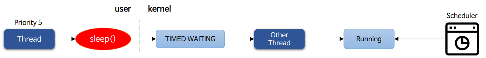
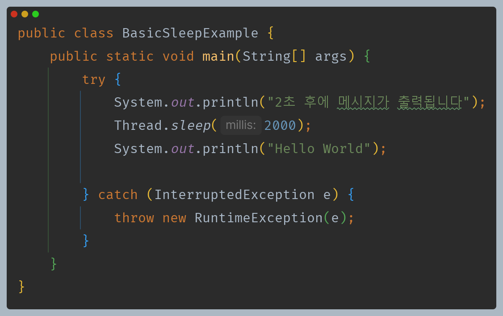
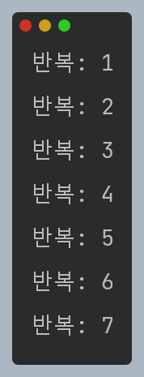
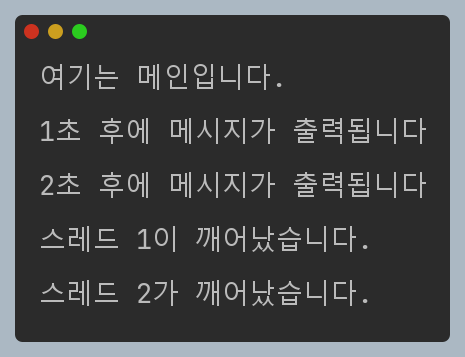
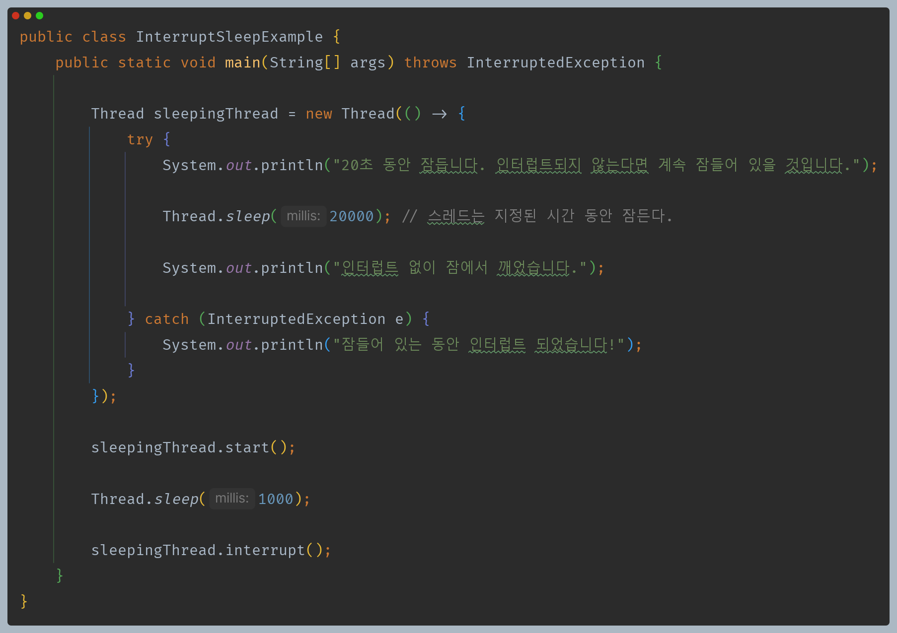

# 자바 동시성 프로그래밍 - Java Thread

# sleep()

- `sleep()` 메서드는 지정된 시간 동안 현재 스레드의 실행을 일시 정지하고 대기 상태로 빠졌다가 시간이 지나면 실행 대기 상태로 전환된다.
- **네이티브 메서드로 연결되며, 시스템 콜을 통해 커널 모드에서 수행 후 유저 모드로 전환한다.**

---

## API 및 예외

- `public static native void sleep(long millis) throws InterruptedException`
  - 지정한 밀리초 시간 동안 스레드를 수면 상태로 만든다.
  - 밀리초에 대한 인수 값은 음수가 될 수 없으며 음수일 경우 `IllegalArgumentException` 예외가 발생한다.
- `public static void sleep(long millis, int nanos) throws InterruptedException`
  - 지정한 밀리초에 나노초를 더한 시간 동안 스레드를 수면 상태로 만든다.
  - 나노초의 범위는 0 ~ 999,999 이다.
- `InterruptedException`
  - 스레드가 수면 중에 인터럽트 될 경우 `InterruptedException` 예외를 발생시킨다.
  - 다른 스레드는 잠자고 있는 스레드에게 인터럽트, 즉 중단(멈춤) 신호를 보낼 수 있다.
  - `InterruptedException` 예외가 발생하면 스레드는 수면 상태에서 깨어나고 실행 대기 상태로 전환되어 실행 상태를 기다린다.

---

## sleep() 작동 방식

**지정된 시간**

**interrupt() 발생**

---

## sleep(0)과 sleep(n)

### sleep(0)

- 스레드가 커널 모드로 전환 후 스케줄러는 현재 스레드와 동일한 우선순위(`Priority`)의 스레드가 있을 경우 실행 대기 상태 스레드에게 CPU를 할당함으로 컨텍스트 스위칭이 발생한다.
- 만약 우선순위가 동일한 실행 대기 상태의 다른 스레드가 없으면 스케줄러는 현재 스레드에게 계속 CPU를 할당해서 컨텍스트 스위칭이 없고 모드 전환만 일어난다.

### sleep(n)

- 스레드가 커널 모드로 전환 후 스케줄러는 조건에 상관없이 현재 스레드를 대기 상태에 두고 다른 스레드에게 CPU를 할당함으로 모든 전환과 함께 컨텍스트 스위칭이 발생한다.

> - `sleep(long millis)` 메서드는 네이티브 메서드이기 때문에 시스템 콜을 호출하게 되어 유저 모드에서 커널 모드로 전환된다.
> - 다른 스레드에게 명확하게 실행을 양보하기 위함이라면 `sleep(0)` 보다는 최소한 `sleep(1)`을 사용하도록 한다.

---

## sleep() 작동 방식 정리

- `sleep()`이 되면 OS 스케줄러는 현재 스레드를 지정된 시간 동안 대기 상태로 전환하고 다른 스레드 혹은 프로세스에게 CPU를 사용하도록 한다.
- 대기 시간이 끝나면 스레드 상태는 바로 실행 상태가 아닌 실행 대기 상태로 전환되고 CPU가 실행을 재개할 때까지 기다린다.
- 실행 상태가 되면 스레드는 남은 지점부터 실행을 다시 시작한다.
- 동기화 메서드 영역에서 수면 중인 스레드는 획득한 모니터나 락을 잃지 않고 계속 유지한다.
- `sleep()` 중인 스레드에게 인터럽트가 발생할 경우 현재 스레드는 대기에서 해제되고 실행 상태로 전환되어 예외를 처리하게 된다.
- 스레드의 수면 시간은 OS 스케줄러 및 시스템 기능에 따라 제한되기 때문에 정확성이 보장되지 않으며 시스템의 부하가 많고 적음에 따라 지정한 수면 시간과 차이가 날 수 있다.

---

## sleep() 예시 코드

> 2초 후에 코드가 실행된다.

> 1초 간격으로 출력한다.

> 멀티 스레드에서 각각의 스레드에게 `sleep()`을 사용한다.

> - 20초 동안 잠드는 스레드에게 1초 후에 인터럽트를 걸었으므로 예외가 발생한다.
> - 인터럽트를 걸지 않았다면 20초 후에 정상 흐름대로 실행하게 된다.

---

[이전 ↩️ - Java Thread - 스레드 생명 주기와 상태](https://github.com/genesis12345678/TIL/blob/main/Java/reactive/javathread/%EC%83%9D%EC%84%B1/state.md)

[메인 ⏫](https://github.com/genesis12345678/TIL/blob/main/Java/reactive/Main.md)

[다음 ↪️ - Java Thread - `join()`](https://github.com/genesis12345678/TIL/blob/main/Java/reactive/javathread/api/join.md)