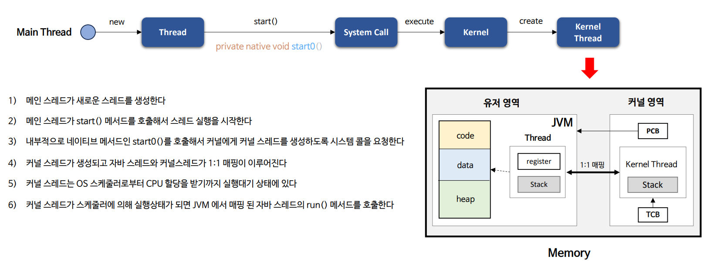
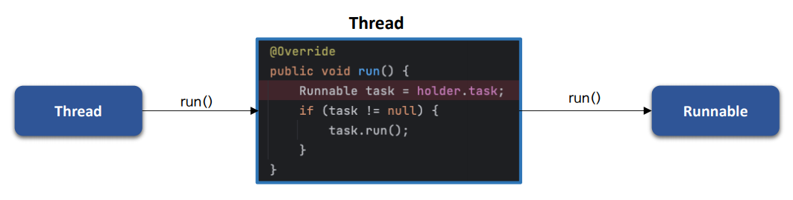
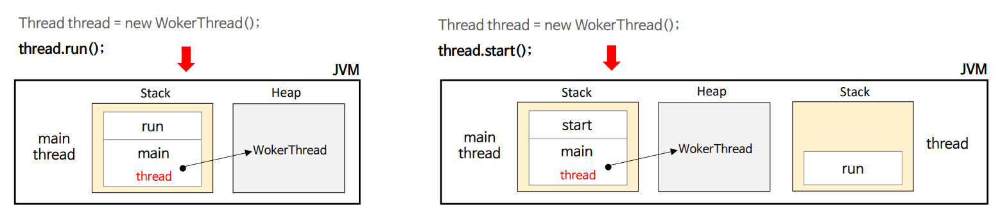
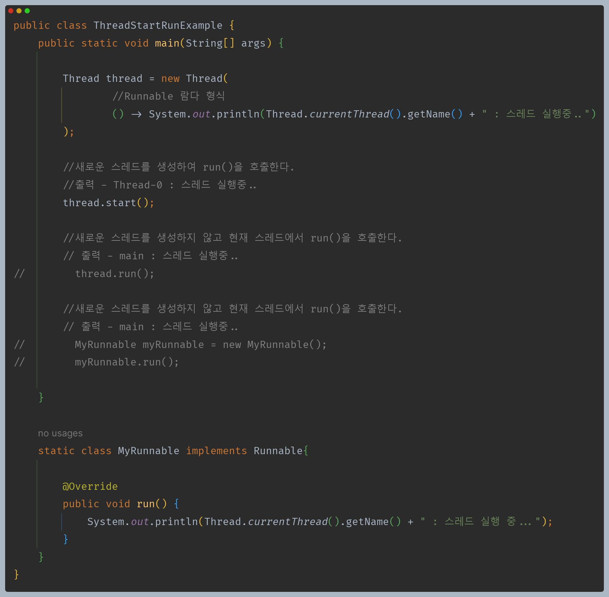
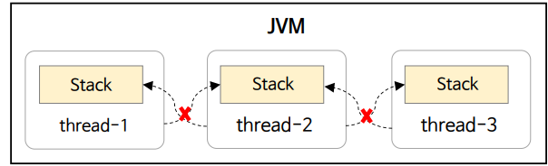
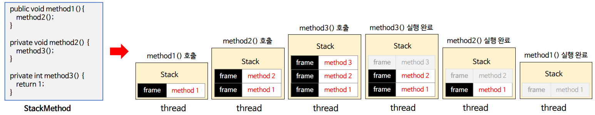
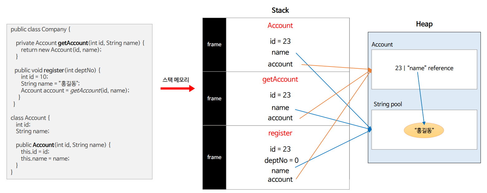
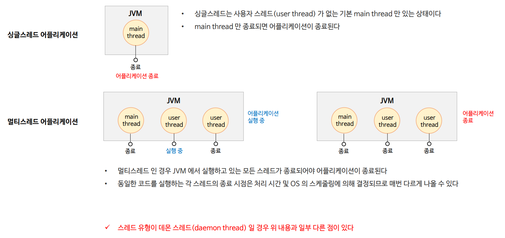

# 자바 동시성 프로그래밍 - Java Thread

- 자바 스레드는 OS 스케줄러에 의해 실행 순서가 결졍되며 스레드 실행 시점을 JVM에서 제어할 수 없다.
- 새로운 스레드는 현재 스레드와 독립적으로 실행되며 최대 한번 시작할 수 있고, 스레드가 종료된 후에는 다시 시작할 수 없다.

# 스레드 실행

-  **`start()` - 스레드를 실행시키는 메서드로, 시스템 콜을 통해서 커널에 커널 스레드 생성을 요청한다.**

- **`run()`**
  - **스레드가 실행이 되면 해당 스레드에 의해 자동으로 호출되는 메서드이다.**
  - `Thread`의 `run()`이 자동 호출되고, 여기서 `Runnable` 구현체가 존재할 경우 `Runnable`의 `run()`을 실행하게 된다.
  - `public static void main(String[] args)`이 메인 스레드에 의해 자동으로 호출되는 것과 비슷한 원리이다.

**주의할 점은 만약 `start()`가 아닌 `run()` 메서드를 직접 호출하면 새로운 스레드가 생성되지 않고, 직접 호출한 스레드의 실행 스택에서 `run()`이 실행될 뿐이다.**

---

# 스레드 스택

- 스레드가 생성되면 해당 스레드를 위한 스택(`stack`)이 같이 만들어진다.
- 스택은 각 스레드마다 독립적으로 할당되어 작동하기 때문에 스레드 간 접근하거나 공유할 수 없고, 이는 **스레드로부터 안전하다** 할 수 있다.
- 스택은 OS에 따라 크기가 주어지고 주어진 크기를 넘게 되면 `java.lang.StackOverFlowError`가 발생하게 된다.

### 스택의 구성 정보

- 스택에 대한 메모리 접근은 후입선출 순서로 이루어지며, 스택은 프레임(`Frame`)으로 구성되어 있다.
- 프레임은 새 메서드를 호출할 때마다 로컬 변수(지역 변수, 파라미터) 및 객체 참조 변수와 함께 스택의 맨 위에 생성(`push`)되고, 메서드 실행이 완료되면
    해당 스택 프레임이 제거(`pop`)되고 흐름이 호출한 메서드로 돌아가며 공간이 다음 메서드에 사용 가능해진다.

### 스택 메모리 상태 관리

- 스택 내부의 변수는 변수를 생성한 메서드가 실행되는 동안에만 존재한다.
- 스택 메모리에 대한 액세스는 Heap 메모리와 비교할 때 빠르다.

---

# 스레드 종료

- 스레드는 `run()` 메서드의 코드가 모두 실행되면 자동으로 종료한다.
- 스레드는 예외가 발생할 경우 종료되며 다른 스레드에 영향을 미치지 않는다.
- 애플리케이션에서 싱글 스레드인 경우와 멀티 스레드인 경우 종료 기준이 다르다.

---

[이전 ↩️ - Java Thread - 스레드 생성](https://github.com/genesis12345678/TIL/blob/main/Java/reactive/javathread/%EC%83%9D%EC%84%B1/%EC%8A%A4%EB%A0%88%EB%93%9C%EC%83%9D%EC%84%B1.md)

[메인 ⏫](https://github.com/genesis12345678/TIL/blob/main/Java/reactive/Main.md)

[다음 ↪️ - Java Thread - 스레드 생명주기와 상태](https://github.com/genesis12345678/TIL/blob/main/Java/reactive/javathread/%EC%83%9D%EC%84%B1/state.md)