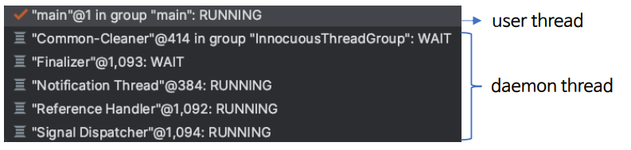
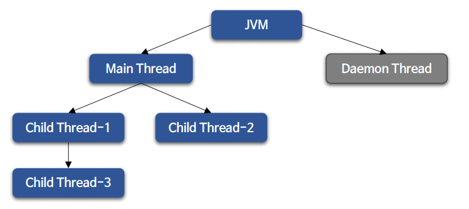
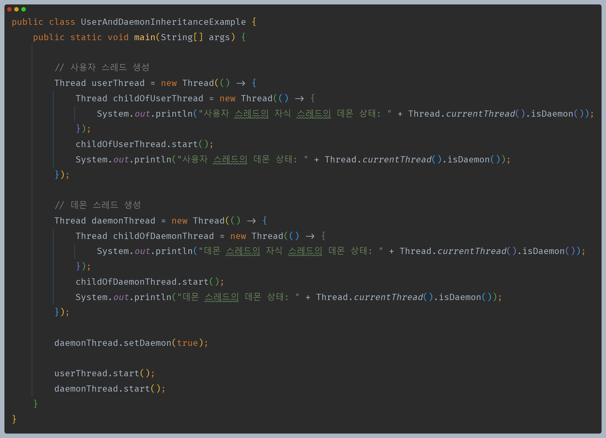
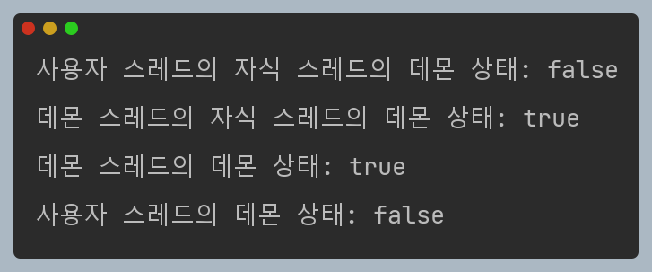
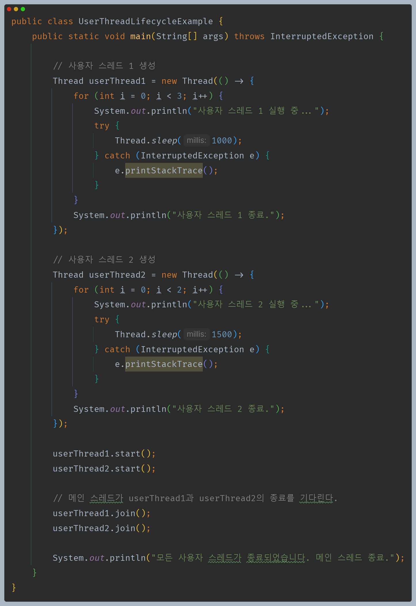
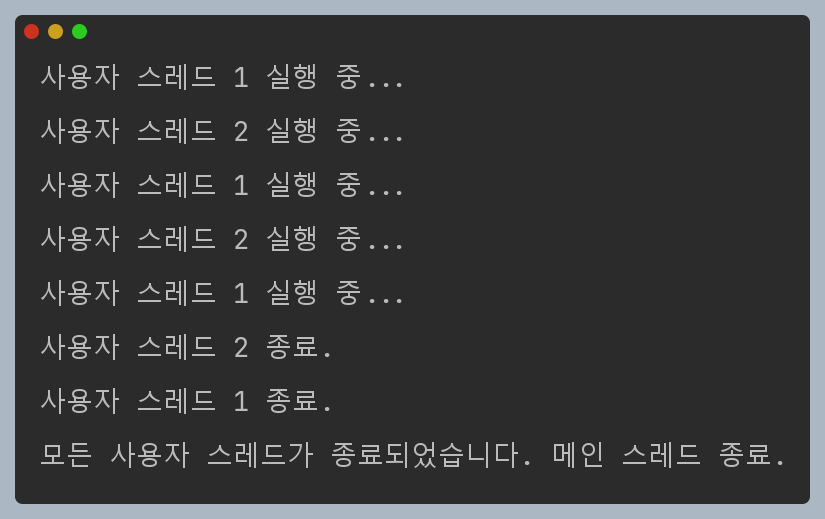
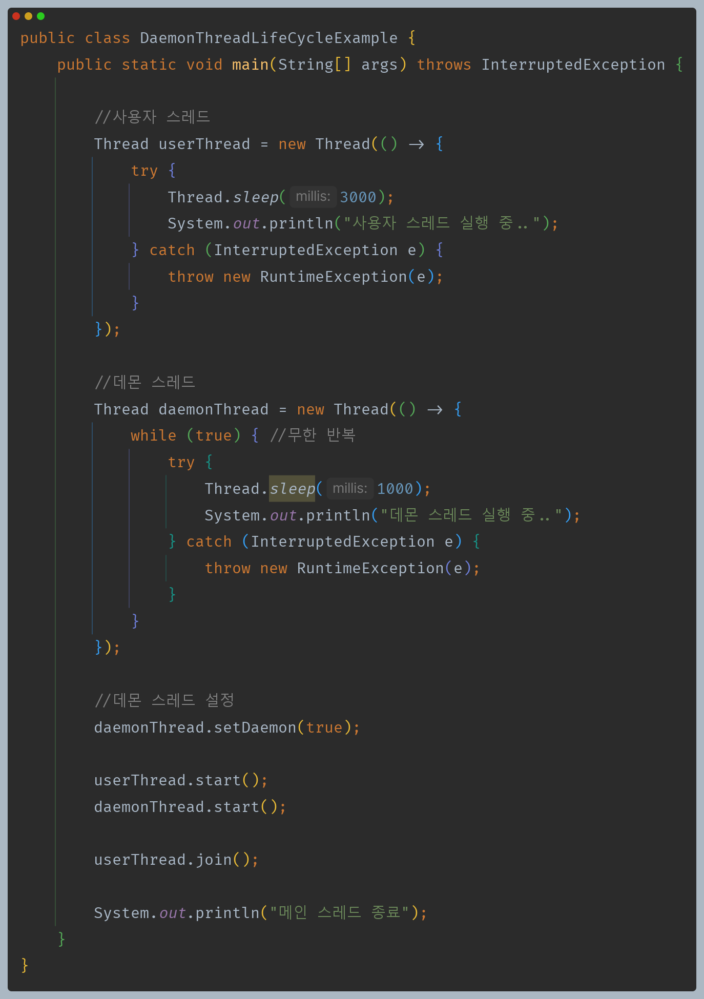
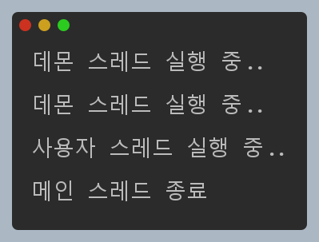

# 자바 동시성 프로그래밍 - Java Thread

## 사용자 스레드와 데몬 스레드

- 자바에는 크게 사용자 스레드와 데몬 스레드 두 가지 유형의 스레드로 구분할 수 있다.
- 사용자 스레드는 사용자 스레드를 낳고, 데몬 스레드는 데몬 스레드를 낳는다. 즉, 자식 스레드는 부모 스레드의 상태를 상속 받는다.
- 자바 애플리케이션이 실행 되면 JVM은 사용자 스레드인 메인 스레드와 나머지 데몬 스레드를 동시에 생성하고 시작한다.

---

## 메인 스레드

- 메인 스레드는 애플리케이션에서 가장 중요한 부분으로서 애플리케이션을 실행할 때마다 메인 스레드가 생성되어 실행된다.
- 메인 스레드는 애플리케이션을 실행하는 최초의 스레드이자 애플리케이션 실행을 완료하는 마지막 스레드의 역할을 한다.
- 메인 스레드에서 여러 하위 스레드를 추가할 수 있고 하위 스레드는 또 여러 하위 스레드를 시작할 수 있다.
- 메인 스레드가 사용자 스레드이기 때문에 하위 스레드는 모두 사용자 스레드가 된다.

---

## 사용자 스레드 (user thread)

- 사용자 스레드는 메인 스레드에서 직접 생성한 스레드를 의미한다.
- 사용자 스레드는 각각 독립적인 생명주기를 가지고 실행하게 되며, 메인 스레드를 포함한 모든 사용자 스레드가 종료하게 되면 애플리케이션이 종료하게 된다.
- 사용자 스레드는 `foreground` 에서 실행되는 높은 우선순위를 가지며 JVM은 사용자 스레드가 스스로 종료될 때까지 애플리케이션을 강제로 종료하지 않고 기다린다.
- 자바가 제공하는 스레드 풀인 `ThreadPoolExecutor` 는 사용자 스레드를 생성한다.

> 모든 사용자 스레드가 종료하면 애플리케이션이 종료된다.

---

## 데몬 스레드 (daemon thread)

- 데몬 스레드는 JVM에서 생성한 스레드이거나 직접 데몬 스레드로 생성한 경우를 말한다.
- 모든 사용자 스레드가 작업을 완료하면 데몬 스레드의 실행 여부에 관계없이 JVM이 데몬 스레드를 강제로 종료하고 애플리케이션을 종료한다.
- 데몬 스레드의 생명주기는 사용자 스레드에 따라 다르며 낮은 우선순위를 가지고 `background` 에서 실행된다.
- 데몬 스레드는 사용자 스레드를 보조 및 지원하는 성격을 가진 스레드로서 보통 사용자 작업을 방해하지 않으면서 백그라운드에서 자동으로 작동되는 기능을 가진 스레드이다.
- 자바가 제공하는 스레드 풀인 `ForkJoinPool` 은 데몬 스레드를 생성한다.

> 데몬 스레드는 무한 반복을 하지만 사용자 스레드가 종료되고 메인 스레드가 종료될 때 같이 종료된다.

### 데몬 스레드 생성 및 확인

- `public final void setDaemon(boolean on)`
  - 스레드를 데몬 또는 비데몬 스레드로 표시하며 이 메서드는 반드시 스레드가 시작되기 전에 호출되어야 한다.
  - 스레드가 실행 중인 동안 `setDaemon()`을 호출하려고 하면 `IllegalThreadStateException`이 발생한다.
  - `true`면 데몬 스레드가 되고, `false`면 사용자 스레드가 된다.(기본값 `false`)
- `public final boolean isDaemon()`
  - 스레드가 데몬 스레드인지 아닌지 확인한다.

---

[이전 ↩️ - Java Thread - 스레드 중지]()

[메인 ⏫](https://github.com/genesis12345678/TIL/blob/main/Java/reactive/Main.md)

[다음 ↪️ - Java Thread - ThreadGroup]()