# 자바 동시성 프로그래밍 - Java Thread

## ThreadGroup

- 자바는 스레드 그룹이라는 객체를 통해서 여러 스레드를 그룹화하는 편리한 방법을 제공한다.
- 스레드 그룹은 스레드 집합을 나타내며 스레드 그룹에는 다른 스레드 그룹도 포함될 수 있고 그룹 내의 모든 스레드는 한번에 종료하거나 중단할 수 있다.
- 스레드는 반드시 하나의 스레드 그룹에 포함되어야 하며 명시적으로 스레드 그룹에 포함시키지 않으면 자신을 생성한 스레드가 속해 있는 스레드 그룹에 포함된다.
- 일반적으로 사용자가 메인 스레드에서 생성하는 모든 스레드는 기본적으로 메인 스레드 그룹에 속하게 된다.

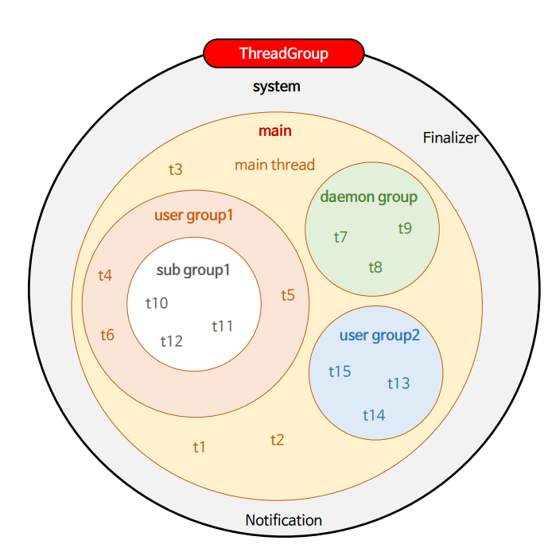

### JVM 스레드 그룹 생성 과정

- JVM이 실행되면 최상위 스레드 그룹인 `system` 스레드 그룹이 생성된다.
- JVM 운영에 필요한 데몬 스레드들을 생성해서 `system` 스레드 그룹에 포함시킨다.
- `system` 스레드 그룹의 하위 스레드 그룹인 `main` 스레드 그룹을 만들고 `main` 스레드를 그룹에 포함시킨다.

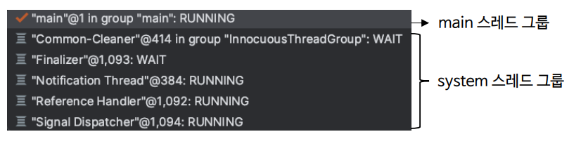

---

## ThreadGroup 구조

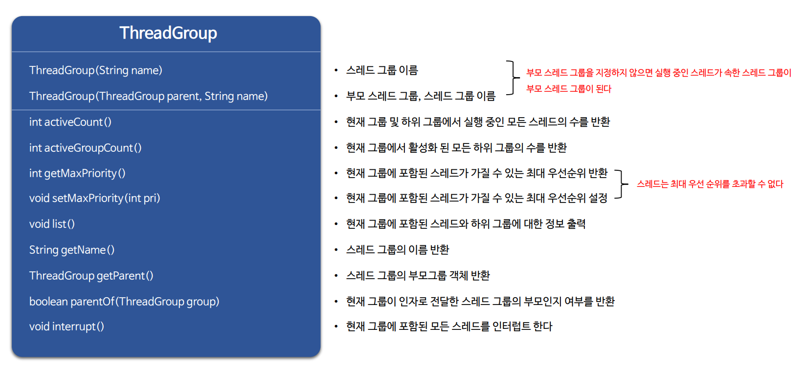

---

## ThreadGroup 예제 코드

### 1

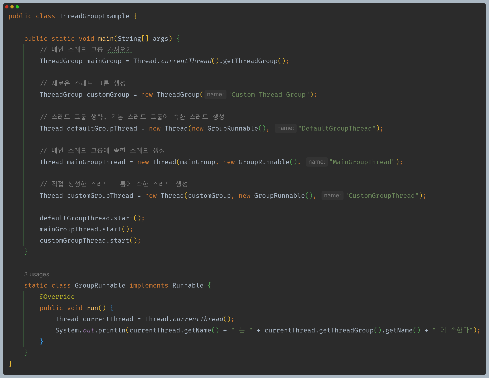

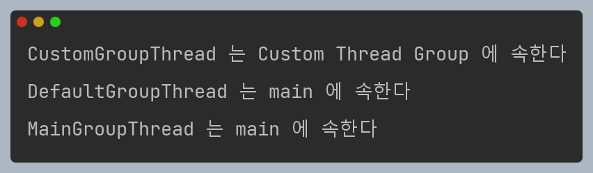

### 2

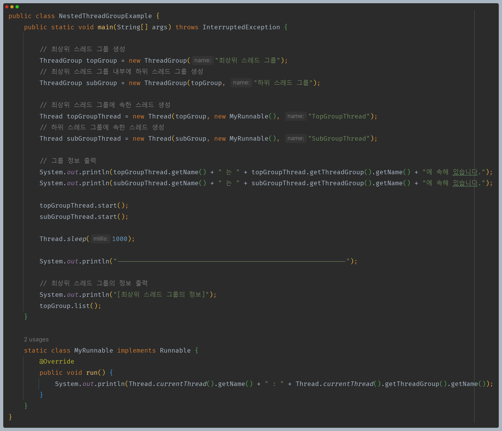

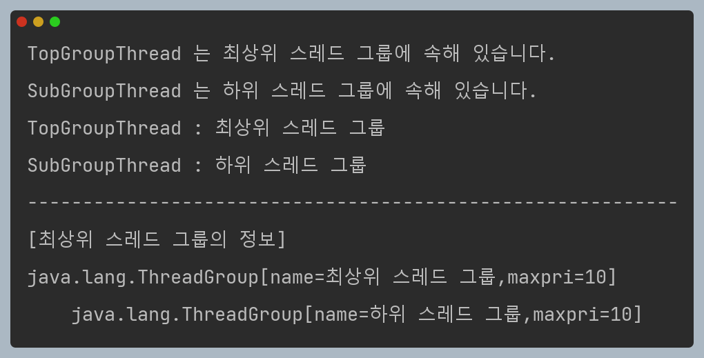

### 3

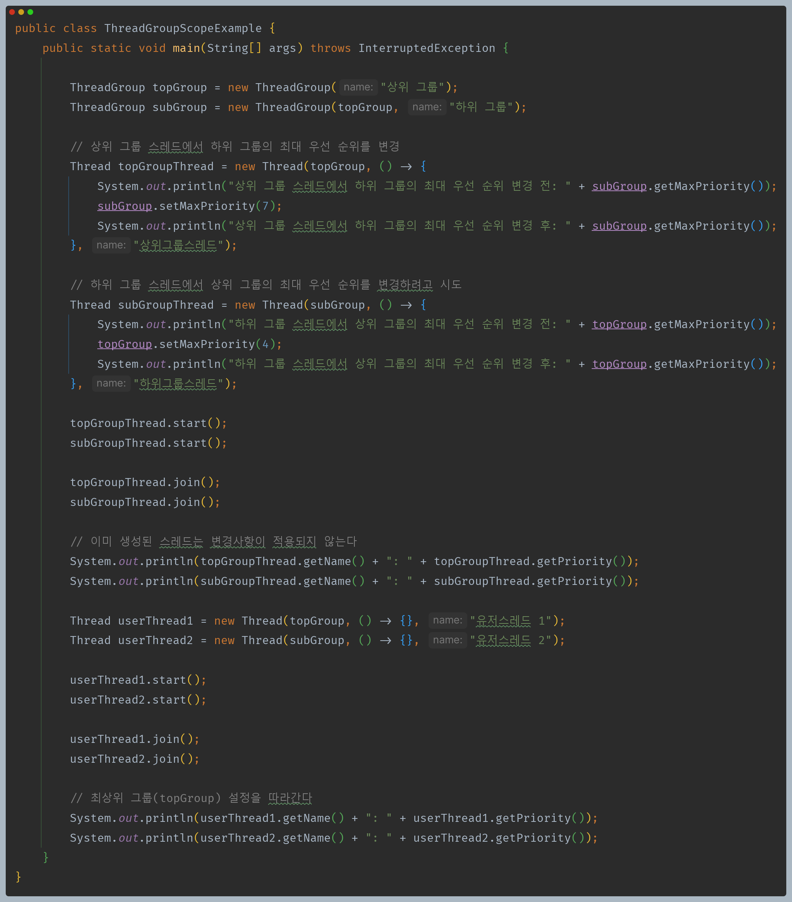

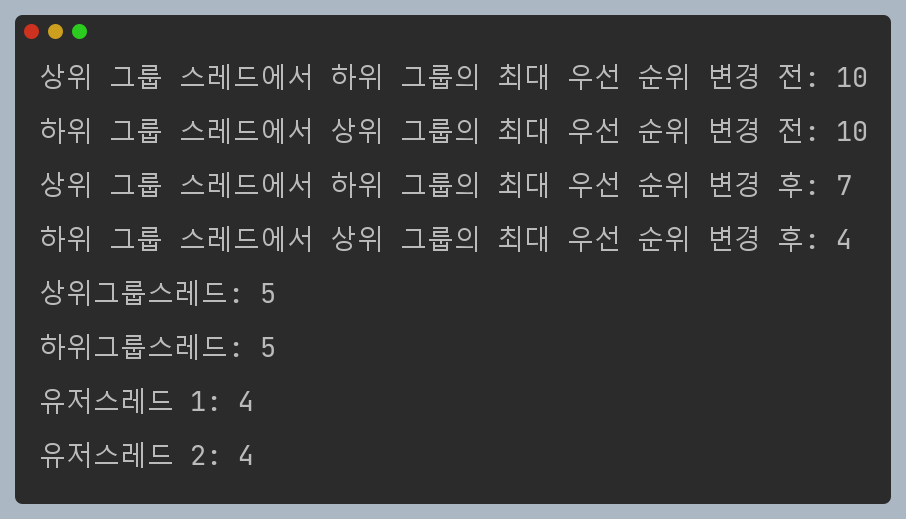

### 4

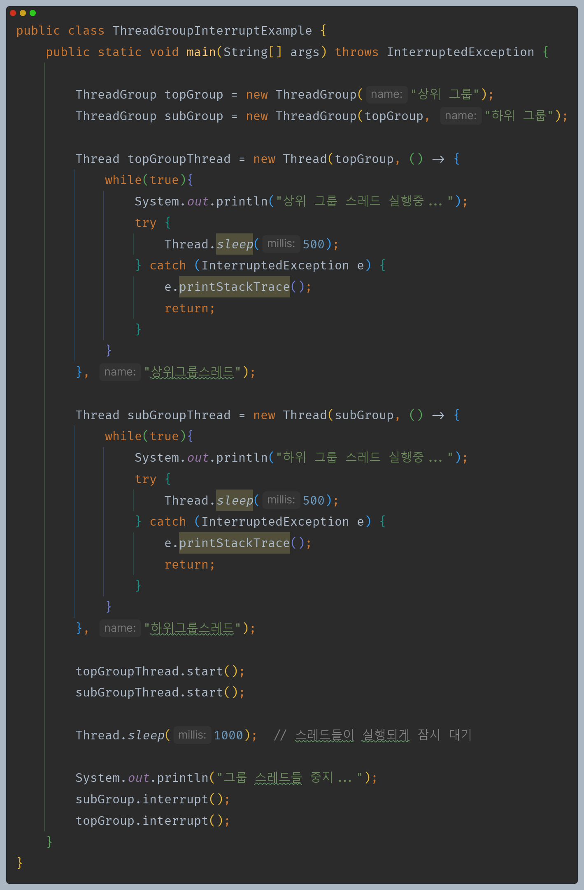

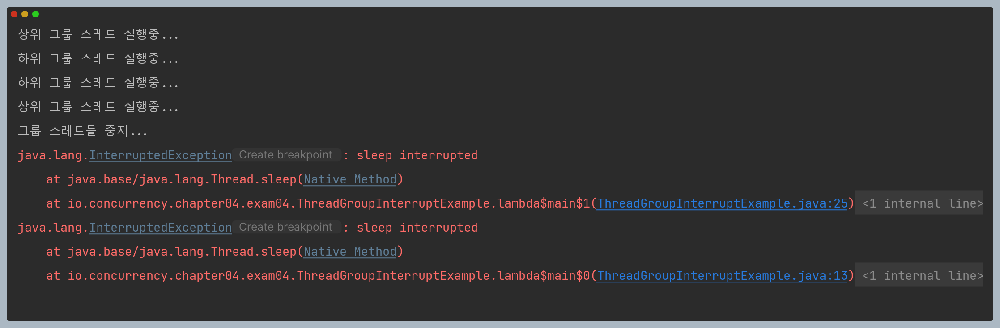

### 5

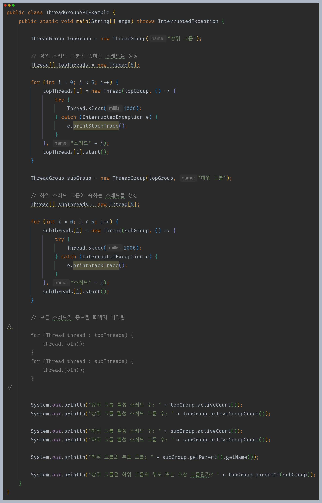

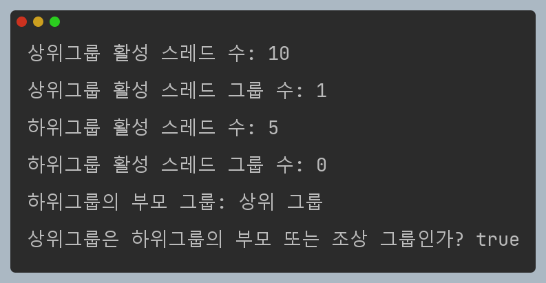

---

[이전 ↩️ - Java Thread - 사용자 스레드와 데몬 스레드]()

[메인 ⏫](https://github.com/genesis12345678/TIL/blob/main/Java/reactive/Main.md)

[다음 ↪️ - Java Thread - ThreadLocal]()