# 자바 동시성 프로그래밍 - Java Thread

## ThreadLocal

- 자바에서 스레드는 오직 자신만이 접근해서 읽고 쓸 수 있는 로컬 변수 저장소 `ThreadLocal`을 제공한다.
- 각 스레드는 고유한 `ThreadLocal` 객체를 속성으로 가지고 있으며 `ThreadLocal`은 스레드 간 격리되어 있다.
- 스레드는 `ThreadLocal`에 저장된 값을 특정한 위치나 시점에 상관없이 어디에서나 전역변수처럼 접근해서 사용할 수 있다. 변수 값을 전달하지 않아도 된다.
- 모든 스레드가 공통적으로 처리해야 하는 기능이나 객체를 제어해야 하는 상황에서 스레드마다 다른 값을 적용해야 하는 경우 사용한다.(인증 주체 보관, 트랜잭션 전파, 로그 추적기 등)

### ThreadLocal API

- `public void set(T value)`
  - 스레드 로컬에 값을 저장한다.
- `public T get()`
  - 스레드 로컬에 저장된 값을 가져온다.
- `public void remove()`
  - 스레드 로컬에 저장된 값을 삭제한다.
- `public static <S> ThreadLocal<S> withInitial(Supplier<? extends S> supplier)`
  - 스레드 로컬을 생성하면서 특정 값으로 초기화한다.

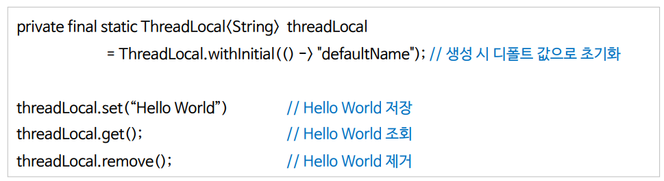

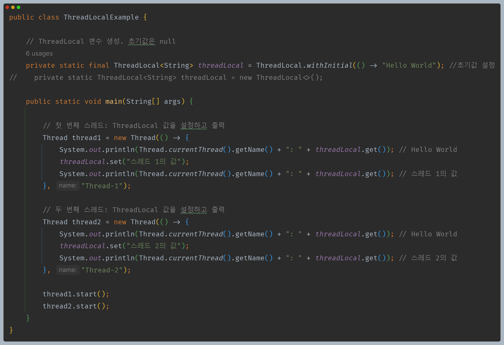

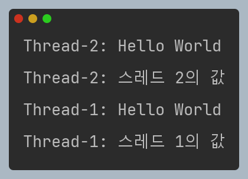

---

## Thread & ThreadLocal

- 스레드는 `ThreadLocal`에 있는 `ThreadLocalMap` 객체를 자신의 `threadLocals` 속성에 저장한다.
- 스레드 생성 시 `threadLocals` 기본값은 `null` 이며, `ThreadLocal`에 값을 저장할 때 `ThreadLocalMap`이 생성되고 `threadLocals`와 연결된다.
- **스레드가 전역적으로 값을 참조할 수 있는 원리는 스레드가 `ThreadLocal`의 `ThreadLocalMap`에 접근해서 여기에 저장된 값을 바로 꺼내어 쓸 수 있기 때문이다.**

- `ThreadLocalMap`은 항상 새롭게 생성되어 스레드 스택에 저장되기 때문에 근본적으로 스레드간 데이터 공유가 될 수 없다. 따라서 동시성 문제가 발생하지 않는다.

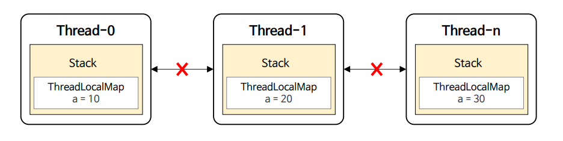

> **주의사항**
> - `ThreadLocal`에 저장된 값은 스레드마다 독립적으로 저장되기 때문에 저장된 데이터를 삭제하지 않아도 메모리를 점유하는 것 외에 문제가 되지는 않는다.
> - 그러나 스레드 풀을 사용해서 스레드를 운용한다면 반드시 `ThreadLocal`에 저장된 값을 삭제해 주어야 한다.
> - 스레드풀은 스레드를 재사용하기 때문에 현재 스레드가 이전의 스레드를 재사용 한다면 이전의 스레드에서 삭제하지 않았던 데이터를 참조할 수 있기 때문에 문제가 될 수 있다.
> 
> 
> 
> 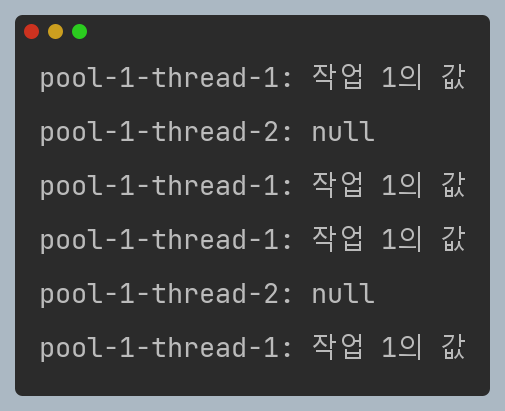

---

## ThreadLocal 작동원리

- `ThreadLocal`은 `Thread`와 `ThreadLocalMap`을 연결하여 스레드 전용 저장소를 구현하고 있는데 이것이 가능한 이유는 `Thread.currentThread()`를 참조할 수 있기 때문이다.
- `Thread.currentThread()`는 현재 실행 중인 스레드의 객체를 참조한다. 그리고 CPU는 오직 하나의 스레드만 할당받아 처리하기 때문에 `ThreadLocal`에서
  `Thread.currentThread()`를 참조하면 지금 실행 중인 스레드의 로컬 변수를 저장하거나 참조할 수 있게 된다.
- `ThreadLocal`에서 현재 스레드를 참조할 수 있는 방법이 없다면 값을 저장하거나 요청하는 스레드를 식별할 수 없기 때문에 `Thread.currentThread()`는 `ThreadLocal`의 중요한 데이터 식별 기준이 된다.

### 데이터 저장

### 데이터 조회

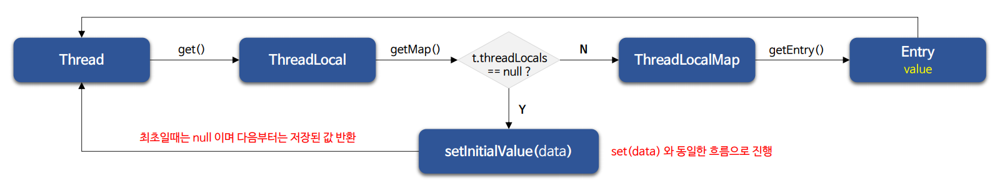

---

## InheritableThreadLocal

- `InheritableThreadLocal`은 `ThreadLocal`의 확장 버전으로, 부모 스레드로부터 자식 스레드로 값을 전달하고 싶은 경우 `InheritableThreadLocal`을 사용할 수 있다.
- 부모 스레드가 `InheritableThreadLocal` 변수에 값을 설정하면, 해당 부모 스레드로부터 생성된 자식 스레드들은 부모의 값을 상속받게 된다.
- 자식 스레드가 상속받은 값을 변경하더라도 부모 스레드의 값에는 영향을 주지 않는다.

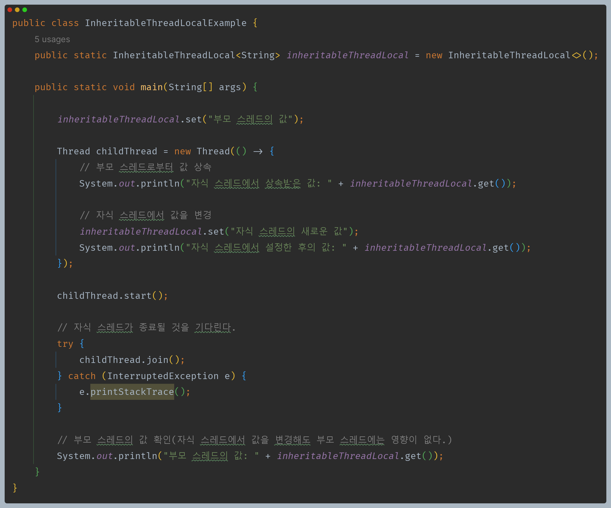

---

## ThreadLocal 사용 예제 코드

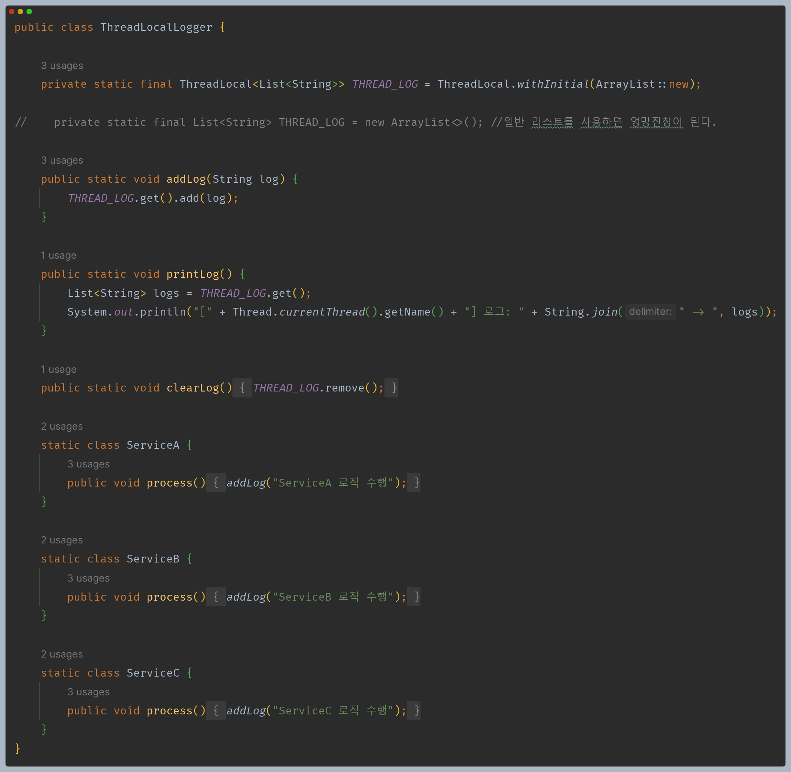

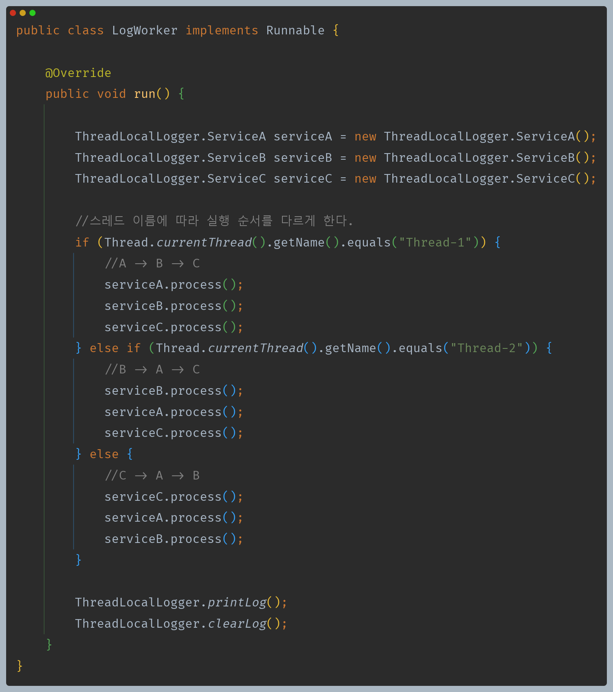

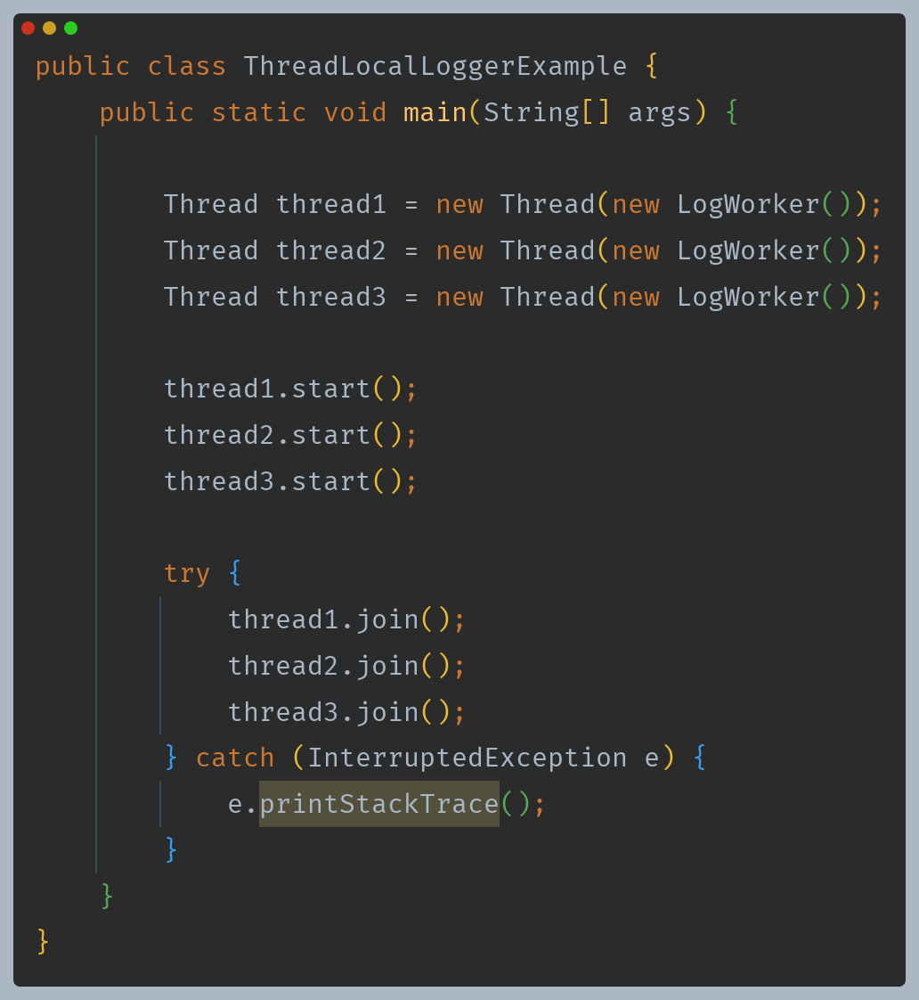

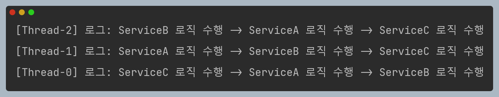

---

[이전 ↩️ - Java Thread - ThreadGroup](https://github.com/genesis12345678/TIL/blob/main/Java/reactive/javathread/%ED%99%9C%EC%9A%A9/ThreadGroup.md)

[메인 ⏫](https://github.com/genesis12345678/TIL/blob/main/Java/reactive/Main.md)

[다음 ↪️ - Java Thread - ]()