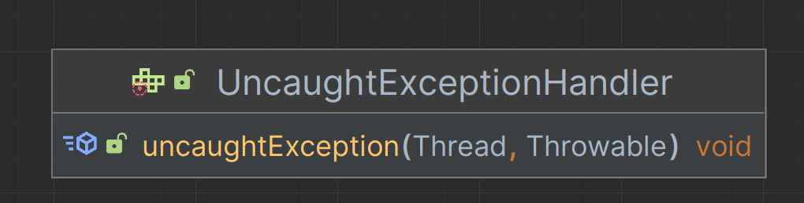
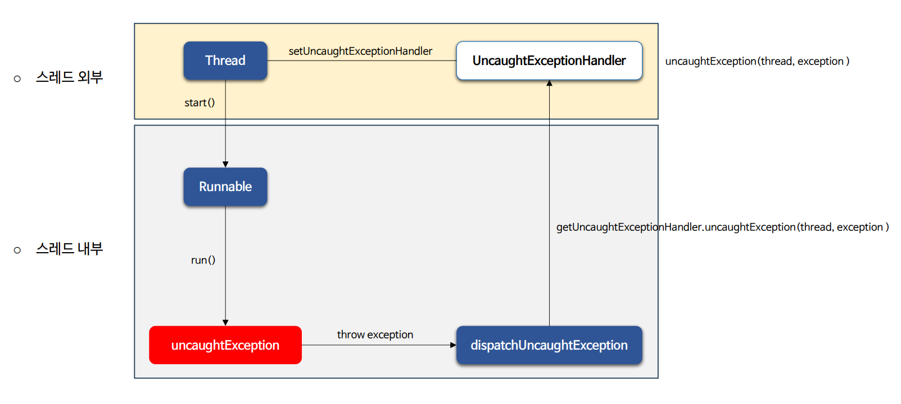
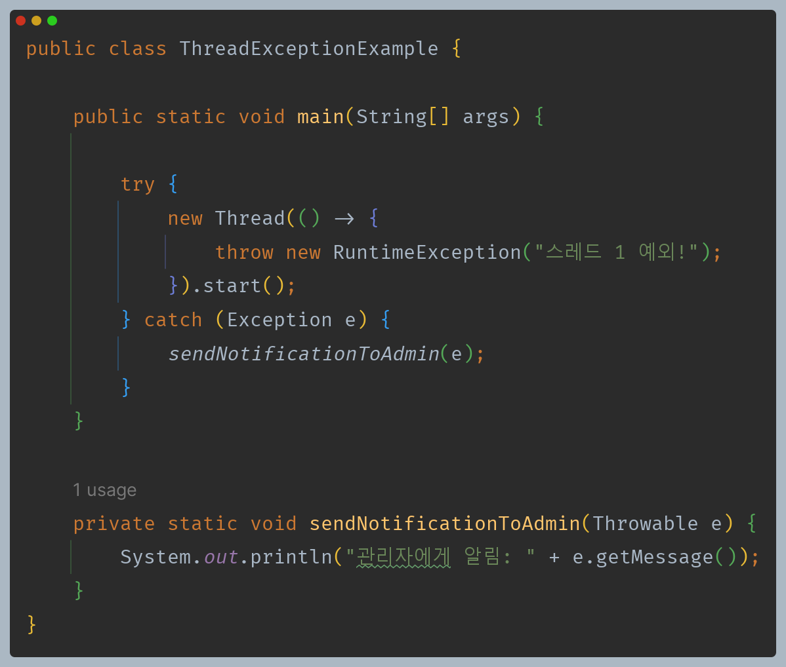
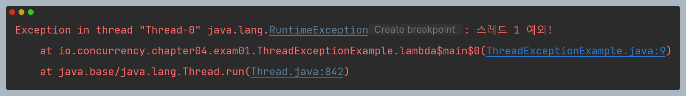
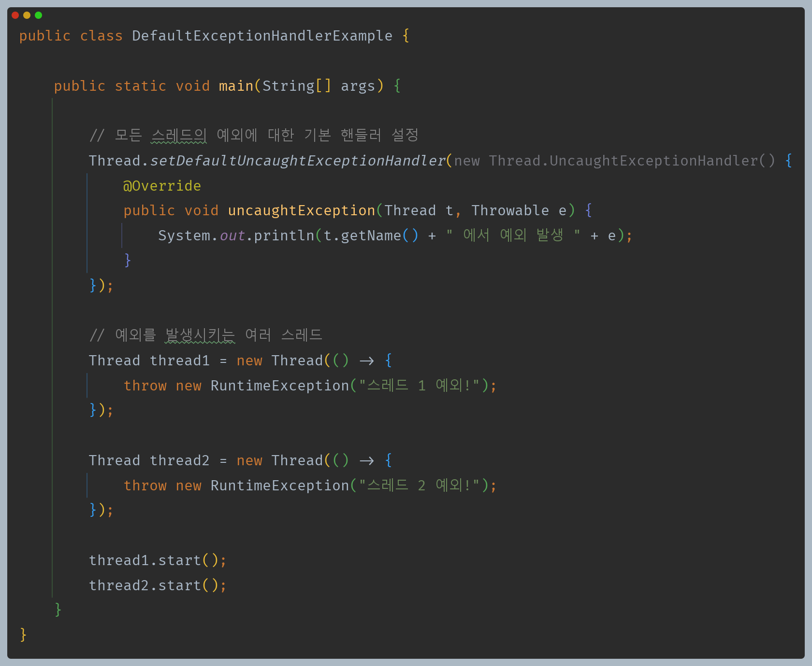
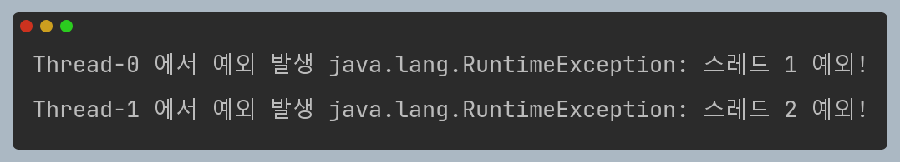
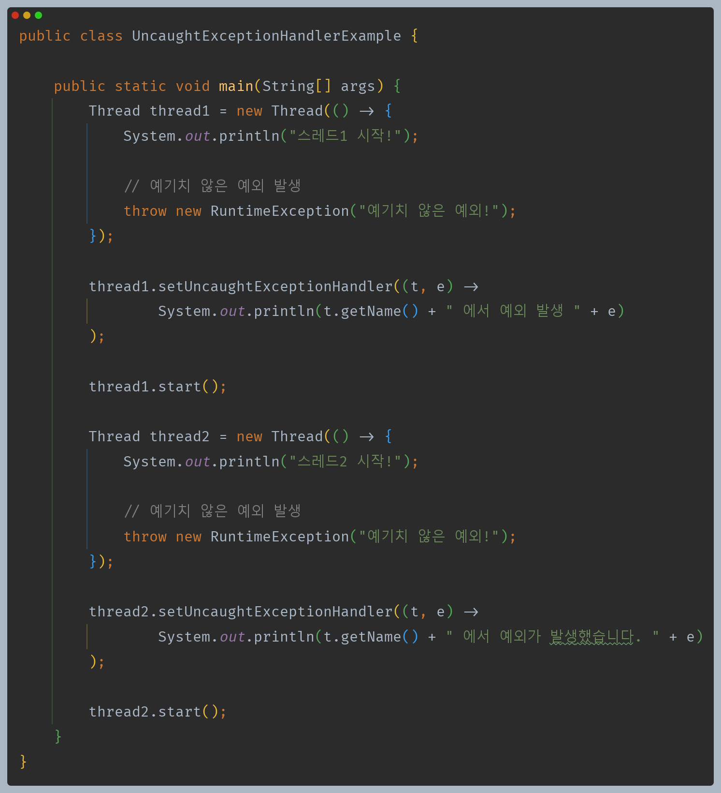
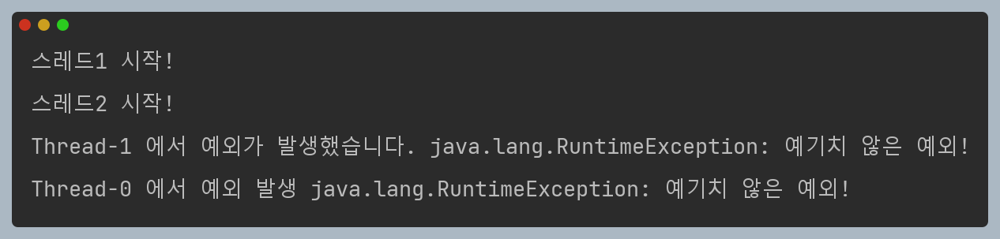

# 자바 동시성 프로그래밍 - Java Thread

## 스레드 예외 처리 - UncaughtExceptionHandler

- 기본적으로 스레드의 `run()`은 예외를 던질 수 없기 때문에 예외가 발생할 경우 `run()` 안에서만 예외를 처리해야 한다.
- `RuntimeException` 타입의 예외가 발생할 지라도 스레드 밖에서 예외를 캐치할 수 없고 사라진다.
- 스레드가 비정상적으로 종료되었거나 특정한 예외를 스레드 외부에서 캐치하기 위해서 자바에서는 `UncaughtExceptionHandler` 인터페이스를 제공한다.

### UncaughtExceptionHandler

- 캐치 되지 않은 예외에 의해 스레드가 갑자기 종료했을 때 호출되는 핸들러 인터페이스
- 어떤 원인으로 인해 스레드가 종료되었는지 대상 스레드와 예외를 파악할 수 있다.

- 예외가 발생하면 `uncaughtException()`이 호출되고 대상 스레드와 예외가 인자로 전달된다.

### 스레드 API

- `public static void setDefaultUncaughtExceptionHandler(UncaughtExceptionHandler eh)`
  - 모든 스레드에서 발생하는 `uncaughtException`을 처리하는 정적 메서드
- `public void setUncaughtExceptionHandler(UncaughtExceptionHandler eh)`
  - 대상 스레드에서 발생하는 `uncaughtException`을 처리하는 인스턴스 메서드
  - `setDefaultUncaughtExceptionHandler()`보다 우선순위가 높다. 

---

## 흐름도

---

## 예제 코드

> 스레드 실행 중 예외가 발생하더라도 `catch` 구문으로 가지 못하게 되고, 예외는 사라져 버린다.

> `setDefaultUncaughtExceptionHandler()`로 모든 스레드에 대한 예외 처리를 할 수 있다.

> `setUncaughtExceptionHandler()`을 통해 각 스레드에게 예외 처리를 설정했다. 이 경우 `setDefaultUncaughtExceptionHandler()`보다 우선순위가 높다.

---

[이전 ↩️ - Java Thread - Priority]()

[메인 ⏫](https://github.com/genesis12345678/TIL/blob/main/Java/reactive/Main.md)

[다음 ↪️ - Java Thread - 스레드 중지]()