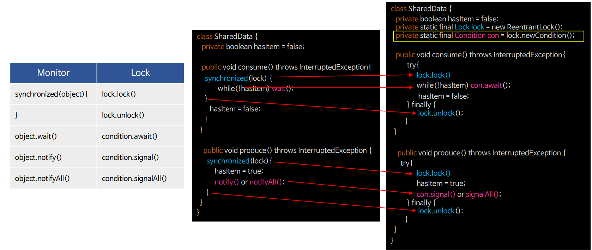
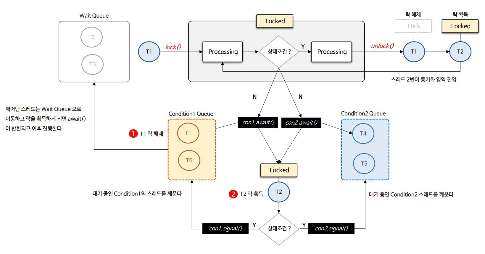
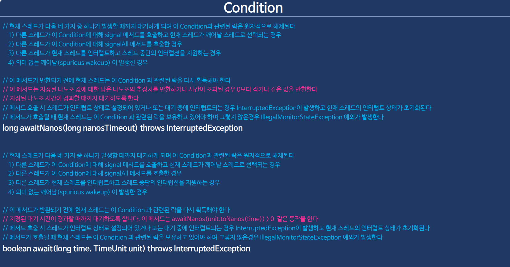
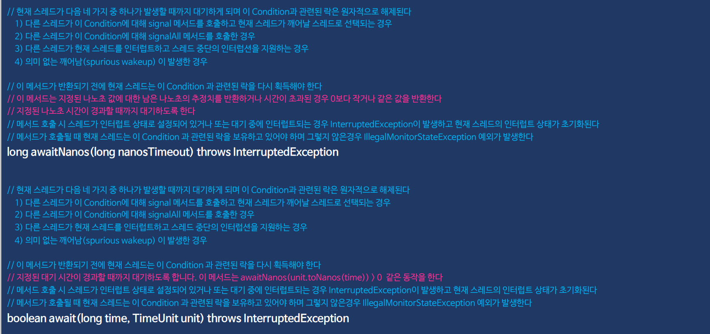
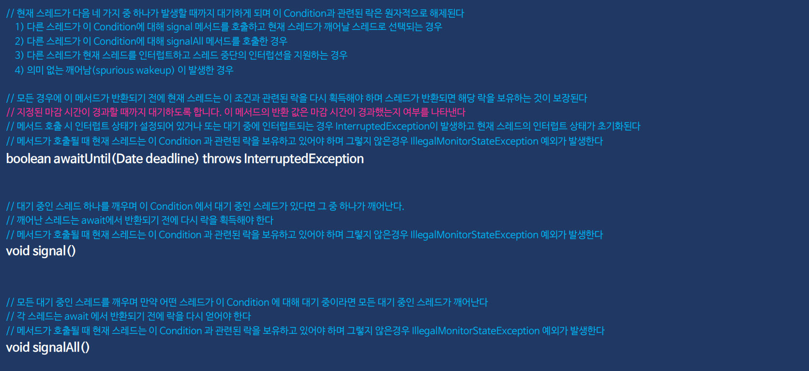
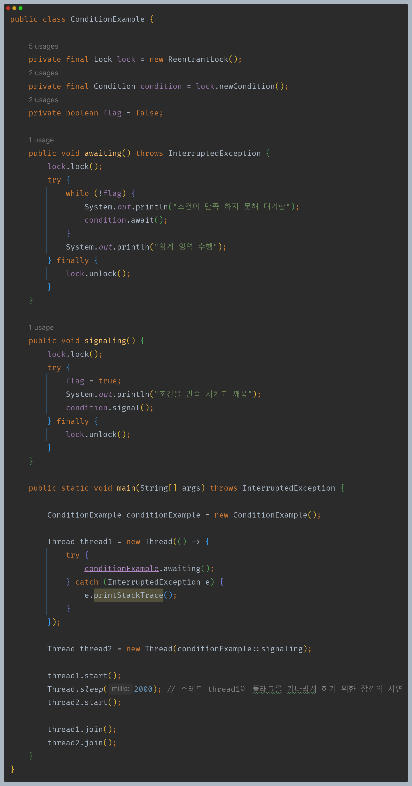
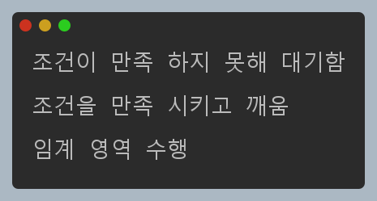
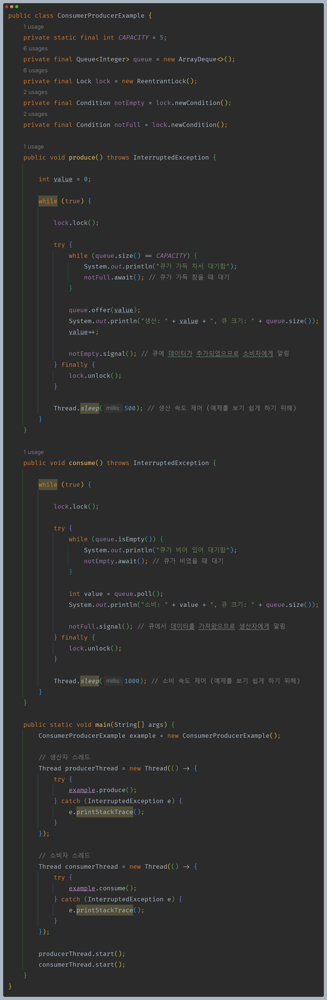
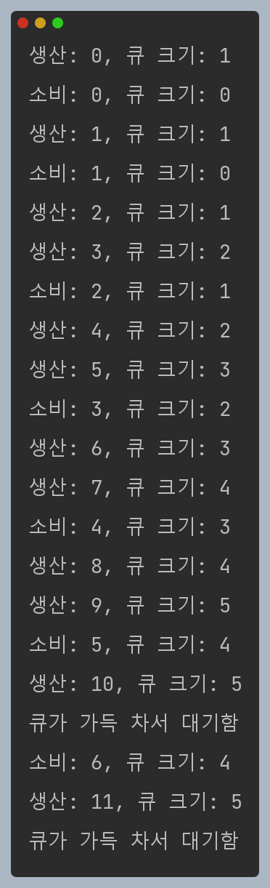

# 자바 동시성 프로그래밍 - Java Locks

## Condition

- `Condition`은 조건 변수 또는 조건 큐로 알려진 객체로서 `Lock`과 결합하여 객체 당 여러 개의 `Wait Queue`를 가지는 효과를 제공한다.
- `Lock`이 `synchronized` 메서드와 문장의 사용을 대체하는 것처럼 `Condition`은 Object 모니터 메서드(`wait()`, `notify()`, `notifyAll()`)의 사용을 대체하여 `Lock`에 바인딩된다.
- `Condition`은 한 스레드가 다른 스레드로부터 어떤 상태 조건이 참이 될 수 있다는 통지를 받을 때까지 실행을 중단하도록 하는 수단을 제공한다.
- `Condition`의 가장 중요한 특성은 락을 원자적으로 해제하고 현재 스레드를 중단하는 것이며 이는 `Object.wait()` 메서드와 동일하게 동작한다.

### 흐름도

- 조건 변수 별로 대기 큐를 관리할 수 있으며 대기 중인 스레드를 깨울 때도 조건에 맞는 `signal()`을 호출해 주어야 한다.

### API

### signalAll() 보다 signal()

- `Condition`에서 신호를 알릴 때 `signalAll()` 보다 `signal()`을 사용하는 것이 다중 조건을 다루는 더욱 효과적인 방법일 수 있다.
- 한 개의 `Lock` 객체에서 생성한 여러 개의 `Condition`은 특정한 조건에 따라 스레드를 구분해서 관리함으로 미세한 제어를 가능하게 해준다.
- 여러 개의 조건이 있을 때 모든 스레드를 동시에 깨우면 경쟁 상태가 발생할 수 있으나 `Condition`을 여러 개 사용하면 각각의 조건에 대해 필요한 스레드만 깨울 수 있다.

### Condition 사용 시 주의 사항

- `Condition` 객체는 단순한 일반 객체로서 `synchronized` 문에서 대상으로 사용하거나, 자체 모니터 `wait()` 및 `notify()` 메서드를 호출할 수 있다.
- `Condition` 객체의 모니터를 사용하는 것은 해당 `Condition`과 연결된 `Lock`을 사용하거나 `await()` 및 `signal()` 메서드를 사용하는 것과 특정한 관계가 없다.
- 혼동을 피하기 위해 `Condition` 인스턴스를 이러한 방식으로 사용하지 않는 것이 좋다.

---

## Condition 예제 코드

### 1

### 2

- 무한 반복한다.

---

[이전 ↩️ - Java Locks - ReadWriteLock & ReentrantReadWriteLock](https://github.com/genesis12345678/TIL/blob/main/Java/reactive/locks/ReentrantReadWriteLock.md)

[메인 ⏫](https://github.com/genesis12345678/TIL/blob/main/Java/reactive/Main.md)

[다음 ↪️ - Java Locks - ]()