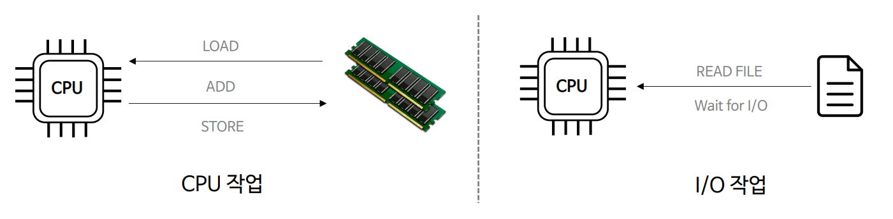
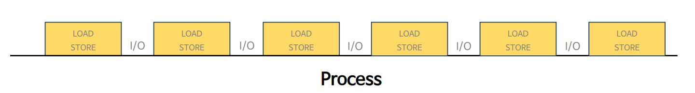
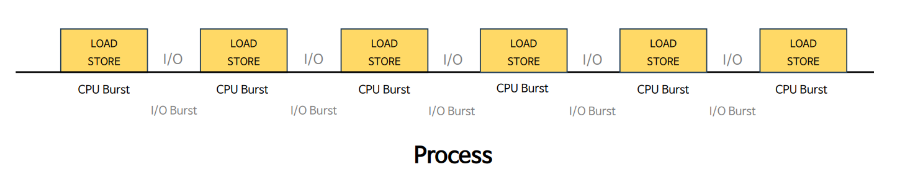
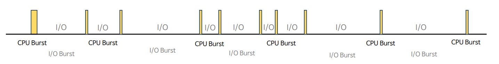

# 자바 동시성 프로그래밍 - 운영 체제 기본 지식

# CPU Bound & I/O Bound

- 프로세스는 CPU 작업과 I/O 작업의 연속된 흐름으로 진행된다.

- 프로세스는 CPU 명령어를 수행하다가 I/O를 만나면 대기하고, I/O 작업이 완료되면 다시 CPU 작업을 수행한다.
- 특정한 `Task`가 완료될 때까지 이를 계속 반복한다.

---

## Burst 

- 한 작업을 짧은 시간 동안 집중적으로 연속해서 처리하거나 실행하는 것

### CPU Burst

- CPU를 연속적으로 사용하면서 명령어를 실행하는 구간을 의미
- 프로세스가 CPU 명령어를 실행하는 데 소비하는 시간
- 프로세스의 `RUNNING` 상태를 처리한다.

### I/O Burst

- 연속적으로 I/O를 실행하는 구간으로 I/O 작업이 수행되는 동안 대기하는 구간
- 프로세스가 I/O 요청 완료를 기다리는 데 걸리는 시간
- 프로세스의 `WAITING` 상태를 처리한다.

- 프로세스마다 CPU Burst 와 I/O Burst 가 차지하는 비율은 균일하지 않다.
- 이 비율을 기준으로 해서 CPU 바운드 프로세스와 I/O 바운드 프로세스로 나눌 수 있다.

### CPU Bounded Process

- CPU Burst 작업이 많은 프로세스로서 I/O Burst 가 거의 없는 경우에 해당한다.
- 머신러닝, 블록체인, 동영상 편집 프로그램 등 CPU 연산 위주의 작업을 하는 경우를 의미한다.
- **멀티 코어의 병렬성을 최대한 활용해서 처리 성능을 극대화 하도록 스레드를 운용한다.** 일반적으로 CPU 코어 수와 스레드 수의 비율을 비슷하게 설정한다.

### I/O Bounded Process

- I/O Burst 가 빈번히 발생하는 프로세스로서 CPU Burst 가 매우 짧다.
- 파일, 키보드, DB, 네트워크 등 외부 연결이나 입출력 장치와의 통신 작업이 많은 경우에 해당한다.
- CPU 코어가 많을 경우 멀티 스레드의 동시성을 최대한 활용하여 CPU가 `Idle` 상태가 되지 않도록 하고 최적화된 스레드 수를 운용해서 CPU의 효율적인 사용을 극대화 한다.

---

[이전 ↩️ - 운영 체제 기본 지식 - Context Switching]()

[메인 ⏫](https://github.com/genesis12345678/TIL/blob/main/Java/reactive/Main.md)

[다음 ↪️ - 운영 체제 기본 지식 - 사용자 & 커널 모드]()