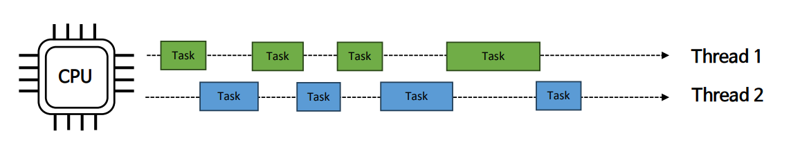
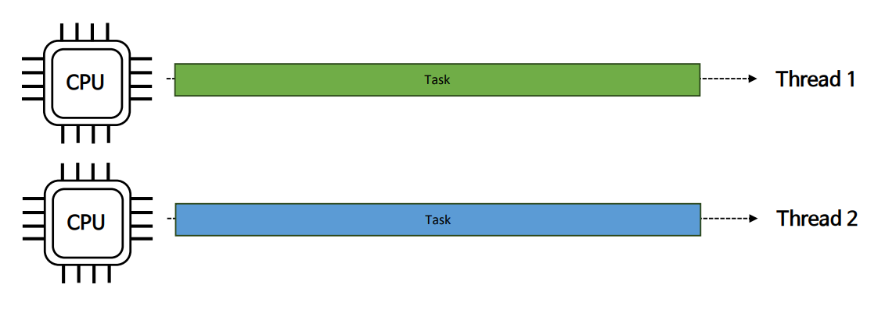
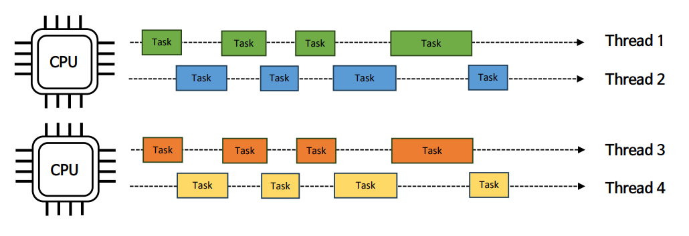
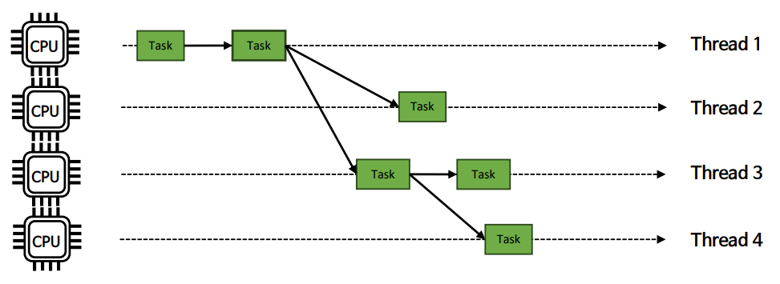
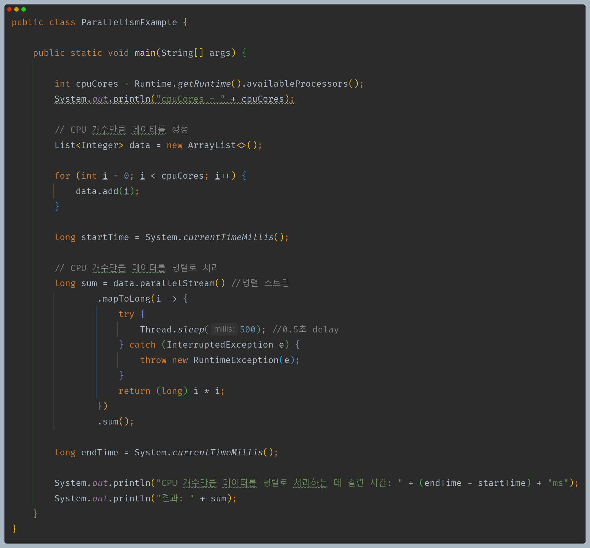
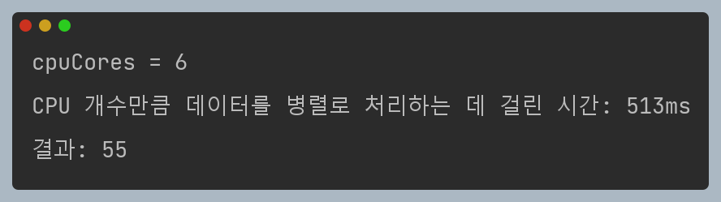
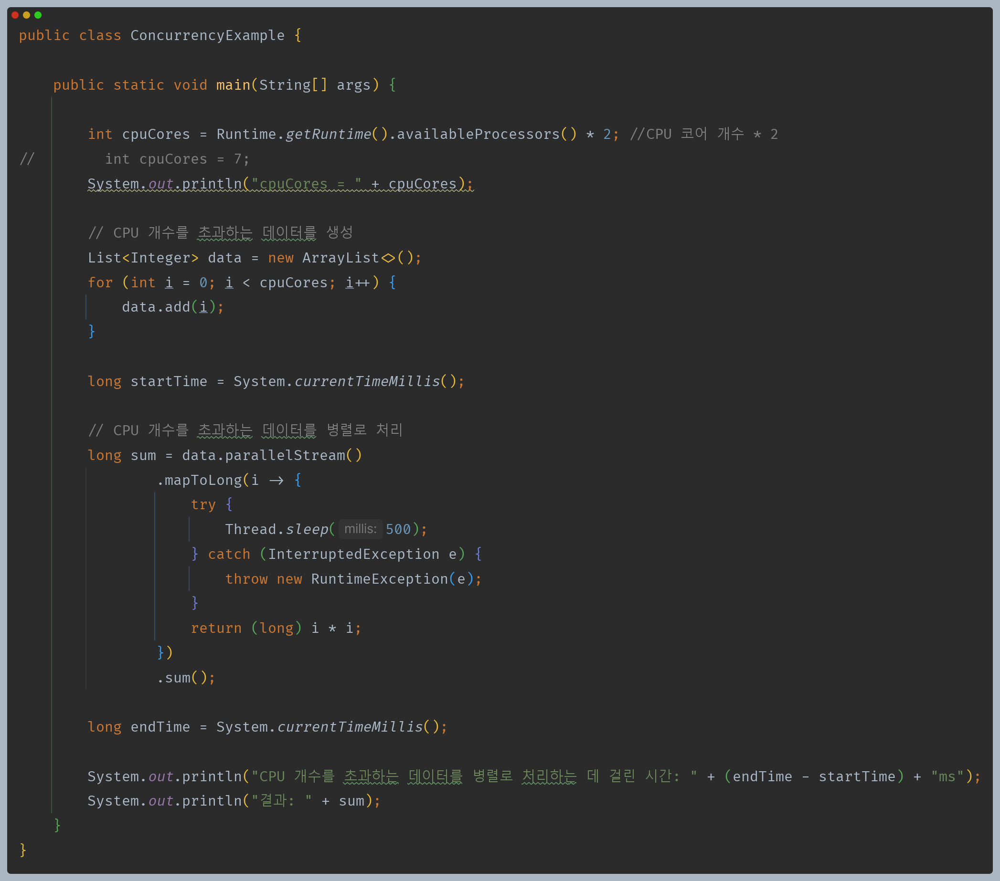
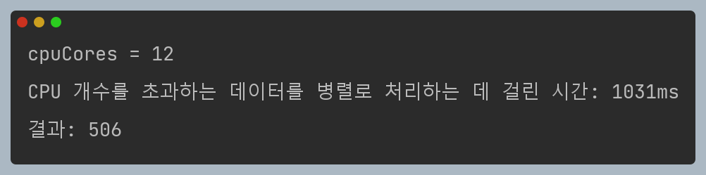
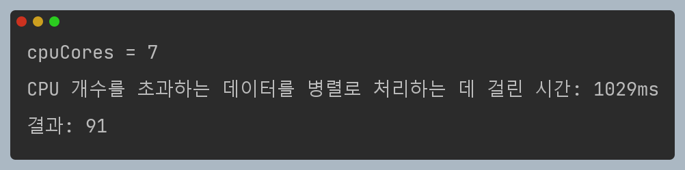

# 자바 동시성 프로그래밍 - 운영 체제 기본 지식

# 동시성과 병렬성

- 동시성은 특정한 순서 없이 겹치는 기간에 시작, 실행 및 완료 되는 여러 작업에 관한 것을 의미한다.
- 병렬성은 멀티 코어 프로세스에서 동시에 실행되는 동일한 작업의 여러 작업에 관한 것이다.
- 동시성과 병렬성은 비슷한 부분이 있지만 동일하지 않다.

---

## 동시성 (Concurrent)

- 동시성은 CPU가 한번에 많은 일을 처리하는 것에 중점을 둔다. 즉, **많은 작업들을 아주 빠른 시간으로 교체하면서** 전체 작업을 처리한다.
- 동시성은 작업의 처리를 빠르게 하기 위한 목적이 아닌 CPU를 효율적으로 사용하는 것에 더 중점을 둔다.
  - 스레드가 작업을 처리하다 IO 블록에 걸렸을 경우 CPU는 다른 스레드로 전환해서 작업을 진행한다.
- 동시성은 작업에 대한 처리 방식을 어떤 식으로 진행할 것인가에 대한 설계적 관점에서 이해해야 한다.
- 동시성은 작업해야 할 수가 CPU 코어 수보다 많을 경우 해당되며, 동시성이 없으면 작업을 순차적으로 진행해야 한다.

---

## 병렬성 (Parallel)

- 병렬성은 CPU가 동시에 많은 일을 수행하는 것에 중점을 둔다. 즉, CPU가 놀지 않고 최대한 바쁘게 동작해야 한다.
- 병렬성은 런타임에 물리적으로 작업을 실행하는 것이며 여러 컴퓨팅 리소스가 있는 하드웨어가 필요하다. 한 개의 코어에서는 절대 병렬성이 구현될 수 없다.
- 병렬성은 동시성의 하위 개념으로 작업을 여러 스레드로 분리하고, 운영체제는 그 스레드를 여러 CPU에 적절히 분배하여 동시적으로 실행되도록 하는 것이다.
- 동시성이 작업 처리 방식에 대한 설계에 관한 것이라면, 병렬성은 하드웨어 계층에서 작업 수행 방식에 관한 것이다.
- 병렬성은 작업해야 할 수가 CPU 코어 수보다 같거나 적을 경우 가장 효율성이 좋다.(작업 수 <= CPU 코어 수)

---

## 동시성과 병렬성 조합

- **ThreadPoolExecutor**

병렬성으로 처리 성능을 극대화하고 동시성으로 CPU 자원을 효율적으로 운용한다.

---

## 병렬성 - 분할 정복

- **ForkJoinPool**

하나의 태스크를 서브 태스크로 분할하여 병렬 처리 함으로써 전체 작업 성능을 높인다.

---

## 병렬성 예제 코드

- CPU 코어의 개수만큼 병렬 작업을 수행한다.
- 이때 병렬 스트림이 아닌 일반 스트림(`stream()`)을 사용하면 데이터당 0.5초가 걸리는 작업들을 6번(CPU 코어 개수) 수행하므로 약 3초가 걸린다.

---

## 동시성 예제 코드

- 동시성은 작업해야 할 수가 CPU 코어 수보다 많아야 하므로 데이터 수를 CPU 코어 개수의 2배로 설정한다.
- 때문에 병렬성 보다 약 2배의 시간이 걸리는 것을 확인할 수 있다.
- 당연히 데이터 수가 2배 많아졌으니까 시간도 2배 걸리는 것이 맞을 수도 있다. **그렇다면 CPU 코어 개수보다 딱 하나 많은 데이터 수는 결과가 어떨까?**
- 하나 많으니까 병렬성에서 걸린 시간 0.5초보다 조금 많은 0.6초 이 정도 걸리는게 맞을까?

- 결과는 같다.
- 작업의 수가 CPU 코어 수보다 1개가 많던 2개가 많던 하나의 CPU가 하나의 작업을 처리하지 못하고 동시적으로 작업을 실행하기 때문에 추가적인 시간이 걸리는 것이다.

---

[이전 ↩️ - 운영 체제 기본 지식 - 프로세스와 스레드]()

[메인 ⏫](https://github.com/genesis12345678/TIL/blob/main/Java/reactive/Main.md)

[다음 ↪️ - 운영 체제 기본 지식 - Context Switching]()