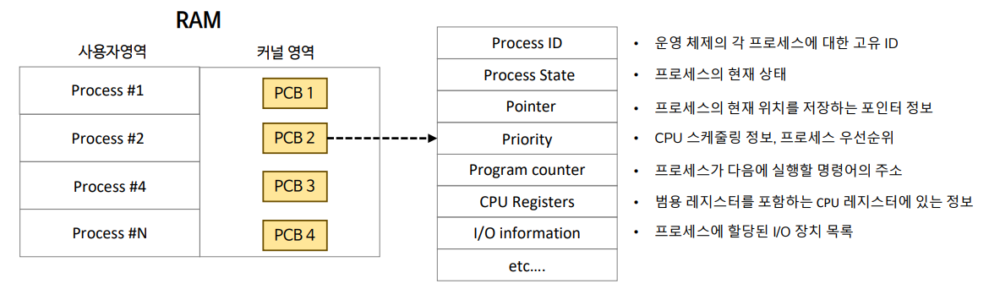
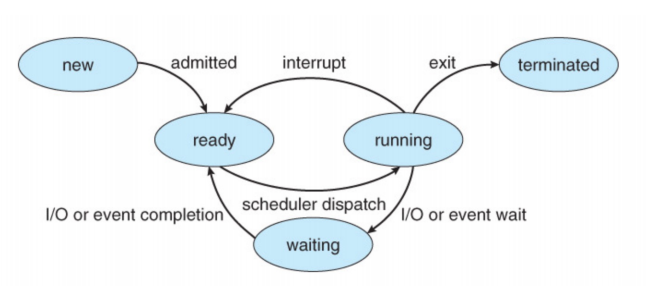
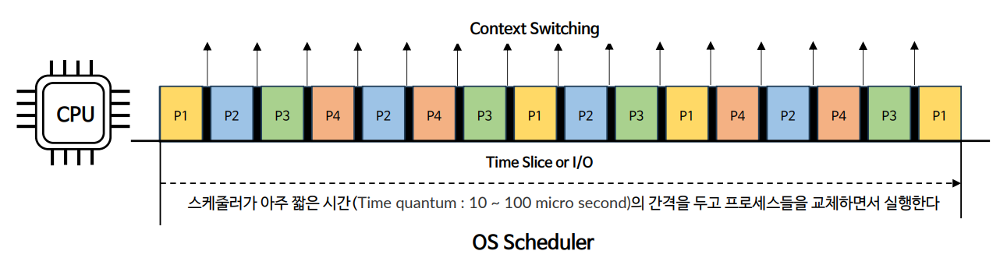
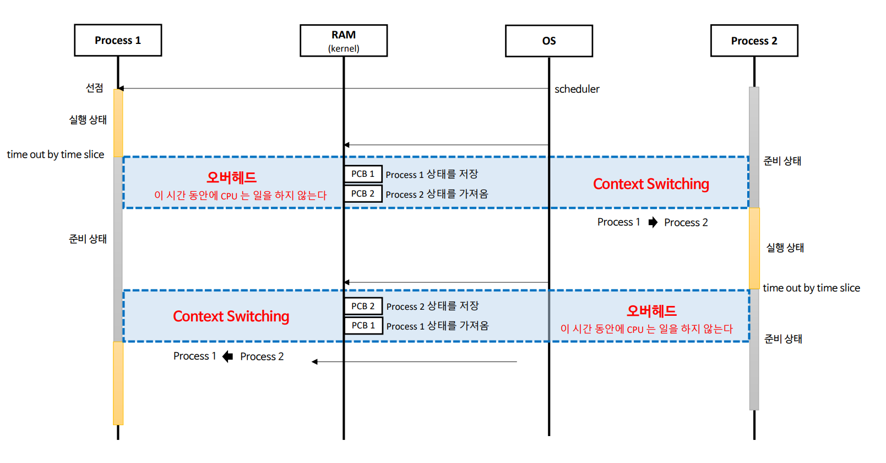
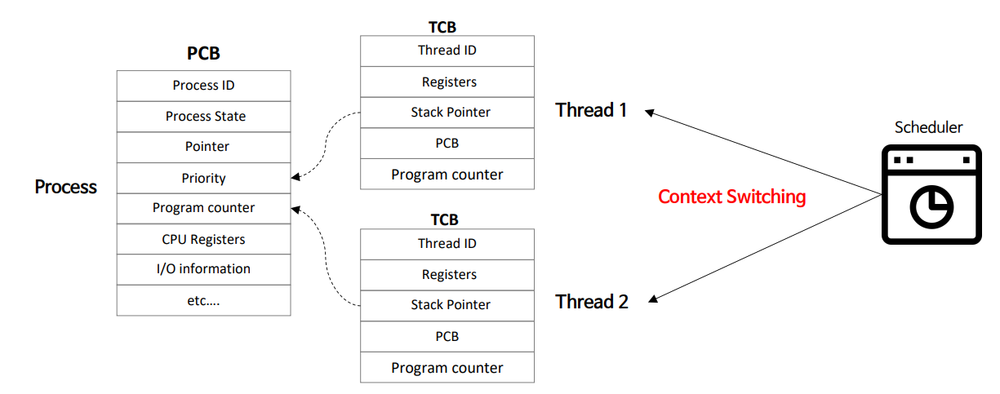

# 자바 동시성 프로그래밍 - 운영 체제 기본 지식

# Context Switching

- 하나의 CPU는 동일한 시간에 하나의 작업(`Task`)만 수행할 수 있기 때문에 여러 프로세스를 동시에 실행할 수 없다.
- 하나의 CPU 에서 여러 프로세스를 동시성으로 처리하기 위해서는 한 프로세스에서 다른 프로세스로 전환해야 하는데 이것을 문맥 교환(`Context Switching`) 이라고 한다.

---

## 문맥 (Context)

- 프로세스 간 전환을 위해서는 이전에 어디까지 명령을 수행했고, `CPU Register`에는 어떤 값이 저장되어 있는지에 대한 정보가 필요하다.
- `Context`는 CPU가 해당 프로세스를 실행하기 위한 프로세스의 정보를 의미하며, 이 정보들은 운영체제가 관리하는 `PCB` 라고 하는 자료 구조의 공간에 저장된다.

---

## PCB (Process Control Block)

- 운영체제가 시스템 내의 프로세스들을 관리하기 위해 프로세스마다 유지하는 정보를 담는 커널 내의 자료 구조이다.
- 컨텍스트 스위칭은 **CPU가 프로세스 간 PCB 정보를 교체하고 캐시를 비우는 일련의 과정**이라 볼 수 있다.

---

## 프로세스 상태

- **New(생성)** : 프로세스를 생성하고 있는 단계로 커널 영역에 PCB가 만들어진 상태
- **Ready(준비)** : 프로세스가 CPU를 할당받기 위해 기다리고 있는 상태
- **Running(실행)** : 프로세스가 CPU를 할당 받아 명령어를 실행 중인 상태
- **Waiting(대기)** : 프로세스가 I/O 작업 완료 또는 사건 발생을 기다리는 상태
- **Terminated(종료)** : 프로세스가 종료된 상태

## 컨텍스트 스위칭이 일어나는 조건

- 실행 중인 프로세스에서 I/O 호출이 일어나 해당 I/O 작업이 끝날 때까지 프로세스 상태가 `Running`에서 `Waiting` 상태로 전이된 경우
- 라운드 로빈 스케줄링 등 운영체제의 CPU 스케줄러 알고리즘에 의해 현재 실행 중인 프로세스가 사용할 수 있는 시간 자원을 모든 사용했을 때
    해당 프로세스를 중지(`Ready` 상태로 전이)하고 다른 프로세스를 실행 시켜주는 경우

---

## 컨텍스트 스위칭 동작 과정

1. 운영체제 스케줄러에 의해 프로세스 하나를 선점
2. 선점된 프로세스(`Process 1`)는 실행 상태, 다른 프로세스(`Process 2`)는 준비 상태
3. 선점된 프로세스에서 주어진 실행 시간이 종료되고 다른 프로세스로 문맥 교환이 발생할 때 오버헤드가 발생한다.

---

## 스레드 컨텍스트 스위칭

- **TCB(Thread Control Block)**
  - 스레드 상태 정보를 저장하는 자료 구조로, PC와 Register Set(CPU 정보), 그리고 PCB를 가리키는 포인터를 가진다.
  - 스레드가 하나 생성될 때마다 PCB 내에서 TCB가 생성되며 컨텍스트 스위칭이 일어나면 기존의 스레드 TCB를 저장하고 새로운 스레드의 TCB를 가져와 실행한다.

---

## 프로세스 vs 스레드

- 프로세스는 컨텍스트 스위칭 할 때 메모리 주소 관련에 대해 여러가지 처리(CPU 캐시 초기화, TLB 초기화, MMU 주소 체계 수정 등)를 하기 때문에 오버헤드가 크다.
- 스레드는 프로세스 내 메모리를 공유하기 때문에 메모리 주소 관련 추가적인 작업이 없어 프로세스에 비해 오버헤드가 작아서 컨텍스트 스위칭이 빠르다.
- 스레드를 생성하는 비용은 크다. 많은 수의 스레드 생성은 메모리 부족 현상이 발생하거나 빈번한 컨텍스트 스위칭으로 인해 애플리케이션의 성능이 저하될 수 있다.

---

[이전 ↩️ - 운영 체제 기본 지식 - 동시성과 병렬성](https://github.com/genesis12345678/TIL/blob/main/Java/reactive/os/Concurrency.md)

[메인 ⏫](https://github.com/genesis12345678/TIL/blob/main/Java/reactive/Main.md)

[다음 ↪️ - 운영 체제 기본 지식 - CPU & I/O Bound](https://github.com/genesis12345678/TIL/blob/main/Java/reactive/os/Bound.md)