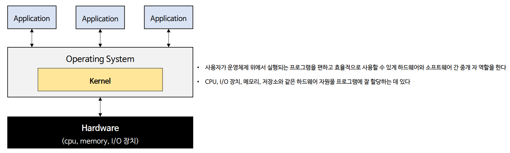
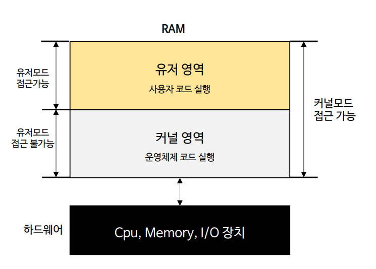
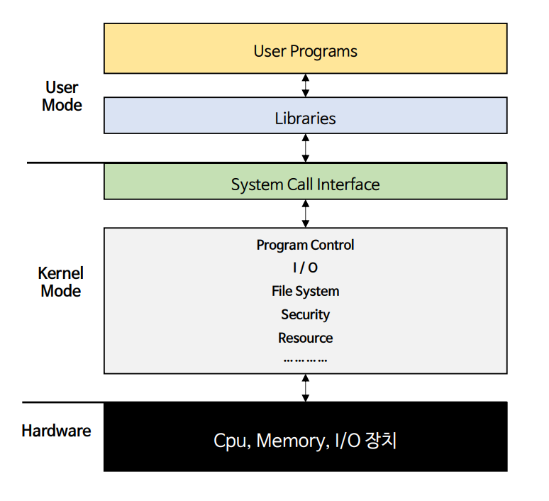
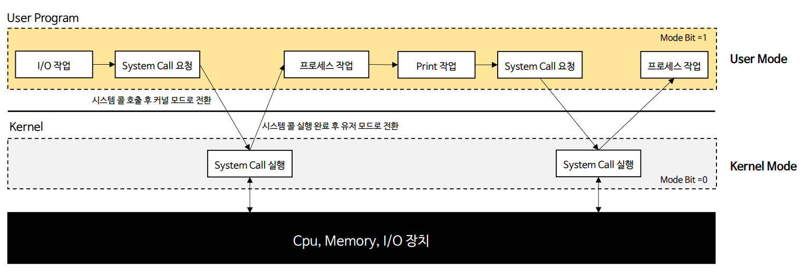

# 자바 동시성 프로그래밍 - 운영 체제 기본 지식

# 사용자 모드 & 커널 모드

- 운영체제는 사용자가 컴퓨터 시스템을 편리하게 사용할 수 있는 환경을 제공하고 컴퓨터 시스템의 자원을 효율적으로 관리하는 소프트웨어이다.
- 운영체제의 여러 기능 중 **핵심 기능을 담당하는 부분을 커널(Kernel)** 이라고 한다.

- **운영체제는 응용 프로그램이 하드웨어 자원에 직접 접근하는 것을 방지하여 자원을 보호한다.**
  - 응용 프로그램이 하드웨어 자원에 직접 접근해서 조작 할 수 있다면 자원 관리가 되지 않고, 프로세스 간 데이터가 훼손되어 최악의 경우 컴퓨터 시스템 전체에 오류를 가져오게 된다.
  - 응용 프로그램이 하드웨어 자원에 접근하려고 할 때는 반드시 운영체제를 통해서만 접근하도록 한다.

---

## CPU 권한 모드

- CPU는 명령어를 실행할 때 사용자 모드(user mode)와 커널 모드(kernel mode) 두 가지 권한 모드로 구분해서 실행한다.
- CPU는 동작하는 동안 두 가지 모드를 번갈아 가면서 수행한다.

### 사용자 모드 (Mode Bit = 1)

- 사용자 응용 프로그램의 코드가 실행되는 모드로서, 메모리의 유저 영역만 접근 가능
- 디스크, 메모리, 프린터 및 여러 I/O 장치들과 같은 특정 리소스들에 직접 접근할 수 없다.
- 대부분의 응용 프로그램은 입출력 장치나 파일로의 접근이 필요하기 때문에 이때는 **유저 모드에서 커널 모드로의 전환이 되어야 한다.**

### 커널 모드 (Mode Bit = 0)

- 커널 영역의 코드가 실행되는 모드로서, 메모리의 유저 영역, 커널 영역 모두 접근 가능
- 하드웨어 자원에 직접 접근할 수 있다.

---

## 시스템 호출 (System Call)

- **응용 프로그램이 운영체제의 커널이 제공하는 서비스를 이용할 수 있도록 커널 모드에 접근하기 위한 인터페이스**
- 응용 프로그램이 파일 입출력이나 화면에 메시지를 출력하는 등의 기능은 커널 모드일 때 CPU가 실행하기 때문에 반드시 시스템 콜을 사용해서 커널 모드로 전환해야 한다.

### 시스템 호출 동작 과정

- 사용자 응용 프로그램은 작업 과정에서 커널의 기능을 사용하기 위해 매우 빈번하게 시스템 콜을 요청하고, 이로 인해 사용자 모드와 커널 모드를 상호 전환하며 실행하게 된다.
- I/O 처리를 위해 사용자 모드와 커널 모드를 번걸아 오가는 것은 컨텍스트 스위칭과 관련이 있으며, 이는 멀티 스레드 환경에서 참고해야 할 중요한 배경적 지식이다.

---

[이전 ↩️ - 운영 체제 기본 지식 - CPU & I/O Bound](https://github.com/genesis12345678/TIL/blob/main/Java/reactive/os/Bound.md)

[메인 ⏫](https://github.com/genesis12345678/TIL/blob/main/Java/reactive/Main.md)

[다음 ↪️ - 운영 체제 기본 지식 - 사용자 & 커널 수준 스레드](https://github.com/genesis12345678/TIL/blob/main/Java/reactive/os/LevelThread.md)