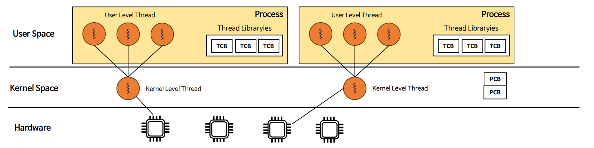
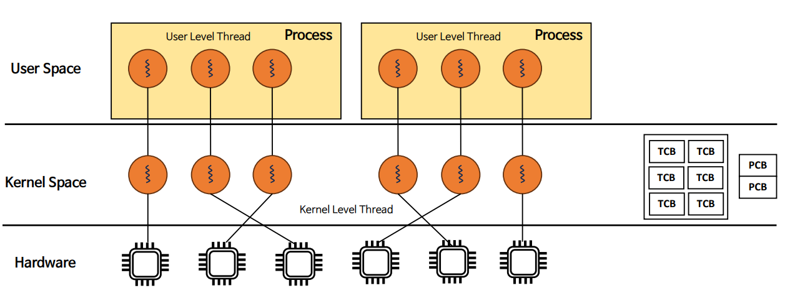
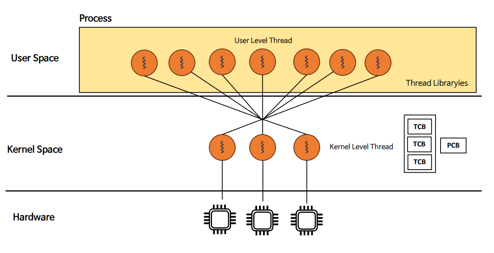

# 자바 동시성 프로그래밍 - 운영 체제 기본 지식

# 사용자 수준 스레드 & 커널 수준 스레드

- 스레드는 크게 **사용자 수준 스레드**와 **커널 수준 스레드**로 구분한다.
- 사용자 수준 스레드는 사용자 프로그램에서 관리하는 스레드고, 커널 수준 스레드는 OS 에서 관리하는 스레드이다.

---

## 사용자 수준 스레드 (User Level Thread)

- 사용자 수준 스레드란 사용자 영역에서 스레드 라이브러리(Pthreads, Window Threads, Java Threads(JVM))에 의해 스레드의 생성과 종료, 스레드간 메시지 전달, 스레드의 스케줄링 보관 등 모든 것을 관리한다.
- **커널은 사용자 수준 스레드에 대해 알지 못하며 단일 스레드 프로세스인 것처럼 관리한다.**

---

## 커널 수준 스레드 (Kernel Level Thread)

- 커널 수준 스레드란 커널이 스레드와 관련된  모든 작업을 관리한다.(PCB와 TCB 관리 및 유지)
- 커널은 커널 스레드의 모든 정보를 알고 있으며, 커널 스레드는 OS 스케줄러에 의해서 스케줄링 된다.
- **CPU는 커널에 의해 생성된 커널 스레드의 실행 만을 담당한다.**

---

## 멀티 스레딩 모델

- CPU는 OS 스케줄러가 예약하는 커널 스레드만 할당받아 실행시키기 때문에 사용자 수준 스레드는 커널 수준 스레드와의 매핑이 필요하다.
- 사용자 수준 스레드는 다대일, 일대일, 다대다 세 가지 모델로 커널 수준 스레드와 매핑하여 구현할 수 있다.

### 다대일 스레드 매핑

다수의 사용자 수준 스레드가 커널 수준 스레드 한개에 매핑하는 유형으로, 사용자 수준의 스레드 모델이라 볼 수 있다.

- 커널 개입 없이 사용자 스레드끼리의 스위칭이 발생하기 때문에 오버헤드가 적다.
- 스케줄링이나 동기화를 위해 커널을 호출하지 않으므로 커널 영역으로 전환하는 오버헤드가 줄어든다.
- 개별 스레드 단위가 아닌 단일 스레드의 프로세스 단위로 프로세스를 할당하기 때문에 멀티 코어를 활용한 병렬 처리를 할 수 없다.
- 한 스레드가 Block I/O 가 발생하면 모든 스레드들이 Block 이 발생하는데 이는 프로세스 자체를 Block 하기 때문이다.
- 자바에서 초기 버전의 Green Thread 가 이 모델에 해당한다고 볼 수 있다.

### 일대일 스레드 매핑

사용자 수준 스레드와 커널 수준 스레드가 일대일로 매핑하는 유형으로, 커널 수준의 스레드 모델이라 볼 수 있다.

- 커널이 전체 프로세스와 스레드 정보를 유지해야 하기 때문에 컨텍스트 스위칭 시 사용자 모드에서 커널 모드로 전환해서 스케줄링 하는 등의 오버헤드가 발생한다.
- 자원 한정으로 인해 스레드를 무한정으로 생성할 수 없다.(대안으로 스레드 풀을 활용하기도 한다.)
- 스레드 단위로 CPU를 할당하기 때문에 멀티 코어를 활용한 병렬 처리가 가능하다.
- 스레드 중 한 개가 대기 상태가 되더라도 다른 스레드를 실행할 수 있다. 즉, 멀티 스레드의 동시성을 활용할 수 있다.
- 자바에서 Native Thread 가 이 모델에 해당한다고 볼 수 있다.

### 다대다 스레드 매핑

- 여러 개의 사용자 수준 스레드를 같은 수 또는 그보다 작은 수의 커널 수준 스레드로 매핑하는 유형이다.
- 각 커널 수준의 스레드가 사용자 수준의 스레드 한 개 이상과 매핑된다.
- 다대다 모델은 다대일, 일대일 모델의 단점을 어느 정도 해결하여, 개발자는 필요한 만큼 사용자 수준 스레드를 생성할 수 있고, 커널 수준 스레드가
    멀티 프로세서에서 병렬로 수행될 수 있다.
- 사용자 수준 스레드가 I/O 시스템 콜을 발생시켰을 때, 커널이 다른 스레드의 수행을 스케줄링 할 수 있다.

---

[이전 ↩️ - 운영 체제 기본 지식 - 사용자 & 커널 모드](https://github.com/genesis12345678/TIL/blob/main/Java/reactive/os/KernelMode.md)

[메인 ⏫](https://github.com/genesis12345678/TIL/blob/main/Java/reactive/Main.md)

[다음 ↪️ - Java Thread - 스레드 생성](https://github.com/genesis12345678/TIL/blob/main/Java/reactive/javathread/%EC%83%9D%EC%84%B1/%EC%8A%A4%EB%A0%88%EB%93%9C%EC%83%9D%EC%84%B1.md)