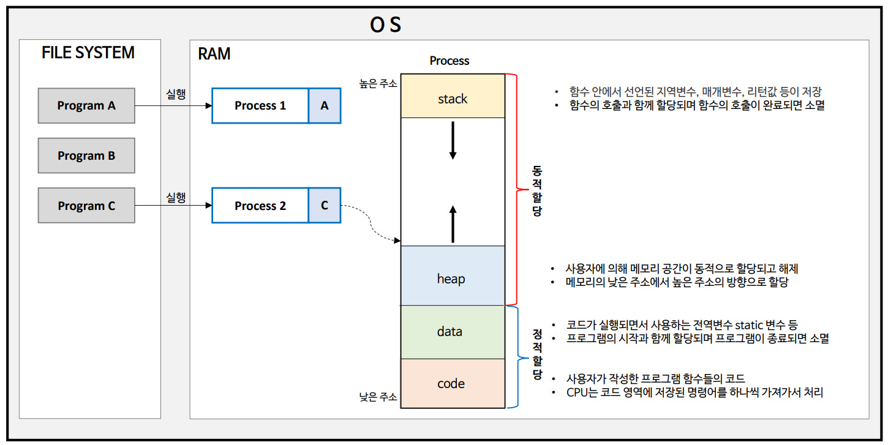
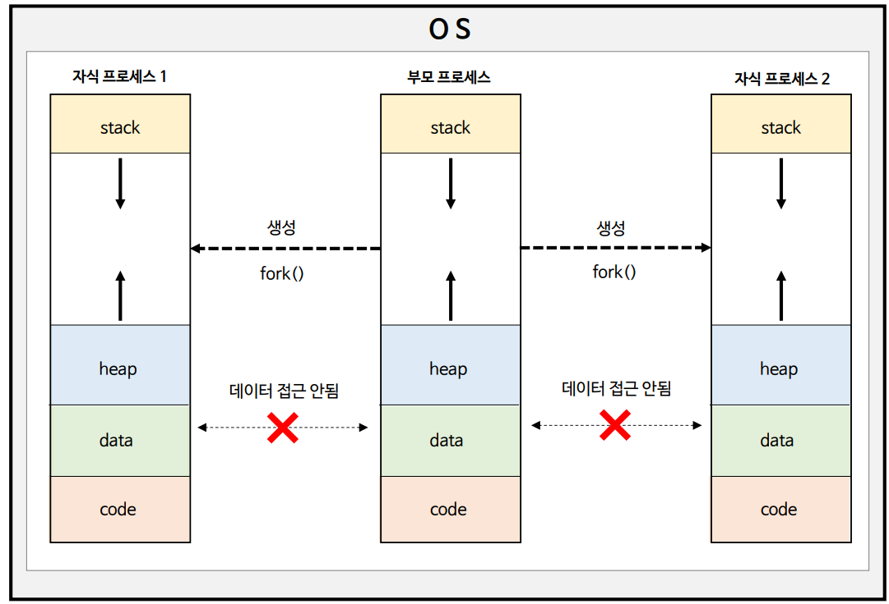
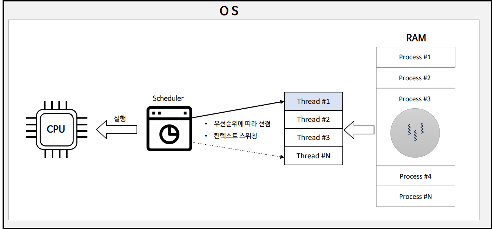

# 자바 동시성 프로그래밍 - 운영 체제 기본 지식

# 프로세스와 스레드

## 프로세스 (Process)

- 운영체제에 의해 파일 시스템에 설치되어 있는 파일을 프로그램이라 한다.
- **프로세스는 프로그램의 실제 실행**을 의미하며 프로그램 파일을 실행함으로써 프로그램 데이터들이 메모리에 올라와 **CPU를 할당받고 명령을 수행하는 있는 상태**이다.
- **프로세스는 운영체제로부터 자원을 할당받은 최소 작업 단위이다.**

- 운영체제는 프로세스마다 각각 독립된 메모리 영역을 `code`, `data`, `stack`, `heap` 형식으로 할당해준다.
- 독립된 메모리 영역을 할당해 주기 때문에 프로세스 간 영향을 받지 않고 독립적인 작업을 수행할 수 있다.
- 기본적으로 다른 프로세스의 변수나 자료에 접근할 수 없다.
  - IPC나 공유 메모리 등의 통신 기법들을 사용하여 프로세스 간 통신이 가능하긴 하다.
  - 프로세스들끼리 데이터를 공유하는 것은 모든 자원을 처음부터 공유하고 있는 스레드에 비하면 어렵고 까다로울 뿐 불가능한 것은 아니다.

---

## 스레드 (Thread)

- 스레드는 프로세스가 운영체제로부터 할당 받은 자원을 이용하는 실행 단위 또는 흐름의 단위로써 **하나의 프로세스는 반드시 하나 이상의 스레드를 갖는다.**
- 프로세스 내에서 각 필요한 `stack`만 할당받고 `code`, `data`, `heap` 영역은 공유해서 각 스레드가 공유한다.
- 스레드 간 메모리 스택 영역에 접근할 수 없으므로 스레드는 독립적인 실행 흐름을 가질 수 있게 되어 독립적인 함수 호출이 가능해진다.

---

## 스레드와 CPU

- **스레드는 운영체제의 스케줄러에 의해 관리되는 CPU의 최소 실행 단위를 의미한다.**
- 스케줄러의 알고리즘에 따라 프로세스에 속한 한 개의 스레드가 선점되어 CPU에 할당된다.
- 스레드 간 선점이 일어날 때 CPU의 실행 흐름(문맥)이 전환되는 컨텍스트 스위칭이 발생한다.

---

## 프로세스 vs 스레드

- **프로세스(Process)**
  - 여러 개의 자식 프로세스 중 하나에 문제가 발생하면 그 자식 프로세스만 죽고 다른 프로세스에게 영향을 미치지 않는다. 즉, 프로그램 전체의 안전성을 확보할 수 있다.
  - 프로세스 간 전환(컨텍스트 스위칭) 시 레지스터, 캐시 메모리 초기화 등 무거운 작업으로 인한 시간적인 비용이 많이 발생한다.
  - 프로세스 간 통신 기법(IPC, 공유 메모리 등)이 어렵고 복잡해서 통신으로 인한 오버헤드가 크다.
  - 프로세스 생성 시 독립적으로 메모리가 할당되기 때문에 리소스 비용이 크다.
- **스레드(Thread)**
  - 여러 개의 스레드 중 하나에 문제가 발생하면 전체 프로세스에 영향을 미치게 된다.
  - 프로세스의 메모리 영역을 공유하기 때문에 컨텍스트 스위칭 시간이 적고 리소스를 효율적으로 사용한다.
  - 스레드 간 통신 비용이 적어 통신으로 인한 오버헤드가 적다.
  - 스레드 간 공유 메모리 영역의 동시 접근으로 인한 동기화 문제가 발생한다.
  - 하나의 스레드에서 오류가 발생할 경우 프로세스 자체가 종료될 수 있다.

---

[메인 ⏫](https://github.com/genesis12345678/TIL/blob/main/Java/reactive/Main.md)

[다음 ↪️ - 운영 체제 기본 지식 - 동시성과 병렬성]()