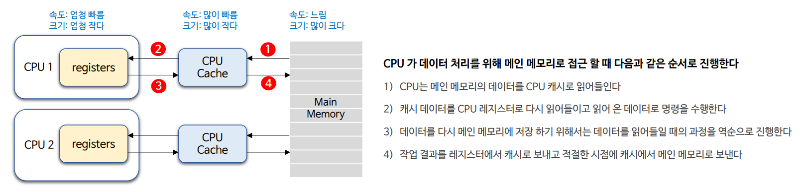
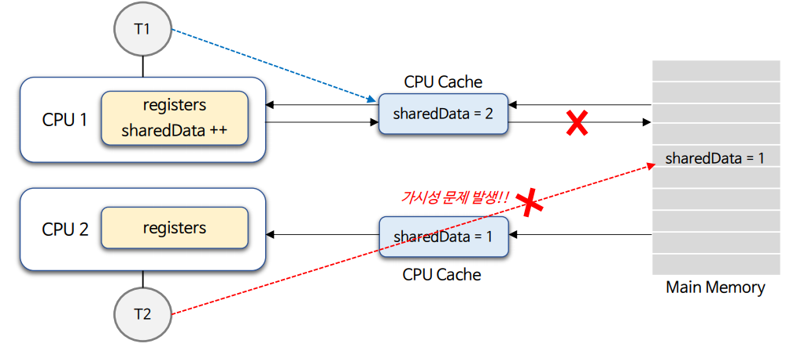
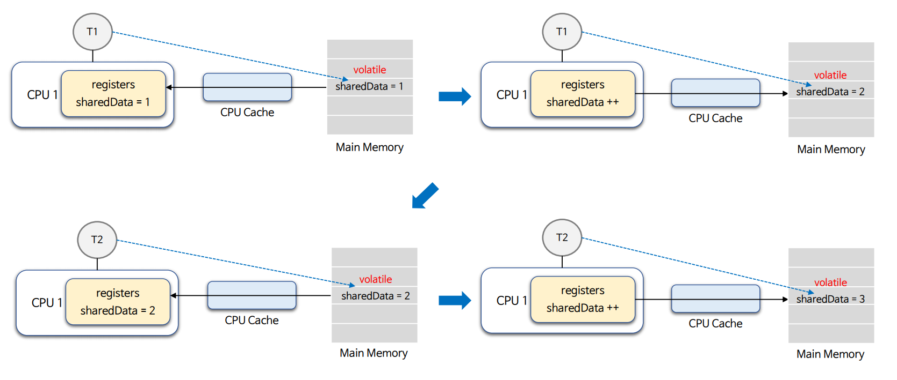
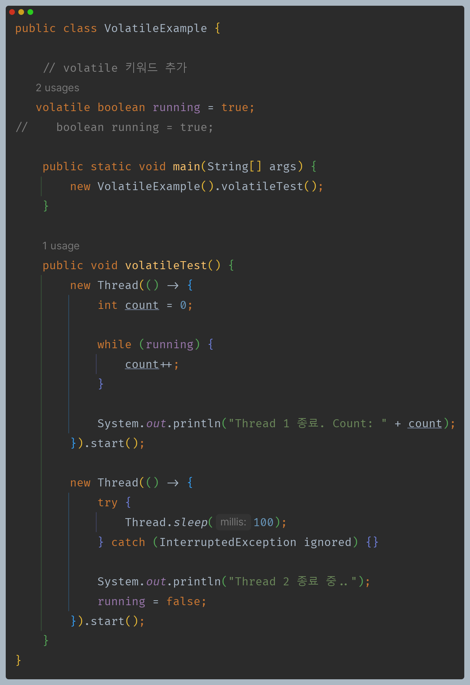
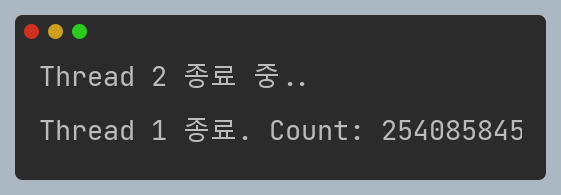
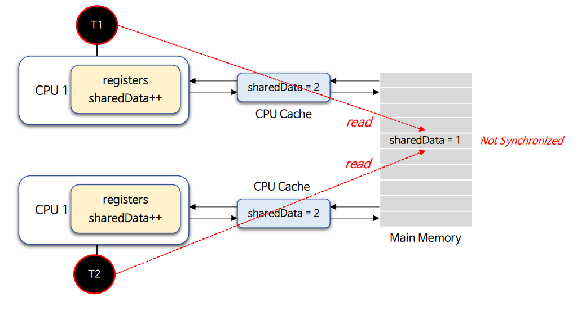
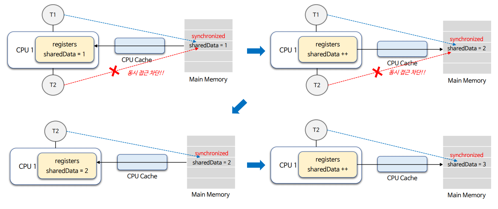
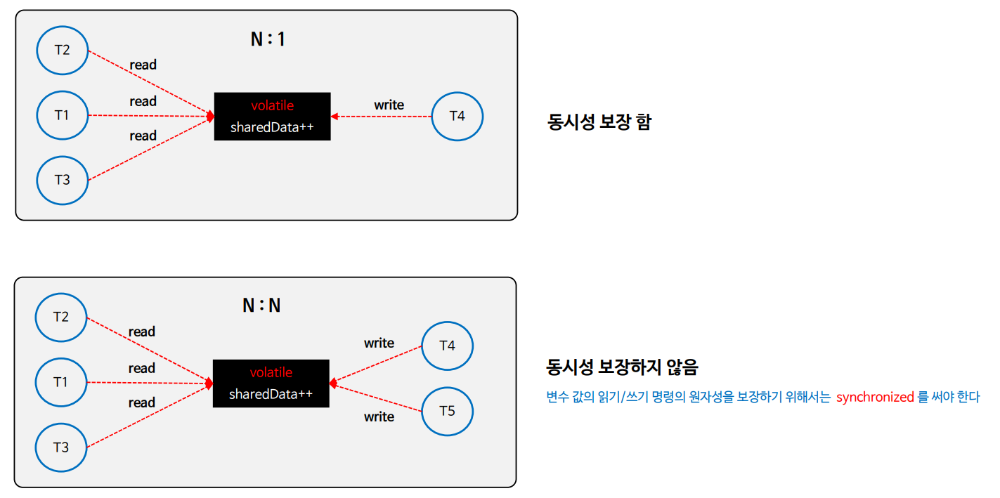
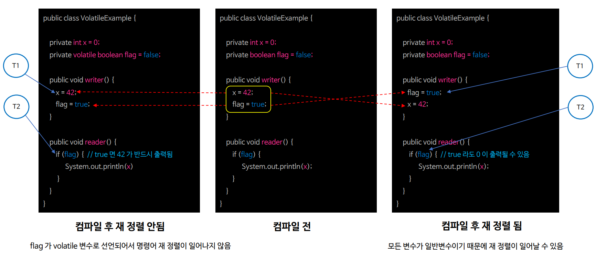

# 자바 동시성 프로그래밍 - Java Synchronization

## volatile - 메모리 동기화

- `volatile`은 **변수의 가시성과 연산의 순서를 제어**하기 위해 사용하는 키워드로서 **스레드 간의 데이터 일관성과 가시성을 보장하는 역할**을 한다.

### CPU 캐시 메모리와 메인 메모리

- 현대 컴퓨터는 거의 대부분 2개 이상의 CPU가 장착되어 있으며 각 코어에는 **레지스터와 캐시 메모리**가 존재한다.
- CPU 캐시 메모리는 CPU 레지스터와 메인 메모리 사이에서 데이터 흐름을 최적화하고 성능을 향상시키기 위해 사용되는 고속 메모리이다.
- **CPU는 값을 읽어올 때 우선 캐시에 해당 값이 있는지 확인하고 없는 경우에만 메인 메모리에서 읽어오는 특성을 가진다.**

- **CPU는 처리 성능을 높이기 위해서 속도가 느린 메인 메모리에서 데이터를 읽고 쓰는 대신 속도가 빠른 CPU 캐시 메모리에서 데이터를 읽고 저장하는 메커니즘을 수행한다.**
- **멀티 스레드 환경에서 CPU에 할당된 스레드가 메인 메모리가 아닌 CPU 캐시에서 공유 변수를 참조하게 되면 서로 다른 변수 값을 스레드가 참조하게 되는 상황이 발생하게 된다.**

---

## 가시성 (visibility)

- 멀티 스레드 환경에서 공유 변수의 변경 내용이 한 스레드에서 다른 스레드에게 어떻게 보이는지를 나타내는 개념을 말한다.
- 멀티 스레드 프로그래밍에서는 여러 스레드가 동시에 변수에 액세스하고 수정할 수 있기 때문에 모든 스레드에게 변수의 값이 일관되게 보여지도록 가시성이 확보되어야 한다.

### 가시성 문제

- CPU 캐시에서 작업한 결과가 메인 메모리에 즉시 반영 되지 않을 경우 스레드 간에 결과가 다르게 보여지는 현상을 말한다.

1. `CPU 1`은 메인 메모리로부터 값을 읽어와서 1을 더한 값을 캐시에 저장하고 메인 메모리에 반영하지 않는다.
2. `T2`는 `CPU 1`에서 변경한 데이터가 메인 메모리에 반영되지 않은 상태에서 값을 읽기 때문에 두 스레드는 서로 다른 캐시 값을 바라보는 가시성 문제가 발생한다.
3. **스레드 간 가시성을 확보하기 위해서는 CPU가 작업한 결과를 즉시 메인 메모리에 반영해야 하며 스레드는 캐시가 아닌 메인 메모리에서 값을 참조해야 한다.**

---

## volatile 원리

- 캐시 메모리 현상으로 공유 변수에 대해 스레드 간 가시성 문제가 발생할 경우 `volatile` 키워드를 사용하면 가시성 문제를 해결할 수 있다.
- 공유 변수에 `volatile` 키워드를 선언하면 **CPU가 데이터 작업을 할 때 메인 메모리에서 공유 변수를 직접 읽고 수정된 결과를 메인 메모리에 즉시 반영하여 가시성 문제를 해결한다.**

- `volatile` 키워드를 사용하지 않으면 다른 스레드에서 수정한 공유 변수 값을 제대로 읽어오지 못해 `while` 문을 무한 반복하게 된다.
- 하지만 `volatile` 키워드를 사용하면 변경된 공유 변수 값을 메인 메모리에서 제대로 읽어와 무한 반복을 빠져나올 수 있게 된다.

---

## 경쟁 조건 (Race Condition)

- 스레드 간 경쟁 조건을 벌여 CPU의 캐시 메모리에 비정상적인 데이터가 저장되고 잘못된 결과 데이터가 메인 메모리에 업데이트 되는 현상이 발생한다.

1. `CPU 1`, `CPU 2`가 동시에 메모리에서 값을 읽어와서 1을 더한 값을 캐시에 저장한다.
2. `CPU 1`, `CPU 2`에 할당된 스레드들은 경쟁 조건으로 인해 두 캐시에 똑같은 값(2)을 저장한다.
3. 캐시 값을 메인 메모리에 반영 하더라도 캐시 자체가 이미 잘못된 값을 가지고 있기 때문에 프로그램은 비정상적으로 동작하게 된다.

---

## synchronized

- `synchronized` 블록을 사용하면 한 시점에 오직 하나의 스레드만이 동기화 영역에 접근할 수 있도록 보장해준다.(상호 배제)
- `synchronized` 블록 안에서 참조되는 모든 변수들은 메인 메모리로부터 읽어들여지고, 블록을 벗어나면 그 동안 수정된 모든 변수들이 즉시 메인 메모리로 반영될 수 있도록 해준다.
- `synchronized` 는 상호 배제와 함께 가시성의 문제까지 해결할 수 있는 기능을 포함하고 있다.
  - `synchronized` 블록 내에서는 `volatile` 키워드가 없어도 된다.

---

## volatile 한계점

- `volatile`은 스레드 간 공유 변수에 대한 가시성을 보장하지만 동시적 상호 배제를 보장해 주지 않는다.
- `volatile` 변수를 읽기 작업하는 스레드와 쓰기 작업하는 스레드가 `N : 1` 의 상황에서는 동시성을 보장하지만 `N : N`의 상호아에서는 동시성을 보장해 주지 못한다.

---

## Happens-Before 보장

- JVM은 프로그램의 성능을 향상시키기 위해 명령어를 재정렬 하는데, `volatile` 변수를 사용하면 해당 변수를 읽거나 쓰는 작업은 특별한 규칙에 따라 재정렬되지 않도록 보장한다.
- 즉, `volatile` 변수 전과 후에 실행되는 명령들은 JVM 컴파일러에 의해 재정렬 될 수 있으나 `volatile` 변수에 대한 명령 이전 / 이후에 존재한다는 규칙은 반드시 지켜진다.

---

[이전 ↩️ - Java Synchronization - 스레드 간 협력(`wait()` & `notify()`)]()

[메인 ⏫](https://github.com/genesis12345678/TIL/blob/main/Java/reactive/Main.md)

[다음 ↪️ - Java Synchronization - 교착 상태(DeadLock)]()