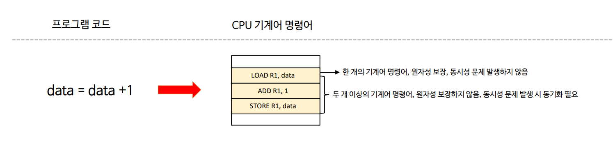
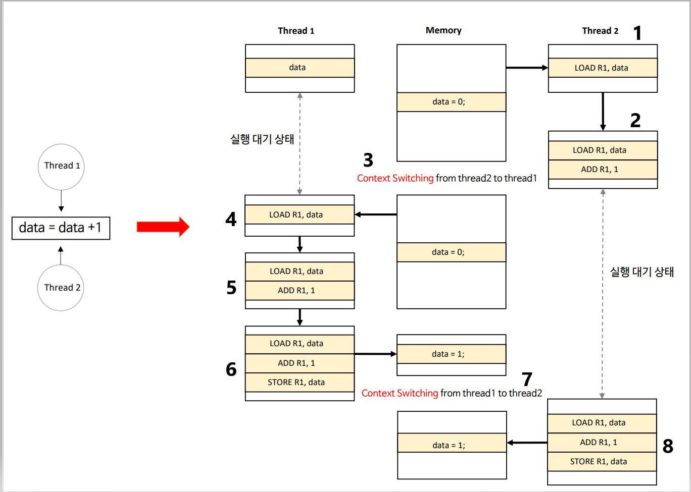
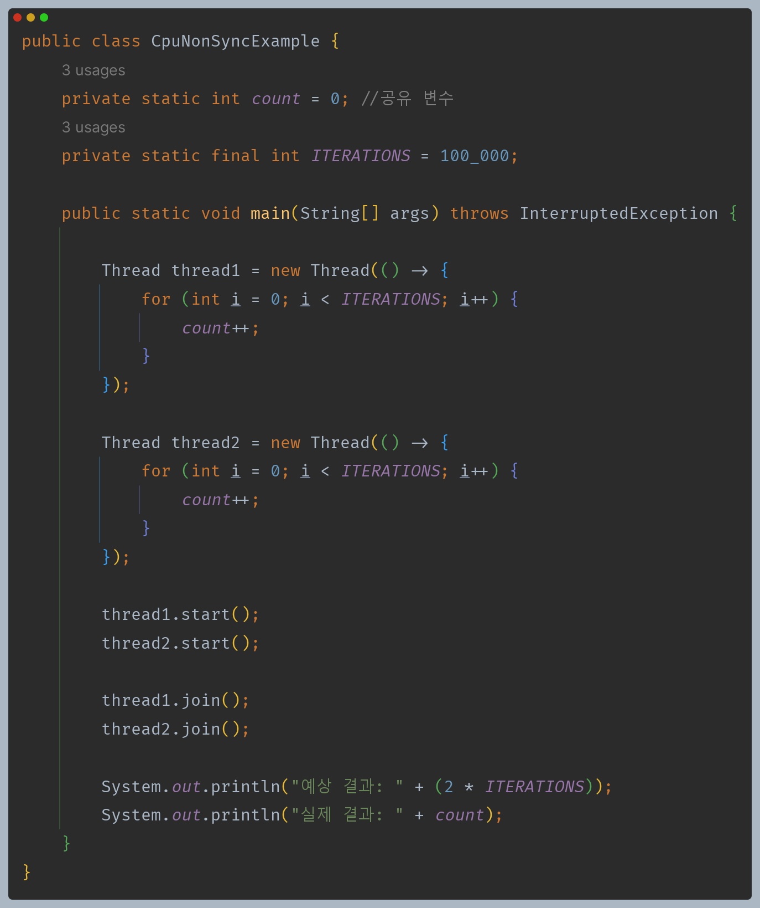
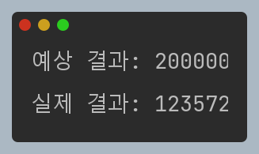
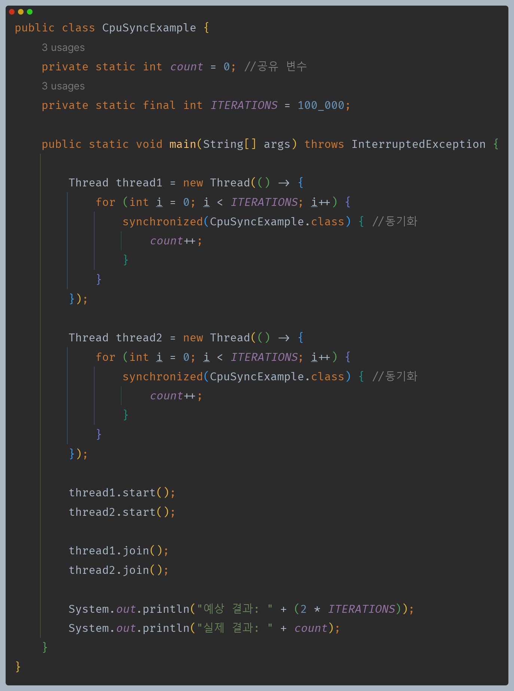
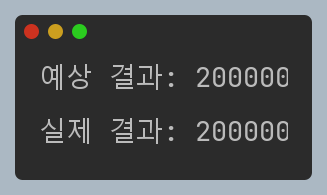

# 자바 동시성 프로그래밍 - 동기화 개념

## 동기화와 CPU 관계

### 동기화(Synchronization) 란

- 프로세스 혹은 스레드 간 공유 영역에 대한 동시 접근으로 인해 발생하는 데이터 불일치를 막고 데이터 일관성을 유지하기 위해 순차적으로 공유 영역을
    수행하도록 보장하는 메커니즘이다.

### CPU 연산 처리 이해

- 모든 기계어 명령은 원자성을 갖는데 이는 하나의 기계어 명령어가 실행을 시작할 경우 그 명령의 수행 종료 시 까지는 인터럽트를 받지 않는다. 분리 불가능 이라고도 한다.
- CPU가 두 개 이상의 명령어를 처리할 경우에는 원자성이 보장되지 않는데 이는 각 명령을 수행하는 중에 OS가 다른 스케줄링으로 CPU에게 다른 명령을 수행하게
    함으로써 현재 수행 중인 명령을 인터럽트, 즉 중단하게 된다는 의미이다.
- 두 개 이상의 명령어를 원자성으로 묶기 위해서는 스레드 간 동기화 메커니즘이 필요하다. 즉, 한 스레드가 모든 명령을 다 수행할 때까지 도중에 중단되지 않도록 해야 한다.

**CPU 에서 원자성을 보장하지 않는 모든 연산 처리는 스레드 간 동시적 접근에 의해 데이터 불일치가 발생할 수 있다.**

---

## 스레드 간 데이터 불일치 흐름도

---

## 예제 코드

### 1. CPU 원자성 미보장

> 실행할 때마다 값이 다르게 나온다.

### 2. CPU 원자성 보장

> 동기화 기법으로 데이터 불일치를 방지할 수 있다.

---

[이전 ↩️ - 동기화 개념 - 싱글 스레드와 멀티 스레드](https://github.com/genesis12345678/TIL/blob/main/Java/reactive/synchronization/%EA%B0%9C%EB%85%90/singleMultiThread.md)

[메인 ⏫](https://github.com/genesis12345678/TIL/blob/main/Java/reactive/Main.md)

[다음 ↪️ - 동기화 개념 - 임계 영역](https://github.com/genesis12345678/TIL/blob/main/Java/reactive/synchronization/%EA%B0%9C%EB%85%90/CriticalSection.md)