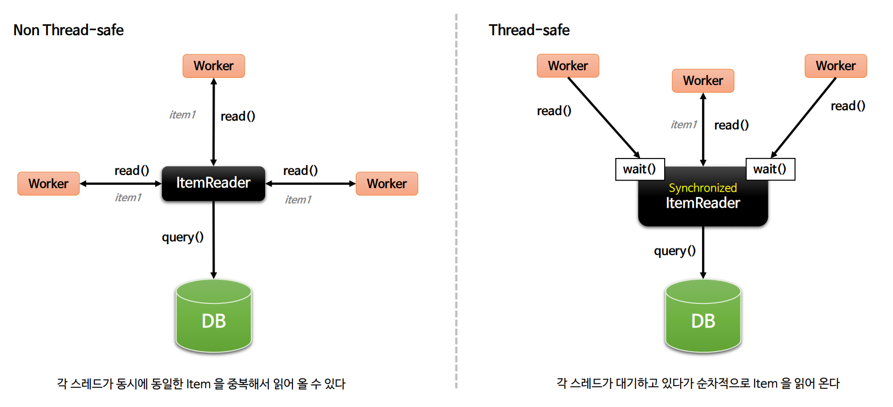
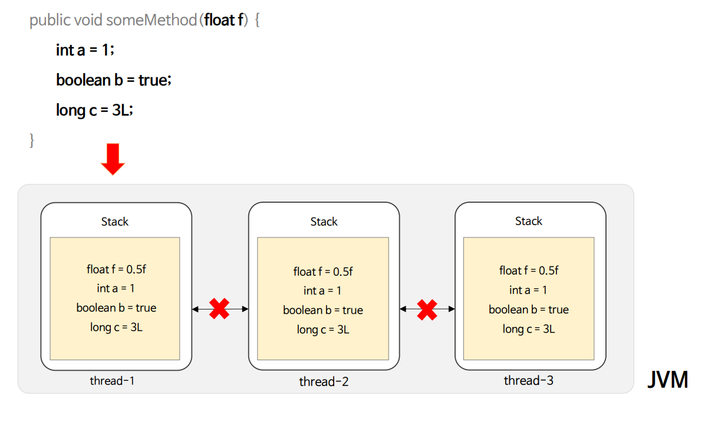
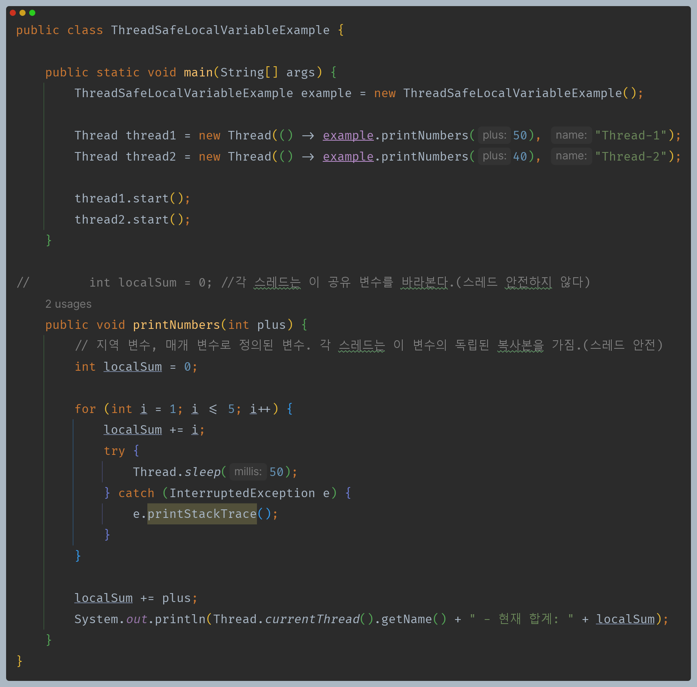
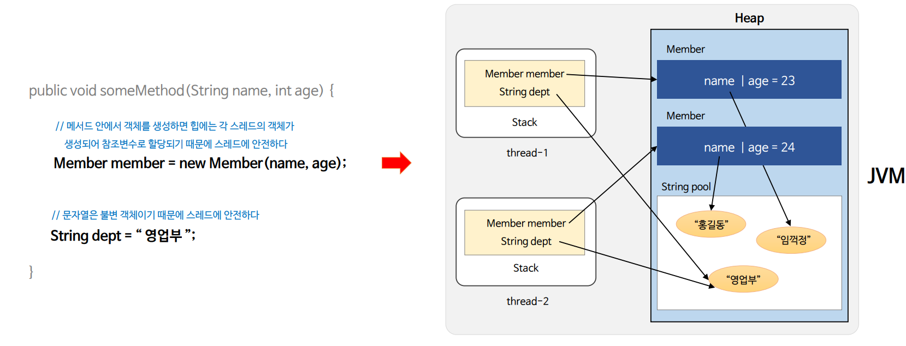
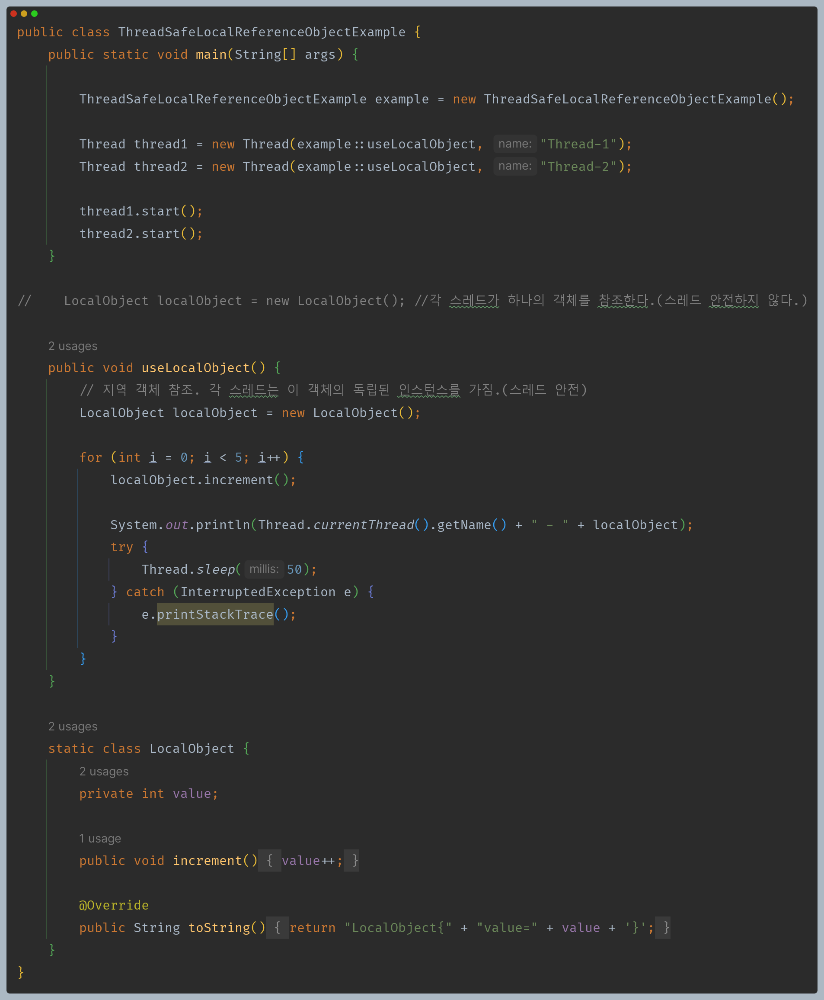
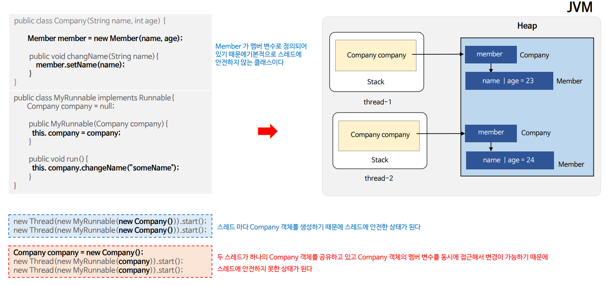
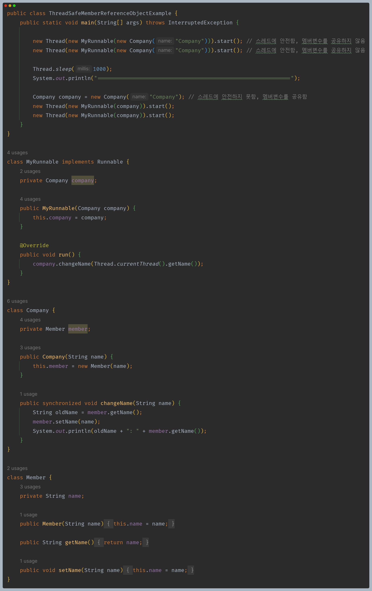
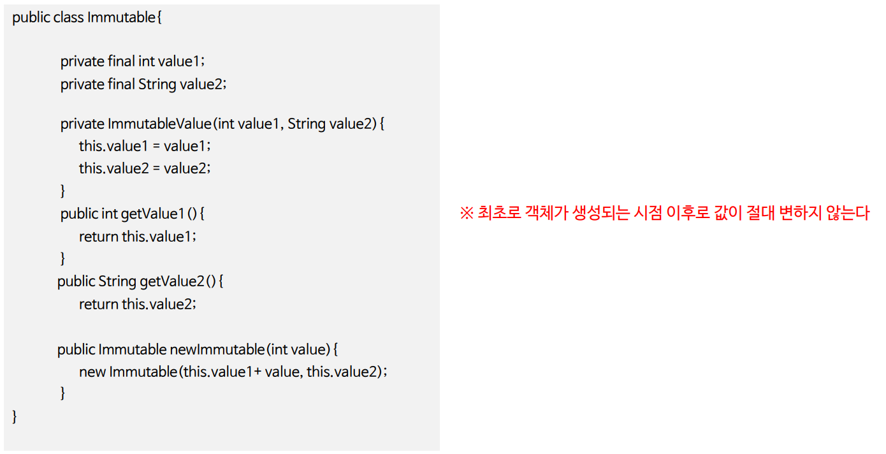
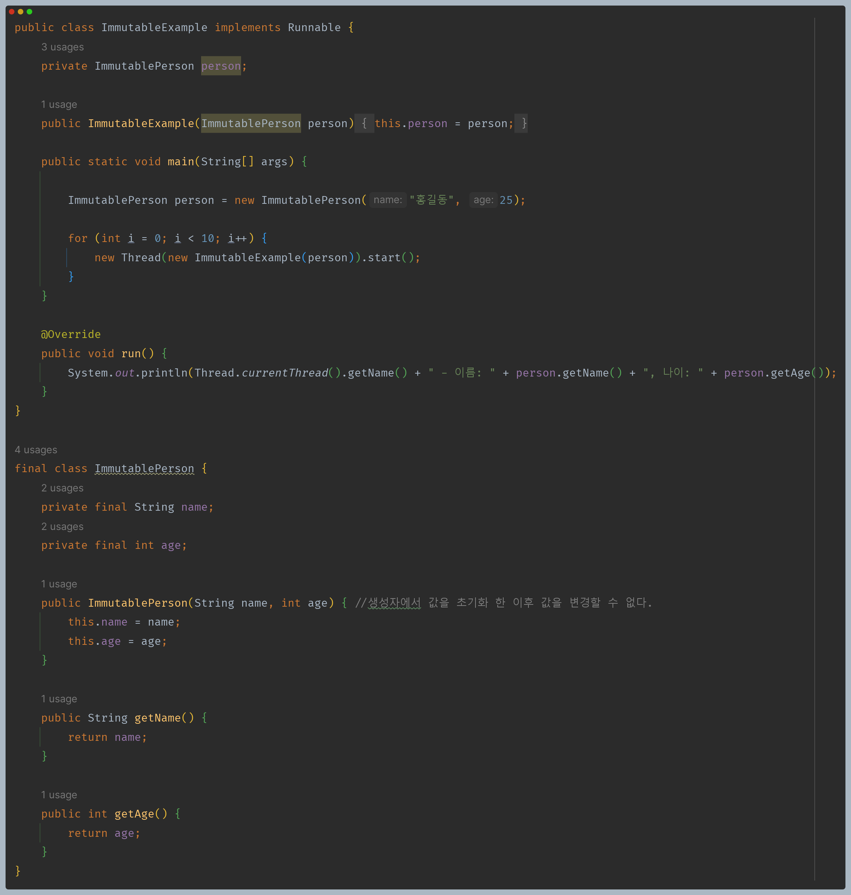

# 자바 동시성 프로그래밍 - 동기화 개념

## 안전한 스레드 구성

- 여러 스레드에서 클래스나 객체에 동시에 접근해서 계속 실행하더라도 지속적인 정확성이 보장되는 코드를 스레드 세이프, 즉 스레드에 안전하다고 한다.
- 기본적으로 클래스 명세에 스레드 안전성을 헤치는 코드나 상태를 가지고 있지 않으면 스레드에 안전하다라고 정의할 수 있다.
- 스레드에 안전한 코드에는 경쟁 상태가 없으며 경쟁 상태는 다수의 스레드가 공유 자원에 쓰기 작업을 시도할 때 발생하기 때문에 스레드가 실행될 때 어떤 자원을
    공유하게 되는지 아는 것이 중요하다.

---

## 스레드에 안전한 구조

### 1. 임계 영역을 동기화 한다.

동시에 여러 개의 스레드가 임계 영역을 접근하지 못하도록 락 메커니즘을 사용한다.

### 2. 동기화 도구를 사용한다.

세마포어, CAS, Atomic 변수, 동시성 자료 구조 등의 동기화 도구들을 사용해서 스레드 안전성을 구현한다.

### 3. 스레드의 스택에 한정해서 상태를 관리한다.

스레드마다 할당된 스택 메모리 내에서 상태를 관리함으로써 다른 스레드와 상태를 공유할 수 없도록 한다.

- **지역 변수**
  - 기본형 지역 변수는 스레드마다 독립적으로 가지고 있는 스택에 저장되기 때문에 스레드 간에 공유될 수 없다. 즉 스레드에 안전하다.
  - 메서드로 전달되는 기본형 파라미터 변수도 스택에서만 관리되므로 스레드에 안전하다.

- **지역 객체 참조**
  - 지역 변수라 할지라도 객체 참조 변수는 기본형과 다른 점이 있는데 객체는 스택에 저장되지 않고 메모리의 `heap` 영역에 저장된다는 점이다.
  - 지역적으로 생성된 객체가 해당 메서드에서 벗어나지 않고 사용 된다면 스레드는 자신만의 객체를 참조할 수 있게 되어 스레드에 안전하다.
  - **지역 참조 변수를 다른 클래스의 메서드에 파라미터로 넘겼을 때 해당 클래스가 파라미터 변수를 다른 스레드가 접근할 수 있는 멤버 변수로 저장했을 경우에는
    스레드에 안전하지 않다.**
  - 문자열 같이 불변 객체는 상태가 변경되지 않기 때문에 스레드에 안전하다.

- **멤버 변수 참조**
  - 멤버 변수 참조 역시 스레드마다 객체를 생성하는 원리는 동일하다. 즉, 스레드의 스택별로 객체가 생성되어 참조되도록 구현하면 된다.

### 4. ThreadLocal 을 사용한다.

스레드마다 가지고 있는 전용 저장소인 `ThreadLocal`을 사용해서 상태를 관리함으로써 다른 스레드와 상태를 공유할 수 없도록 한다.

### 5. 불변 객체를 사용한다.

객체의 상태를 변경할 수 없는 클래스를 사용하거나 클래스를 설계할 때 상태를 변경할 수 없도록 만들어서 스레드에 안전하도록 한다.

- `setter` 메서드가 없다. 생성자에서 멤버 변수를 초기화하고, 멤버 변수는 `final`로 선언 등으로 불변 객체를 생성한다.
- 불변 객체는 어떠한 상황에도 상태가 변하지 않으므로 스레드에 안전하다고 할 수 있다.

---

[이전 ↩️ - 동기화 개념 - 임계 영역](https://github.com/genesis12345678/TIL/blob/main/Java/reactive/synchronization/%EA%B0%9C%EB%85%90/CriticalSection.md)

[메인 ⏫](https://github.com/genesis12345678/TIL/blob/main/Java/reactive/Main.md)

[다음 ↪️ - 동기화 기법 - 상호 배제](https://github.com/genesis12345678/TIL/blob/main/Java/reactive/synchronization/%EA%B8%B0%EB%B2%95/Mutex.md)