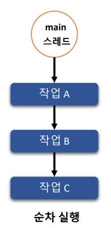
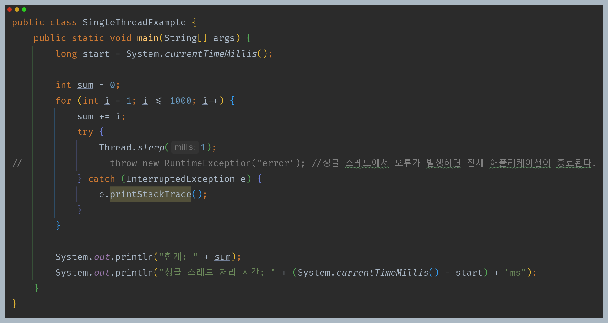
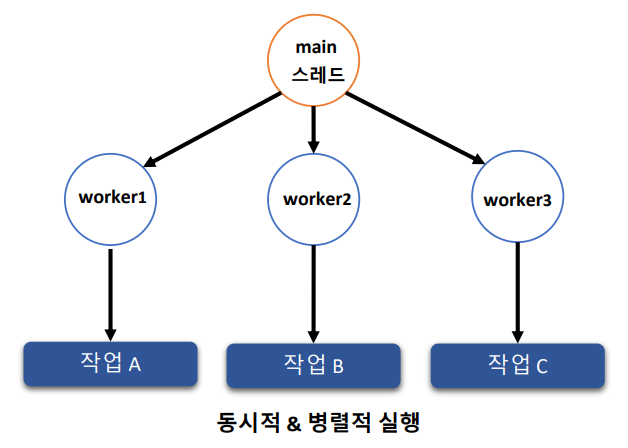
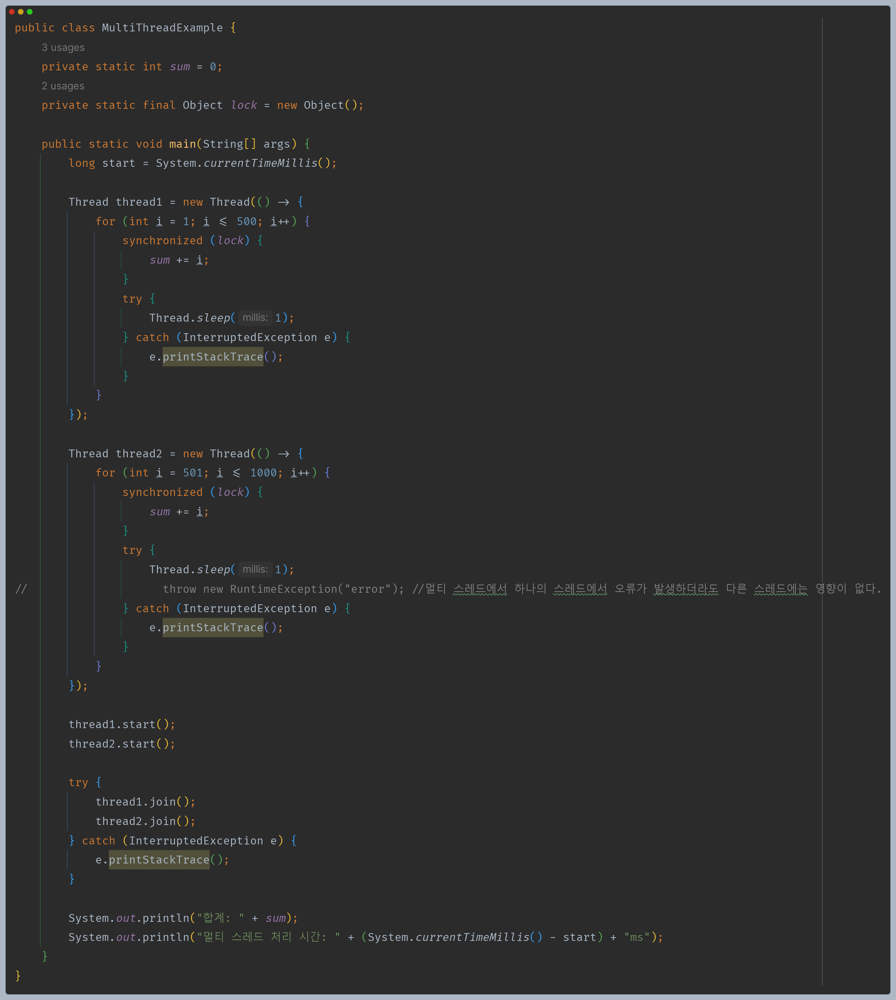
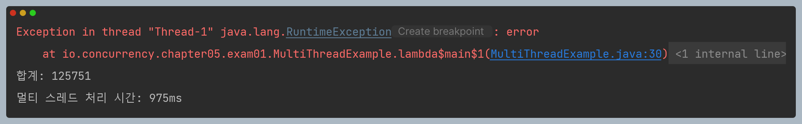
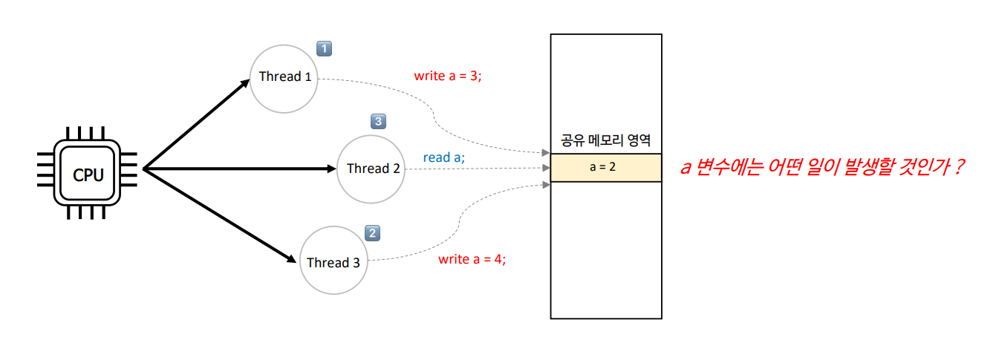

# 자바 동시성 프로그래밍 - 동기화 개념

## 싱글 스레드와 멀티 스레드

- 프로세스는 오직 한개의 스레드로만 구성하는 **싱글 스레드 프로세스**와 하나 이상의 스레드로 구성하는 **멀티 스레드 프로세스**로 구분할 수 있다.
- 작업 처리에 있어서 단일 스레드와 멀티 스레드의 선택 기준은 어떤 방식이 자원을 더 효율적으로 사용하고 성능 처리에 유리한가 하는 점이다.
- **현대 CPU는 대부분 멀티 코어를 지원하기 때문에 병렬적 성능 및 동시적 자원 사용 관점에서는 싱글 스레드보다 멀티 스레드 기반 프로그래밍이 유리한 점이 많다.**
- **싱글 스레드 혹은 아주 적은 스레드를 활용한 비동기 논블로킹 프로그래밍은 많은 수의 멀티 스레드 기반 프로그래밍보다 더 좋은 성능과 응답성을 보여줄 수 있다.**

### 단일 스레드 (순차 실행)

- **장점**
  - 문맥 교환이 없다.
  - 동기화 이슈가 없다.
  - 자원 비용이 적다.
  - 프로그래밍 난이도가 낮다.
- **단점**
  - CPU 멀티코어를 활용 못한다.
  - 순차적 실행으로 응답성 및 전체 처리량이 낮다.
  - I/O 처리 시 CPU가 낭비된다.
  - 스레드가 오류가 발생하면 프로그램이 종료된다.

- 싱글 스레드에서는 하나의 스레드로 전체 작업을 처리하기 때문에 스레드에서 오류가 발생하면 전체 애플리케이션이 종료된다.

### 멀티 스레드 (동시적 & 병렬적 실행)

- **장점**
  - 동시성으로 사용자의 응답성이 향상된다.
  - CPU 멀티 코어의 병렬성으로 성능이 향상된다.
  - CPU 낭비 없는 자원의 효율적인 사용이 가능하다.
  - 한 스레드 오류는 다른 스레드에 영향이 없다.
- **단점**
  - 빈번한 문맥 교환으로 성능이 저하될 수 있다.
  - 스레드 간 동기화 이슈가 발생한다.
  - 스레드 생성 비용이 적지 않다.
  - 프로그래밍 난이도가 높다.

- 멀티 스레드에서는 최소 두 개의 스레드가 동시적 & 병렬적으로 실행되기 때문에 하나의 스레드에서 오류가 발생하더라도 전체 애플리케이션은 종료되지 않는다.
- 또한 멀티 스레드가 싱글 스레드보다 전체 작업 처리 시간이 더 빠르다.

- 하지만 멀티 스레드에서는 동시성 문제가 발생하기 때문에 동기화 기법을 사용하지 않으면 예상하지 못한 결과를 얻을 수 있다.

---

## 멀티 스레딩과 동시성

- CPU의 동시적 작업 처리는 CPU 코어 개수보다 스레드의 개수가 많을 때 즉, 멀티 스레딩 환경에서 자원을 효율적으로 배분하고 사용하기 위해 설계된 방식이다.
- 같은 프로그램 안에서 실행되는 여러 스레드가 읽기 및 쓰기 작업을 같은 메모리 영역에서 동시에 실행할 경우 동시성 문제가 발생한다.
- 동시성 문제는 하나의 스레드가 어떤 메모리 영역의 데이터를 쓰고 있는데 또 다른 스레드가 같은 메모리 영역의 데이터를 읽거나 쓸 경우 발생할 수 있는 문제이다.
- 동시성 문제는 싱글 스레드에서는 절대 발생하지 않으며 멀티 스레드를 운용하는 애플리케이션에서 나타나는 현상이다.

**멀티 스레딩 환경에서 공유 자원을 선점하기 위해 발생하는 스레드 간의 동시성 문제는 자바 프로그램 개발에 있어서 반드시 숙지하고 이해해야 할 중요한 주제이다.**

---

[이전 ↩️ - Java Thread - ThreadLocal]()

[메인 ⏫](https://github.com/genesis12345678/TIL/blob/main/Java/reactive/Main.md)

[다음 ↪️ - 동기화 개념 - 동기화와 CPU 관계]()