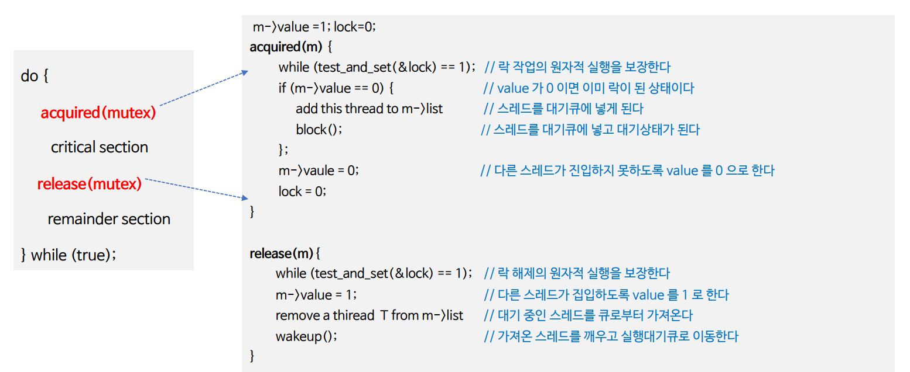
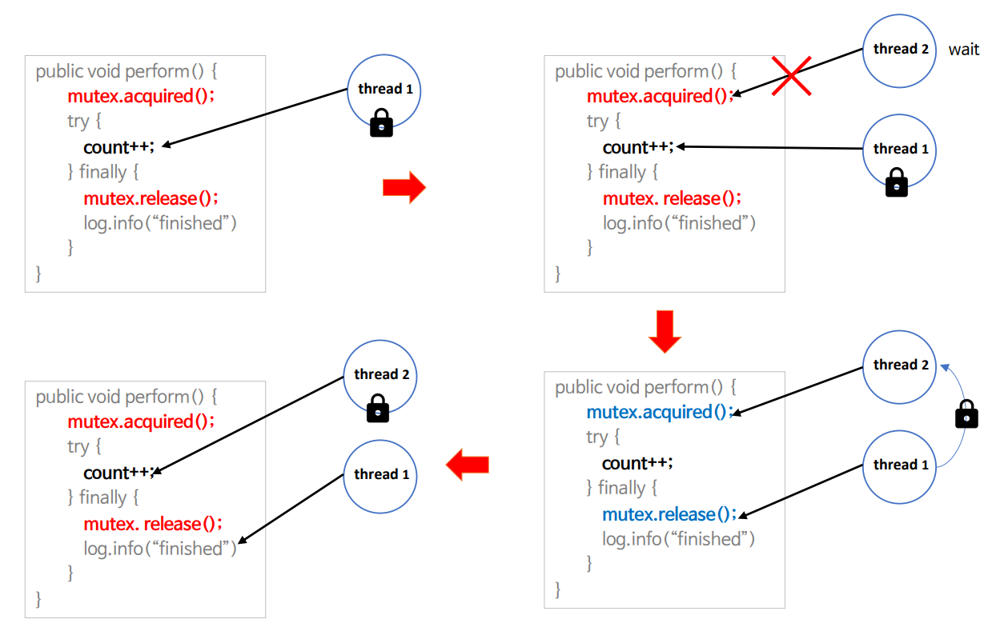
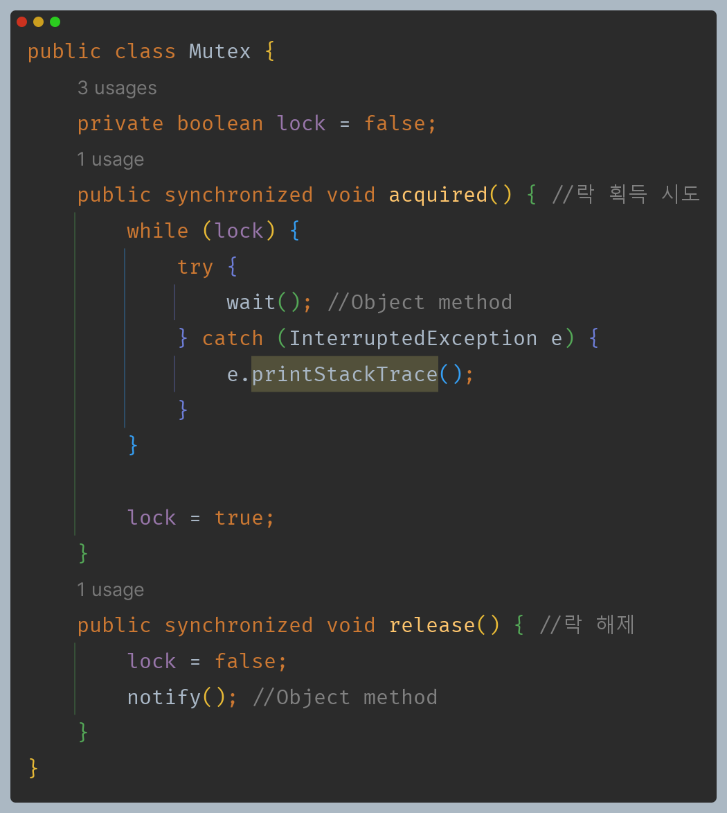
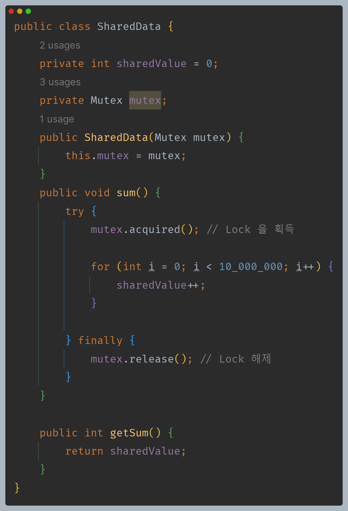
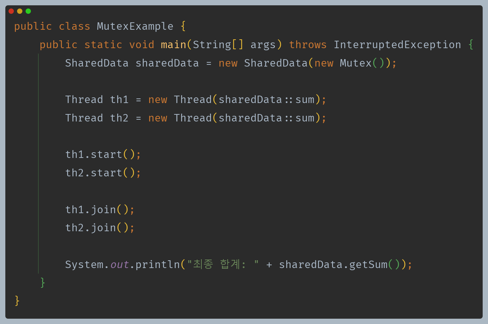

# 자바 동시성 프로그래밍 - 동기화 기법

## 상호 배제 (Mutual Exclusion)

- **상호 배제**, 또는 **뮤텍스(Mutex)** 는 공유 자원에 대한 경쟁 상태를 방지하고 동시성 제어를 위한 락 메커니즘이다. 
- 스레드가 임계 영역에서 `Mutex` 객체의 플래그를 소유하고 있으면(락 획득) 다른 스레드가 액세스 할 수 없으며 해당 임계 영역에서
    액세스 하려고 시도하는 모든 스레드는 차단되고 `Mutex` 객체 플래그가 해제된 경우(락 해제) 에만 액세스 할 수 있다.
- 이 메커니즘은 `Mutex` 락을 가진 오진 한개의 스레드만이 임계 영역에 진입할 수 있으며 락을 획득한 스레드만이 락을 해제할 수 있다.

**뮤텍스는 락과 락 해제를 통해 자원을 보호하는 락 체계 동기화 도구이다.**

---

## 뮤텍스 문제점

### 1. 데드락 (Deadlock)

- **데드락**은 두 개 이상의 스레드가 서로가 가진 락을 기다리면서 상호적으로 블로킹되어 아무 작업도 수행할 수 없는 상태를 의미하며 잘못된 뮤텍스 사용으로
    인해 데드락이 발생할 수 있다.

### 2. 우선 순위 역전

- **우선 순위 역전**은 높은 우선 순위를 가진 스레드가 낮은 우선 순위를 가진 스레드가 보유한 락을 기다리는 동안 블록되는 현상으로, 높은 우선 순위를 가진
    스레드의 작업이 지연될 수 있다.
- 이는 우선 순위 상속으로 해결할 수 있다.

### 3. 오버헤드 & 성능 저하

- **뮤텍스를 사용하면 여러 스레드가 경합하면서 락을 얻기 위해 스레드 스케줄링이 발생한다.**
- 또한 락을 얻기 위해 스레드가 대기하게 되고, 스레드의 실행 시간이 블록된다.
- 이로 인해 오버헤드가 발생하고 성능이 저하될 수 있다.

### 4. 잘못된 사용

- 뮤텍스를 적절하게 사용하지 않거나 잘못된 순서로 락을 해제하는 경우 예기치 않은 동작이 발생할 수 있다.

---

## 뮤텍스 예제 코드

> 자바에서 `Mutex` 라는 클래스는 제공하지 않는다. 하지만 `Mutex`가 가지고 있는 상호 배제의 원리를 활용해서 동기화 기법을 사용할 수 있는 키워드는 제공한다.

- 공유 객체의 메서드를 실행하기 전에 락을 획득하게 되어 기대하던 결과를 얻을 수 있다.
- 만약 메서드 실행 전에 `acquired()`를 하지 않으면 실행마다 결과가 달라지게 된다.

---

[이전 ↩️ - 동기화 개념 - 안전한 스레드 구성](https://github.com/genesis12345678/TIL/blob/main/Java/reactive/synchronization/%EA%B0%9C%EB%85%90/ThreadSafe.md)

[메인 ⏫](https://github.com/genesis12345678/TIL/blob/main/Java/reactive/Main.md)

[다음 ↪️ - 동기화 기법 - 세마포어](https://github.com/genesis12345678/TIL/blob/main/Java/reactive/synchronization/%EA%B8%B0%EB%B2%95/Semaphore.md)