# 자바 동시성 프로그래밍 - 동기화 기법

## 세마포어 (Semaphore)

- 세마포어는 공유 자원에 대한 접근을 제어하기 위해 사용되는 **신호 전달 메커니즘 동기화 도구** 이다.
- 세마포어는 정수형 변수 `S`와 `P(try)`, `V(increment)`의 두 가지 원자적 함수로 구성된 신호 전달 메커니즘 동기화 도구이다.
- `P`는 **임계 영역을 사용하려는 스레드의 진입 여부를 결정하는 연산**으로 `Wait` 연산이라고도 하고, `V`는 **대기 중인 프로세스를 깨우는 신호**로 `Signal` 연산이라고도 한다.
- 스레드가 임계 영역에 진입하지 못할 경우 자발적으로 대기(`Block`) 상태에 들어가고 임계 영역을 빠져나오는 스레드가 대기 상태의 스레드를 실행 대기 상태로 깨워준다.
- 자바에서는 `java.util.concurrent` 패키지에 세마포어 구현체를 포함하고 있다. 직접 세마포어를 구현할 필요는 없다.

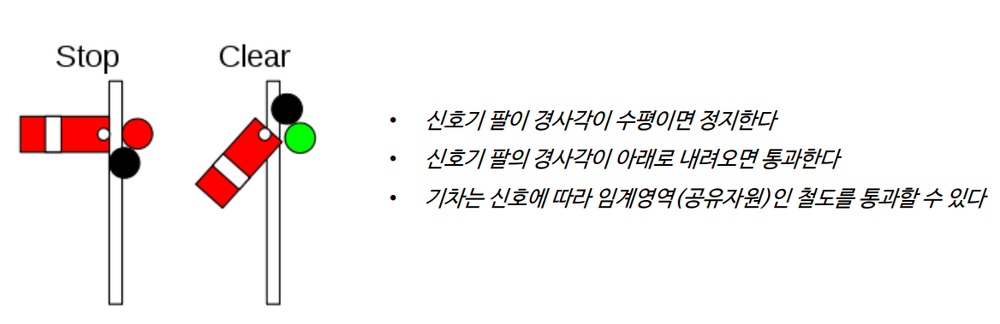

**세마포어는 특정 신호에 의해 공유 자원의 접근을 제어하고 보호하는 신호 체계 동기화 도구이다.**

---

## 세마포어 작동 방식

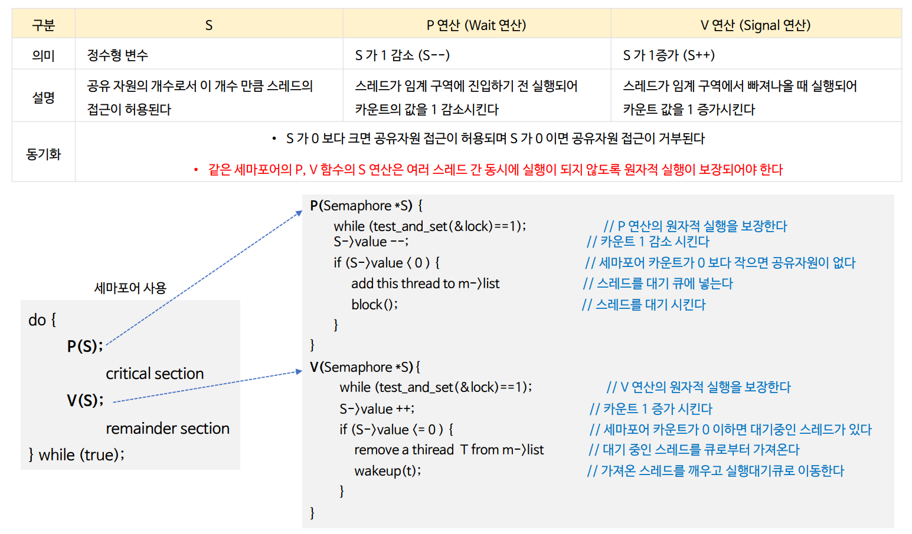

### wait() 동작 방식

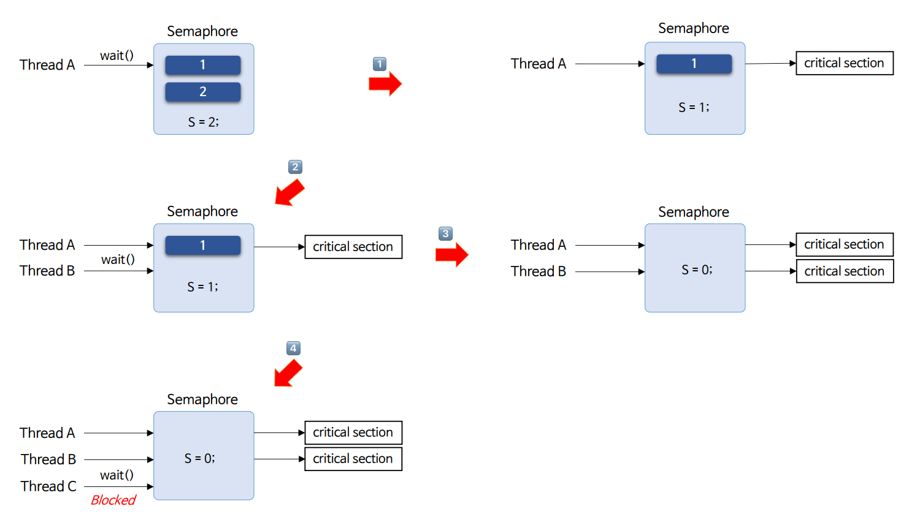

### signal() 동작 방식

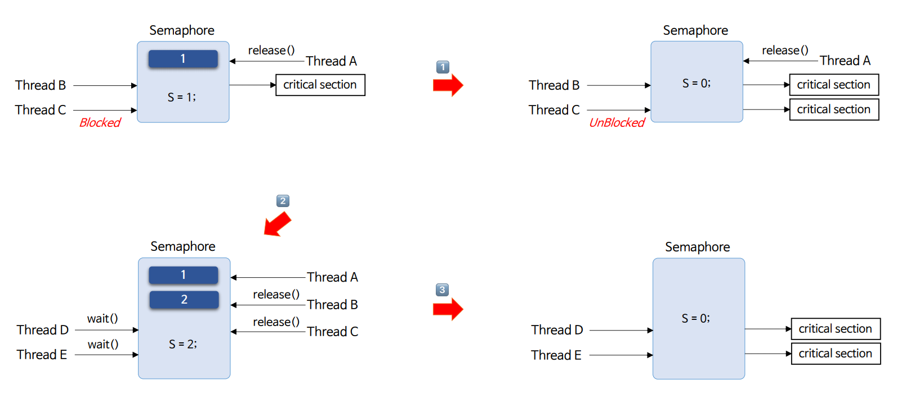

---

## 세마포어 유형

세마포어는 카운트 변수 `S`가 1인 **이진 세마포어**와 2 이상의 양수 값을 가진 **카운팅 세마포어**로 구분할 수 있다.

### 이진 세마포어 (Binary Semaphore)

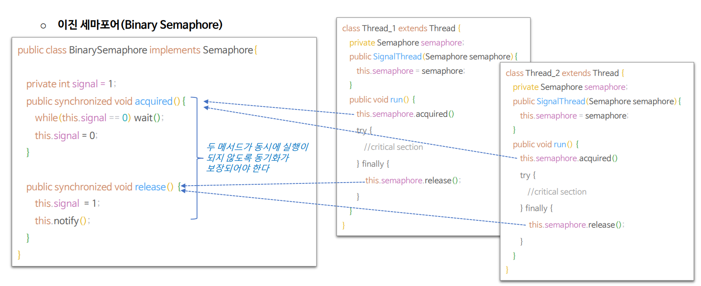

- 세마포어를 뮤텍스 처럼 락으로 사용하기 위해서는 카운트 변수(`S`)를 1로 설정하고 한 스레드 안에서 세마포어를 획득하고 해제 할 수 있도록 구현한다.
- 한 스레드만이 세마포어를 획득할 수 있기 때문에 그 외 다른 모든 스레드가 `acquired()`를 호출하게 되면 해당 스레드가 세마포어를 해제하기 전까지 블록된다.

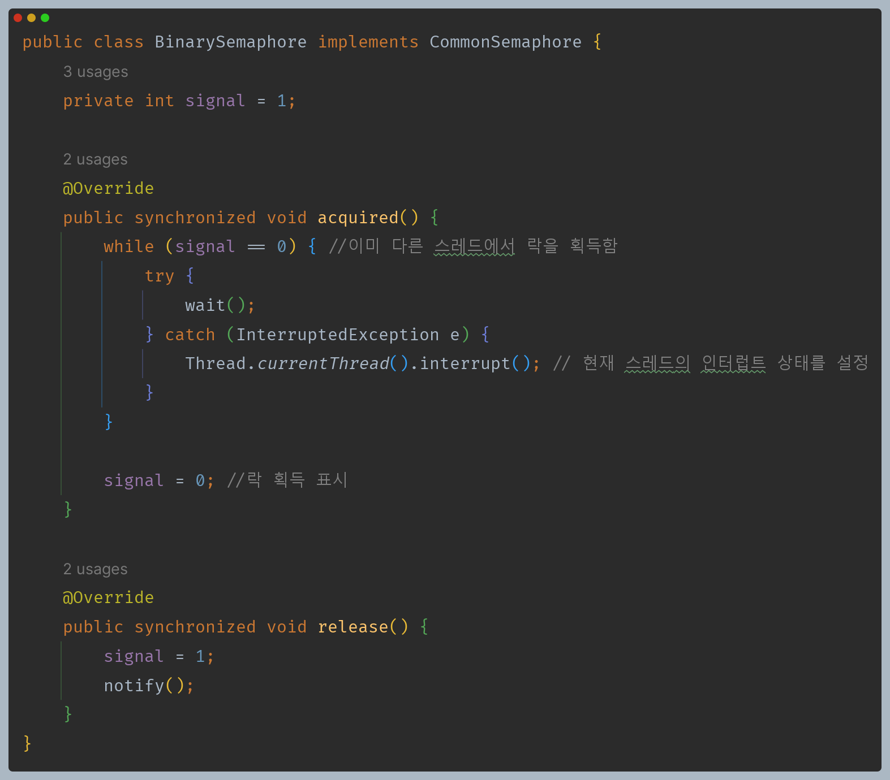

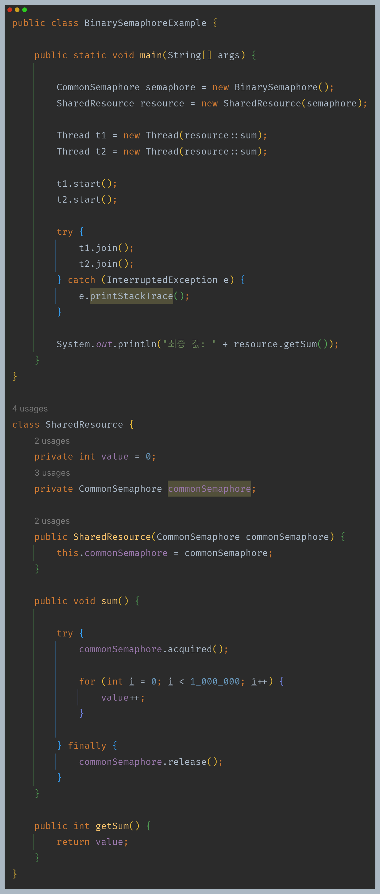

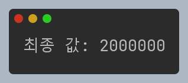

### 카운팅 세마포어 (Counting Semaphore)

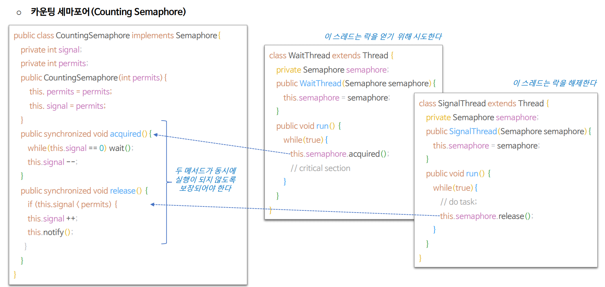

- 카운팅 세마포어는 카운트 변수를 설정해서 스레드가 공유할 수 있는 자원의 최대치를 한정해서 운용하는 방식으로 자원 풀(pool)이나 컬렉션의 크기에 제한을 두고자 할 때 유용하다.
  - DB Connection 개수 제한, 파일 다운로드 동시 실행 제한 등
- 락을 획득한 스레드와 락을 해제하는 스레드는 다를 수 있으며 스레드 간 락과 락 해제를 위한 신호를 전달함으로 동기화를 구현한다.

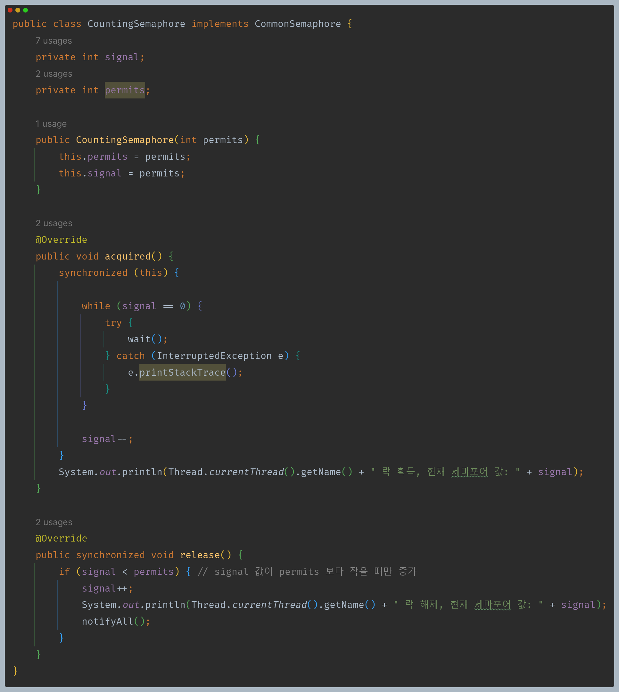

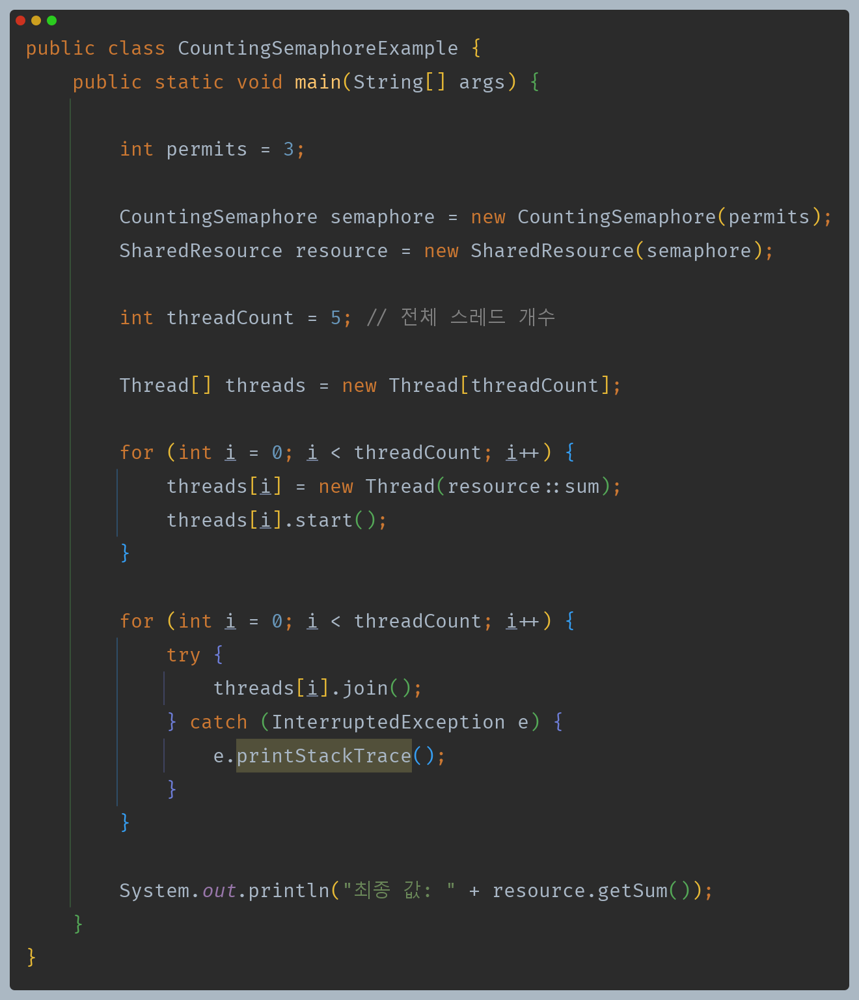

- 최대 3개의 스레드의 접근을 허용하는 세마포어에 5개의 스레드들이 각각 동작한다
- 그 결과 락을 획득하고 해제하는 과정을 반복하면서 스레드들이 수행이 된다.

---

## 프로세스 순서화

- 세마포어는 스레드 간 프로세스 흐름을 순서화(Ordering) 할 수 있게 한다.

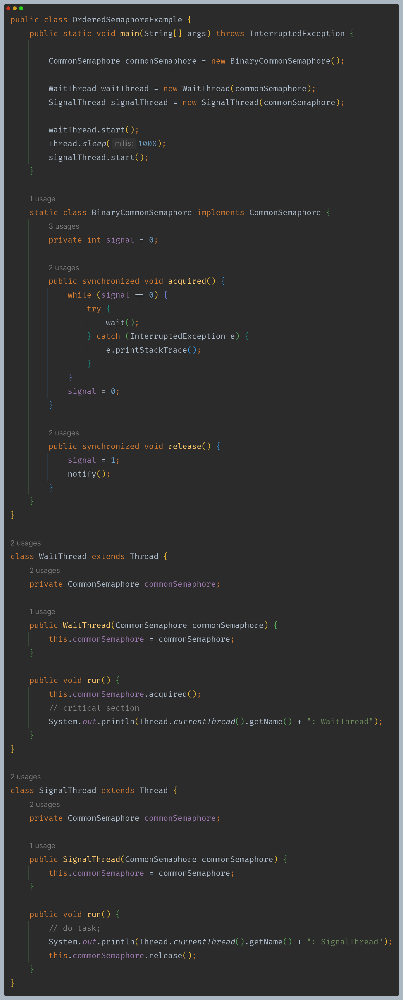

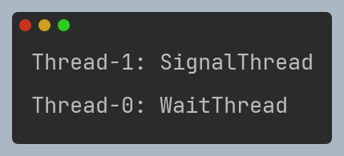

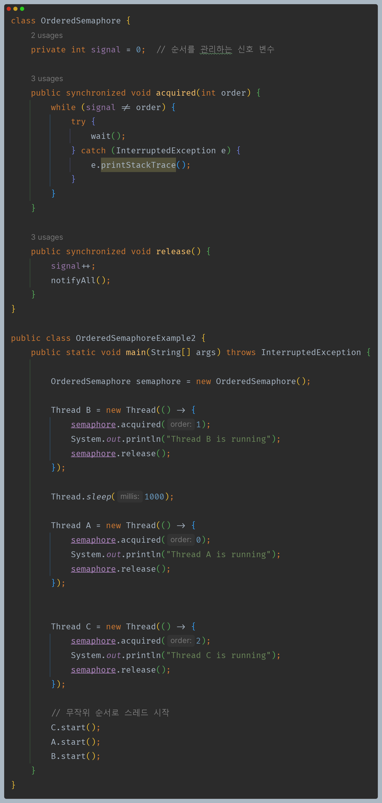

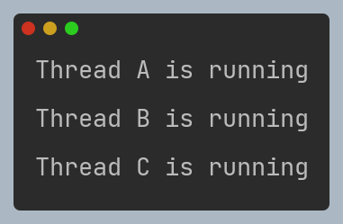

---

## 자바 세마포어 구조

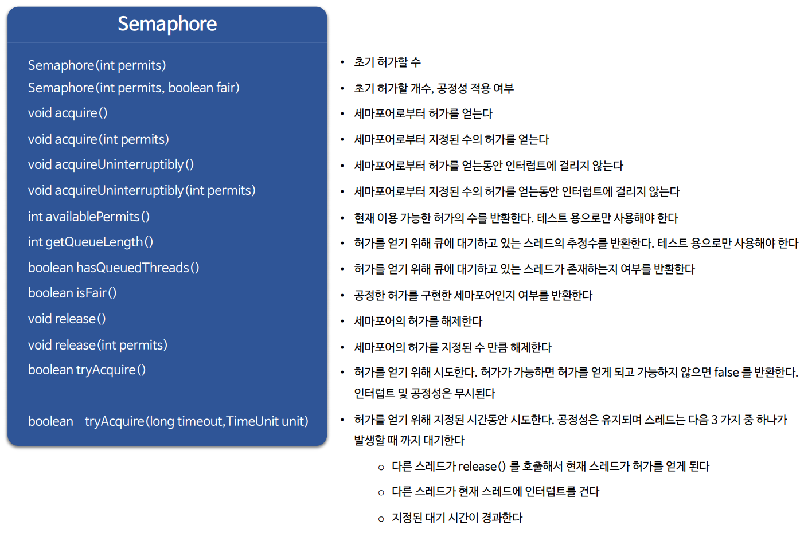

---

## 뮤텍스와 세마포어

### 동작 방식

- **뮤텍스**는 공유 자원에 대한 접근을 동시에 하나의 스레드만 가능하도록 보장한다. 즉, 뮤텍스는 상호 배제를 위한 동기화 기법이다.
- **세마포어**는 카운팅 기법으로, 특정 개수의 스레드가 동시에 공유 자원에 접근할 수 있도록 제어한다.
- 0 또는 1의 값을 가진 이진 세마포어는 뮤텍스와 유사한 역할을 하며, 카운팅 세마포어는 양수 값을 가져 해당 개수만큼의 스레드가 동시 접근을 허용한다.

### 소유권

- **뮤텍스**는 소유권이 있어서 락을 획득한 스레드만이 락을 해제할 수 있다. 즉, 락을 획득한 스레드가 락을 해제하지 않으면 다른 스레드는 해당 뮤텍스에 접근할 수 없다.
- **세마포어**는 소유권이 없으며, 특정 개수의 스레드가 동시에 접근을 허용하는 카운팅 기법으로 작동한다. 따라서 세마포어를 사용하는 스레드들이 모두 세마포어를 해제할 수 있다.

### 초기값

- **뮤텍스**는 기본적으로 잠겨있는 상태로 시작한다. 한 스레드가 뮤텍스를 획득하여 자원에 접근하면 다른 스레드들은 해당 뮤텍스를 획득하기 위해 블로킹된다.
- **세마포어**는 초기값을 설정할 수 있으며, 초기값에 따라서 처음부터 스레드가 자원에 접근할 수 있는지 여부가 결정된다.

### 사용 목적

- **뮤텍스**는 주로 상호 배제를 위해 사용되며 하나의 자원에 하나의 스레드만 접근하도록 보장해야 하는 경우에 사용된다.
- **세마포어**는 주로 리소스의 한정적인 사용을 제어하는 데 사용되며 특정 개수의 스레드만이 동시에 자원에 접근하도록 제한하고자 할 때 사용된다.

> **자바에서는 뮤텍스를 고도화한 모니터 객체와 세마포어 구현체를 제공하고 있다.**

---

[이전 ↩️ - 동기화 기법 - 뮤텍스](https://github.com/genesis12345678/TIL/blob/main/Java/reactive/synchronization/%EA%B8%B0%EB%B2%95/Mutex.md)

[메인 ⏫](https://github.com/genesis12345678/TIL/blob/main/Java/reactive/Main.md)

[다음 ↪️ - 동기화 기법 - 모니터](https://github.com/genesis12345678/TIL/blob/main/Java/reactive/synchronization/%EA%B8%B0%EB%B2%95/Monitor.md)